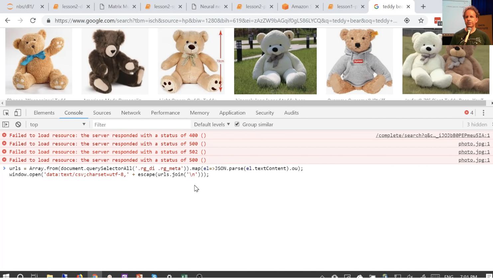
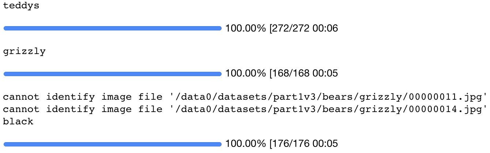
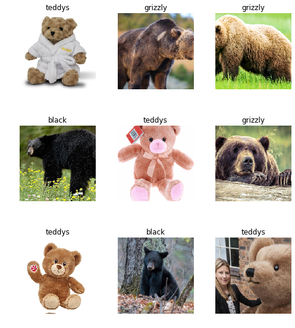
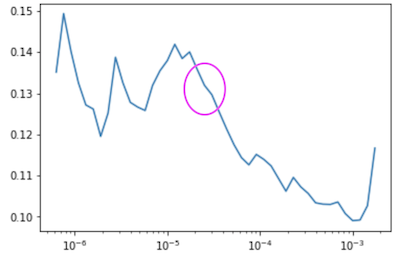
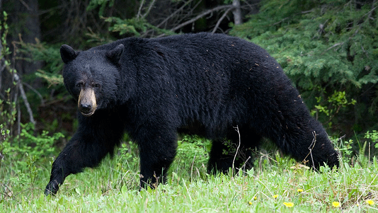

# Lesson 2

[Video](https://youtu.be/Egp4Zajhzog) / [Lesson Forum]((https://forums.fast.ai/t/lesson-2-official-resources-and-updates/28630)) / [General Forum]((https://forums.fast.ai/t/faq-resources-and-official-course-updates/27934/))

## Deeper Dive into Computer Vision

Taking a deeper dive into computer vision applications, taking some of the amazing stuff you've all been doing during the week, and going even further.

### Forum tips and tricks [[0:17]](https://youtu.be/Egp4Zajhzog?t=17)

Two important forum topics:

- [FAQ, resources, and official course updates](https://forums.fast.ai/t/faq-resources-and-official-course-updates/27934/)

- [Lesson 2 official resources and updates](https://forums.fast.ai/t/lesson-2-official-resources-and-updates/28630)


#### "Summarize This Topic" [[2:32]](https://youtu.be/Egp4Zajhzog?t=152)

After just one week, the most popular thread has 1.1k replies which is intimidatingly large number. You shouldn't need to read all of it.  What you should do is click "Summarize This Topic" and it will only show the most liked ones.


####  Returning to work [[3:19]](https://youtu.be/Egp4Zajhzog?t=199)

https://course-v3.fast.ai/ now has a "Returning to work" section which will show you (for each specific platform you use):

- How to make sure you have the latest notebooks
- How to make sure you have the latest fastai library 

If things aren't working for you, if you get into some kind of messy situation, which we all do, just delete your instance and start again unless you've got mission-critical stuff there — it's the easiest way just to get out of a sticky situation.


### What people have been doing this week [[4:19]](https://youtu.be/Egp4Zajhzog?t=259)

[Share your work here](https://forums.fast.ai/t/share-your-work-here/27676/) 


- [Figuring out who is talking — is it Ben Affleck or Joe Rogan](https://forums.fast.ai/t/share-your-work-here/27676/143) 
- [Cleaning up Watsapp downloaded images folder to get rid of memes](https://forums.fast.ai/t/share-your-work-here/27676/97)


[Forum post](https://forums.fast.ai/t/share-your-work-here/27676/215)

One of the really interesting projects was looking at the sound data that was used in [this paper](https://arxiv.org/abs/1608.04363). In this paper, they were trying to figure out what kind of sound things were. They got a state of the art of nearly 80% accuracy. Ethan Sutin then tried using the lesson 1 techniques and got 80.5% accuracy, so I think this is pretty awesome. Best as we know, it's a new state of the art for this problem. Maybe somebody since has published something we haven't found it yet. So take all of these with a slight grain of salt, but I've mentioned them on Twitter and lots of people on Twitter follow me, so if anybody knew that there was a much better approach, I'm sure somebody would have said so.


[[6:01](https://youtu.be/Egp4Zajhzog?t=361)]


[Forum post](https://forums.fast.ai/t/share-your-work-here/27676/38)

Suvash has a new state of the art accuracy for Devanagari text recognition. I think he's got it even higher than this now. This is actually confirmed by the person on Twitter who created the dataset. I don't think he had any idea, he just posted here's a nice thing I did and this guy on Twitter said: "Oh, I made that dataset. Congratulations, you've got a new record." So that was pretty cool.


[6:28](https://youtu.be/Egp4Zajhzog?t=388)


[The Mystery of the Origin](https://medium.com/@alenaharley/the-mystery-of-the-origin-cancer-type-classification-using-fast-ai-libray-212eaf8d3f4e)

I really like this post from Alena Harley. She describes in quite a bit of detail about the issue of metastasizing cancers and the use of point mutations and why that's a challenging important problem. She's got some nice pictures describing what she wants to do with this and how she can go about turning this into pictures. This is the cool trick — it's the same with urning sounds into pictures and then using the lesson 1 approach. Here is turning point mutations into pictures and then using the lesson 1 approach. And it seems that she's got a new state of the art result by more than 30% beating the previous best. Somebody on Twitter who is a VP at a genomics analysis company looked at this as well and thought it looked to be a state of the art in this particular point mutation one as well. So that's pretty exciting. 

When we talked about last week this idea that this simple process is something which can take you a long way, it really can. I will mention that something like this one in particular is using a lot of domain expertise, like figuring out that picture to create. I wouldn't know how to do that because I don't really know what a point mutation is, let alone how to create something that visually is meaningful that a CNN could recognize. But the actual deep learning side is actually straight forward.


[[8:07](https://youtu.be/Egp4Zajhzog?t=487)]


Another cool result from Simon Willison and Natalie Downe, they created a cougar or not web application over the weekend and won the Science Hack Day award in San Francisco. So I think that's pretty fantastic. So lots of examples of people doing really interesting work. Hopefully this will be inspiring to you to think well to think wow, this is cool that I can do this with what I've learned. It can also be intimidating to think like wow, these people are doing amazing things. But it's important to realize that as thousands of people are doing this course, I'm just picking out a few of really amazing ones. And in fact Simon is one of these very annoying people like Christine Payne who we talked about last week who seems to be good at everything he does. He created Django which is the world's most popular web frameworks, he founded a very successful startup, etc. One of those annoying people who tends to keep being good at things, now turns out he's good at deep learning as well. So that's fine. Simon can go on and win a hackathon on his first week of playing with deep learning. Maybe it'll take you two weeks to win your first hackathon. That's okay. 


[[9:22](https://youtu.be/Egp4Zajhzog?t=562)]


I think it's important to mention this because there was this really inspiring blog post this week from James Dellinger who talked about how he created a bird classifier using techniques from lesson 1. But what I really found interesting was at the end, he said he nearly didn't start on deep learning at all because he went through the scikit-learn website which is one of the most important libraries of Python and he saw this. And he described in this post how he was just like that's not something I can do. That's not something I understand. Then this kind of realization of like oh, I can do useful things without reading the Greek, so I thought that was really cool message. 


[[10:01](https://youtu.be/Egp4Zajhzog?t=601)]


I really wanted to highlight Daniel Armstrong on the forum. I think really shows he's a great role model here. He was saying I want to contribute to the library and I looked at the docs and I just found it overwhelming. The next message, one day later, was I don't know what any of this is, I didn't know how much there is to it, caught me off guard, my brain shut down but I love the way it forces me to learn so much. And a day later, I just submitted my first pull request. So I think that's awesome. It's okay to feel intimidated. There's a lot. But just pick one piece and dig into it. Try and push a piece of code or a documentation update, or create a classifier or whatever.


[[10:49](https://youtu.be/Egp4Zajhzog?t=649)]

So here's lots of cool classifiers people have built. It's been really inspiring. 

- Trinidad and Tobago islanders versus masquerader classifier
- A zucchini versus cucumber classifier
- Dog and cat breed classifier from last week and actually doing some exploratory work to see what the main features were, and discovered that one was most hairy dog and naked cats. So there are interesting you can do with interpretation. 
- Somebody else in the forum took that and did the same thing for anime to find that they had accidentally discovered an anime hair color classifier.
- We can now detect the new versus the old Panamanian buses.
- Henri Palacci discovered that he can recognize with 85% accuracy which of 110 countries a satellite image is of which is definitely got to be beyond human performance of just about anybody. 
- Batik cloth classification with a hundred percent accuracy
- Dave Luo did this interesting one. He actually went a little bit further using some techniques we'll be discussing in the next couple of courses to build something that can recognize complete/incomplete/foundation buildings and actually plot them on aerial satellite view. 

So lots and lots of fascinating projects. So don't worry. It's only been one week. It doesn't mean everybody has to have had a project out yet. A lot of the folks who already have a project out have done a previous course, so they've got a bit of a head start. But we will see today how you can definitely create your own classifier this week. 


[[12:56]](https://youtu.be/Egp4Zajhzog?t=776)


So from today, after we did a bit deeper into really how to make these computer vision classifiers and particular work well, we're then going to look at the same thing for text. We're then going to look at the same thing for tabular data. They are more like spreadsheets and databases. Then we're going to look at collaborative filtering (i.e. recommendation systems). That's going to take us into a topic called embeddings which is a key underlying platform behind these applications. That will take us back into more computer vision and then back into more NLP. So the idea here is that it turns out that it's much better for learning if you see things multiple times so rather than being like okay, that's computer vision, you won't see it again for the rest of the course, we're actually going to come back to the two key applications NLP and computer vision a few weeks apart. That's going to force your brain to realize oh, I have to remember this. It's not must something I can throw away. 

[[14:06]](https://youtu.be/Egp4Zajhzog?t=846)


For people who have more of a hard sciences background in particular, a lot of folks find this hey, here's some code, type it in, start running it approach rather than here's lots of theory approach confusing and surprising and odd at first. So for those of you, I just wanted to remind you this basic tip which is keep going. You're not expected to remember everything yet. You're not expected to understand everything yet. You're not expected to know why everything works yet. You just want to be in a situation where you can enter the code and you can run it and you can get something happening and then you can start to experiment and you get a feel for what's going on. Then push on. Most of the people who have done the course and have gone on to be really successful watch the videos at least three times. So they kind of go through the whole lot and then go through it slowly the second time, then they go through it really slowly the third time. I consistently hear them say I get a lot more out of it each time I go through. So don't pause at lesson 1 and stop until you can continue. 

This approach is based on a lot of academic research into learning theory. One guy in particular David Perkins from Harvard has this really great analogy. He is a researcher into learning theory. He describes this approach of whole game which is basically if you're teaching a kid to play soccer, you don't first of all teach them about how the friction between a ball and grass works and then teach them how to saw a soccer ball with their bare hands, and then teach them the mathematics of parabolas when you kick something in the air. No. You say, here's a ball. Let's watch some people playing soccer. Okay, now we'll play soccer and then gradually over the following years, learn more and more so that you can get better and better at it. So this is kind of what we're trying to get you to do is to play soccer which in our case is to type code and look at the inputs and look at the outputs. 


## Teddy bear detector using Google Images [[16:21](https://youtu.be/Egp4Zajhzog?t=981)]

Let's dig into our first notebook which is called [lesson2-download.ipynb](https://github.com/fastai/course-v3/blob/master/nbs/dl1/lesson2-download.ipynb). What we are going to do is we are going to see how to create your own classifier with your own images. It's going to be a lot like last week's pet detector but it will detect whatever you like. So to be like some of those examples we just saw. How would you create your own Panama bus detector from scratch. This is approach is inspired by Adrian Rosebrock who has a terrific website called [pyimagesearch](https://www.pyimagesearch.com/) and he has this nice explanation of  [how to create a deep learning dataset using Google Images](https://www.pyimagesearch.com/2017/12/04/how-to-create-a-deep-learning-dataset-using-google-images/). So that was definitely an inspiration for some of the techniques we use here, so thank you to Adrian and you should definitely check out his site. It's full of lots of good resources.

We are going to try to create a teddy bear detector. And we're going to separate teddy bears from black bears, from grizzly bears. This is very important. I have a three year old daughter and she needs to know what she's dealing with. In our house, you would be surprised at the number of monsters, lions, and other terrifying threats that are around particularly around Halloween. So we always need to be on the lookout to make sure that the things we're about to cuddle is in fact a genuine teddy bear. So let's deal with that situation as best as we can.

### Step 1: Gather URLs of each class of images

Our starting point is to find some pictures of teddy bears so we can learn what they look like. So I go to  https://images.google.com/ and I type in Teddy bear and I just scroll through until I find a goodly bunch of them. Okay, that looks like plenty of teddy bears to me.

Then I go back to [the notebook](https://github.com/fastai/course-v3/blob/master/nbs/dl1/lesson2-download.ipynb) and you can see it says "go to Google Images and search and scroll." The next thing we need to do is to get a list of all the URLs there. To do that, back in your google images, you hit <kbd>Ctrl</kbd><kbd>Shift</kbd><kbd>J</kbd> in Windows/Linux and <kbd>Cmd</kbd><kbd>Opt</kbd><kbd>J</kbd> in Mac, and you paste the following into the window that appears:

``` javascript
urls = Array.from(document.querySelectorAll('.rg_di .rg_meta')).map(el=>JSON.parse(el.textContent).ou);
window.open('data:text/csv;charset=utf-8,' + escape(urls.join('\n')));
```



This is a Javascript console for those of you who haven't done any Javascript before. I hit enter and it downloads my file for me. So I would call this teddies.txt and press "Save". Okay, now I have a file containing URLs of teddies. Then I would repeat that process for black bears and for grizzly bears, and I put each one in a file with an appropriate name. 


### Step 2: Download images [[19:39](https://youtu.be/Egp4Zajhzog?t=1179)]

So step 2 is we now need to download those URLs to our server. Because remember when we're using Jupyter Notebook, it's not running on our computer. It's running on SageMaker or Crestle, or Google cloud, etc. So to do that, we start running some Jupyer cells. Let's grab the fastai library:

```python
from fastai import *
from fastai.vision import *
```

And let's start with black bears. So I click on this cell for black bears and I'll run it. So here, I've got three different cells doing the same thing but different information. This is one way I like to work with Jupyter notebook. It's something that a lot of people with more strict scientific background are horrified by. This is not reproducible research. I click on the black bear cell, and run it to create a folder called black and a file called urls_black.txt for my black bears. I skip the next two cells.

```python
folder = 'black'
file = 'urls_black.txt'
```

```python
folder = 'teddys'
file = 'urls_teddys.txt'
```

```python
folder = 'grizzly'
file = 'urls_grizzly.txt'
```


 Then I run this cell to create that folder.

```python
path = Path('data/bears')
dest = path/folder
dest.mkdir(parents=True, exist_ok=True)
```


Then I go down to the next section and I run the next cell which is download images for black bears. So that's just going to download my black bears to that folder. 

```python
classes = ['teddys','grizzly','black']
```

```python
download_images(path/file, dest, max_pics=200)
```


Now I go back and I click on `'teddys'`. And I scroll back down and repeat the same thing. That way, I'm just going backwards and forwards to download each of the classes that I want. Very manual bur for me, I'm very iterative and very experimental, that work swell for me. If you are better at planning ahead than I am, you can write a proper loop or whatever and do it that way. But when you see my notebooks and see things that are kind of like configuration cells (i.e. doing the same thing in different places), this is a strong sign that I didn't run this in order. I clicked one place, went to another, ran that. For me, I'm experimentalist. I really like to experiment in my notebook, I treat it like a lab journal, I try things out and I see what happens. So this is how my notebooks end up looking. 


It's a really controversial topic. For a lot of people, they feel this is "wrong" that you should only ever run things top to bottom. Everything you do should be reproducible. For me, I don't think that's the best way of using human creativity. I think human creativity is best inspired by trying things out and seeing what happens and fiddling around. You can see how you go. See what works for you.


So that will download the images to your server. It's going to use multiple processes to do so. One problem there is if something goes wrong, it's a bit hard to see what went wrong. So you can see in the next section, there's a commented out section that says `max_workers=0`. That will do it without spinning up a bunch of processes and will tell you the errors better. So if things aren't downloading, try using the second version. 

```python
# If you have problems download, try with `max_workers=0` to see exceptions:
# download_images(path/file, dest, max_pics=20, max_workers=0)
```


### Step 3: Create ImageDataBunch [[22:50](https://youtu.be/Egp4Zajhzog?t=1370)]

The next thing that I found I needed to do was to remove the images that aren't actually images at all. This happens all the time. There's always a few images in every batch that are corrupted for whatever reason. Google image told us this URL had an image but it doesn't anymore. So we got this thing in the library called `verify_images` which will check all of the images in a path and will tell you if there's a problem. If you say `delete=True`, it will actually delete it for you. So that's a really nice easy way to end up with a clean dataset. 

```python
for c in classes:
    print(c)
    verify_images(path/c, delete=True, max_workers=8)
```



So at this point, I now have a bears folder containing a grizzly folder, teddys folder, and black folder. In other words, I have the basic structure we need to create an ImageDataBunch to start doing some deep learning. So let's go ahead and do that.

Now, very often, when you download a dataset from like Kaggle or from some academic dataset, there will often be folders called train, valid, and test containing the different datasets. In this case, we don't have a separate validation set because we just grabbed these images from Google search. But you still need a validation set, otherwise you don't know how well your model is going and we'll talk more about this in a moment. 

Whenever you create a data bunch, if you don't have a separate training and validation set, then you can just say the training set is in the current folder (i.e. `.` because by default, it looks in a folder called `train`) and I want you to set aside 20% of the data, please. So this is going to create a validation set for you automatically and randomly. You'll see that whenever I create a validation set randomly, I always set my random seed to something fixed beforehand. This means that every time I run this code, I'll get the same validation set.  In general, I'm not a fan of making my machine learning experiments reproducible (i.e. ensuring I get exactly the same results every time). The randomness is to me a really important part of finding out your is solution stable and it is going to work each time you run it. But what is important is that you always have the same validation set. Otherwise when you are trying to decide has this hyper parameter change improved my model but you've got a different set of data you are testing it on, then you don't know maybe that set of data just happens to be a bit easier. So that's why I always set the random seed here.

```python
np.random.seed(42)
data = ImageDataBunch.from_folder(path, train=".", valid_pct=0.2,
        ds_tfms=get_transforms(), size=224, num_workers=4).normalize(imagenet_stats)
```


[[25:37](https://youtu.be/Egp4Zajhzog?t=1537)]

We've now got a data bunch, so you can look inside at the `data.classes` and you'll see these are the folders that we created. So it knows that the classes (by classes, we mean all the possible labels) are black bear, grizzly bear, or teddy bear.


```python
data.classes
```

```
['black', 'grizzly', 'teddys']
```


We can run `show_batch` and take a little look. And it tells us straight away that some of these are going to be a little bit tricky.  Some of them are not photo, for instance. Some of them are cropped funny, if you ended up with a black bear standing on top of a grizzly bear, that might be tough. 

```python
data.show_batch(rows=3, figsize=(7,8))
```



You can kind of double check here. Remember, `data.c` is the attribute which the classifiers tell us how many possible labels there are. We'll learn about some other more specific meanings of `c` later. We can see how many things are now training set, how many things are in validation set. So we've got 473 training set, 141 validation set.  

```python
data.classes, data.c, len(data.train_ds), len(data.valid_ds)
```

```
(['black', 'grizzly', 'teddys'], 3, 473, 140)
```


### Step 4: Training a model [[26:49](https://youtu.be/Egp4Zajhzog?t=1609)]

So at that point, we can go ahead and create our convolutional neural network using that data. I tend to default to using a resnet34, and let's print out the error rate each time.

```python
learn = create_cnn(data, models.resnet34, metrics=error_rate)
```

Then run `fit_one_cycle` 4 times and see how we go. And we have a 2% error rate. So that's pretty good. Sometimes it's easy for me to recognize a black bear from a grizzly bear, but sometimes it's a bit tricky. This one seems to be doing pretty well.  

```python
learn.fit_one_cycle(4)
```

```
Total time: 00:54
epoch  train_loss  valid_loss  error_rate
1      0.710584    0.087024    0.021277    (00:14)
2      0.414239    0.045413    0.014184    (00:13)
3      0.306174    0.035602    0.014184    (00:13)
4      0.239355    0.035230    0.021277    (00:13)
```

After I make some progress with my model and things are looking good, I always like to save where I am up to to save me the 54 seconds of going back and doing it again. 

```python
learn.save('stage-1')
```

As per usual, we unfreeze the rest of our model. We are going to be learning more about what that means during the course. 

```python
learn.unfreeze()
```

Then we run the learning rate finder and plot it (it tells you exactly what to type). And we take a look.

```python
learn.lr_find()
```

```
LR Finder complete, type {learner_name}.recorder.plot() to see the graph.
```


We are going to be learning about learning rates today, but for now, here's what you need to know. On the learning rate finder, what you are looking for is the strongest downward slope that's kind of sticking around for quite a while. It's something you are going to have to practice with and get a feel for﹣which bit works. So if you are not sure which, try both learning rates and see which one works better. I've been doing this for a while and I'm pretty sure this (between 10^-5 and 10^-3) looks like where it's really learning properly, so I will probably pick something back here for my learning rate [[28:28](https://youtu.be/Egp4Zajhzog?t=1708)].

```python
learn.recorder.plot()
```



So you can see, I picked `3e-5` for my bottom learning rate. For my top learning rate, I normally pick 1e-4 or 3e-4, it's kind of like I don't really think about it too much. That's a rule of thumb﹣it always works pretty well. One of the things you'll realize is that most of these parameters don't actually matter that much in detail. If you just copy the numbers that I use each time, the vast majority of the time, it'll just work fine. And we'll see places where it doesn't today.

```python
learn.fit_one_cycle(2, max_lr=slice(3e-5,3e-4))
```

```
Total time: 00:28
epoch  train_loss  valid_loss  error_rate
1      0.107059    0.056375    0.028369    (00:14)
2      0.070725    0.041957    0.014184    (00:13)
```

So we've got 1.4% error rate after doing another couple of epochs, so that's looking great. 

```python
learn.save('stage-2')
```


## Interpretation


```python
learn.load('stage-2')
```


```python
interp = ClassificationInterpretation.from_learner(learn)
```


```python
interp.plot_confusion_matrix()
```


![img](data:image/png;base64,iVBORw0KGgoAAAANSUhEUgAAARoAAAEmCAYAAAC9C19sAAAABHNCSVQICAgIfAhkiAAAAAlwSFlzAAALEgAACxIB0t1+/AAAADl0RVh0U29mdHdhcmUAbWF0cGxvdGxpYiB2ZXJzaW9uIDMuMC4wLCBodHRwOi8vbWF0cGxvdGxpYi5vcmcvqOYd8AAAHZdJREFUeJzt3XmclWX9//HXGwYQBcVdGUQFBAIjFSi3XHMLocxyL1HLn2n69Wtupbm0qrR8Lcvccs0lLXOr1CxzQ9lE3JdCE3BfEBEFx8/vj/sePOIwzADXXOfMvJ+Pxzyc+7qX8zm3h/dc93UvRxGBmVlKnXIXYGbtn4PGzJJz0JhZcg4aM0vOQWNmyTlozCw5B421mKTukm6SNFvStcuwnf0l3bY8a8tF0mclPZm7jmonX0fT/kjaDzgGGAzMAaYCP4qIe5Zxu18FjgS2jIj3l7nQKicpgI0i4pnctdQ692jaGUnHAP8H/BhYG+gL/Ab4wnLY/PrAUx0hZFpCUl3uGmpGRPinnfwAqwBvA19pZpluFEE0q/z5P6BbOW87YAbwbeBl4AXgoHLe6cB8YEH5GocApwFXVGx7AyCAunJ6LPAfil7VdGD/ivZ7KtbbEpgIzC7/u2XFvDuBHwD3ltu5DVhjMe+tsf7jK+r/IvB54CngdeC7Fct/GhgPvFkuew7QtZx3V/le5pbvd++K7Z8AvAhc3thWrtO/fI3NyunewKvAdrk/G7l/shfgn+X4PxN2Bd5v/Ie+mGW+D9wPrAWsCdwH/KCct125/veBLuU/0HeAVcv5iwbLYoMGWAl4CxhUzlsXGFr+vjBogNWAN4CvluvtW06vXs6/E/g3MBDoXk6fsZj31lj/KWX93wBeAa4EegJDgXeBfuXyw4HNy9fdAHgcOLpiewEMaGL7Z1IEdvfKoCmX+Ua5nRWBW4Gf5v5cVMOPD53al9WBV6P5Q5v9ge9HxMsR8QpFT+WrFfMXlPMXRMRfKP6aD1rKej4ANpbUPSJeiIhHm1hmFPB0RFweEe9HxFXAE8DoimUujoinImIe8Adgk2ZecwHFeNQC4GpgDeDsiJhTvv6jwDCAiJgcEfeXr/sscB6wbQve06kR8V5Zz0dExAXA08ADFOF60hK21yE4aNqX14A1ljB20Bt4rmL6ubJt4TYWCap3gB6tLSQi5lIcbhwGvCDpFkmDW1BPY031FdMvtqKe1yKiofy9MQheqpg/r3F9SQMl3SzpRUlvUYxrrdHMtgFeiYh3l7DMBcDGwK8i4r0lLNshOGjal/EUhwZfbGaZWRSDuo36lm1LYy7FIUKjdSpnRsStEbETxV/2Jyj+AS6pnsaaZi5lTa1xLkVdG0XEysB3AS1hnWZP00rqQTHudRFwmqTVlkehtc5B045ExGyK8YlfS/qipBUldZG0m6SzysWuAk6WtKakNcrlr1jKl5wKbCOpr6RVgO80zpC0tqQxklYC3qM4BGtoYht/AQZK2k9SnaS9gSHAzUtZU2v0pBhHervsbX1zkfkvAf1auc2zgckR8XXgFuC3y1xlO+CgaWci4ucU19CcTDEQ+jzwLeDP5SI/BCYB04CHgSll29K81u3ANeW2JvPRcOhEcfZqFsWZmG2Bw5vYxmvA7uWyr1GcMdo9Il5dmppa6VhgP4qzWRdQvJdKpwGXSnpT0l5L2pikL1AMyB9WNh0DbCZp/+VWcY3yBXtmlpx7NGaWnIPGzJJz0JhZcg4aM0uuw94U1mWlXtFt1XWWvGAHM2jtVl+bZx3YlCmTX42INZe0XIcNmm6rrsOwo87PXUbV+ccx2+QuwWpI9y5a9KruJvnQycySc9CYWXIOGjNLzkFjZsk5aMwsOQeNmSXnoDGz5Bw0Zpacg8bMknPQmFlyDhozS85BY2bJOWjMLDkHjZkl56Axs+QcNGaWnIPGzJJz0JhZcg4aM0vOQWNmyTlozCw5B42ZJeegMbPkHDRmlpyDxsySc9CYWXIOmgw6CS45cDPG7TkUgFN3H8xVXx/BFQcN57u7DqRzJ2WuMK/bbv0bw4YOYujgAYw764zc5VSNWt4vDpoM9hpez7OvvbNw+rbHXmLfCydxwMWT6dalE2OGrZOxurwaGho4+qgjuOGmv/LgtMe49uqrePyxx3KXlV2t7xcHTRtbs0dXtuy/GjdNe3Fh2/j/vLHw98demMNaPbvlKK0qTJwwgf79B7Bhv3507dqVr+y9DzffdEPusrKr9f3ioGljR+/Yn1/fOZ0PIj42r3MnsevQtbh/+usZKqsOs2bNpE+f9RZO19f3YebMmRkrqg61vl+yBI2kDSQ90kT7nZJGLMX2xko6Z/lUl86W/VfjjXcW8ORLbzc5/7idBjD1+dk8NOOtNq6sekQTASx17DErqP39Upe7gI5kWP3KbD1gdbbotxpdO3dipW6dOXXUIE6/5UkO3rIvvVbswpnXP527zKzq6/swY8bzC6dnzpxB7969M1ZUHWp9v+Q8dKqTdKmkaZKuk7Ri5UxJ50qaJOlRSadXtI+UdJ+khyRNkNRzkfVGSRovaY22eiMt9du7nuWL5z7AnudN4JSbHmfyf9/k9FueZPSwdfjMhqtyyk1P8PG/Wx3LiJEjeeaZp3l2+nTmz5/Ptddczajdx+QuK7ta3y85ezSDgEMi4l5JvwMOX2T+SRHxuqTOwB2ShgFPANcAe0fEREkrA/MaV5C0B3AM8PmIeGOR7SHpUOBQgK691k7yppbGcTtvxEuz3+X8/TcB4F9Pv8rF9/03c1V51NXV8Yuzz2H0qF1oaGjgwLEHM2To0NxlZVfr+0VNHfslf1FpA+CuiOhbTu8AHAX0Ao6NiEmSDqMIhTpgXeBI4FHgtxGx1SLbGwscB8wBdo6IJQ5y9OgzOIYddf7yekvtxj+O2SZ3CVZDunfR5IhY4rhqzkOnRRNu4bSkDYFjgR0jYhhwC7ACoCbWa/QfoCcwcPmXambLImfQ9JW0Rfn7vsA9FfNWBuYCsyWtDexWtj8B9JY0EkBST0mNh3/PAV8CLpNUO31Ksw4gZ9A8DhwoaRqwGnBu44yIeAh4kOJQ6XfAvWX7fGBv4FeSHgJup+jpNK73JLA/cK2k/m30PsxsCbIMBkfEs8CQJmZtV7HM2MWsOxHYfJHmS8ofIuLBxWzbzDLxlcFmlpyDxsySc9CYWXIOGjNLzkFjZsk5aMwsOQeNmSXnoDGz5Bw0Zpacg8bMknPQmFlyDhozS85BY2bJOWjMLDkHjZkl56Axs+QcNGaWnIPGzJJz0JhZcg4aM0vOQWNmyTlozCw5B42ZJeegMbPkHDRmlpyDxsySc9CYWXIOGjNLzkFjZsnV5S4gl0Fr9+Afx2yTu4yqc9T1j+QuoSr9co+Nc5dQ09yjMbPkHDRmlpyDxsySc9CYWXIOGjNLzkFjZsk5aMwsOQeNmSXnoDGz5Bw0Zpacg8bMknPQmFlyDhozS85BY2bJOWjMLDkHjZkl56Axs+QcNGaWnIPGzJJz0JhZcg4aM0vOQWNmyS3261Yk3QTE4uZHxJgkFZlZu9Pc9zr9tM2qMLN2bbFBExH/astCzKz9WuI3VUraCPgJMARYobE9IvolrMvM2pGWDAZfDJwLvA9sD1wGXJ6yKDNrX1oSNN0j4g5AEfFcRJwG7JC2rI7htlv/xrChgxg6eADjzjojdznZ1HUS39mxH9/bqT+n7TyA0UPWAuBrI+r53k79OWWnAfy/LdajW+eOfZK0lj8vSzx0At6V1Al4WtK3gJnAWmnLav8aGho4+qgjuOWvt1Pfpw9bbz6S3XcfwyeGDMldWpt7/4Pg53c+y3sNH9BZcPz2/XjkxTn8YeoLvPv+BwB85VPrsP2A1fjbk69mrjaPWv+8tORPxNHAisBRwHDgq8CBKYvqCCZOmED//gPYsF8/unbtylf23oebb7ohd1nZvNdQBErnTqJzJwEsDBmALp21+GstOoBa/7wssUcTERPLX98GDkpbTscxa9ZM+vRZb+F0fX0fJkx4IGNFeQk4eaf+rNmjK3c+8zrTX58HwIEj6vnkuj154a13ue6hF/MWmVGtf15actbpnzRx4V5ELLdxGkmHAe9ExGWtWGcsMCIivrW86mhLER//+ywpQyXVIYAf3P5vunfpxOFb9qX3yt2Y9dZ7XDppJgL23XRdRqy3Cvc9+2buUrOo9c9LS8Zojq34fQVgT4ozUMuFpLqI+O3y2l6tqK/vw4wZzy+cnjlzBr17985YUXWYt+ADnnxlLkPX6cGst94DihCa9Pxsdh60RocNmlr/vLTk0GnyIk33SmrxxXySvgfsDzwPvApMBnYH7gO2Am6U1JPi0OxK4C8Vq38S6AdUHowOAnat2H5PYBowMCIWSFq5nN4oIha0tM62NmLkSJ555mmenT6d3vX1XHvN1Vxy+ZW5y8qiR9fONEQwb8EHdOkkPrFWD2598lXWXKkrr8ydD8Cw3ivz4pz5mSvNp9Y/Ly05dFqtYrITxYDwOi3ZuKQRFD2gTcvXmkIRNAC9ImLbcrnTACJiFrBJ2XYEsG1EPFfRNho4niKkNizXmSPpTmAU8GdgH+CPTYWMpEOBQwHW69u3JW8hmbq6On5x9jmMHrULDQ0NHDj2YIYMHZq1plxW6V7HQSP70ElCKnovD78wh+O235DuXToDMOPNd/n9lFmZK82n1j8vLTl0mkzRexXFIdN04JAWbn9r4IaImAcLb9RsdM3iVpK0FfB14LMVbRsB44Adyp5L5SoXUgTQnykGrL/R1HYj4nzgfIDhw0dkP4mx626fZ9fdPp+7jOxmzn6PH/793x9rP+uf0zNUU71q+fPSkqD5RES8W9kgqVsLt9/caNXcJleQ1gUuAsZExNtl20rAH4BvlL2ej4iIeyVtIGlboHNEPNLC+sysDbTkOpr7mmgb38Lt3wOMlrSCpB4UhzeLJakLRaCcEBFPVcy6GLg4Iu5uZvXLgKvKZc2sijT3PJp1gHqgu6RN+bB3sjLFBXxLFBETJd0IPAQ8B0wCZjezypbASOB0SaeXbV8AvgwMlHRw2fb1Jtb9PfBDirAxsyrS3KHTLsBYoA/wMz4MmreA77biNX4aEadJWhG4C/hZRFxQuUB5/1SjFfi4pnpek4BLKqa3Bq6LiI55/tOsijX3PJpLgUsl7RkRf1yG1zhfUuMjJi6NiCnLsK0mSfoVsBtQmyNlZu1cSwaDh0u6o7GnIGlV4NsRcXJLXiAi9luWAlv4Gkemfg0zW3otGQzerfJwJCLewD0HM2uFlgRN58rT2ZK6Ay09vW1m1qJDpyuAOyQ1njY+CLg0XUlm1t605F6nsyRNAz5Hcebpb8D6qQszs/ajpc9GfBH4gOK+pR2Bx5NVZGbtTnMX7A2kuEFxX+A1inuTFBHbt1FtZtZONHfo9ARwNzA6Ip4BkPS/bVKVmbUrzR067UlxyPRPSRdI2pHmb5I0M2vSYoMmIq6PiL2BwcCdwP8Ca0s6V9LObVSfmbUDSxwMjoi5EfH7iNid4r6nqcCJySszs3ajVd/IFRGvR8R5y/PB5GbW/nXsr/4zszbhoDGz5Bw0Zpacg8bMknPQmFlyDhozS85BY2bJOWjMLDkHjZkl56Axs+QcNGaWnIPGzJJz0JhZcg4aM0vOQWNmyTlozCy5lnyBnHUgv9xj49wlVKVVR34rdwk1zT0aM0vOQWNmyTlozCw5B42ZJeegMbPkHDRmlpyDxsySc9CYWXIOGjNLzkFjZsk5aMwsOQeNmSXnoDGz5Bw0Zpacg8bMknPQmFlyDhozS85BY2bJOWjMLDkHjZkl56Axs+QcNGaWnIPGzJJz0JhZcg4aM0vOQWNmyTlozCw5B01Gt936N4YNHcTQwQMYd9YZucupGt4vH1qlR3euHHcIU/90Mg/+8WQ+M2zDhfOO/uqOzHvwHFbvtVLGClumLncBHVVDQwNHH3UEt/z1dur79GHrzUey++5j+MSQIblLy8r75aN+evyXue2+x9jvuIvoUteZFVfoCkCftXuxw+aD+e8Lr2eusGXco8lk4oQJ9O8/gA379aNr1658Ze99uPmmG3KXlZ33y4d6rrQCW2/Wn0uuHw/AgvcbmP32PADOOnZPTjr7z0REzhJbzEGTyaxZM+nTZ72F0/X1fZg5c2bGiqqD98uHNqxfnVffeJvzTz+A8VedwG9O2Y8VV+jKqG0/yayX3+Thp2pnvyQJGkm9JB3eynVOk3RsE+0bSHpk+VVXHZr6SyQpQyXVxfvlQ3V1ndlk8HpccO3dbLHvmbwz7z1OPuzznHDILnz/3Ftyl9cqqXo0vYBWBU1HU1/fhxkznl84PXPmDHr37p2xourg/fKhmS+9wcyX32TiI88BcP3fp7LJ4PVYv351JlzzHZ645XTq1+rF+CtPYO3Ve2autnmpguYMoL+kqZLGSTpO0kRJ0ySd3riQpJMkPSnp78Cgivbhkh6SNB44oqL9bkmbVEzfK2mYpG3L15oq6UFJ1b3XgREjR/LMM0/z7PTpzJ8/n2uvuZpRu4/JXVZ23i8feum1Ocx48Q02Wn8tALb79CCmPvE86+/4HQaPOpXBo05l5stvssV+Z/LSa3MyV9u8VGedTgQ2johNJO0MfBn4NCDgRknbAHOBfYBNyzqmAJPL9S8GjoyIf0kaV7HdC4GxwNGSBgLdImKapJuAIyLiXkk9gHebKkrSocChAOv17btc33Br1dXV8Yuzz2H0qF1oaGjgwLEHM2To0Kw1VQPvl4865sxrufjHY+la15lnZ77KoadekbukpaIUo9aSNgBujoiNJf2UImjeLGf3AH4C9ARWi4hTynV+DswCLgAejoi+Zfsw4MpyWysC04BPAD8AZkTEOZJOBPYAfg/8KSJmLKnG4cNHxL0PTFpeb9nauVVHfit3CVXp3am/nhwRI5a0XFucdRLwk4jYpPwZEBEXlfOaSjktpp2IeAe4HfgCsBdwZdl+BvB1oDtwv6TBy/k9mNkySBU0cyh6LAC3AgeXhzRIqpe0FnAXsIek7uWYymiAiHgTmC1p63L9/RfZ9oXAL4GJEfF6uc3+EfFwRJwJTAIcNGZVJMkYTUS8Vg7UPgL8laLnMb48Tfk2cEBETJF0DTAVeA64u2ITBwG/k/QORVBVbnuypLcoxnEaHS1pe6ABeKx8TTOrEsluQYiI/RZpOruJZX4E/KiJ9snApyqaTmv8RVJvip7YbRXLH7mM5ZpZQjV1ZbCkrwEPACdFxAe56zGzlqmpmyoj4jLgstx1mFnr1FSPxsxqk4PGzJJz0JhZcg4aM0vOQWNmyTlozCw5B42ZJeegMbPkHDRmlpyDxsySc9CYWXIOGjNLzkFjZsk5aMwsOQeNmSXnoDGz5Bw0Zpacg8bMknPQmFlyDhozS85BY2bJOWjMLDkHjZkl56Axs+QcNGaWnIPGzJJz0JhZcoqI3DVkIekV4LncdZTWAF7NXUQV8n5pWjXtl/UjYs0lLdRhg6aaSJoUESNy11FtvF+aVov7xYdOZpacg8bMknPQVIfzcxdQpbxfmlZz+8VjNGaWnHs0Zpacg8bMknPQmFlyDppMJK3WRNuGOWqpFpI6567B0nDQ5HOTpJUbJyQNAW7KWE81eEbSuHJfWEnSSpI6lb8PlDRGUpfcdbWGgyafH1OETQ9Jw4FrgQMy15TbMOAp4EJJ90s6tDKMO7C7gBUk1QN3AAcBl2StqJV8ejsjSV8Ejgd6Al+KiKczl1Q1JG0DXAX0Aq4DfhARz+StKg9JUyJiM0lHAt0j4ixJD0bEprlra6m63AV0NJJ+BVSm+8rAf4AjJRERR+WpLL9yjGYUxV/sDYCfAb8HPgv8BRiYrbi8JGkLYH/gkLKtpv7t1lSx7cSkRaYnZ6miOj0N/BMYFxH3VbRfV/ZwOqr/Ab4DXB8Rj0rqR7GfaoYPnTKRtBLwbkQ0lNOdgW4R8U7eyvKR1CMi3s5dR7WRtHFEPJK7jmXhoMlE0v3A5xr/YUnqAdwWEVvmraztNXE4+REd+XASQNI9QFeKAeArI+LNvBW1ng+d8lmh8q93RLwtacWcBWW06OGkVYiIrSUNpBi7miRpAnBJRNyWubQWc9DkM1fSZhExBaA8xT0vc01ZRMSlAJI+C9zXeDhZtm2WrbAqEhFPSTqZIpR/CWwqScB3I+JPeatbMh86ZSJpJHA1MKtsWhfYOyI67OCwpHeAicBeEfFS2TYlIjp02EgaRtGbGQXcDlwUEVMk9QbGR8T6WQtsAfdoMomIiZIGA4MAAU9ExILMZeX2JDAOuFPSIeWZJ2WuqRqcA1xI0XtZ2OuNiFllL6fquUeTkaSNgSHACo1tEXFZvoryqrgwbSPgGuB3wMEdvUfTHrhHk4mkU4HtKILmL8BuwD1Ahw0ayt5LRDwtaWuKsyzDslaUkaSHaf5sXM3sGwdNPl8GPgU8GBEHSVqbonvckY1p/KW8nmgvSX0z1pPb7uV/jyj/e3n53/2BmrreyjdV5jMvIj4A3i9vHHwZ6Je5ptz+I+mqRU7z/zlbNZlFxHMR8RywVUQcHxEPlz8nArvkrq81HDT5TJLUC7iA4jaEKcCEvCVl9whwN3C3pP5lmweDYaXyUBIASVsCK2Wsp9U8GFwFJG0ArBwR0zKXklXFYPBWFAF8AnB6Rx8MLq+x+h2wStn0JsUg+ZR8VbWOg6aNLekCtFr68CxvlY8+kLQuxZmnERHRUa+Y/ojyEFsRMTt3La3loGljkirvuq3c+QIiInZo45KqhqR1I+KFiuk6YMuIuCtjWdlIOqa5+RHx87aqZVn5rFMbi4jtASR1Bw4HtqYInLuBczOWlo2kAyLiCmDf4qr6j+mQQUPxQDQoLuocCdxYTo+mxvaJgyafS4G3KO5bAdiX4hqavbJVlE/jwGbPZpfqYCLidABJtwGbRcSccvo0ike/1gwHTT6DIuJTFdP/lPRQtmoyiojzyufxvBURv8hdTxXqC8yvmJ5P8QTCmuHT2/k8KGnzxglJnwHuzVhPVuUd22OWuGDHdDkwQdJp5RXlD1BjV5B7MLiNVVxW3oXi2Pu/5fT6wGMRsXHG8rKS9COKU7jXAHMb2zvymbhG5dnKz5aTd0XEgznraS0HTRuT1Owt/eWVoB1SxRm5xg9lhz8T16i8YG+jiLhY0ppAj4iYnruulnLQWNWQ9G2KkGk89RQUA+aTImJqtsIyKw+XRlCM6w0sn0NzbURslbm0FvMYjVWT4cBhFA8B6w0cCmwLXCDp+JyFZbYHxfjVXCieQ0ONnaHzWSerJqtTnMZtfGD7qRRfHrcNxf1gZ2WsLaf5ERGSAhZ+g0ZNcY/Gqsmip3EXAOuXT5V7L09JVeEPks4Dekn6BvB3invBaoZ7NFZNrgTul3RDOT0auKr8C/5YvrKyW5OiZ/cWxZnKU4DPZa2olTwYbFWlvFN5a4oB4XsiosN/FUtTD2iXNK2WnrDnoDGrUpK+SXE/XD/g3xWzegL3RsQBWQpbCg4asyolaRVgVeAnwIkVs+ZExOt5qlo6DhozS85nncwsOQeNmSXnoLFlIqlB0lRJj0i6dpFvMGjttraTdHP5+xhJJzazbC9Jhy/Fa5wm6dilrdGWjoPGltW8iNikvOt8PsUtBAup0OrPWUTcGBFnNLNIL4ozMlYDHDS2PN0NDJC0gaTHJf2G4mtk1pO0s6TxkqaUPZ8eAJJ2lfSEpHuALzVuSNJYSeeUv68t6XpJD5U/WwJnAP3L3tS4crnjJE2UNE3S6RXbOknSk5L+TnHBm7UxB40tF+WDxHcDHi6bBgGXld9qMBc4GfhceeHZJOAYSStQXEo/muJZK+ssZvO/BP5VPpFwM+BRitO9/y57U8dJ2hnYCPg0sAkwXNI25QWA+wCbUgTZyOX81q0FfAuCLavukhof4XA3cBHFndfPRcT9ZfvmFN8xfm/58PGuwHhgMDA9Ip4GkHQFxR3bi9oB+BosfBLfbEmrLrLMzuVP4wOhelAET0/g+vIrdpF0I9bmHDS2rOZFxCaVDWWYzK1sAm6PiH0XWW4TmvkS+1YS8JOIOG+R1zh6Ob6GLSUfOllbuB/YStIAAEkrShoIPAFsWPH1t/suZv07gG+W63Yuv0htDh99JsutwMEVYz/1ktai+FqSPSR1l9ST4jDN2piDxpKLiFeAsRR3Yk+jCJ7BEfEuxaHSLeVg8OIeY/o/wPbl85YnA0Mj4jWKQ7FHJI2LiNso7v4eXy53HdCzfN7wNcBU4I8Uh3fWxnwLgpkl5x6NmSXnoDGz5Bw0Zpacg8bMknPQmFlyDhozS85BY2bJ/X9i7PUElzwM0AAAAABJRU5ErkJggg==%0A)


```python
from fastai.widgets import *

losses,idxs = interp.top_losses()
top_loss_paths = data.valid_ds.x[idxs]
```


```python
fd = FileDeleter(file_paths=top_loss_paths)
```


```python
Button(button_style='primary', description='Confirm', style=ButtonStyle())
```


## Putting your model in production


```python
data.classes
```


```
['black', 'grizzly', 'teddys']
```


```python
# fastai.defaults.device = torch.device('cpu')
```


```python
img = open_image(path/'black'/'00000021.jpg')
img
```





```python
classes = ['black', 'grizzly', 'teddys']
data2 = ImageDataBunch.single_from_classes(path, classes, tfms=get_transforms(), size=224).normalize(imagenet_stats)
learn = create_cnn(data2, models.resnet34)
learn.load('stage-2')
```


```python
pred_class,pred_idx,outputs = learn.predict(img)
pred_class
```

```
'black'
```


So you might create a route something like this ([thanks](https://github.com/simonw/cougar-or-not) to Simon Willison for the structure of this code):

```python
@app.route("/classify-url", methods=["GET"])
async def classify_url(request):
    bytes = await get_bytes(request.query_params["url"])
    img = open_image(BytesIO(bytes))
    _,_,losses = learner.predict(img)
    return JSONResponse({
        "predictions": sorted(
            zip(cat_learner.data.classes, map(float, losses)),
            key=lambda p: p[1],
            reverse=True
        )
    })
```

(This example is for the [Starlette](https://www.starlette.io/) web app toolkit.)


## Things that can go wrong


- Most of the time things will train fine with the defaults
- There's not much you really need to tune (despite what you've heard!)
- Most likely are
  - Learning rate
  - Number of epochs


### Learning rate (LR) too high


```python
learn = create_cnn(data, models.resnet34, metrics=error_rate)
```


```python
learn.fit_one_cycle(1, max_lr=0.5)
```

```
Total time: 00:13
epoch  train_loss  valid_loss  error_rate       
1      12.220007   1144188288.000000  0.765957    (00:13)
```


### Learning rate (LR) too low


```python
learn = create_cnn(data, models.resnet34, metrics=error_rate)
```


Previously we had this result:

```
Total time: 00:57
epoch  train_loss  valid_loss  error_rate
1      1.030236    0.179226    0.028369    (00:14)
2      0.561508    0.055464    0.014184    (00:13)
3      0.396103    0.053801    0.014184    (00:13)
4      0.316883    0.050197    0.021277    (00:15)
```


```python
learn.fit_one_cycle(5, max_lr=1e-5)
```

```
Total time: 01:07
epoch  train_loss  valid_loss  error_rate
1      1.349151    1.062807    0.609929    (00:13)
2      1.373262    1.045115    0.546099    (00:13)
3      1.346169    1.006288    0.468085    (00:13)
4      1.334486    0.978713    0.453901    (00:13)
5      1.320978    0.978108    0.446809    (00:13)
```


```python
learn.recorder.plot_losses()
```


![img](data:image/png;base64,iVBORw0KGgoAAAANSUhEUgAAAXcAAAD8CAYAAACMwORRAAAABHNCSVQICAgIfAhkiAAAAAlwSFlzAAALEgAACxIB0t1+/AAAADl0RVh0U29mdHdhcmUAbWF0cGxvdGxpYiB2ZXJzaW9uIDMuMC4wLCBodHRwOi8vbWF0cGxvdGxpYi5vcmcvqOYd8AAAIABJREFUeJzt3Xl4HNWd7vHv0W5r3xfLsmzL+4aNvOENzGIPBAiBmWDIHQhwHTJDSO7c3EnmSW7ITCaTgdzMZAWGIQ4BEgMJa9gNGBsbL8i7jRfJuxZrtWTJ2tXn/lFtS7K12i21VHo/z1OPuququ35d4LdPn6o6Zay1iIiIuwT4uwAREfE9hbuIiAsp3EVEXEjhLiLiQgp3EREXUriLiLiQwl1ExIUU7iIiLqRwFxFxoSB/bTghIcFmZmb6a/MiIoPStm3byqy1id2t57dwz8zMJCcnx1+bFxEZlIwxx3uynrplRERcSOEuIuJCCncRERdSuIuIuJDCXUTEhRTuIiIupHAXEXEhhXs/2Z1fydajFf4uQ0SGCIV7D3k8lm++sIP/eP8gHk/v7ju79mAJdzyxia8/v63XrxURuRR+u0J1sHkx5ySv7ywEIL+yjkdvn05wYPffjWsPlPC157YRGhRA+dlGDhZXMyk1qq/LFZEhrtt0MsasMsaUGGP2drPebGNMizHmDt+VNzCcPtvIo+8eYE5mHP9w/Xhe2V7AymdzqG1s7vJ1Hx0o5mvPbWN8SgQvPTgfgI15Zf1RsogMcT3plnkGWN7VCsaYQOBR4D0f1DTgPPbeQarrm/mXL07h4WvH8ePbprLuUCl3P72FytrGDl/z4X4n2CekRPKH++cxKTWKMYnhbFC4i0g/6DbcrbXrge6OBH4DeBko8UVRA8nOk5W88NkJ7r0qk4kpTnfK3XNH8fjds9hXcIa/fnITRVV17V7zwefFPPj8NialRvH8A3OJHh4MwMKsBLYcqaCx2dPvn0NEhpbLPqBqjBkB3AY8efnlDCwtHssPXt9LQkQo37puXLtly6em8sx9symqquf2xz8lr6QagDWfF/P1P2xjcmoUz90/l+hhwedfsyArgbqmFnacON2vn0NEhh5fnC3zc+A71tqW7lY0xqw0xuQYY3JKS0t9sOm+9cJnJ9idX8X3b5pEZFjwRcuvGpvACyvn0dhiuePJTTz+cR5/94dtTE6L5tkLgh1g3ph4Aoz63UWk7/ki3LOBF4wxx4A7gMeNMV/saEVr7VPW2mxrbXZiYrdjzV+SspoGTp/tuB+8NyrONvLYuweZOzqOW2akdbre1BHRvPz1+USFBfPYuweZkhbNc/fPuSjYAaKHBTM9PUb97iLS5y77VEhr7ehzj40xzwBvWmtfu9z37Y0Wj2V9bimrt5zgwwMlZCVG8M43FxEQYC75PR979wA1Dc386ItTMabr9xkVH86fvz6fV7YXcNfcDKI6aOWfszArgSfWHeZMfVOX64mIXI6enAq5GtgETDDG5Btj7jfGPGiMebDvy+taUVUdv/ggl8WPreWrv/uM7SdOc82ERA4WV7Mu99K7fXacOM0Ln53kvgWZjE+O7NFrkiLDeHDJ2G4De0FWAi0ey5YjulpVRPpOty13a+2Knr6Ztfbey6qmB5pbPKw7VMrqrSf46EAJHguLxiXwvZsmcd2kZAAWPvoRqzYc5ZoJSb1+f+cg6j6So0L55nXjfV0+s0bFEBYcwMa8Mq6fnOzz9xcRgUF4herL2/P5zst7SIgI5cElY7lzdgYZ8cPbrXPPVZn89L2DHDxVzYSUnrW8z1m99QR7Cqr45YqZRIT6fveEBgUyZ3S8+t1FpE8NurFlbpyWypNfmcWmf1rKPy6feFGwA9w1J4Ow4AB+u+FIr967vKaBn753kPlj4rl5eqqvSr7Iwqx48kpqKD5T32fbEJGhbdCFe2RYMMunpnY5rktseAi3z0rntZ2FlFY39Pi9f/LOAc42NPMvt07p9iDq5ViQlQDolMjOlFY38M9/2cff/WEbJdX6AhS5FIMu3HvqvoWjaWz28Pzm4z1af9Phcv68LZ+Vi8cwrocHUS/VpJQo4sJD1DVzgaq6Jn763gEWP7aWZzcd54P9Jdz0yw1sOVLu79JEBh3XhvvYxAiWTkzi+c3HqW/q+vqqhuYWvvfqHjLihvONpeO6XNcXAgIMV42NZ2NeGdZqCODaxmYe/ziPRY9+xG/WHua6ycms+V+LeeOhBUSGBnHX01t4ct1hDZcs0guuDXeABxaOpvxsI6/vLOhyvcfXHuZI2Vn+9YtTGRYS2C+1LcxKoPhMA4dLa/plewNRY7OH3396jMWPfcxj7x4kOzOOtx5eyK9WzGRMYgQTU6J4/aEFLJ+awr+/c4CVz+VQVdvk77JFBgVXh/v8sfFMTInktxuOdtpCziup4YmPD3PrFWksHt83V8125Fy/+4bcodc1Y63l7T1FLP3Zxzzyxj7GJIbz5wfns+re2UxJi263bmRYML9eMZMf3jyZdYdKuelXn7Anv8pPlYsMHq4Od2MMDywaw6HiGj7pIESttXzv1T2EBQfw/Zsm92ttI+OGMyp+OBvyhlZ/8qHiau5+egt/94ftRIQG8ex9c3hx5TyyM+M6fY0xhnsXjObFr83H47Hc/sSnPL/5uLq0RLow6M5z762bZ6Ty7+8c4Lcbjl7UMv/Ttny2HK3gJ1+aRmJkaL/XtiArgTd2FtLc4iGoB3d1Gsyq6pr4+QeHeHbTcSJCg/jRrVNYMSejV597VkYsbz68iG+9uJPvv7aXJz4+zIyR0UxPj2F6ejRTR0RrSAcRL9eHe2hQIPfMH8XP1hwit7j6/Jkw5TUN/Nvb+5mdGcuXs0f6pbaFWQn8ccsJduVXceWoWL/U0Nc8Hsuftp3ksXcPUlHbyF1zMvj2DROIDQ+5pPeLCw/hmXtn82LOSTbklbE7v5K395w6v3xMYjjTR0Qza1Qst8xII2b4pW1HZLBzfbgD3D1vFL9em8eqjUf5yZemA/Djt/dztqGZf7tt2mUNMHY55o+Jx3iHAB6M4b566wl+/VEeYcEBxA4PIWZ4CHHhwecfR4YF8VLOSXbnVzE7M5bf3zyHqSOiu3/jbgQEGFbMyWDFnAzAuQ3i7oIq9uRXsiu/is1HKnhtZyH/9vZ+bps5gnva3GhFZKgYEuEeFx7Cl2aN4JXtBXz7hgkcOFXNK9sLeOiarD4/p70rseEhTE2LZkNeGQ9f2/enYPrSc5uO8X9f38fMjBhSo8M4fbaJ/NO17Clo5HRt0/m7TSVHhfKLO6/glhlpfXZhWGx4CEvGJ7KkTbfb/qIzPLvpGK/uKGD11pPMHR3HVxdkct2kZNd3gYnAEAl3gPsWjGb11pOs2niUt3YXkRk/nIeWZvm7LBZkJfDbDUc429BMeB+MZdMZj8dyuraR0poGYoeHkBwV1uPXPrvpGD94fR/XTUriN3fPIjSo/emj1lrqmlo4XdtEfHgIYcH9c3ppW5NSo/jJl6bzneUTefGzkzy76TgPPr+dtOgwvjJ/FHfOziDuEruGRAYD468zDrKzs21OTk6/bvOeVVtZd8gZCvj5++eycFxCv26/Ixtyy/jKb7fwu6/O7vEols0tHo5X1JJXUkNeSQ2HS2uob2ohODDg/BQSaJzHQQEEGOfmI6XVDZRUN1BypoGymgaavRcFhQQG8NDSLB5cMpaQoK5btb//9BiPvLGP6ycn85u7ZnW7/kDR4rF8sL+Y3396jE8PlxMSGMCyqSmsmD3SuUOWn7rmRHrLGLPNWpvd3XpDpuUO8MCi0aw7VMptM0cMiGAHyM6MJSQogI25ZR2Gu8dj+exYBZ/kljlhXlrD8fKzNLW0fiknR4USFRZMU4uHxmYPjS2WphbP+anZY4kPDyExMozEyFDGJ0eSFBlKUmQoCZGhvL+vmP9Yc4g3dxfy77dPZ1ZGx/3/v9t4lH/+y+fcMDmZXw+iYAcIDDAsm5LCsikpHCqu5o9bTvDqjgL+squQUfHD+fLskdxxZTpJkT3/BSMykA2plru1lnf3nmLhuIQO74nqL3c/vZnymkbe/dZiwKlzd34Vb+wq5K3dRZw6U09ggGFU/HCyEiMYmxRBVmIEWUkRjEkM7/azWGu77e/+cH8x339tL6fO1HPP/Ez+z7IJ7bqJVm04yr+8+TnLpiTzqxWDK9g7U9/Uwjt7i3hh60m2HK0gKMBw7aQk7pydwYKsBFd8RnGfnrbch1S4D1SPf5zHY+8eZPX/nMfGvDL+sruQ4+W1hAQGsGRCIjfPSOO6SUkMD+nbH1o1Dc389N0DPLv5OGnRw/jX26ZyzYQknv7kCP/61n6WT0nhV3fN7HJEzsHqcGkNL352kpe35VN+tpGw4ACyR8Uxf2w888fGM31EtA7EyoCgcB9EdudXcsuvNwIQYJyDrDfPSGPZlJQOb7Td17YdP813X95NbkkNszNj+ezYaf5qagq/XOHOYG+rsdm509fGvDI2HynnwKlqAMJDApk9Oo6rxsZz1dgEpqRF9emw0CKdUbgPIh6P5WdrDpIcFcaN01JJiOj/q2Uv1NDcwhMfH+Y3a/O4YXIKP7/zCtcHe0fKaxrYfKSCTUfK+PRwOUdKzwLOcY6lE5O5dmISC7ISuhxwzlpLQWUdewvOUFRVx9UTkhidEN5fH0FcRuEuPnGmvonI0CC1Ur2Kz9Sz/lApaw+WsP5QGTUNzYQGBXDV2HiWTkpm6cQkWlosewqq2FtYxd4CZzp9wWiWszJi+NKsdL4wPVVX0UqvKNxF+lhjs4etRyv48EAxH+4v4URFbbvlwYGG8cmRTE2LZmp6NFPTokiICOXtPUW8vD2fQ8U1hAQGcO2kJL40K52rJyQOyV9H0jsKd5F+ZK3lcOlZ1h0qZVhwINNGRDM+JeKiC7zarr+v8AyvbC/g9Z0FlJ9tJC48hGVTkpk3Jp55Y+J7dWGZDB0Kd5FBoqnFwye5pby8vYD1B0upbmgGYHRCOPPGxDFvTDxzR8eTEq2wF4W7yKDU4rF8XniGzUfK2XK0nC1HK6iubw37G6el8DfZIxkVPzgOyDa3eMg/XUdkWBDRw4J7dTrpuYvy+nNYjsFA4S7iAi0ey/4iJ+zX55axIbcUj4V5Y+L48uyRLJ+S2m+3huyp5hYPm49U8NaeQt7de6rdweSIUCfkY4YHn//r8TjXWFTXN1Fd38yZeudxg3fwuakjolg2OYVlU1MYlxTR5cF9j8fp7lqfW0rOsQqWTkrmK3MzXHVCgMJdxIWKqup4ZXsBL+Wc5Hh5LZFhQdwyI40vzx7JtBHRfgux5hYPW45W8ObuIt7bd4qKs42EhwRy7aRkFmTFU9/kobK2icq6RqrqmqiqbaKyronK2kYCjCEyLIjIsODzf6PCgogIDcICHx8sYfuJSsD59eIMI5HMjPQYAgIM5TUNfJJbxrpDpaw/VEr52UYAUqPDKKqq5/rJyTx2+/RLvofAQKNwF3Exj8ey5WgFL+Wc5O09RTQ0e5icGsUDi0Zz84y0Pj/rxlrLyYo6co5XsPVoBWs+L6b8bCPDvYF+07RUrp6Q6LMRQYvP1PP+58W8v+8Umw6X0+yxJEeFkhgZyr7CM1jrDO29aFwCS8YnsmhcIvHhIazaeJRH3z1AQkQoP//yFcwdE++TevxJ4S4yRJypb+KNnYU8u+kYh4prSI0O474Fo7lzzsguxx1qavHw6eFy3tlTxNajFSREhJ6/t29G3HBGxjl/EyJCaGqx7CusYtvx0+QcO822E6cprW4AIDI0iCUTEvnC9FSunpDU50M8V9U28eGBYt7b53T5LMpKYMmERKamRXc4uuee/Cq+sXo7JypqeWjpOB5emjWoh5JQuIsMMdZaPj5Yyn+tP8zmIxVEhgVx99xRfHVB5vnTKhubPWzMK+PtPUW8/3kxVXVNhIcEMn9sPGfqmjlRUcupM/Xt3nd4SCAtHnu+D3xk3DCyR8Vx5ahYrhwVy/jkSAIH+JDJNQ3NPPL6Pl7ens/szFh+fudMRsQM83dZl0ThLjKE7TpZyVPrj/DO3iICAwy3XjECj7Ws+byY6vpmIkODuG5yMjdOS2XRuIR2re36phbyT9dyoqKWE+W1HK+oJdCY82GeNIjPv39tRwHfe3UPQYEB/PCWyWSPiiMlOszn3VgV3usW+oLCXUQ4UV7L0xuO8FLOSUICA7h+cgo3Tkth4biETi+wcrtjZWd5+IUd7M6vAsAYSI4MIzUmjLSYYYyIGUZqdBhT0qKZlRHT4y6cirONvLajgD9vy6eqrolP/vGaPrkJjMJdRM6ra2whMMBojHqvc0NH5J+upbCqnsLKOgor6yiqqqegsu78PYCjwoJYPD6RpROTWDI+kfgLBvVravGw7mApf9p2ko8OlNDUYpk2Ipq/zk7nztkZfbK/dScmETlvoJ0L728hQQGd3o3NWktZTSM5xyr46EAJaw+W8ubuIoyBGekxLJ2YxMyMGNYdLOW1nQWU1TSSEBHCvVdlcvuV6UxMiernT9MxtdxFRLrg8Vj2FlY5QX+ghF3e7pzgQMO1E5O548p0lvTjoG9quYuI+EBAgGF6egzT02P41nXjKa1uYHd+JTMzYvvsoKkvKNxFRHohMTKUaycl+7uMbunoioiIC3Ub7saYVcaYEmPM3k6W32qM2W2M2WmMyTHGLPR9mSIi0hs9abk/AyzvYvmHwAxr7RXAfcDTPqhLREQuQ7fhbq1dD1R0sbzGtp5yEw745/QbERE5zyd97saY24wxB4C3cFrvna230tt1k1NaWuqLTYuISAd8Eu7W2lettROBLwI/6mK9p6y12dba7MTERF9sWkREOuDTs2W8XThjjTEdX/olIiL94rLD3RiTZby3fzHGzAJCgPLLfV8REbl03V7EZIxZDVwNJBhj8oFHgGAAa+2TwO3A3xpjmoA64MvWX2MaiIgI0INwt9au6Gb5o8CjPqtIREQum65QFRFxIYW7iIgLKdxFRFxI4S4i4kIKdxERF1K4i4i4kMJdRMSFFO4iIi6kcBcRcSGFu4iICyncRURcSOEuIuJCCncRERdSuIuIuJDCXUTEhRTuIiIupHAXEXEhhbuIiAsp3EVEXEjhLiLiQgp3EREXUriLiLiQwl1ExIUU7iIiLqRwFxFxIYW7iIgLKdxFRFxI4S4i4kIKdxERF1K4i4i4kMJdRMSFFO4iIi6kcBcRcSGFu4iICyncRURcSOEuIuJC3Ya7MWaVMabEGLO3k+V3G2N2e6dPjTEzfF+miIj0Rk9a7s8Ay7tYfhRYYq2dDvwIeMoHdYmIyGUI6m4Fa+16Y0xmF8s/bfN0M5B++WWJiMjl8HWf+/3AOz5+TxER6aVuW+49ZYy5BifcF3axzkpgJUBGRoavNi0iIhfwScvdGDMdeBq41Vpb3tl61tqnrLXZ1trsxMREX2xaREQ6cNnhbozJAF4B/oe19tDllyQiIper224ZY8xq4GogwRiTDzwCBANYa58EfgDEA48bYwCarbXZfVWwiIh0rydny6zoZvkDwAM+q0hERC6brlAVEXEhhbuIiAsp3EVEXEjhLiLiQgp3EREXUriLiLiQwl1ExIUU7iIiLqRwFxFxIYW7iIgLKdxFRFxI4S4i4kIKdxERF1K4i4i4kMJdRMSFFO4iIi6kcBcRcSGFu4iICyncRURcSOEuIuJCCncRERdSuIuIuJDCXUTEhRTuIiIupHAXEXEhhbuIiAsp3EVEXEjhLiLiQgp3EREXUriLiLiQwl1ExIUU7iIiLqRwFxFxIYW7iIgLKdxFRFxI4S4i4kIKdxERF+o23I0xq4wxJcaYvZ0sn2iM2WSMaTDGfNv3JYqISG/1pOX+DLC8i+UVwMPA//NFQSIicvm6DXdr7XqcAO9seYm19jOgyZeFiYjIpevXPndjzEpjTI4xJqe0tLQ/Ny0iMqT0a7hba5+y1mZba7MTExP7c9MiIkOKzpYREXEhhbuIiAsFdbeCMWY1cDWQYIzJBx4BggGstU8aY1KAHCAK8BhjvgVMttae6bOqRUSkS92Gu7V2RTfLTwHpPqtIREQum7plRERcSOEuIuJCCncRERdSuIuIuJDCXUTEhRTuIiIupHAXEXEhhbuIiAsp3EVEXEjhLiLiQt0OPyADQNEuKNwBsZnOFJUOgfpPJyKdU0IMBofeg7U/bn1uAiFmZGvYn5tiRjl/h8WCMX4pVUQGBoX7YLDof8OMFXD62MXT/jehtqz9+qHREDvq4vCPzYTokRAU0p/Vi4gfKNwHgwBvSz1mJIxedPHyhmo4fRwqj7cP/tIDTqu/paF1XRMAUSO8YX/uC2B0a/gPj1erX8QFFO5uEBoJKVOd6UIeD9ScuqDF7/0SyP3AWdZWSERr985F3T4ZEBzWpx9FRHxD4e52AQEQleZMo666eHljLVSe6KDL5ygcWQtNte3Xj0y7oNXfZopIVqtfZIBQuA91IcMhaaIzXchaOFvacV//0fWw6wXAtq4fNKx96Lf7BTAKQsL7+tOIiJfCXTpnDEQkOdPIORcvb26AypOtLf223T7HNkBjTfv1w5MuaO23Cf/INOdXhoj4hMJdLl1QKCRkOdOFrIXaivbBf+6A78nNsPfPYD2t6weGOH36bcM/cRJkLoDgYf3xaURcReEufcMYCI93pvQrL17e0gRVJzvu8snPgfpKZ72gMBi9GMbd4Eyxo/rtI4gMZgp38Y/AYIgb40wdqTsNBdsgd41zOmfu+878hAkw7noYvwxGztM5+yKdMNba7tfqA9nZ2TYnJ8cv25ZBqPxwa8gf3wgtjRASCWOvhnHLnMCPTPF3lSJ9zhizzVqb3e16CncZdBpq4Og6J+gPvQ/Vhc78lOlOi37cDTDiSufiLxGXUbjL0GAtFO9zgj73fTi5xTlQOywOsq5zgj7rWhge5+9KRXyip+GuPncZ3IxpvTp30T84ffWHP3Ja9HlrYM9LzpAL6bOdrptxyyBlmi62EtdTy13cy9PiDJV8rlVfuMOZH5nqtOrHL4MxVzvDN4gMEuqWEblQdTHkfQC578HhtdBwBgKCnWEZzp1qmTBOrXoZ0BTuIl1paXL65w+955xuWbrfmR+b2Rr0mQt1AZUMOAp3kd6oPOHtvlkDR9ZBc50zVs7oxa3n1cdk+LtKEYW7yCVrqnfGxsl93+nCOX3MmZ84sbVVnzHPuRBLpJ8p3EV8wVooz/OeU/8eHP8UPE0QGgVjr/Geank9RCb7u1IZInQqpIgvGOMcZE0YB/P/3rnr1ZF1Tos+dw18/rqzXuoVra36EbN0AZX4nVruIpfKWije23pQNn+rcwHV8PjWC6jGLtUFVOJTarmL9DVjnAuiUqbB4m87Qxwf/qj1wOzuF70XUM2B8d5WffJUnWop/UItd5G+4GmBgu2tB2WLdjnzI9O8V8re4L2AKsKfVcogpAOqIgNJ9SnnAqpD3guoGqudG5Scv4BqGcSPVateuuWzcDfGrAK+AJRYa6d2sNwAvwBuBGqBe62127vbsMJdhqzmRucCqnMHZUsPOPNjRzut+RGzIG2Wc+ploHpOpT1fhvtioAZ4tpNwvxH4Bk64zwV+Ya2d292GFe4iXqePOSGf+z6c2AINVc78oGGQOt0J+nOBHzdG95od4nzaLWOMyQTe7CTc/wv42Fq72vv8IHC1tbaoq/dUuIt0wOOBiiNQuN0Z6Kxgu9Nf31znLA+NhrQZ7QM/Ol3dOUNIf54tMwI42eZ5vndel+EuIh0ICGi96fj0v3HmtTQ7XTeF252wL9wOm34NnmZneXiiE/JpM1sDPyLRf59BBgRfhHtHTYYOfw4YY1YCKwEyMjROh0iPBAa1jlk/62+deU31zk1K2gZ+7vuc/6cXPdIJ+/OBPxPCov32EaT/+SLc84GRbZ6nA4UdrWitfQp4CpxuGR9sW2RoCg6D9Cud6ZyGGqcLp23g73+jdXl8VpvunJnObQlDhvd/7dIvfBHubwAPGWNewDmgWtVdf7uI9IHQCMhc4Ezn1FY4ffeF26FgBxz7xLk7FYAJhKRJ7btzkiZDUIh/6hef6jbcjTGrgauBBGNMPvAIEAxgrX0SeBvnTJk8nFMhv9pXxYpILw2Pc+4hm3Vt67wzRW0CfzsceBN2POcsCwx1un/aHrBNGKexcgYhXcQkMtRZ65yOef4MnR1QtBMaa5zlIRGQOqN9Cz82U2fo+InGlhGRnjEG4kY709TbnXmeFijLbdN/vwO2/je0NDjLh8VdcMB2FkSl+u8zyEUU7iJysYBASJroTFfc5cxrboSSz9sE/k7Y8J9gW5zlkaltTsmc6TzWiJh+o3AXkZ4JCoG0K5wp+z5nXmMtnNrT/gydg2+1viY2s/05+KkzIDTSL+UPNQp3Ebl0IcMhY64znVNf5bTqzwV+/mew7xXvQgOJE9oHfmSqt//etP9rAtrMo82ygI7X72rZEDw+oHAXEd8Ki4YxS5zpnJrS9mfo5K2BXX/s58I6+jK48Evkwi+Kzl7X2ZfIuffq4HVttzPrHrjqoT79tAp3Eel7EYnODUvG3+A8txaq8p3Ar6twnmPb/+1o3vllni6WdfY6Tw+W0YvtXLiMnm8nou/vuatwF5H+ZwzEjHQm6RMaO1RExIUU7iIiLqRwFxFxIYW7iIgLKdxFRFxI4S4i4kIKdxERF1K4i4i4kN/GczfGlALHL/HlCUCZD8vxlYFaFwzc2lRX76iu3nFjXaOstd3eAd1v4X45jDE5PRmsvr8N1Lpg4NamunpHdfXOUK5L3TIiIi6kcBcRcaHBGu5P+buATgzUumDg1qa6ekd19c6QrWtQ9rmLiEjXBmvLXUREujDowt0Ys9wYc9AYk2eM+a6/6znHGHPMGLPHGLPTGJPjxzpWGWNKjDF728yLM8asMcbkev/GDpC6fmiMKfDus53GmBv9UNdIY8xaY8x+Y8w+Y8w3vfP9us+6qMuv+8wYE2aM2WqM2eWt65+980cbY7Z499eLxpiQAVLXM8aYo2321xX9WVeb+gKNMTuMMW96n/f9/rLWDpoJCAQOA2OAEGAXMNnfdXlrOwYkDIA6FgOzgL1t5j0GfNf7+LvAowOkrh8C3/bz/koFZnkfRwKHgMn+3mdd1OVn79dBAAADJElEQVTXfYZzA7kI7+NgYAswD3gJuNM7/0ng6wOkrmeAO/z5/5i3pn8A/gi86X3e5/trsLXc5wB51toj1tpG4AXgVj/XNKBYa9cDFRfMvhX4vffx74Ev9mtRdFqX31lri6y1272Pq4H9wAj8vM+6qMuvrKPG+zTYO1lgKfBn73x/7K/O6vI7Y0w6cBPwtPe5oR/212AL9xHAyTbP8xkA/8N7WeB9Y8w2Y8xKfxdzgWRrbRE4oQEk+bmeth4yxuz2dtv0e3dRW8aYTGAmTqtvwOyzC+oCP+8zbxfDTqAEWIPza7rSWtvsXcUv/y4vrMtae25//di7v/7TGBPa33UBPwf+EfB4n8fTD/trsIW76WDegPh2BhZYa2cBfwX8vTFmsb8LGgSeAMYCVwBFwM/8VYgxJgJ4GfiWtfaMv+q4UAd1+X2fWWtbrLVXAOk4v6YndbRa/1Z1cV3GmKnAPwETgdlAHPCd/qzJGPMFoMRau63t7A5W9fn+Gmzhng+0vaNuOlDop1rasdYWev+WAK/i/E8/UBQbY1IBvH9L/FwPANbaYu8/SA/w3/hpnxljgnEC9A/W2le8s/2+zzqqa6DsM28tlcDHOH3bMcaYIO8iv/67bFPXcm/3lrXWNgC/o//31wLgFmPMMZxu5KU4Lfk+31+DLdw/A8Z5jzSHAHcCb/i5Jowx4caYyHOPgRuAvV2/ql+9AdzjfXwP8LofaznvXHh63YYf9pm3//O3wH5r7X+0WeTXfdZZXf7eZ8aYRGNMjPfxMOA6nOMBa4E7vKv5Y391VNeBNl/QBqdfu1/3l7X2n6y16dbaTJy8+shaezf9sb/8fRT5Eo4634hz5sBh4Hv+rsdb0xicM3d2Afv8WRewGufnehPOL537cfr4PgRyvX/jBkhdzwF7gN04YZrqh7oW4vwk3g3s9E43+nufdVGXX/cZMB3Y4d3+XuAH3vljgK1AHvAnIHSA1PWRd3/tBZ7He0aNPybgalrPlunz/aUrVEVEXGiwdcuIiEgPKNxFRFxI4S4i4kIKdxERF1K4i4i4kMJdRMSFFO4iIi6kcBcRcaH/D0Gjo/Kp9Cz9AAAAAElFTkSuQmCC%0A)


As well as taking a really long time, it's getting too many looks at each image, so may overfit.


### Too few epochs


```python
learn = create_cnn(data, models.resnet34, metrics=error_rate, pretrained=False)
```


```python
learn.fit_one_cycle(1)
```

```
Total time: 00:14
epoch  train_loss  valid_loss  error_rate
1      0.602823    0.119616    0.049645    (00:14)
```


### Too many epochs


```python
np.random.seed(42)
data = ImageDataBunch.from_folder(path, train=".", valid_pct=0.9, bs=32, 
        ds_tfms=get_transforms(do_flip=False, max_rotate=0, max_zoom=1, max_lighting=0, max_warp=0
                              ),size=224, num_workers=4).normalize(imagenet_stats)
```


```python
learn = create_cnn(data, models.resnet50, metrics=error_rate, ps=0, wd=0)
learn.unfreeze()
```


```python
learn.fit_one_cycle(40, slice(1e-6,1e-4))
```

```
Total time: 06:39
epoch  train_loss  valid_loss  error_rate
1      1.513021    1.041628    0.507326    (00:13)
2      1.290093    0.994758    0.443223    (00:09)
3      1.185764    0.936145    0.410256    (00:09)
4      1.117229    0.838402    0.322344    (00:09)
5      1.022635    0.734872    0.252747    (00:09)
6      0.951374    0.627288    0.192308    (00:10)
7      0.916111    0.558621    0.184982    (00:09)
8      0.839068    0.503755    0.177656    (00:09)
9      0.749610    0.433475    0.144689    (00:09)
10     0.678583    0.367560    0.124542    (00:09)
11     0.615280    0.327029    0.100733    (00:10)
12     0.558776    0.298989    0.095238    (00:09)
13     0.518109    0.266998    0.084249    (00:09)
14     0.476290    0.257858    0.084249    (00:09)
15     0.436865    0.227299    0.067766    (00:09)
16     0.457189    0.236593    0.078755    (00:10)
17     0.420905    0.240185    0.080586    (00:10)
18     0.395686    0.255465    0.082418    (00:09)
19     0.373232    0.263469    0.080586    (00:09)
20     0.348988    0.258300    0.080586    (00:10)
21     0.324616    0.261346    0.080586    (00:09)
22     0.311310    0.236431    0.071429    (00:09)
23     0.328342    0.245841    0.069597    (00:10)
24     0.306411    0.235111    0.064103    (00:10)
25     0.289134    0.227465    0.069597    (00:09)
26     0.284814    0.226022    0.064103    (00:09)
27     0.268398    0.222791    0.067766    (00:09)
28     0.255431    0.227751    0.073260    (00:10)
29     0.240742    0.235949    0.071429    (00:09)
30     0.227140    0.225221    0.075092    (00:09)
31     0.213877    0.214789    0.069597    (00:09)
32     0.201631    0.209382    0.062271    (00:10)
33     0.189988    0.210684    0.065934    (00:09)
34     0.181293    0.214666    0.073260    (00:09)
35     0.184095    0.222575    0.073260    (00:09)
36     0.194615    0.229198    0.076923    (00:10)
37     0.186165    0.218206    0.075092    (00:09)
38     0.176623    0.207198    0.062271    (00:10)
39     0.166854    0.207256    0.065934    (00:10)
40     0.162692    0.206044    0.062271    (00:09)
```


Strongest downslope that continues


Putting your model in production

CPU for inference

Claire 


Starlette


Python anywhere


BREAK

clean up validation set and test set

ipywidget


When you have a problem


`learn.recorder.plot_losses()`

Training loss should never be higher than validation loss. # epoch too low or LR too low


don't compare train_loss to valid loss to check overfitting

error starts getting worse.


argmax


Question:  error_Rate


Question: Why 3e-3 good learning rate before unfreezing. then 3e-4. min is out of learning rate finder.


y = ax + b


kahn academy is good


y = a1x + a2


y = a1x1 + a2x2  x2=1


coefficient


dot product

matrix product


Question: How many images are enough?

good learning rage, trained long enough, still not happy with accuracy. get more data. 


Question: Unbalanced classes?

Try it. it works. 


Question: 

do another cycle, train a few more cycles. 


Question: https://forums.fast.ai/t/lesson-2-chat/28722/139


PyTorch doesn't really like loops


https://github.com/fastai/course-v3/blob/master/nbs/dl1/lesson2-sgd.ipynb


`x@a`


regular shaped array

not jagged array

image is 3D tensor

Rank, or axis 


all rows, column 0

uniform_


plt matplotlib


50 million numbers


MSE


elementwise arithmetic 


Derivative


Quadratic


that's why we need good learning rate


Mini batches


Vocab


- Learning rate

- Epoch one complete run through all of our data points
- Minibatch
- SGD
- Model / Architecture
- Parameters : coefficients, weights
- Loss function : How far away/closer to 


You're a math person

There's no such thing as "not a math person"

[There’s no such thing as “not a math person”](https://www.youtube.com/watch?v=q6DGVGJ1WP4)

 

Underfitting "Just right" Overfitting

Validation set

How (and why) to create a good validation set


Build web application

