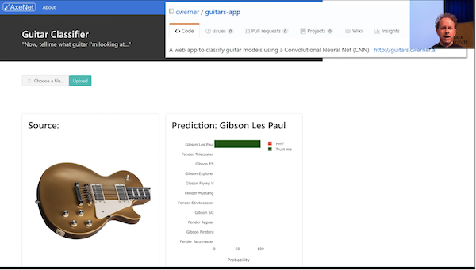
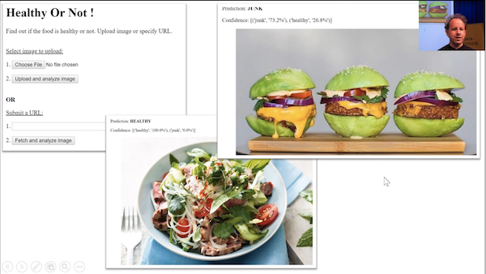
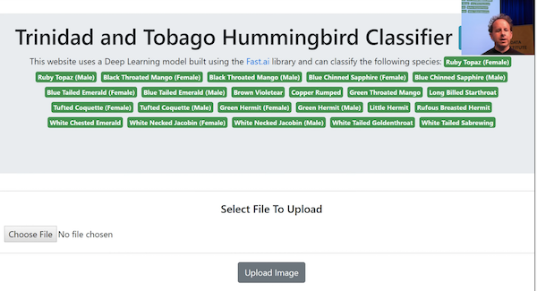
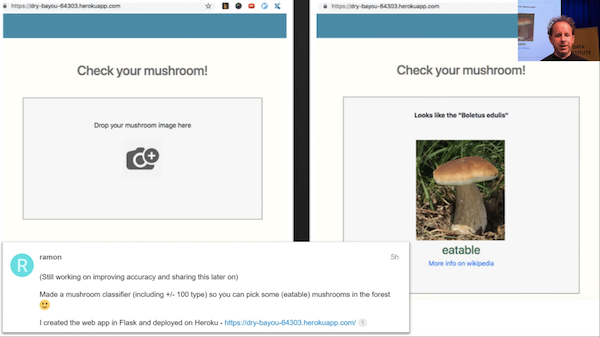
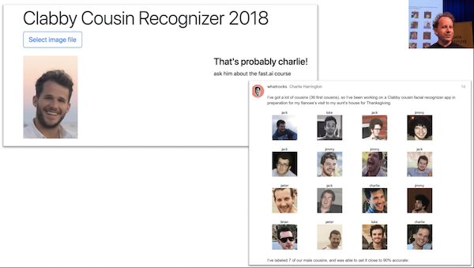
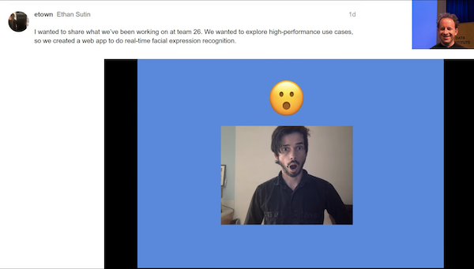
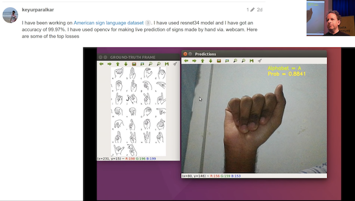
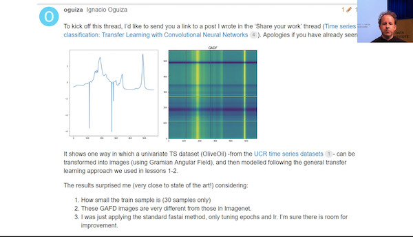
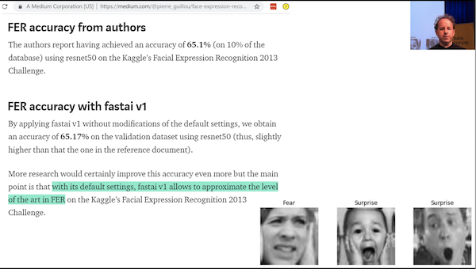
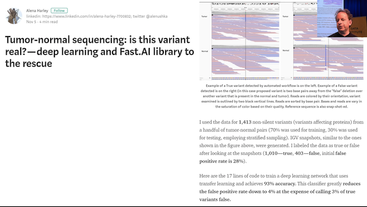

# Lesson 3

[Video](https://youtu.be/PW2HKkzdkKY)

A quick correction on citation. This chart originally cane from Andrew Ng's excellent machine learning course on Coursera. Apologies for the incorrect citation. 


[Andrew Ng's machine learning course](https://www.coursera.org/learn/machine-learning) on Coursera is great. In some ways, it's a little dated but a lot of the content is as appropriate as ever and taught in a bottom-up style. So it can be quite nice to combine it with our top down style and meet somewhere in the middle. 

Also, if you are interested in machine learning foundations, you should check out our [machine learning course](https://course.fast.ai/ml) as well. It is about twice as long as this deep learning course and takes you much more gradually through some of the foundational stuff around validation sets, model interpretation, how PyTorch tensor works, etc. I think all these courses together, if you really dig deeply into the material, do all of them. I know a lot of people who have and end up saying "oh, I got more out of each one by doing a whole lot". Or you can backwards and forwards to see which one works for you.

We started talking about deploying your web app last week. One thing that's going to make life a lot easier for you is that https://course-v3.fast.ai/ has a production section where right now we have one platform but more will be added showing you how to deploy your web app really easily. When I say easily, for example, here is [how to deploy on Zeit guide](https://course-v3.fast.ai/deployment_zeit.html) created by Navjot. 


As you can see, it's just a page. There's almost nothing to and it's free. It's not going to serve 10,000 simultaneous requests but it'll certainly get you started and I found it works really well. It's fast. Deploying a model doesn't have to be slow or complicated anymore. And the nice thing is, you can use this for a Minimum Viable Product (MVP) if you do find it's starting to get a thousand simultaneous requests, then you know that things are working out and you can start to upgrade your instance types or add to a more traditional big engineering approach. If you actually use this starter kit, it will create my teddy bear finder for you. So the idea is, this template is as simple as possible. So you can fill in your own style sheets, your own custom logic, and so forth. This is designed to be a minimal thing, so you can see exactly what's going on. The backend is a simple REST style interface that sends back JSON and the frontend is a super simple little Javascript thing. It should be a good way to get a sense of how to build a web app which talks to a PyTorch model. 


#### Examples of web apps people have built during the week [3:36](https://youtu.be/PW2HKkzdkKY?t=216)

Edward Ross built the what Australian car is that? app


I thought it was interesting that Edward said on the forum that building of this app was actually a great experience in terms of understanding how the model works himself better. It's interesting that he's describing trying it out on his phone. A lot of people think "oh, if I want something on my phone, I have to create some kind of mobile TensorFlow, ONNX, whatever tricky mobile app"﹣you really don't. You can run it all in the cloud and make it just a web app or use some kind of simple little GUI frontend that talks to a rest backend. It's not that often that you'll need to actually run stuff on the phone. So this is a good example of that. 

<table>
<tr>
<td>  <a href="https://forums.fast.ai/t/share-your-work-here/27676/400">Guitar Classifier</a> by Christian Werner</td><td> <a href="https://forums.fast.ai/t/share-your-work-here/27676/340">Healthy or Not!</a> by Nikhil Utane </td><td>  <a href="https://forums.fast.ai/t/share-your-work-here/27676/333">Hummingbird Classifier</a> by Nissan Dookeran</td>
</tr><tr>
<td>  <a href="https://forums.fast.ai/t/share-your-work-here/27676/409">Edible Mushroom?</a> by Ramon</td><td>  <a href="https://forums.fast.ai/t/share-your-work-here/27676/387">Cousin Recognizer</a> by Charlie Harrington</td><td>  <a href="https://forums.fast.ai/t/share-your-work-here/27676/386">Emotion Classifier</a> by Ethan Sutin and Team 26</td>
</tr><tr>
<td>  <a href="https://forums.fast.ai/t/share-your-work-here/27676/350">American Sign Language</a> by Keyur Paralkar</td><td>  <a href="https://forums.fast.ai/t/share-your-work-here/27676/355">Your City from Space</a> by Henri Palacci</td><td>  <a href="https://forums.fast.ai/t/share-your-work-here/27676/367">Univariate TS as images using Gramian Angular Field</a> by Ignacio Oguiza</td>
</tr><tr>
<td>  <a href="https://forums.fast.ai/t/share-your-work-here/27676/348">Face Expression Recognition</a> by Pierre Guillou</td><td> <a href="https://forums.fast.ai/t/share-your-work-here/27676/352">Tumor-normal sequencing</a> by Alena Harley</td><td>  </td>
</tr><table>


Nice to see what people have been building in terms of both web apps and just classifiers. What we are going to do today is look at a whole a lot more different types of model that you can build and we're going to zip through them pretty quickly and then we are going to go back and see how all these things work and what the common denominator is. All of these things, you can create web apps from these as well but you'll have to think about how to slightly change that template to make it work with these different applications. I think that'll be a really good exercise in making sure you understand the material.


### Multi-label classification with Planet Amazon dataset [9:51](https://youtu.be/PW2HKkzdkKY?t=591)

[lesson3-planet.ipynb](https://github.com/fastai/course-v3/blob/master/nbs/dl1/lesson3-planet.ipynb)

The first one we're going to look at is a dataset of satellite images. Satellite imaging is a really fertile area for deep learning. Certainly a lot of people are already using deep learning in satellite imaging but only scratching the surface. The dataset we are going to look at looks like this:


It has satellite tiles and for each one, as you can see, there's a number of different labels for each tile. One of the labels always represents the weather (e.g. cloudy, partly_cloudy). And all of the other labels tell you any interesting features that are seen there. So primary means primary rainforest, agriculture means there's some farming, road means road, and so forth. As I am sure you can tell, this is a little different to all the classifiers we've seen so far because there's not just one label, there's potentially multiple labels. So multi-label classification can be done in a very similar way but the first thing we are going to need to do is to download the data.

#### Downloading the data [11:02](https://youtu.be/PW2HKkzdkKY?t=662)

 This data comes from Kaggle. Kaggle is mainly known for being a competitions website and it's really great to download data from Kaggle when you're learning because you can see how would I have gone in that competition. And it's a good way to see whether you know what you are doing. I tend to think the goal is to try and get in the top 10%. In my experience, all the people in the top 10% of a competition really know what they're doing. So if you can get in the top 10%, then that's a really good sign. 

Pretty much every Kaggle dataset is not available for download outside of Kaggle (at least competition datasets) so you have to download it through Kaggle. The good news is that Kaggle provides a python-based downloader tool which you can use, so we've got a quick description here of how to download stuff from Kaggle. 

You first have to install the Kaggle download tool via `pip`.

```bash
#! pip install kaggle --upgrade
```

What we tend to do when there's one-off things to do is we show you the commented out version in the notebook and you can just remove the comment. If you select a few lines and then hit <kbd>ctrl</kbd>+<kbd>/</kbd>, it uncomment them all. Then when you are done, select them again, <kbd>ctrl</kbd>+<kbd>/</kbd> again and re-comments them all. So this line will install `kaggle` for you. Depending on your platform, you may need `sudo` or `/something/pip`, you may need `source activate` so have a look on the setup instructions instructions or the returning to work instructions on the course website to see when we do `conda	` install, you have to the same basic steps for your pip install. 

Once you've got that module installed, you can then go ahead and download the data. Basically it's as simple as saying `kaggle competitions download -c competition_name -f file_name` the only other steps you do that is you have to authenticate yourself and there is a little bit of information here on exactly how you can go about downloading from Kaggle the file containing your API authentication information. I wouldn't bother going through it here, but just follow these steps. 

> Then you need to upload your credentials from Kaggle on your instance. Login to kaggle and click on your profile picture on the top left corner, then 'My account'. Scroll down until you find a button named 'Create New API Token' and click on it. This will trigger the download of a file named 'kaggle.json'.

> Upload this file to the directory this notebook is running in, by clicking "Upload" on your main Jupyter page, then uncomment and execute the next two commands (or run them in a terminal).

```bash
#! mkdir -p ~/.kaggle/
#! mv kaggle.json ~/.kaggle/
```


> You're all set to download the data from [planet competition](https://www.kaggle.com/c/planet-understanding-the-amazon-from-space). You **first need to go to its main page and accept its rules**, and run the two cells below (uncomment the shell commands to download and unzip the data). If you get a `403 forbidden` error it means you haven't accepted the competition rules yet (you have to go to the competition page, click on *Rules* tab, and then scroll to the bottom to find the *accept* button).

```python
path = Config.data_path()/'planet'
path.mkdir(exist_ok=True)
path
```

```
PosixPath('/home/jhoward/.fastai/data/planet')
```

```bash
# ! kaggle competitions download -c planet-understanding-the-amazon-from-space -f train-jpg.tar.7z -p {path}  
# ! kaggle competitions download -c planet-understanding-the-amazon-from-space -f train_v2.csv -p {path}  
# ! unzip -q -n {path}/train_v2.csv.zip -d {path}
```


Sometimes stuff on Kaggle is not just zipped or `tar`ed but it's compressed with a program called 7zip which will have a .7z extension. If that's the case, you'll need to either `apt install p7zip` or here is something really nice. Some kind person has created a `conda` installation of 7zip that works on every platform. So you can always just run this `conda install` ﹣doesn't even require a `sudo` or anything like that. This is actually a good example of where conda is super handy. You can actually install binaries and libraries and stuff like that and it's nicely cross-platform. So if you don't have 7zip installed, that's a good way to get it.

> To extract the content of this file, we'll need 7zip, so uncomment the following line if you need to install it (or run `sudo apt install p7zip` in your terminal).

```bash
# ! conda install -y -c haasad eidl7zip
```


This is how you unzip a 7zip file. In this case, it's tared and 7zipped, so you can do this all in one step. `7za` is the name of the 7zip archival program you would run. 

That's all basic stuff which if you are not familiar with the command line and stuff, it might take you a little bit of experimenting to get it working. Feel free to ask on the forum, make sure you search the forum first to get started. 

```bash
# ! 7za -bd -y -so x {path}/train-jpg.tar.7z | tar xf - -C {path}
```


#### Multiclassification [14:49](https://youtu.be/PW2HKkzdkKY?t=889)

Once you've got the data downloaded and unzipped, you can take a look at it. In this case, because we have multiple labels for each tile, we clearly can't have a different folder for each image telling us what the label is. We need some different way to label it. The way Kaggle did it was they provided a CSV file that had each file name along with a list of all the labels. So in order to just take a look at that CSV file, we can read it using the Pandas library. If you haven't used pandas before, it's kind of  the standard way of dealing with tabular data in Python. It pretty much always appears in the `pd` namespace. In this case we're not really doing anything with it other than just showing you the contents of this file. So we can read it, take a look at the first few lines, and there it is:

```python
df = pd.read_csv(path/'train_v2.csv')
df.head()
```

|      | image_name | tags                                      |
| ---- | ---------- | ----------------------------------------- |
| 0    | train_0    | haze primary                              |
| 1    | train_1    | agriculture clear primary water           |
| 2    | train_2    | clear primary                             |
| 3    | train_3    | clear primary                             |
| 4    | train_4    | agriculture clear habitation primary road |

We want to turn this into something we can use for modeling. So the kind of object that we use for modeling is an object of the DataBunch class. We have to somehow create a data bunch out of this. Once we have a data bunch, we'll be able to go `.show_banch` to take a look at it.  And then we'll be able to go `create_cnn` with it, and we would be able to start training.

So really the the trickiest step previously in deep learning has often been getting your data into a form that you can get it into a model. So far we've been showing you how to do that using various "factory methods" which are methods where you say "I want to create this kind of data from this kind of source with these kinds of options." That works fine, sometimes, and we showed you a few ways of doing it over the last couple of weeks. But  sometimes you want more flexibility, because there's so many choices that you have to make about:

- Where do the files live
- What's the structure they're in
- How do the labels appear
- How do you spit out the validation set
- How do you transform it

So we've got this unique API that I'm really proud of called the [data block API](https://docs.fast.ai/data_block.html). The data block API makes each one of those decisions a separate decision that you make. There are separate methods with their own parameters for every choice that you make around how to create/set up my data. 

```python
tfms = get_transforms(flip_vert=True, max_lighting=0.1, max_zoom=1.05, max_warp=0.)
```

```python
np.random.seed(42)
src = (ImageFileList.from_folder(path)            
       .label_from_csv('train_v2.csv',sep=' ',folder='train-jpg',suffix='.jpg')
       .random_split_by_pct(0.2))
```

```python
data = (src.datasets()
        .transform(tfms, size=128)
        .databunch().normalize(imagenet_stats))
```

For example, to grab the planet data we would say:

- We've got a list of image files that are in a folder 
- They're labeled based on a CSV with this name (`train_v2.csv`) 
  - They have this separator (` `) ﹣remember I showed you back here that there's a space between them. By passing in separator, it's going to create multiple labels. 
  - The images are in this folder (`train-jpg`) 
  - They have this suffix (`.jpg`)
- They're going to randomly spit out a validation set with 20% of the data 
- We're going to create datasets from that, which we are then going to transform with these transformations (`tfms`)
- Then we going to create a data bunch out of that, which we will then normalize using these statistics (`imagenet_stats`)

So there's all these different steps. To give you a sense of what that looks like, the first thing I'm going to do is go back and explain what are all of the PyTorch and fastai classes you need to know about that are going to appear in this process. Because you're going to see them all the time in the fastai docs and PyTorch docs.

##### Dataset (PyTorch) [18:30](https://youtu.be/PW2HKkzdkKY?t=1110)

The first one you need to know about is a class called a Dataset. The Dataset class is part of PyTorch and this is the source code for the Dataset class:


As you can see. it actually does nothing at all. The Dataset class in PyTorch defines two things: `__getitem__` and `__len__`. In Python these special things that are "underscore underscore something underscore underscore" ﹣Pythonists call them "dunder" something. So these would be "dunder get items" and "dunder len". They're basically special magical methods with some special behavior. This particular method means that your object, if you had an object called `O`, it can be indexed with square brackets (e.g. `O[3]`).  So that would call `__getitem__` with 3 as the index.

Then this one called `__len__` means that you can go `len(o)` and it will call that method. In this case, they're both not implemented. That is to say, although PyTorch says "in order to tell PyTorch about your data, you have to create a dataset", it doesn't really do anything to help you create the dataset. It just defines what the dataset needs to do. In other words, the starting point for your data is something where you can say:

- What is the third item of data in my dataset (that's what `__getitem__` does)
- How big is my dataset (that's what `__len__` does) 

Fastai has lots of Dataset subclasses that do that for all different kinds of stuff. So far, you've been seeing image classification datasets. They are datasets where `__getitem__`  will return an image and a single label of what is that image. So that's what a dataset is. 

##### DataLoader (PyTorch) [20:37](https://youtu.be/PW2HKkzdkKY?t=1237)

Now a dataset is not enough to train a model. The first thing we know we have to do, if you think back to the gradient descent tutorial last week is we have to have a few images/items at a time so that our GPU can work in parallel. Remember we do this thing called a "mini-batch"? Mini-batch is a few items that we present to the model at a time that it can train from in parallel. To create a mini-batch, we use another PyTorch class called a DataLoader.


A DataLoader takes a dataset in its constructor, so it's now saying "oh this is something I can get the third item and the fifth item and the ninth item." It's going to:

- Grab items at random
- Create a batch of whatever size you asked for
- Pop it on the GPU
- Send it off to your model for you

So a DataLoader is something that grabs individual items, combines them into a mini-batch, pops them on the GPU for modeling. So that's called a DataLoader and that comes from a Dataset. 

You can see, already there are choices you have to make: what kind of dataset am I creating, what is the data for it, where it's going to come from. Then when I create my DataLoader: what batch size do I want to use.  

##### DataBunch (fastai) [21:59](https://youtu.be/PW2HKkzdkKY?t=1319)

It still isn't enough to train a model, because we've got no way to validate the model. If all we have is a training set, then we have no way to know how we're doing because we need a separate set of held out data, a validation set, to see how we're getting along.


For that we use a fastai class called a DataBunch. A DataBunch is something which binds together a training data loader (`train_dl`) and a valid data loader (`valid_dl`).  When you look at the fastai docs when you see these mono spaced font things, they're always referring to some symbol you can look up elsewhere. In this case you can see `train_dl` is the first argument of DataBunch. There's no point knowing that there's an argument with a certain name unless you know what that argument is, so you should always look after the `:` to find out that is a DataLoader. So when you create a DataBunch, you're basically giving it a training set data loader and a validation set data loader. And that's now an object that you can send off to a learner and start fitting,

They're the basic pieces. Coming back to here, these are all the stuff which is creating the dataset:


With the dataset, the indexer returns two things:  the image and the labels (assuming it's an image dataset).

- where do the images come from 
- where do the labels come from
- then I'm going to create two separate data sets the training and the validation 
- `.datasets()` actually turns them into PyTorch datasets 
- `.transform()` is the thing that transforms them
- `.databunch()` is actually going to create the the DataLoader and the DataBunch in one go 


#### Data block API examples [23:56](https://youtu.be/PW2HKkzdkKY?t=1436)

Let's look at some examples of this data block API because once you understand the data block API, you'll never be lost for how to convert your dataset into something you can start modeling with.

[data_block.ipynb](https://github.com/fastai/fastai/blob/master/docs_src/data_block.ipynb)


#### MNIST

Here are some examples of using the data block API. For example, if you're looking at MNIST (the pictures and classes of handwritten numerals), you can do something like this:

```python
path = untar_data(URLs.MNIST_TINY)
tfms = get_transforms(do_flip=False)
path.ls()
```

```
[PosixPath('/home/jhoward/.fastai/data/mnist_tiny/valid'),
 PosixPath('/home/jhoward/.fastai/data/mnist_tiny/models'),
 PosixPath('/home/jhoward/.fastai/data/mnist_tiny/train'),
 PosixPath('/home/jhoward/.fastai/data/mnist_tiny/test'),
 PosixPath('/home/jhoward/.fastai/data/mnist_tiny/labels.csv')]
```

```python
(path/'train').ls()
```

```
[PosixPath('/home/jhoward/.fastai/data/mnist_tiny/train/3'),
 PosixPath('/home/jhoward/.fastai/data/mnist_tiny/train/7')]
```

```python
data = (ImageFileList.from_folder(path)  #Where to find the data? -> in path and its subfolders
        .label_from_folder()             #How to label? -> depending on the folder of the filenames
        .split_by_folder()               #How to split in train/valid? -> use the folders
        .add_test_folder()               #Optionally add a test set
        .datasets()                      #How to convert to datasets?
        .transform(tfms, size=224)       #Data augmentation? -> use tfms with a size of 224
        .databunch())                    #Finally? -> use the defaults for conversion to ImageDataBunch
```


- What kind of data set is this going to be? 
  - It's going to come from a list of image files which are in some folder.
  - They're labeled according to the folder name that they're in.
  - We're going to split it into train and validation according to the folder that they're in (`train` and `valid`).
  - You can optionally add a test set. We're going to be talking more about test sets later in the course.
  - We'll convert those into PyTorch datasets now that that's all set up. 
  - We will then transform them using this set of transforms (`tfms`), and we're going to transform into something of this size (`224`).
  - Then we're going to convert them into a data bunch.

So each of those stages inside these parentheses are various parameters you can pass to customize how that all works. But in the case of something like this MNIST dataset, all the defaults pretty much work, so this is all fine.

```python
data.train_ds[0]
```

```
(Image (3, 224, 224), 0)
```

Here it is. `data.train_ds` is the dataset (not the data loader) so I can actually index into it with a particular number. So here is the zero indexed item in the training data set: it's got an image and a label.
```python
data.show_batch(rows=3, figsize=(5,5))
```


We can show batch to see an example of the pictures of it. And we could then start training.

```python
data.valid_ds.classes
```

```
['3', '7']
```

Here are the classes that are in that dataset. This little cut-down sample of MNIST has 3's and 7's. 

#### Planet [26:01](https://youtu.be/PW2HKkzdkKY?t=1561)

Here's an example using planet dataset. This is actually again a little subset of planet we use to make it easy to try things out. 

```python
planet = untar_data(URLs.PLANET_TINY)
planet_tfms = get_transforms(flip_vert=True, max_lighting=0.1, max_zoom=1.05, max_warp=0.)
data = ImageDataBunch.from_csv(planet, folder='train', size=128, suffix='.jpg', sep = ' ', ds_tfms=planet_tfms)
```

> With the data block API we can rewrite this like that:

```python
data = (ImageFileList.from_folder(planet)            
        #Where to find the data? -> in planet and its subfolders
        .label_from_csv('labels.csv', sep=' ', folder='train', suffix='.jpg')  
        #How to label? -> use the csv file labels.csv in path, 
        #add .jpg to the names and take them in the folder train
        .random_split_by_pct()                     
        #How to split in train/valid? -> randomly with the default 20% in valid
        .datasets()
        #How to convert to datasets? -> use ImageMultiDataset
        .transform(planet_tfms, size=128)             
        #Data augmentation? -> use tfms with a size of 128
        .databunch())                          
        #Finally? -> use the defaults for conversion to databunch
```

In this case:

- Again, it's an ImageFileList
- We are grabbing it from a folder
- This time we're labeling it based on a CSV file
- We're randomly splitting it (by default it's 20%) 
- Creating data sets
- Transforming it using these transforms (`planet_tfms`), we're going to use a smaller size (`128`).
- Then create a data bunch 

```python
data.show_batch(rows=3, figsize=(10,8))
```


There it is. Data bunches know how to draw themselves amongst other things. 

#### CAMVID [26:38](https://youtu.be/PW2HKkzdkKY?t=1598)

Here's some more examples we're going to be seeing later today.

```python
camvid = untar_data(URLs.CAMVID_TINY)
path_lbl = camvid/'labels'
path_img = camvid/'images'
```

```python
codes = np.loadtxt(camvid/'codes.txt', dtype=str); codes
```

```
array(['Animal', 'Archway', 'Bicyclist', 'Bridge', 'Building', 'Car', 'CartLuggagePram', 'Child', 'Column_Pole',
       'Fence', 'LaneMkgsDriv', 'LaneMkgsNonDriv', 'Misc_Text', 'MotorcycleScooter', 'OtherMoving', 'ParkingBlock',
       'Pedestrian', 'Road', 'RoadShoulder', 'Sidewalk', 'SignSymbol', 'Sky', 'SUVPickupTruck', 'TrafficCone',
       'TrafficLight', 'Train', 'Tree', 'Truck_Bus', 'Tunnel', 'VegetationMisc', 'Void', 'Wall'], dtype='<U17')
```

```python
get_y_fn = lambda x: path_lbl/f'{x.stem}_P{x.suffix}'
```

```python
data = (ImageFileList.from_folder(path_img)                #Where are the input files? -> in path_img
        .label_from_func(get_y_fn)                         #How to label? -> use get_y_fn
        .random_split_by_pct()                             #How to split between train and valid? -> randomly
        .datasets(SegmentationDataset, classes=codes)      #How to create a dataset? -> use SegmentationDataset
        .transform(get_transforms(), size=96, tfm_y=True)  #Data aug -> Use standard tfms with tfm_y=True
        .databunch(bs=64))                                 #Lastly convert in a databunch.
```

```python
data.show_batch(rows=2, figsize=(5,5))
```


What if we look at this data set called CAMBID?  CAMVID looks like this. It contains pictures and every pixel in the picture is color coded. So in this case :

- We have a list of files in a folder 
- We're going to label them using a function. So this function (`get_y_fn`) is basically the thing which tells it whereabouts of the color coding for each pixel. It's in a different place. 
- Randomly split it in some way
- Create some datasets in some way. We can tell it for our particular list of classes, how do we know what pixel you know value 1 versus pixel value 2 is. That was something that we can read in.
- Some transforms
- Create a data bunch. You can optionally pass in things like what batch size do you want.

Again, it knows how to draw itself and you can start learning with that.

#### COCO [27:41](https://youtu.be/PW2HKkzdkKY?t=1661)

One more example. What if we wanted to create something like this:


This is called an object detection dataset. Again, we've got a little minimal COCO dataset. COCO is the most famous academic dataset for object detection.

```
coco = untar_data(URLs.COCO_TINY)
images, lbl_bbox = get_annotations(coco/'train.json')
img2bbox = {img:bb for img, bb in zip(images, lbl_bbox)}
get_y_func = lambda o:img2bbox[o.name]
```

```python
data = (ImageFileList.from_folder(coco)
        #Where are the images? -> in coco
        .label_from_func(get_y_func)                    
        #How to find the labels? -> use get_y_func
        .random_split_by_pct()                          
        #How to split in train/valid? -> randomly with the default 20% in valid
        .datasets(ObjectDetectDataset)                  
        #How to create datasets? -> with ObjectDetectDataset
        #Data augmentation? -> Standard transforms with tfm_y=True
        .databunch(bs=16, collate_fn=bb_pad_collate))   
        #Finally we convert to a DataBunch and we use bb_pad_collate
```

We can create it using the same process:

- Grab a list of files from a folder.
- Label them according to this little function (`get_y_func`).
- Randomly split them.
- Create an object detection dataset.
- Create a data bunch. In this case you have to use generally smaller batch sizes or you'll run out of memory. And you have to use something called a "collation function". 

Once that's all done we can again show it and here is our object detection data set. So you get the idea. So here's a really convenient notebook. Where will you find this? Ah, this notebook is the documentation. Remember how I told you that all of the documentation comes from notebooks? You'll find them in [fastai repo in docs_src](https://github.com/fastai/fastai/tree/master/docs_src) . This which you can play with and experiment with inputs and outputs, and try all the different parameters, you will find [the data block API examples of use](https://github.com/fastai/fastai/blob/master/docs_src/data_block.ipynb), if you go to the documentation here it is - the [data block API examples of use](https://docs.fast.ai/data_block.html#Examples-of-use). 

Everything that you want to use in fastai, you can look it up in the documentation. There is also search functionality available:


So once you find some documentation that you actually want to try playing with yourself, just look up the name (e.g. `data_block.html`) and then you can open up a notebook with the same name (e.g. `data_block.ipynb`) in the fastai repo and play with it yourself.

#### Creating satellite image data bunch [29:35](https://youtu.be/PW2HKkzdkKY?t=1775)

That was a quick overview of this really nice data block API, and there's lots of documentation for all of the different ways you can label inputs, split data, and create datasets. So that's what we're using for planet.

In the documentation, these two steps were all joined up together:

```python
np.random.seed(42)
src = (ImageFileList.from_folder(path)            
       .label_from_csv('train_v2.csv', sep=' ', folder='train-jpg', suffix='.jpg')  
       .random_split_by_pct(0.2))
```

```python
data = (src.datasets()
        .transform(tfms, size=128)
        .databunch().normalize(imagenet_stats))
```

We can certainly do that here too, but you'll learn in a moment why it is that we're actually splitting these up into two separate steps which is also fine as well. 

A few interesting points about this. 

- **Transforms**: transforms by default will flip randomly each image, but they'll actually randomly only flip them horizontally. If you're trying to tell if something is a cat or a dog, it doesn't matter whether it's pointing left or right. But you wouldn't expect it to be upside down On the other hand satellite imagery whether something's cloudy or hazy or whether there's a road there or not could absolutely be flipped upside down. There's no such thing as a right way up from space. So `flip_vert` which defaults to `False`, we're going to flip over to `True` to say you should actually do that. And it doesn't just flip it vertically, it actually tries each possible 90-degree rotation (i.e. there are 8 possible symmetries that it tries out).
- **Warp**: perspective warping is something which very few libraries provide, and those that do provide it it tends to be really slow. I think fastai is the first one to provide really fast perspective warping. Basically, the reason this is interesting is if I look at you from below versus above, your shape changes. So when you're taking a photo of a cat or a dog, sometimes you'll be higher, sometimes you'll be lower, then that kind of change of shape is certainly something that you would want to include as you're creating your training batches. You want to modify it a little bit each time. Not true for satellite images. A satellite always points straight down at the planet. So if you added perspective warping, you would be making changes that aren't going to be there in real life. So I turn that off.

This is all something called data augmentation. We'll be talking a lot more about it later in the course. But you can start to get a feel for the kinds of things that you can do to augment your data. In general, maybe the most important one is if you're looking at astronomical data, pathology digital slide data, or satellite data where there isn't really an up or down, turning on flip verticals true is generally going to make your models generalize better.

#### Creating multi-label classifier [35:59](https://youtu.be/PW2HKkzdkKY?t=1979)

Now to create a multi-label classifier that's going to figure out for each satellite tile what's the weather and what else what can I see in it, there's basically nothing else to learn. Everything else that you've already learned is going to be exactly nearly the same.

```python
arch = models.resnet50
```

```python
acc_02 = partial(accuracy_thresh, thresh=0.2)
f_score = partial(fbeta, thresh=0.2)
learn = create_cnn(data, arch, metrics=[acc_02, f_score])
```

When I first built built this notebook, I used `resnet34` as per usual. Then I tried `resnet50` as I always like to do. I found `resnet50` helped a little bit and I had some time to run it, so in this case I was using `resnet50`. 

There's one more change I make which is metrics. To remind you, a metric has got nothing to do with how the model trains. Changing your metrics will not change your resulting model at all. The only thing that we use metrics for is we print them out during training.

```python
lr = 0.01
```

```python
learn.fit_one_cycle(5, slice(lr))
```

```
Total time: 04:17
epoch  train_loss  valid_loss  accuracy_thresh  fbeta   
1      0.115247    0.103319    0.950703         0.910291  (00:52)
2      0.108289    0.099074    0.953239         0.911656  (00:50)
3      0.102342    0.092710    0.953348         0.917987  (00:51)
4      0.095571    0.085736    0.957258         0.926540  (00:51)
5      0.091275    0.085441    0.958006         0.926234  (00:51)
```

Here it's printing out accuracy and this other metric called `fbeta`. If you're trying to figure out how to do a better job with your model, changing the metrics will never be something that you need to do. They're just to show you how you're going. 

You can have one metric, no metrics, or a list of multiple metrics to be printed out as your models training. In this case, I want to know two things: 

1. The accuracy
2. How would I go on Kaggle

Kaggle told me that I'm going to be judged on a particular metric called the F score. I'm not going to bother telling you about the F score﹣it's not really interesting enough to be worth spending your time on. But it's basically this. When you have a classifier, you're going to have some false positives and some false negatives. How do you weigh up those two things to create a single number? There's lots of different ways of doing that and something called the F score is a nice way of combining that into a single number. And there are various kinds of F scores: F1, F2 and so forth. And Kaggle said in the competition rules, we're going to use a metric called F2. 


We have a metric called `fbeta`. In other words, it's F with 1, 2, or whatever depending on the value of beta. We can have a look at its signature and it has a threshold and a beta. The beta is 2 by default, and Kaggle said that they're going to use F 2 so I don't have to change that. But there's one other thing that I need to set which is a threshold.

What does that mean? Here's the thing. Do you remember we had a little look the other day at the source code for the accuracy metric? And we found that it used this thing called `argmax`. The reason for that was we had this input image that came in, it went through our model, and at the end it came out with a table of ten numbers. This is if we're doing MNIST digit recognition and the ten numbers were the probability of each of the possible digits. Then we had to look through all of those and find out which one was the biggest. So the function in Numpy, PyTorch, or just math notation that finds the biggest in returns its index is called `argmax`.

To get the accuracy for our pet detector, we use this accuracy function the called `argmax` to find out which class ID pet was the one that we're looking at. Then it compared that to the actual, and then took the average. That was the accuracy. 


[37:23](https://youtu.be/PW2HKkzdkKY?t=2243)

We can't do that for satellite recognition because there isn't one label we're looking for﹣there's lots. A data bunch has a special attribute called `c` and `c` is going to be how many outputs do we want our model to create. For any kind of classifier, we want one probability for each possible class. In other words, `data.c` for classifiers is always going to be equal to the length of `data.classes`. 


They are the 17 possibilities. So we're going to have one probability for each of those. But then we're not just going to pick out one of those 17, we're going to pick out *n* of those 17. So what we do is, we compare each probability to some threshold. Then we say anything that's higher than that threshold, we're going to assume that the models saying it does have that feature. So we can pick that threshold.


I found that for this particular dataset, a threshold of 0.2 seems to generally work pretty well. This is the kind of thing you can easily just experiment to find a good threshold. So I decided I want to print out the accuracy at a threshold of 0.2.

The normal accuracy function doesn't work that way. It doesn't `argmax`. We have to use a different accuracy function called `accuracy_thresh`. That's the one that's going to compare every probability to a threshold and return all the things higher than that threshold and compare accuracy that way.


#### Python3 `partial` [[39:17](https://youtu.be/PW2HKkzdkKY?t=2357)]

One of the things we had passed in is `thresh`. Now of course our metric is going to be calling our function for us, so we don't get to tell it every time it calls back what threshold do we want, so we really want to create a special version of this function that always uses a threshold of 0.2. One way to do that would be defining a function `acc_02` as below:

```python
def acc_02(inp, targ): return accuracy_thresh(inp, targ, thresh=0.2)
```

We could do it that way. But it's so common that computer science has a term for that it's called a "partial" / "partial function application" (i.e. create a new function that's just like that other function but we are always going to call it with a particular parameter).

Python3 has something called `partial` that takes some function and some list of keywords and values, and creates a new function that is exactly the same as this function (`accurasy_thresh`) but is always going to call it with that keyword argument (`thresh=0.2`).

```python
acc_02 = partial(accuracy_thresh, thresh=0.2)
```

This is a really common thing to do particularly with the fastai library because there's lots of places where you have to pass in functions and you very often want to pass in a slightly customized version of a function so here's how you do it.

Similarly, `fbeta` with `thresh=0.2`:

```python
acc_02 = partial(accuracy_thresh, thresh=0.2)
f_score = partial(fbeta, thresh=0.2)
learn = create_cnn(data, arch, metrics=[acc_02, f_score])
```

I can pass them both in as metrics and I can then go ahead and do all the normal stuff.

```python
learn.lr_find()
```

```python
learn.recorder.plot()
```


Find the thing with the steepest slope ﹣so somewhere around 1e-2, make that our learning rate.

```python
lr = 0.01
```

Then fit for awhile with `5, slice(lr)` and see how we go.

```python
learn.fit_one_cycle(5, slice(lr))
```

```
Total time: 04:17
epoch  train_loss  valid_loss  accuracy_thresh  fbeta   
1      0.115247    0.103319    0.950703         0.910291  (00:52)
2      0.108289    0.099074    0.953239         0.911656  (00:50)
3      0.102342    0.092710    0.953348         0.917987  (00:51)
4      0.095571    0.085736    0.957258         0.926540  (00:51)
5      0.091275    0.085441    0.958006         0.926234  (00:51)
```

So we've got an accuracy of about 96% and F beta of about 0.926 and so you could then go and have a look at [Planet private leaderboard](https://www.kaggle.com/c/planet-understanding-the-amazon-from-space/leaderboard). The top 50th is about 0.93 so we kind of say like oh we're on the right track. So as you can see, once you get to a point that the data is there, there's very little extra to do most of the time.

**Question**: When your model makes an incorrect prediction in a deployed app, is there a good way to “record” that error and use that learning to improve the model in a more targeted way? [[42:01](https://youtu.be/PW2HKkzdkKY?t=2522)]

That's a great question. The first bit﹣is there a way to record that? Of course there is. You record it. That's up to you. Maybe some of you can try it this week. You need to have your user tell you that you were wrong. This Australian car you said it was a Holden and actually it's a Falcon. So first of all. you'll need to collect that feedback and the only way to do that is to ask the user to tell you when it's wrong. So you now need to record in some log somewhere﹣something saying you know this was the file, I've stored it here, this was the prediction I made, this was the actual that they told me. Then at the end of the day or at the end of the week, you could set up a little job to run something or you can manually run something. What are you going to do? You're going to do some fine-tuning. What does fine-tuning look like? Good segue Rachel! It looks like this. 

So let's pretend here's your saved model:

```python
learn.save('stage-1-rn50')
```

Then we unfreeze:

```python
learn.unfreeze()
```

```python
learn.lr_find()
learn.recorder.plot()
```


Then we fit a little bit more. Now in this case, I'm fitting with my original dataset. But you could create a new data bunch with just the misclassified instances and go ahead and fit. The misclassified ones are likely to be particularly interesting. So you might want to fit at a slightly higher learning rate to make them really mean more or you might want to run them through a few more epochs. But it's exactly the same thing. You just call fit with your misclassified examples and passing in the correct classification. That should really help your model quite a lot.

There are various other tweaks you can do to this but that's the basic idea. 

```python
learn.fit_one_cycle(5, slice(1e-5, lr/5))
```

```
Total time: 05:48
epoch  train_loss  valid_loss  accuracy_thresh  fbeta   
1      0.096917    0.089857    0.964909         0.923028  (01:09)
2      0.095722    0.087677    0.966341         0.924712  (01:09)
3      0.088859    0.085950    0.966813         0.926390  (01:09)
4      0.085320    0.083416    0.967663         0.927521  (01:09)
5      0.081530    0.082129    0.968121         0.928895  (01:09)
```

```python
learn.save('stage-2-rn50')
```


**Question**: Could someone talk a bit more about the data block ideology? I'm not quite sure how the blocks are meant to be used. Do they have to be in a certain order? Is there any other library that uses this type of programming that I could look at? [[44:01](https://youtu.be/PW2HKkzdkKY?t=2641)]

Yes, they do have to be in a certain order and it's basically the order that you see in [the example of use](https://docs.fast.ai/data_block.html#Examples-of-use).

```python
data = (ImageItemList.from_folder(path) #Where to find the data? -> in path and its subfolders
        .split_by_folder()              #How to split in train/valid? -> use the folders
        .label_from_folder()            #How to label? -> depending on the folder of the filenames
        .add_test_folder()              #Optionally add a test set (here default name is test)
        .transform(tfms, size=64)       #Data augmentation? -> use tfms with a size of 64
        .databunch())                   #Finally? -> use the defaults for conversion to ImageDataBunch
```

- What kind of data do you have? 
- Where does it come from? 
- How do you split it? 
- How do you label it? 
- What kind of datasets do you want? 
- Optionally, how do I transform it? 
- How do I create a data bunch from? 

They're the steps. We invented this API. I don't know if other people have independently invented it. The basic idea of a pipeline of things that dot into each other is pretty common in a number of places﹣not so much in Python, but you see it more in JavaScript. Although this kind of approach of each stage produces something slightly different, you tend to see it more in like ETL software (extraction transformation and loading software) where this particular stages in a pipeline. It's been inspired by a bunch of things. But all you need to know is to use this example to guide you, and then look up the documentation to see which particular kind of thing you want. In this case, the `ImageItemList`, you're actually not going to find the documentation of `ImageItemList` in datablocks documentation because this is specific to the vision application. So to, then, go and actually find out how to do something for your particular application, you would then go to look at text, vision, and so forth. That's where you can find out what are the datablock API pieces available for that application.

Of course, you can then look at the source code if you've got some totally new application. You could create your own "part" of any of these stages. Pretty much all of these functions are very few lines of code. Maybe we could look an example of one. Let's try.


You can look at the documentation to see exactly what that does. As you can see, most fastai functions are no more than a few lines of code. They're normally pretty straightforward to see what are all the pieces there and how can you use them. It's probably one of these things that, as you play around with it, you'll get a good sense of how it all gets put together. But if during the week there are particular things where you're thinking I don't understand how to do this please let us know and we'll try to help you.

**Question**: What resources do you recommend for getting started with video? For example, being able to pull frames and submit them to your model. [[47:39](https://youtu.be/PW2HKkzdkKY?t=2859)]

The answer is it depends. If you're using the web which I guess probably most of you will be then there's there's web API's  that basically do that for you. So you can grab the frames with the web api and then they're just images which you can pass along. If you're doing a client side, i guess most people would tend to use OpenCV for that. But maybe during the week, people who are doing these video apps can tell us what have you used and found useful, and we can start to prepare something in the lesson wiki with a list of video resources since it sounds like some people are interested.


[48:50](https://youtu.be/PW2HKkzdkKY?t=2930)


### How to choose good learning rates

One thing to notice here is that before we unfreeze you'll tend to get this shape pretty much all the time:


If you do your learning rate finder before you unfreeze. It's pretty easy ﹣ find the steepest slope, **not the bottom**. Remember, we're trying to find the bit where we can like slide down it quickly. So if you start at the bottom it's just gonna send you straight off to the end here. 

Then we can call it again after you unfreeze, and you generally get a very different shape.


[49:24](https://youtu.be/PW2HKkzdkKY?t=2964)

This is a little bit harder to say what to look for because it tends to be this kind of shape where you get a little bit of upward and then it kind of very gradual downward and then up here. So I tend to kind of look for just before it shoots up and go back about 10x as a kind of a rule of thumb. So one 1e-5. That is what I do for the first half of my slice. And then for the second half of my slice, I normally do whatever learning rate are used for the the frozen part.  So lr which was 0.01 kind of divided by five or ten. Somewhere around that. That's my rule of thumb:

- look for the bit kind of at the bottom find about 10x smaller that's the number that I put as the first half of my slice
- `lr/5` or `lr/10`  is kind of what I put as the second half of my slice

This is called discriminative learning rates as the course continues. 

### Making the model better [50:30](https://youtu.be/PW2HKkzdkKY?t=3030)

How am I going to get this better? We want to get into the top 10% which is going to be about 0.929 ish so we're not quite there (0.9288). 

So here's the trick [[51:01](https://youtu.be/PW2HKkzdkKY?t=3061)]. When I created my dataset, I put `size=128` and actually the images that Kaggle gave us are 256. I used the size of 128 partially because I wanted to experiment quickly. It's much quicker and easier to use small images to experiment. But there's a second reason. I now have a model that's pretty good at recognizing the contents of 128 by 128 satellite images. So what am I going to do if I now want to create a model that's pretty good at 256 by 256 satellite images? Why don't I use transfer learning? Why don't I start with the model that's good at 128 by 128 images and fine-tune that? So don't start again. That's actually going to be really interesting because if I trained quite a lot and I'm on the verge of overfitting then I'm basically creating a whole new dataset effectively﹣one where my images are twice the size on each axis right so four times bigger. So it's really a totally different data set as far as my convolutional neural networks concerned. So I got to lose all that overfitting. I get to start again. Let's keep our same learner but use a new data bunch where the data bunch is 256 by 256. That's why I actually stopped here before I created my data sets:


Because I'm going to now take this this data source (`src`) and I'm going to create a new data bunch with 256 instead so let's have a look at how we do that.


```python
data = (src.transform(tfms, size=256)
        .databunch().normalize(imagenet_stats))
```

So here it is. Take that source, transform it with the same transforms as before but this time use size 256. That should be better anyway because this is going to be higher resolution images. But also I'm going to start with this kind of pre-trained model (I haven't got rid of my learner it's the same learner I had before).

 I'm going to replace the data inside my learner with this new data bunch. 

```python
learn.data = data
data.train_ds[0][0].shape
```
```
torch.Size([3, 256, 256])
```

```python
learn.freeze()
```

Then I will freeze again (i.e. I'm going back to just training the last few layers) and I will do a new `lr_find()`. 

```python
learn.lr_find()
learn.recorder.plot()
```


Because I actually now have a pretty good model (it's pretty good for 128 by 128 so it's probably gonna be like at least okay for 256 by 256), I don't get that same sharp shape that I did before. But I can certainly see where it's way too high. So I'm gonna pick something well before where it's way too high. Again maybe 10x smaller. So here I'm gonna go `1e-2/2` ﹣ that seems well before it shoots up. 

```python
lr=1e-2/2
```

So let's fit a little bit more.

```python
learn.fit_one_cycle(5, slice(lr))
```

```
Total time: 14:21
epoch  train_loss  valid_loss  accuracy_thresh  fbeta   
1      0.088628    0.085883    0.966523         0.924035  (02:53)
2      0.089855    0.085019    0.967126         0.926822  (02:51)
3      0.083646    0.083374    0.967583         0.927510  (02:51)
4      0.084014    0.081384    0.968405         0.931110  (02:51)
5      0.083445    0.081085    0.968659         0.930647  (02:52)
```
We frozen again so we're just trading the last few layers and fit a little bit more. As you can see, I very quickly remember 0.928 was where we got to before after quite a few epochs. we're straight up there and suddenly we've passed 0.93. So we're now already into the top 10%. So we've hit our first goal. We're, at the very least, pretty confident at the problem of recognizing satellite imagery. 
```python
learn.save('stage-1-256-rn50')
```

But of course now, we can do the same thing as before. We can unfreeze and train a little more. 

```python3
learn.unfreeze()
```

Again using the same kind of approach I described before lr/5 on the right and even smaller one on the left. 

```python3
learn.fit_one_cycle(5, slice(1e-5, lr/5))
```

```
Total time: 18:23
epoch  train_loss  valid_loss  accuracy_thresh  fbeta   
1      0.083591    0.082895    0.968310         0.928210  (03:41)
2      0.088286    0.083184    0.967424         0.928812  (03:40)
3      0.083495    0.083084    0.967998         0.929224  (03:40)
4      0.080143    0.081338    0.968564         0.931363  (03:40)
5      0.074927    0.080691    0.968819         0.931414  (03:41)
```

Train a little bit more. 0.9314 so that's actually pretty good﹣somewhere around top 25ish. Actually when my friend Brendan and I entered this competition we came 22nd with 0.9315 and we spent (this was a year or two ago) months trying to get here. So using pretty much defaults with the minor tweaks and one trick which is the resizing tweak you can get right up into the top of the leaderboard of this very challenging competition. Now I should say we don't really know where we'd be﹣we would actually have to check it on the test set that Kaggle gave us and actually submit to the competition which you can do. You can do a late submission. So later on in the course, we'll learn how to do that. But we certainly know we're doing very well so that's great news.

```python
learn.recorder.plot_losses()
```


```python
learn.save('stage-2-256-rn50') 
```

You can see as I kind of go along I tend to save things. You can name your models whatever you like but I just want to basically know you know is it before or after the unfreeze (stage 1 or 2), what size was I training on, what architecture was I training on. That way I could have always go back and experiment pretty easily. So that's planet. Multi label classification.


## Segmentation example: CamVid [[56:31](https://youtu.be/PW2HKkzdkKY?t=3391)] 

[Notebook](https://github.com/fastai/course-v3/blob/master/nbs/dl1/lesson3-camvid.ipynb)

The next example we're going to look at is this dataset called CamVid. It's going to be doing something called segmentation. We're going to start with a picture like the left:

 

and we're going to try and create a color-coded picture like the right where all of the bicycle pixels are the same color all of the road line pixels are the same color all of the tree pixels of the same color all of the building pixels are same color the sky the same color and so forth.

Now we're not actually going to make them colors, we're actually going to do it where each of those pixels has a unique number. In this case the top of left is building, so I guess building this number 4, the top right is tree, so tree is 26, and so forth.

In other words, this single top left pixel, we're going to do a classification problem just like the pet's classification for the very top left pixel. We're going to say "what is that top left pixel? Is it bicycle, road lines, sidewalk, building?" Then what is the next pixel along? So we're going to do a little classification problem for every single pixel in every single image. That's called segmentation.

In order to build a segmentation model, you actually need to download or create a dataset where someone has actually labeled every pixel. As you can imagine, that's a lot of work, so you're probably not going to create your own segmentation datasets but you're probably going to download or find them from somewhere else. 

This is very common in medicine and life sciences. If you're looking through slides at nuclei, it's very likely you already have a whole bunch of segmented cells and segmented nuclei. If you're in radiology, you probably already have lots of examples of segmented lesions and so forth. So there's a lot of different domain areas where there are domain-specific tools for creating these segmented images. As you could guess from this example, it's also very common in self-driving cars and stuff like that where you need to see what objects are around and where are they. 

In this case, there's a nice dataset called CamVid which we can download and they have already got a whole bunch of images and segment masks prepared for us. Remember, pretty much all of the datasets that we have provided inbuilt URLs for, you can see their details at https://course.fast.ai/datasets and nearly all of them are academic datasets where some very kind people have gone to all of this trouble for us so that we can use this dataset and made it available for us to use. So if you do use one of these datasets for any kind of project, it would be very very nice if you were to go and find the citation and say "thanks to these people for this dataset." Because they've provided it and all they're asking in return is for us to give them that credit. So here is the CamVid dataset and the citation (on our data sets page, that will link to the academic paper where it came from).


**Question**: Is there a way to use `learn.lr_find()` and have it return a suggested number directly rather than having to plot it as a graph and then pick a learning rate by visually inspecting that graph? (And there are a few other questions around more guidance on reading the learning rate finder graph) [[1:00:26](https://youtu.be/PW2HKkzdkKY?t=3626)]

The short answer is no and the reason the answer is no is because this is still a bit more artisinal than I would like. As you can see, I've been saying how I read this learning rate graph depends a bit on what stage I'm at and what the shape of it is. I guess when you're just training the head (so before you unfreeze), it pretty much always looks like this:


And you could certainly create something that creates a smooth version of this, finds the sharpest negative slope and picked that you would probably be fine nearly all the time. 

But then for you know these kinds of ones, it requires a certain amount of experimentation:


But the good news is you can experiment. Obviously if the lines going up, you don't want it. Almost certainly at the very bottom point, you don't want it right because you needed to be going downwards. But if you kind of start with somewhere around 10x smaller than that, and then also you could try another 10x smaller than that, try a few numbers and find out which ones work best. 

And within a small number of weeks, you will find that you're picking the best learning rate most of the time. So at this stage, it still requires a bit of playing around to get a sense of the different kinds of shapes that you see and how to respond to them. Maybe by the time this video comes out, someone will have a pretty reliable auto learning rate finder. We're not there yet. It's probably not a massively difficult job to do. It would be an interesting project﹣collect a whole bunch of different datasets, maybe grab all the datasets from our datasets page, try and come up with some simple heuristic, compare it to all the different lessons I've shown. It would be a really fun project to do. But at the moment, we don't have that. I'm sure it's possible but we haven't got them.


### Image Segmentation [[1:03:05](https://youtu.be/PW2HKkzdkKY?t=3785)]

So how do we do image segmentation? The same way we do everything else. Basically we're going to start with some path which has got some information in it of some sort. 

```python
%reload_ext autoreload
%autoreload 2
%matplotlib inline
```

```python
from fastai import *
from fastai.vision import *
```

So I always start by un-taring my data, do an `ls`, see what I was given. In this case there's a label a folder called `labels` and a folder called `images`, so I'll create paths for each of those.

```python
path = untar_data(URLs.CAMVID)
path.ls()
```

```
[PosixPath('/home/ubuntu/course-v3/nbs/dl1/data/camvid/images'),
 PosixPath('/home/ubuntu/course-v3/nbs/dl1/data/camvid/codes.txt'),
 PosixPath('/home/ubuntu/course-v3/nbs/dl1/data/camvid/valid.txt'),
 PosixPath('/home/ubuntu/course-v3/nbs/dl1/data/camvid/labels')]
```

```python
path_lbl = path/'labels'
path_img = path/'images'
```


We'll take a look inside each of those. At this point like you can see there's some kind of coded filenames for the images and some kind of coded filenames for the segment masks and then you kind of have to figure out how to map from one to the other you know normally these kind of datasets will come with a readme you can look at or you can look at their website often it's kind of obvious in this case I can see like these ones always have this kind of particular format these ones always have exactly the same format with an underscore payee so I kind of but I did this honestly I just guessed I thought oh it's probably the same thing underscore P and so I created a little function that basically took the filename and added the underscore P and put it in the different place and I tried opening it and it I noticed it worked so you know so I've created this little function that converts from the image file names to the equivalent label file names I opened up that to make sure it works normally we use open image to open a file and then you can go to show to take a look at it but this as we described this is not a usual image file that contains integers so you have to use open masks rather than open image because we want to return integers not floats and first day I knows how to deal with masks so if you go mask touch show it will automatically color code it for you in some appropriate way that's why we said open masks so you know we can kind of have a look inside look at the data see what the size is so there's 720 by 960 we can take a look at the data inside and so forth the other thing you might have noticed is that they gave us a file called codes text and a file called valid text so codes text we can load it up and have a look inside and not surprisingly it's got a list telling us that for example number 4 is 0 1 2 3 4 it's building top left is building there you go okay so just like we had you know Grizzlies black bears and Teddy's here we've got the coding for what each one of these pixels means so we need to create a databank so to create a data bunch we can go through the data block API and say ok we've got a list of image files that are in a folder we need to create labels which we can use with that get Y function file name function we just created we then need to split into training and validation in this case I don't do it randomly why not because actually the pictures they've given us frames from videos so if I did them randomly I would be having like two frames next to each other one in the validation set one in the training set that would be far too easy that's treating right so the people that created this data set actually gave us a data set saying here is the list of file names that are meant to be in your validation set and their non-contiguous parts of the video so here's how you can split your validation and training using a file named fail so from that I can create my data sets and so I actually have a list of plus names so like often with stuff like the planet data set or the pets data set we actually have a string saying you know this is a this is a pug or this is a ragdoll or this is a Behrman or this is cloudy or whatever in this case you don't have every single pixel labeled with an entire string that would be incredibly inefficient they're each labeled with just a number and then there's a separate file telling you what those numbers mean so here's where we get to tell it and the data block API this is the list of what the numbers mean okay so these are the kind of parameters that the data block API gives you here's our transformations and so here's an interesting point remember I told you that for example sometimes we randomly flip an image right what if we randomly flip the independent variable image but we don't also randomly flip this one there now I'm not matching anymore right so we need to tell fast AI that I want to transform the Y so what so X is our independent variable Y is that a Penant I want to transform the Y as well so whatever you due to the X I also want you to do to the way so there's all these little parameters that we can play with and I can create our data bunch I'm using a smaller batch size because as you can imagine because I'm creating a classifier for every pixel that's going to take a lot more GPU right so I found a batch size of 8 is all I could handle and then normalize in the usual way and this is quite nice fast AI because it knows that you've given it a segmentation problem when you call show batch it actually combines the two pieces for you and it will color code the photo isn't that nice alright so you can see here the green on the trees and the red on the lines and this kind of color on the walls and so forth alright so you can see here here are the pedestrians this is the pedestrians backpack so this is what the ground truth data looks like so once we've got that we can go ahead and create a learner I'll show you some more details in a moment call allow find find the sharpest bit which looks about one a neg to call fit passing in slice LR and see the accuracy and save the model and unfreeze and train a little bit more so that's the basic idea ok and so we're gonna have a break and when we come back I'm going to show you some little tweaks that we can do and I'm also going to explain this custom metrics that we've created and then we'll be able to go on and look at some other cool things so let's all come back at 8 o'clock 6 minutes testing 1 2 3 check 1 2 testing one two three test testing one two testing one two you okay let's get goin thank you yep as a question okay so we're gonna kick off with a question Rachel what's okay welcome back everybody and we're going to start off with a question we got during the break could you use unsupervised learning here pixel classification with the bike example to avoid needing a human to label a heap of images what not exactly unsupervised learning but you can certainly get a sense of where things are without needing these kind of labels and time permitting we'll we'll try and see some examples of how to do that it's you're certainly not going to get as such a quality in such a specific exert as what you see here though if you want to get this level of segmentation mask you need a pretty good segmentation mask ground truth to work with and is there a reason we shouldn't deliberately make a lot of smaller data set up sets to step up from in tuning let's say 64 by 64 or 128 by 128 256 by 256 and so on yes you should totally do that it works great try it I found this idea it's something that I first came up with in the course a couple of years ago and I kind of thought it seemed obvious and just presented it as a good idea and then I later discovered that nobody had really published this before and then we started experimenting with it and there was basically the main tricks that we use to to to win the imagenet competition the dawn Banshee internet training competition and we're like well people this wasn't only not not only was this not standard nobody had heard of it before there's been now a few papers that use this trick for various specific purposes but it's still largely unknown and it means that you can train much faster it generalizes better there's still a lot of unknowns about exactly like how how small and how big and how much at each level and so forth but I guess in as much as it has a name now it probably does and I guess we call it progressive resizing I found that going much under 64 by 64 tends not to help very much but yeah it's it's a it's a great technique and I definitely try a few a few different sizes what does accuracy mean for pix pixel wise segmentation is it correctly classified pixels divided by the total number of pixels yep that's it so if you imagined each pixel was a separate you know object you're classifying it's exactly the same accuracy and so you actually can just pass the inaccuracy as geometric but in this case we actually don't we've created a new metric called accuracy cam vid and the reason for that is that when they labeled the images sometimes they labeled a pixel as void I'm not quite sure why maybe it was something that they didn't know or somebody felt it they'd made a mistake or whatever but some of the pixels are void and in the canvas paper they say when you're reporting accuracy you should remove the void pixels so we've created an accuracy camford so all metrics take the actual output of the neural net that's the input to the actor this is what they call the inbox is the input to the metric and the target ie the labels you're trying to predict so we then basically create a mask so we look for the places where the target is not equal to void and then we just take the input do the Arg max as per usual just the standard accuracy max but then we just grabbed those that not equal to the void code we do the same for the target and we take them in okay so it's it's just a standard accuracy it's almost exactly the same as the accuracy source code we saw before with the addition of this mask so this quite often happens that that the particular kegels competition metric you're using or the particular way your organization you know scores things or whatever there's often like little tweaks you have to do and it this is how easy it is right and so as you'll see to do this stuff the main thing you need to know pretty well is how to do basic mathematical operations in PyTorch so that's just something you kind of need to practice I've noticed that most of the examples and most of my models result in a training loss greater than the validation loss what are the best ways to correct that I should add that this still happens after trying many variations on number of epochs and learning rate okay good question so remember from last week if you're training loss is higher than your validation lost in your underfitting okay it definitely means that you're under fitting you want your training loss to be lower than your validation loss if you're under fitting you can train for longer you can train a train the last bit at a lower learning rate but if you're still under fitting then you're going to have to decrease regularization and we haven't talked about that yet so in the second half of this part of the course we're going to be talking quite a lot about regularization and specifically how to avoid overfitting or underfitting by using regularization if you want to skip ahead we're going to be learning about weight decay dropout and data augmentation will be the key things that are we talking about okay for segmentation we don't just create a compilation or neural network we can but actually a architecture called unit turns out to be better and actually the let's find it okay okay so this is what a unit looks like and this is from the University website where they talk about the unit and so we'll be learning about this both in this part of the course and in part two if you do it but basically this bit down on the left hand side is what a normal convolutional neural network looks like it's something which starts with a bigger big image and gradually makes it smaller and smaller and smaller and smaller until eventually you just have one prediction what a unit does is it then takes that and makes it bigger and bigger and bigger again and then it takes every stage of the downward path and kind of copies it across and it creates this new shape it's was originally actually created or published as a biomechanical image segmentation method but it turns out to be useful for far more than just biomedical image segmentation so it was presented at Mick I which is the main medical imaging conference and as of just yesterday it actually just became the most cited paper of all time from that conference so it's been incredibly useful over 3,000 citations you don't really need to know any details at this stage all you need to know is if you want to create a segmentation model you want to be saying learner don't create unit rather than create CNN but you pass it the normal stuff their data bunch and architecture and some metrics okay so having done that everything else works the same you can do the yellow finder find the slope train it for a while what's the accuracy go up save it from time to time unfreeze probably want to go about ten less what's still going up so probably ten less than that so one a nig 5 comma L R over 5 train a bit more and there we go all right now here's something interesting you can learn dot recorder is where we keep track of what's going on during training and it's got a number of nice methods one of which is plot losses and this plots your training loss and your validation loss and you'll see quite often they actually go up a bit before they go down why is that that's because you can also plot your learning rate over time and you'll see that the old learning rate goes up and then it goes down why is that because we said fit one cycle and that's what fit one cycle does it actually makes the learning rate start low go up and then go down again why is that a good idea well to find out why that's a good idea let's first of all look at a really cool project done by Jose Fernandez portal during the week he took our gradient descent demo notebook and actually plotted the weights over time not just the ground truth and model over time and he did it for a few different learning rates and so remember we had two weights we were doing basically y equals ax plus B or in his nomenclature here y equals W naught X plus W 1 and so we can actually look and see over time what happens to those weights and we know this is the correct answer yeah right so what a learning rate of 0.1 they're kind of like slides on in here and you can see that it takes a little bit of time to get to the right point and you can see the loss improving at a higher learning rate of 0.7 you can see that the ground truth the model jumps to the ground truth really quickly and you can see that the weights jump straight to the right place really quickly what if we have a learning rate that's really too high you can see it takes a very very very long time to get to the right point or if it's really too high it diverges okay so you can see here why getting the right learning rate is important when you get the right learning rate it really zooms into the best but very quickly now as you get closer to the final spot something interesting happens which is that you really want your learning rate to decrease right because you're kind of you're getting close to the right spot right and what actually happens so what actually happens is I can only draw 2d sorry you don't generally actually have some kind of loss function surface that looks like that and remember there's lots of dimensions but it actually tends to kind of look like bumpy like that right and so you kind of want a learning rate that's like high enough to jump over the bumps right but then once you get close to the middle you know once you get close to the the best answer you don't want to be just jumping backwards and forwards between bumps so you really want your learning rate to go down so that as you get closer you take smaller and smaller steps so that's why it is that we want our learning rate to go down at the end now this idea of decreasing the learning rate during training has been around forever and it's just called learning rate annealing but the idea of gradually increasing it at the start is much more recent and it mainly comes from a guy called Leslie Smith if you're in San Francisco next week actually you can come and join me and Leslie Smith we're having a meet-up where we'll be talking about this stuff so come along to that what Leslie discovered is that if you gradually increase your learning rate what tends to happen is that actually actually what tends to happen is that loss function surfaces tend to kind of look something like this bumpy bumpy bumpy bumpy bumpy flat bumpy bumpy bumpy bumpy bumpy something like this right they have flat areas and bumpy areas and if you end up in the bottom of a bumpy area that that solution will tend not to generalize very well because you've found a solution that's it's good in that one place but it's not very good in other places where else if you found one in the flat area it probably will generalize well because it's not only good in that one spot but it's good to kind of around it as well if you have a really small learning rate it'll tend to kind of plot down and stick in these places right but if you gradually increase the learning rate then it'll kind of like jump down and then as the learning rate goes up it's going to start kind of going up again like this right and then the learning rate now going to be up here it's going to be bumping backwards and forwards and eventually the learning rate starts to come down again and so it'll tend to find its way to these flat areas so it turns out that gradually increasing the learning rate is a really good way of helping the model to explore the whole function surface and try and find areas where both the loss is is low and also it's it's not bumpy because if it was bumpy it would get kicked out again and so this allows us to train at really high learning rates so it tends to mean that we solve our problem much more quickly and we tend to end up with much more generalizable solutions so if you call plot losses and find that it's just getting a little bit worse and then it gets a lot better you've found a really good maximum learning rate so when you actually call fit one cycle you're not actually passing in a learning rate you're actually passing in a maximum learning rate and if it's kind of always going down particularly after you unfreeze that suggests you could probably bump your your learning rates up a little because you really want to see this kind of shake it's going to train faster and generalize better just just a little bit right and you're tend to particularly see it in the validation set the orange is the validation set right and again the difference between kind of knowing the theory and being able to do it is looking at lots of these pictures right so like after you train stuff type learn dot recorder dot and hit tab and see what's in there right and particularly the things that start with plot and start getting a sense of like what are these pictures looking like when you're getting good results and then try making the learning rate much higher try making it much lower more epochs less epochs and get a sense for that it looked like so in this case we use two size and our transforms of the original image size over to these two slashes in Python means integer divide okay because obviously we can't have half pixel amounts in all sizes so integer divide divided by two and we used a batch size of eight and I found that fits on my GPU it might not fit on yours if it doesn't you can just decrease the batch size down to four and this isn't really solving the problem because the problem is to segment all of the pixels not half of the pixels so I'm going to use the same trick that I did last time which is I'm now going to put the size up to the full size of the source images which means I now have to have my batch size otherwise I ran out of GPU memory and I'm then going to set my learner I can either say learn data equals play new data well I actually found us had a lot of trouble with kind of GPU memory so I generally restarted my kernel came back here created a new learner and loaded up their weights that I saved last time but the key thing here being that this learner now has the same weights that I had here but the data is now the full image size so I can now do an LR find again find an area where it's kind of you know well before it goes up so I'm going to use one Enoch three and fit some more and then unfreeze and fit some more and you could go to learn dots show results to see how your predictions compare to the ground truth and you've got to say they really look pretty good not bad huh so how good is pretty good an accuracy of point of ninety two point one five the best paper I know of for segmentation was a paper called the hundred layers tiramisu which developed a convolutional dense net came out about two years ago so after I trained this today I went back and looked at the paper to find their state of the art accuracy here it is and I looked it up and there best was ninety one point five and we got ninety two point one so I got to say where this happened today I was like wow III don't know if better results have come out since this paper but I remember when this paper came out and it was a really big deal you know it's like wow this this is an exceptionally good segmentation result like when you compare it to the previous bests that they compared it to it was a big step up and so like in last year's course we spent a lot of time in the course re-implementing the hundred layers tiramisu and now with our totally default fast AI class I'm easily beating this and I also remember this I had to train for hours and hours and hours where else today's I trained in minutes so we've this is a super strong architecture for segmentation so yeah I'm not going to promise that this is the definite state of the art today because I haven't done a complete literature search to see what's happened in the last two years but it's certainly beating the world's best approach the last time I looked into this which was in last year's course basically and so these are kind of just all the little tricks I guess we've picked up along the way in terms of like how to Train things well things like using the pre train model and things like you know using the one cycle convergence and all these little tricks they work extraordinarily well and it's really nice to be able to like show something in class where we can say you know and we actually haven't published the paper on the exact details of how this variation of the unit works there's a few little tweaks we do but if you come back for part two we'll be going into all of the details about how we make this work so well but for you or you have to know at this stage is that you can say learn a doc create unit and you should get great results also there's another trick you can use if you're running out of memory a lot which is you can actually do something called mixed precision training and mixed precision training means that instead of using for those of you that have done a little bit of computer science instead of using single precision floating point numbers you can do all the calculus of the calculations in your model with half precision floating point numbers so 16 bits instead of 32 bits tradition I mean the very idea of this has only been around really for the last couple of years in terms of like hardware that actually does this reasonably quickly and then fast AI library I think is the first and probably still the only that makes it actually easy to use this if you add through FP 16 on the end of any learner call you're actually going to get a model that trains in 16-bit precision because it's so new you'll need to have kind of the most recent CUDA drivers and all that stuff for this even to work when I tried it this morning on some of the platforms it just killed the colonel so you need to make sure you've got the most recent drivers but if you've got a really recent GPU like a 28 ETA not only will it work but it'll work about twice as fast as otherwise now the reason I'm mentioning it is that it's going to lose less GPU Ram so even if you don't have like a 28 ETA you might find or you'll probably find that things that didn't fit into your GPU without this then do fit in with this now I actually have never seen people use 16 the mixed precision floating point for segmentation before just for a bit of a laugh I tried it and actually discovered that I got even better result so I only found this this morning so I don't have anything more to add here other than quite often when you make things a little bit less precise in deep learning it generalizes a little bit better and I you know I've never seen a 92.5 accuracy on camford before so yeah this not only will this be faster you'll be able to use bigger batch sizes but you might even find like I did that you get an even better result so that's a cool little trick now you just need to make sure that every time you create a learner you're at this 2fp 16 if your kernel dies it probably means you have slightly out of date CUDA drivers or maybe even an old to old graphics card I'm not sure exactly which cards support FP 16 okay so one more before we kind of rewind sorry Mon the first one I'm going to show you is an interesting data set called the B we impose data set and Gabrielle finale was kind enough to give us permission to use this in the class his team created this this cool data set here's what the data set looks it's pictures it's actually got a few things in it we're just going to do a simplified version and one of the things they do is they have a dot saying this is the center of the face and so we're going to try and create a model that can find the center of a face so for this data set there's a few data set specific things we have to do which I don't really even understand but I just know from the readme that you have to they use some kind of depth sensing camera I think they actually used a connect you know Xbox Kinect there's some kind of calibration numbers that they provide in a little file which I had to read in and then they provided a little function that you have to use to take their coordinates to change it from this this depth sensor calibration thing to end up with actual coordinates so when you when you open this and you see these at all conversion routines that's just you know I'm just doing what they told us to do basically it's got nothing particularly to do with deep learning to end up with this dot the interesting bit really is where we create something which is not an image or an image segment but an image points and we'll mainly learn about this later in the course but basically image points use this idea of kind of their coordinates right they're not pixel values they're XY coordinates there's just two numbers as you can see let me see let's do this let's go Oh CTI so here's an example for a particular image file name this particular image file and here it is the coordinates of the centre of the face are at 263 comma 428 and here it is so there's just true numbers which represent whereabouts on this picture is the centre of the face so if we're going to create a model that can find the centre of a face we need a neural network that spits out two numbers but note this is not a classification model these are not two numbers that you look up in a list to find out that they're Road or building or ragdoll cat or whatever their actual locations so so far everything we've done has been a classification model something that's created labels or classes this for the first time is what we'd call a regression model a lot of people think regression means linear regression it doesn't regression just means any kind of model where your output is some continuous number or set of numbers so this is we need to create an image regression model something that can predict these two numbers so how do you do that same way as always right so we can actually just say I've got a list of image files it's in a folder and I want to label them using this function that we wrote that basically does the stuff that the readme says to grab the coordinates out of their text files so that's going to give me the two numbers for everyone and then I'm going to split it according to some function and so in this case that the files they gave us again they're from videos and so I picked just one folder to be my validation set in other words a different person so again I was trying to think about like how do I validate this fairly so I said well the fair validation would be to make sure that it works well on a person that it's never seen before so my validation set is all going to be a particular person create a data set and so this data set I just tell it what kind of data set is it well there going to be a set of points so points means you know specific coordinates do some transforms again I have to say transform y equals true because that red dot needs to move if I flip or rotate or walk right pick some size I just picked a size that's going to work pretty quickly create a data bunch normalize it and again show batch there it is ok I noticed that there red dots don't always seem to be quite in the middle of the face I don't know exactly what their kind of internal algorithm for putting dots on they kind of sometimes looks like it's meant to be the nose but sometimes it's not quite the nose anyway you get the rights it's somewhere around the center of the face or the nose so how do we create a model we create a CNN but we're going to be learning a lot about loss functions in the next few lessons but generally that basically the loss function is that that that number that says how good is the model and so for classification we use this loss function called cross-entropy loss which says basically remember this from earlier lessons did you predict the correct class and were you confident of that prediction now we can't use that for regression so instead we use something called mean squared error and if you remember from last lesson we actually implemented mean square error from scratch it's just the difference between the two squared and added up together okay so we need to tell it this is not pacification so we use mean squared error join all these so this is not classification so we have to use mean squared error and then once we've created the learner we've taught it what loss function to use we can go ahead and do LR find we can then fit and you can see here within a minute and a half our mean squared error is 0.0004 the nice thing is about like mean squared error that's very easy to interpret right so we're trying to predict something which is somewhere around a few hundred and we're getting a squared error on average of 0.0004 so we can feel pretty confident that this is a really good model and then we can look at the results by learn Daksha results and we can see predictions ground truth it's doing a nearly perfect job okay so that's how you can do image regression models so anytime you've got something you're trying to predict which is some continuous value you use an approach that's something like this so last example before we look at some kind of more foundational theory stuff NLP and next week we're going to be looking at a lot more NLP but let's now do the same thing but rather than creating a classification of pictures let's try and classify documents and so we're going to go through this in a lot more detail next week but let's do the quick version rather than importing from faster I Division I now import for the first time from faster I dot text that's where you'll find all the application specific stuff for analyzing text documents and in this case we're going to use a data set called IMDB and IMDB has lots of movie reviews they're generally about a couple of thousand words and each movie review has been classified as either negative or positive so it's just in a CSV file so we can use pandas to read it we can take a little look we can take a look at a review and basically as per usual we can either use factory methods or the data block API to create a data bunch so here's the quick way to create a data bunch from a csv of texts data bunch from CSV and that's that and yeah at this point I could create a learner and start training it but we're going to show you a little bit more detail which we're mainly going to look at next week the steps that actually happen when you create these data button there's a few steps the first is it does something called tokenization which is it takes those words and it converts them into a standard form of tokens where there's basically each token represents a word but it does things like see here see how didn't has been turned here into two separate words and you see how everything's been lower cased see how your has been turned into two separate words so tokenization is trying to make sure that each each token each each thing that we've got with spaces around it here represents a single you know linguistic concept okay also it finds words that are really rare like really rare names and stuff like that and replaces them with a special token called unknown so anything starting with xx in fast AI is some special token so this is tokenization so we end up with something where we've got a list of tokenized words you'll also see that things like punctuation end up with spaces around them to make sure that they're separate tokens the next thing we do is we take a complete unique list of all of the possible tokens that's called the vocab and that gets created for us and so here's the first ten items of the vocab so here is every possible token the first ten of them that appear in our all of the movie reviews and we then replace every movie review with a list of numbers and the list of numbers simply says what numbered thing in the vocab is in this place so here 6 is 0 1 2 3 4 5 6 so this is the word ah and this is 3 0 1 2 3 this was a comma and so forth right so through tokenization and numerical ization this is a standard way in NLP of turning a document into a list of numbers we can do that with the data block API right so this time it's not image files list it's text spit data from a CSV convert them to datasets tokenize the numeric lies them create a data bunch and at that point we can start to create a model as we learn about next week when we do NLP classification we actually create two models the first model is something called a language model which as you can see we train in a kind of a usual way we say we want to create a language model learner we train it we can save it we unfreeze we train some more and then after we've created a language model we fine-tune it to create the classifier so here's the thing where we create the data bunch of the classifier we create a learner we train it and we end up with some accuracy so that's the really quick version we're going to go through it in more detail next week but you can see the basic idea of training and NLP classifier is very very very similar to creating every other model we've seen so far and this accuracy so the current state of the art for IMDB classification is actually the algorithm that we built and published with colleague quad as named Sebastian Reuter and this basically what I just showed you is pretty much the state of the art algorithm with some minor tweaks you can get this up to about 95% I'm if you try really hard so this is very close to the state of the art accuracy that we developed as a question okay there's a great time for question for a data set very different than imagenet like the satellite images or genomic images shown in lesson 2 we should use our own stats Jeremy once said if you're using a pre trained model you need to use the same stats that was trained with why is that isn't it that normalized data with its own stats will have roughly the same distribution like image net the only thing I can think of which may differ is skewness is it the possibility of skewness or something else the reason of your statement and does that mean you don't recommend using pre train models with very different data sets like the 1 point mutation that you mentioned in lesson 2 no as you can see I've used pre trade models for all of those things every time I've used an image a train pre train model and every time I've used image net stats why is that because that model was trained with those stats so for example imagine you're trying to classify different types of green frogs so if you were to use your own per channel means from your data set you would end up converting them to a mean of zero standard deviation of one for each of your red green and blue channels which means they don't look like green frogs anymore they now look like grey frogs right but imagenet expects frogs to be green okay so you need to normalize with the same stats that the imagenet training people normalized with otherwise the unique characteristics of your data set won't appear anymore you actually normalized them out in terms of the per channel statistics so you should always use the same stats that the model was trained with okay so in every case what we're doing here is we're using gradient descent with mini batches so stochastic gradient descent to fit some parameters of a model and those parameters are parameters to basically matrix multiplications and the second half of this part we're actually going to learn about a little tweak called convolutions but it's a basically a type of matrix multiplication the thing is though no amount of matrix multiplications is possibly going to create something that can read IMDB movie reviews and decide if it's positive or negative or look at satellite imagery and decide whether it's got a road in it that's far more than a linear classifier can do now we know these are deep neural networks and deep neural networks contain lots of these matrix multiplications but every matrix multiplication is just a linear model and a lot a linear function on top of a linear function is just another linear function if you remember back to your you know high school math you might remember that if you you know have a y equals ax plus B and then you stick another you know C Y plus D on top of that it's still just another slope and another intercept so no amount of stacking matrix multiplications is going to help in the slightest so what are these models actually what are we actually doing and here's the interesting thing all we're actually doing is we literally do have a matrix multiplication or a slight variation like a convolution that we'll learn about but after each one we do something called a non-linearity or an activation function an activation function is something that takes the result of that matrix multiplication and sticks it through some function and these are some of the functions that we use in the old days the most common function that we used to use was basically this shape these shapes are called sigmoid and they have you know particular mathematical definitions nowadays we almost never use those for these between H matrix multiply days where nearly always use this one it's called a rectified linear unit it's very important when you're doing deep learning to use big long words that sound impressive otherwise normal people might think they can do it too but just between you and me a rectified linear unit is defined using the following function that's it okay so and if you want to be really exclusive of course you then shorten the long version and you call it a rail you to show that you're really in the exclusive in the exclusive team so this is a rail you activation right so here's the crazy thing if you take your red green blue pixel inputs and you chuck them through a matrix modification and then you replace the negatives with zero and you put it through another matrix multiplication place negative zero and you keep doing that again and again and again you have a deep learning you're all networked that's it right so how the hell does that work so extremely cool guy called Michael Neilson and showed how this works he has a very nice website affecting more than a website it's a book neural networks and deep learning comm and he has these beautiful little JavaScript things where you can get to play around because this was back in the old days this was back when we used to use sigmoids right and what he shows is that if you have enough little these shows these little matrix multiplications if you have enough little matrix multiplications followed by sigmoids and there's exactly the same thing works for a matrix multiplication followed by over Lu you can actually create arbitrary shapes right and so this this this idea that these combinations of of linear functions and nonlinearities can create arbitrary shapes actually has a name and this name is the universal approximation theorem and what it says is that if you have stacks of linear functions and nonlinearities the thing you end up with can approximate any function arbitrarily closely so you just need to make sure that you have a big enough matrix to multiply by or enough of them so if you have you know now this this this this function which is just a sequence of matrix multiplies and nonlinearities where the nonlinearities can be you know basically any of these things we normally use this one if that can approximate anything then all you need is some way to find the particular values of the of the weight matrices in your matrix model place that solve the problem you want to solve and we already know how to find the values of parameters we can use gradient descent and so that's actually it right and this is the bit I find the hardest thing normally to explain to students is that we're actually done now people often come up to me after this lesson and they say what's the rest please explain to me the rest of deep learning but like no there's no rest like we have a function where we take our input pixels or whatever we multiply them by some weight matrix we replace the negatives with zeros we multiply it by another weight matrix replacing negative zeros we do that a few times we see how close it is to our target and then we use gradient descent to update our weight matrices using the derivatives and we do that a few times and eventually we end up with something that can classify movie reviews or can recognize pictures of reptile cats that that's actually it okay so it's it's the reason it's hard to understand intuitively is because we're talking about weight matrices that have you know once you read them all up something like a hundred million parameters they're very big weight matrices all right so your intuition about what multiplying something by a linear model and replacing the negatives of zeros a bunch of times can do your intuition doesn't hold right you just have to accept empirically the truth is doing that works really well so in part two of the course we're actually going to build these from scratch all right but I mean just to skip ahead you'll basically will find that you know it's going to be kind of five lines of code right it's going to be a little for loop that goes you know T equals you know X at weight matrix 1 T 2 equals max of T comma 0 stick that in a for loop that goes through which weight matrix and at the end calculate my loss function and of course we're not going to calculate the gradients ourselves because plate which does that for us and that's about it so yeah that's a good time ok question there's a question about tokenization I'm curious about how tokenizing words works when they depend on each other such as San Francisco yeah okay okay tokenization how do you tokenize something like san francisco san francisco contains two tokens san francisco that's it that's how you tokenized san francisco the question may be coming from people who have done like traditional NLP often need to kind of use these things called engrams and engrams are kind of this idea of like a lot of NLP in the old days was all built on top of linear models where you basically countered how many times particular strings of text appeared like the phrase san francisco that would be a bigram or an Engram with an ED of two the cool thing is that we're deep learning we don't have to worry about that like like with many things a lot of the complex feature engineering disappears when you do deep learning so with deep learning each token is literally just a word or in the case that the word really consists of two words like you're you split it into two words and then what we're going to do is we're going to then let the deep learning model figure out how best to combine words together now when we seed like let the big learning model figure it out of course all we really mean is find the weight matrices using gradient descent that gives the right answer like there's not really much more to it than that again there's some minor tweaks right in the second half of the course we're going to be learning about the particular tweak for image models which is using a convolution wcnn for language there's a particular tweak we do called using recurrent models or an RNN but they're very minor tweaks on on what we've just described so basically it turns out with an RNN that it it can learn that sand plus francisco has a different meaning when those two things are together some satellite images have four channels how can we deal with data that has four channels or channels when using pre-trained models yeah that's a good question I think that's something that we're going to try and incorporate into fast AI so hopefully by the time you watch this video there'll be easier ways to do this but the basic idea is a pre trained imagenet model expects a red green and blue pixels so if you've only got two channels there's a few things you can do but basically you'll want to create a third Channel and so you can create the third channel as either being all zeros or it could be the average of the other two channels and so you can just use you know normal PyTorch arithmetic to create that third channel you could either do that ahead of time in a little loop and save your three Channel versions or you could create a custom data set class that does that on demand for a four channel you probably don't want to get rid of the fourth Channel so instead what you'd have to do is to actually modify the model itself so to know how to do that we'll only know how to do that in a couple more lessons time but basically the idea is that the initial weight matrix weight matrix is really the wrong term they're not waiting matrices their weight tensors so they can have more than just two dimensions so that weight that initial weight matrix in the neural net it's going to have it's actually a tensor and one of its axes is going to have three three slices in it so you would just have to change that to add an extra slice which I would generally just initialize to zero or to some random numbers so that's the short version but really to answer this to understand exactly what I meant by that we're going to need a couple more lessons to get there okay so wrapping up what if we looked at today basically we started out by saying hey it's really easy now to create web apps we've got starter kits for you that show you how to create web apps and people have created some really cool web apps using what we've learnt so far which is single label classification but the cool thing is the exact same steps we use to do single label classification you can also do to do multi-label classification such as in the planet or you could use to do segmentation or you could use to do or you could use to do any kind of image regression or this is probably a bit early if you actually try this yet you could do for an LP classification and a lot more so and in each case all we're actually doing is we're doing gradient descent on not just two parameters but on maybe 100 million parameters but it still just plain gradient descent along with a non-linearity which is normally this one which it turns out the universal approximation theorem tells us lets us arbitrarily accurately approximate any given function including functions such as converting a spoken-- waveform into the thing the person was saying or converting a sentence in Japanese to a sentence in English while converting a picture of a dog into the word dog these are all mathematical functions that we can learn using this approach so this week see if you can come up with an interesting idea of a problem that you would like to solve which is either multi-label classification or regression or image segmentation something like that and see if you can try to solve that problem you will probably find the hardest part of solving that problem is coming up creating the data bunch and so then you'll need to dig into the data block API to try to figure out how to create the data bunch from the data you have and with some practice yeah you will start to get pretty good at that it's not a huge API there's a small number of pieces it's also very easy to add your own but for now you know ask on the forum if you try something and you get stuck okay great so next week we're going to come back and we're going to look at some more NLP we're going to learn some more about some details about how we actually train with SGD quickly we're going to learn about things like Adam and rmsprop and so forth and hopefully we're also going to show off lots of really cool web apps and models that you've all built during the week so I'll see you then. 


codes.txt - what the number means


valid.txt - 


tfm_y 


show_batch


BREAK


Question: unsupervised learning?

Question: 

"progressive resizing"


Question: 

acc_camvid


training loss > validation loss. Underfitting. Train for longer, last bit with lower learning rate. Decrease regularization. weight decay, dropout


For segmentation 


Unet! MICAI 3000 sitation

https://twitter.com/ORonneberger/status/1059816543561891840


learn.recorder.plot_losses()

plot_lr - fit one cycle


Jose Fernandez Portal


"Learning rate annealing"

Leslie Smith


One Hundred Layers Tiramisu


Running out of memory a lot.

Mixed precision training

half precision floating point

.to_fp16() when create learner. if kernel dies, old driver


lesson3-head-pose.ipynb


ImagePoints coordinates 

Regression model


IMDB

lesson3-imdb.ipynb

fastai.text


DataBunch.from_csv


Question: https://forums.fast.ai/t/lesson-3-in-class-discussion/29733/333


stochastic (with mini batch) gradient descent


SAGAR SHARMA Activation Functions: Neural Networks


Rectified Linear Unit = max(x, 0)


michael neilson


Universal approximation theorem


Question: tokenization San Francisco

https://forums.fast.ai/t/lesson-3-in-class-discussion/29733/358?u=hiromi

Image model, CNN, recurrent model RNN, 


Question: satellite image 4 channel pretrained

2 channel: create a third channel with 0 or average of other two channels. do it ahead of time and save or custom 


4 channel: modify the model itself. weight tensors . zeros or random versions. a couple more lessons.


Wrapping up.

- started out with it's easy to make web apps! Single label classifications
- multi-label classification such as planet. 
- segmentation 
- image regression
- NLP classifications and a lot more
- Gradient descent along with non linearity. Universal approximation theory tells

This week, see if you can come up with 


Next week, more NLP, SGD, Adam, RMSProp, webapps


https://forums.fast.ai/t/share-your-work-here/27676/300


