# CNN's using abbreviated Lesson 1
[Webpage](http://course-v3.fast.ai/) / [Video](https://youtu.be/BWWm4AzsdLk) /  [Lesson Forum](https://forums.fast.ai/t/lesson-1-official-resources-and-updates/27936) / [General Forum](https://forums.fast.ai/t/faq-resources-and-official-course-updates/27934/1)


## Welcome!

Make sure your GPU environment is set up and you can run Jupyter Notebook

[00_notebook_tutorial.ipynb](https://github.com/fastai/course-v3/blob/master/nbs/dl1/00_notebook_tutorial.ipynb)


Four shortcuts:

- <kbd>Shift</kbd>+<kbd>Enter</kbd>: Runs the code or markdown on a cell

- <kbd>Up Arrow</kbd>+<kbd>Down Arrow</kbd>: Toggle across cells

- <kbd>b</kbd>: Create new cell

- <kbd>0</kbd>+<kbd>0</kbd>: Restart Kernel


## What's your pet [[12:26](https://youtu.be/BWWm4AzsdLk?t=746)]

[lesson1-pets.ipynb](https://github.com/fastai/course-v3/blob/master/nbs/dl1/lesson1-pets.ipynb)

<kbd>Shift</kbd>+<kbd>Enter</kbd> to run a cell

These three lines is what we start every notebook with:
```
%reload_ext autoreload
%autoreload 2
%matplotlib inline
```
These things starting `%` are special directives to Jupyter Notebook itself, they are not Python code. They are called "magics."

- If somebody changes underlying library code while I'm running this, please reload it automatically
- If somebody asks to plot something, then please plot it here in this Jupyter Notebook

The next two lines load up the fastai library:

```python
from fastai import *
from fastai.vision import *
```


[[20:51](https://youtu.be/BWWm4AzsdLk?t=1251)]

This kind of thing where you have to distinguish between similar categories is called fine grained classification in the academic context.  

### untar_data

The first thing we have to do is download and extract the data that we want. We're going to be using this function called `untar_data` which will download it automatically and untar it. AWS has been kind enough to give us lots of space and bandwidth for these datasets so they'll download super quickly for you.

```python
path = untar_data(URLs.PETS); path
```

### help

The first question then would be how do I know what `untar_data` does. You could just type help and you will find out what module it came from (since we did `import *` you don't necessarily know that), what it does, and something you might not have seen before even if you are an experienced programmer is what exactly you pass to it. You're probably used to seeing the names: url, fname, dest, but you might not be used to seeing `Union[pathlib.Path, str]`. These bits are types and if you're used to typed programming language, you would be used to seeing them, but Python programmers are less used to it. But if you think about it, you don't actually know how to use a function unless you know what type each thing is that you're providing it. So we make sure that we give you that type information directly here in the help.

In this case, `url` is a string, `fname` is either path or a string and defaults to nothing (`Union` means "either"). `dest` is either a string or a path and defaults to nothing.

```python
help(untar_data)
```

```
Help on function untar_data in module fastai.datasets:

untar_data(url:str, fname:Union[pathlib.Path, str]=None, dest:Union[pathlib.Path, str]=None)
    Download `url` if doesn't exist to `fname` and un-tgz to folder `dest`
```

We'll learn more shortly about how to get more documentation about the details of this, but for now, we can see we don't have to pass in a file name `fname` or a destination `dest`, it'll figure them out for us from the URL.

For all the datasets we'll be using in the course, we already have constants defined for all of them. So in this [URLs](https://github.com/fastai/fastai/blob/master/fastai/datasets.py) class, you can see where it's going to grab it from.

`untar_data` will download that to some convenient path and untar it for us and it will then return the value of path.

```python
path = untar_data(URLs.PETS); path
```
```
PosixPath('/data1/jhoward/git/course-v3/nbs/dl1/data/oxford-iiit-pet')
```
In Jupyter Notebook, you can just write a variable on its own (semicolon is just an end of statement in Python) and it prints it. You can also say `print(path)` but again, we are trying to do everything fast and interactively, so just write it and here is the path where it's given us our data.

Next time you run this, since you've already downloaded it, it won't download it again. Since you've already untared it, it won't untar it again. So everything is designed to be pretty automatic and easy.

[[23:50](https://youtu.be/BWWm4AzsdLk?t=1430)]

There are some things in Python that are less convenient for interactive use than they should be. For example, when you do have a path object, seeing what's in it actually takes a lot more typing than I would like. So sometimes we add functionality into existing Python stuff. One of the things we do is add a `ls()` method to path.

```python
path.ls()
```
```
['annotations', 'images']
```

These are what's inside this path, so that's what we just downloaded.

### Python 3 pathlib [[24:25](https://youtu.be/BWWm4AzsdLk?t=1465)]

```python
path_anno = path/'annotations'
path_img = path/'images'
```

If you are an experienced Python programmer, you may not be familiar with this approach of using a slash like this. This is a really convenient function that's part of Python 3. It's functionality from [pathlib](https://docs.python.org/3/library/pathlib.html). Path object is much better to use than strings. They let you use basically create sub paths like this. It doesn't matter if you're on Windows, Linux, or Mac. It is always going to work exactly the same way. `path_img` is the path to the images in that dataset.

[[24:57](https://youtu.be/BWWm4AzsdLk?t=1497)]

So if you are starting with a brand new dataset trying to do some deep learning on it. What do you do? Well, the first thing you would want to do is probably see what's in there. So we found that `annotations` and `images` are the directories in there, so what's in this images?

### get_image_files [[25:15](https://youtu.be/BWWm4AzsdLk?t=1515)]

get_image_files will just grab an array of all of the image files based on extension in a path.

```python
fnames = get_image_files(path_img)
fnames[:5]
```
```
[PosixPath('/data1/jhoward/git/course-v3/nbs/dl1/data/oxford-iiit-pet/images/american_bulldog_146.jpg'),
 PosixPath('/data1/jhoward/git/course-v3/nbs/dl1/data/oxford-iiit-pet/images/german_shorthaired_137.jpg'),
 PosixPath('/data1/jhoward/git/course-v3/nbs/dl1/data/oxford-iiit-pet/images/japanese_chin_139.jpg'),
 PosixPath('/data1/jhoward/git/course-v3/nbs/dl1/data/oxford-iiit-pet/images/great_pyrenees_121.jpg'),
 PosixPath('/data1/jhoward/git/course-v3/nbs/dl1/data/oxford-iiit-pet/images/Bombay_151.jpg')]
```

 This is a pretty common way for computer vision datasets to get passed around - just one folder with a whole bunch of files in it. So the interesting bit then is how do we get the labels. In machine learning, the labels refer to the thing we are trying to predict. If we just eyeball this, we could immediately see that the labels are actually part of the file names. It's kind of like `path/label_number.extension`. We need to somehow get a list of `label` bits of each file name, and that will give us our labels. Because that's all you need to build a deep learning model:
 - Pictures (files containing the images)
 - Labels

In fastai, this is made really easy. There is an object called `ImageDataBunch`. An ImageDataBunch represents all of the data you need to build a model and there's some factory method which try to make it really easy for you to create that data bunch - a training set, a validation set with images and labels.

In this case, we need to extract the labels from the names. We are going to use `from_name_re`. `re` is the module in Python that does regular expressions - things that's really useful for extracting text.

Here is the regular expression that extract the label for this dataset:

```python
np.random.seed(2)
pat = r'/([^/]+)_\d+.jpg$'
```
With this factory method, we can basically say:

- path_img: a path containing images
- fnames: a list of file names
- pat: a regular expression (i.e. pattern) to be used to extract the label from the file name
- ds_tfm: we'll talk about transforms later
- size: what size images do you want to work with.


This might seem weird because images have size. This is a shortcoming of current deep learning technology which is that a GPU has to apply the exact same instruction to a whole bunch of things at the same time in order to be fast. If the images are different shapes and sizes, you can't do that. So we actually have to make all of the images the same shape and size. In part 1 of the course, we are always going to be making images square shapes. Part 2, we will learn how to use rectangles as well. It turns out to be surprisingly nuanced. But pretty much everybody in pretty much all computer vision modeling nearly all of it uses this approach of square. 224 by 224, for reasons we'll learn about, is an extremely common size that most models tend to use so if you just use size=224, you're probably going to get pretty good results most of the time. This is kind of the little bits of artisanship that I want to teach you which is what generally just works. So if you just use size 224, that'll generally just work for most things most of the time.


```python
data = ImageDataBunch.from_name_re(path_img, fnames, pat, ds_tfms=get_transforms(), size=224)
data.normalize(imagenet_stats)
```

[[29:16](https://youtu.be/BWWm4AzsdLk?t=1756)]

`ImageDataBunch.from_name_re` is going to return a DataBunch object. In fastai, everything you model with is going to be a DataBunch object. Basically DataBunch object contains 2 or 3 datasets - it contains your training data, validation data, and optionally test data. For each of those, it contains your images and your labels, your texts and your labels, or your tabular data and your labels, or so forth. And that all sits there in this one place(i.e. `data`).

Something we will learn more about in a little bit is normalization. But generally in nearly all machine learning tasks, you have to make all of your data about the same "size" - they are specifically about the same mean and standard deviation.  So there is a normalize function that we can use to normalize our data bunch in that way.


[[30:25](https://youtu.be/BWWm4AzsdLk?t=1825)]

Question: What does the function do if the image size is not 224?

This is what we are going to learn about shortly. Basically this thing called transforms is used to do a number of the things and one of the things it does is to make something size 224.


### data.show_batch
Let's take a look at a few pictures. Here are a few pictures of things from my data bunch. So you can see data.show_batch can be used to show me some of the contents in my data bunch. So you can see roughly what's happened is that they all seem to have being zoomed and cropped in a reasonably nice way. So basically what it'll do is something called by default center cropping which means it'll grab the middle bit and it'll also resize it. We'll talk more about the detail of this because it turns out to actually be quite important, but basically a combination of cropping and resizing is used.

```python
data.show_batch(rows=3, figsize=(7,6))
```
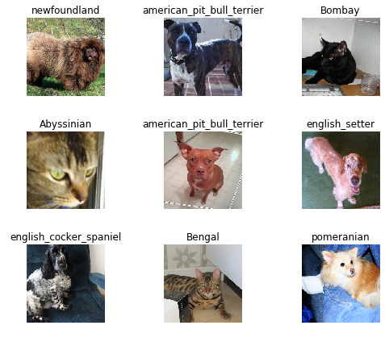

Something else we are going to learn about is we also use this to do something called data augmentation. So there's actually some randomization in how much and where it crops and stuff like that.

Basic the basic idea is some cropping, resizing, and padding. So there's all kinds of different ways it depends on data augmentation which we are going to learn about shortly.


[[31:51](https://youtu.be/BWWm4AzsdLk?t=1911)]

**Question**: What does it mean to normalize the images?

Normalizing the images, we're going to be learning more about later in the course, but in short, it means that the pixel values start out from naught to 255. And some channels might tend to be really bright, some might tend to be really not bright at all, some might vary a lot, and some might not very much at all. It really helps train a deep learning model if each one of those red green and blue channels has a mean of zero and a standard deviation of one.

If your data is not normalized, it can be quite difficult for your model to train well. So if you have trouble training a model, one thing to check is that you've normalized it.


[[33:00](https://youtu.be/BWWm4AzsdLk?t=1980)]
**Question**: As GPU mem will be in power of 2, doesn't size 256 sound more practical considering GPU utilization compared to 224?

The brief answer is that the models are designed so that the final layer is of size 7 by 7, so we actually want something where if you go 7 times 2 a bunch of times (224 = 7*2^5), then you end up with something that's a good size.


[[33:27](https://youtu.be/BWWm4AzsdLk?t=2007)]

We will get to all these details but the key thing is I wanted to get to training a model as quickly as possible.

### It is important to look at the data

One of the most important thing to be a really good practitioner is to be able to look at your data. So it's really important to remember to go to `data.show_batch` and take a look. It's surprising how often when you actually look at the dataset you've been given that you realize it's got weird black borders on it, some of the things have text covering up some of it, or some of it is rotated in odd ways. So make sure you take a look.

The other thing we want to do is to look at the labels. All of the possible label names are called your classes. With DataBunch, you can print out your `data.classes`.

```python
print(data.classes)
len(data.classes),data.c
```

```
['american_bulldog', 'german_shorthaired', 'japanese_chin', 'great_pyrenees', 'Bombay', 'Bengal', 'keeshond', 'shiba_inu', 'Sphynx', 'boxer', 'english_cocker_spaniel', 'american_pit_bull_terrier', 'Birman', 'basset_hound', 'British_Shorthair', 'leonberger', 'Abyssinian', 'wheaten_terrier', 'scottish_terrier', 'Maine_Coon', 'saint_bernard', 'newfoundland', 'yorkshire_terrier', 'Persian', 'havanese', 'pug', 'miniature_pinscher', 'Russian_Blue', 'staffordshire_bull_terrier', 'beagle', 'Siamese', 'samoyed', 'chihuahua', 'Egyptian_Mau', 'Ragdoll', 'pomeranian', 'english_setter']

(37, 37)
```

 That's all of the possible labels that we found by using that regular expression on the file names. We learnt earlier on at the top that there are 37 possible categories, so just checking `len(data.classes)`, it is indeed 37. DataBunch will always have a property called `c`. We will get to the technical detail later, but for now, you can kind of think of it as being the number of classes. For things like regression problems and multi-label classification, that's not exactly accurate, but it'll do for now. It is important to know that `data.c` is a really important piece of information that is something like, or at least for classification problems it is, the number of classes.

 ## Training [[35:07](https://youtu.be/BWWm4AzsdLk?t=2107)]

 Believe it or not, we are now ready to train a model. A model is trained in fastai using something called a "learner".

 - **DataBunch**: A general fastai concept for your data, and from there, there are subclasses for particular applications like ImageDataBunch
 - **Learner**: A general concept for things that can learn to fit a model. From that, there are various subclasses to make things easier in particular, there is a convnet learner  (something that will create a convolutional neural network for you).

```python
learn = create_cnn(data, models.resnet34, metrics=error_rate)
```

For now, just know that to create a learner for a convolutional neural network, you just have to tell it two things:
`data`: What's your data. Not surprisingly, it takes a data bunch.
`arch`: What's your architecture. There are lots of different ways of constructing a convolutional neural network.

For now, the most important thing for you to know is that there's a particular kind of model called ResNet which works extremely well nearly all the time. For a while, at least, you really only need to be doing choosing between two things which is what size ResNet do you want. There are ResNet34 and ResNet50. When we are getting started with something, I'll pick a smaller one because it'll train faster. That's as much as you need to know to be a pretty good practitioner about architecture for now which is that there are two variants of one architecture that work pretty well: ResNet34 and ResNet50. Start with a smaller one and see if it's good enough.

That is all the information we need to create a convolutional neural network learner.

There is one other thing I'm going to give it though which is a list of metrics. Metrics are literally just things that gets printed out as it's training. So I'm saying I would like you to print out error rate.

[[37:25](https://youtu.be/BWWm4AzsdLk?t=2245)]

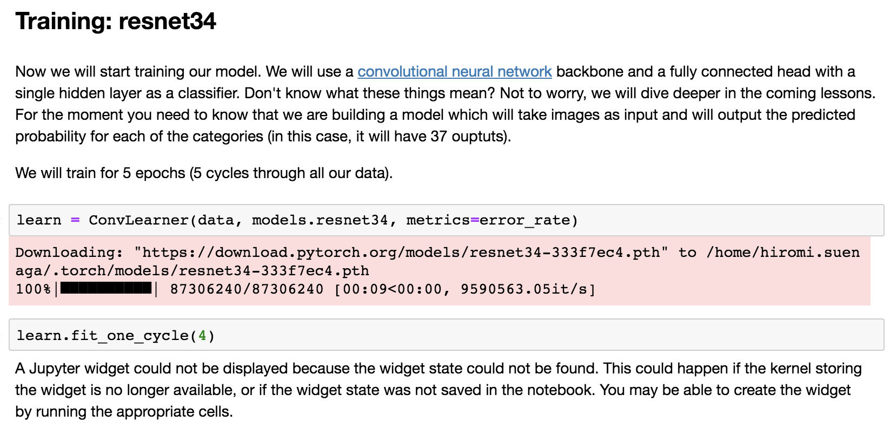

The first time I run this on a newly installed box, it downloads the ResNet34 pre-trained weights. What that means is that this particular model has actually already been trained for a particular task. And that particular task is that it was trained on looking at about one and a half million pictures of all kinds of different things, a thousand categories of things, using an image dataset called ImageNet. So we can download those pre-trained weights so that we don't start with a model that knows nothing about anything, but we actually start with a model that knows how to recognize a thousand categories of things in ImageNet. I don't think all of these 37 categories of pet are in ImageNet but there were certainly some kinds of dog and some kinds of cat. So this pre-trained model knows quite a little bit about what pets look like, and it certainly knows quite a lot about what animals look like and what photos look like. So the idea is that we don't start with a model that knows nothing at all, but we start by downloading a model that knows something about recognizing images already. So it downloads for us automatically, the first time we use it, a pre-trained model and then from now on, it won't need to download it again - it'll just use the one we've got.

## Transfer learning [[38:54](https://youtu.be/BWWm4AzsdLk?t=2334)]

This is really important. We are going to learn a lot about this. It's kind of the focus of the whole course which is how to do this thing called "transfer learning." How to take a model that already knows how to do something pretty well and make it so that it can do your thing really well. We will take a pre-trained model, and then we fit it so that instead of predicting a thousand categories of ImageNet with ImageNet data, it predicts the 37 categories of pets using your pet data. By doing this, you can train models in 1/100 or less of the time of regular model training with 1/100 or less of the data of regular model training. Potentially, many thousands of times less. Remember I showed you the slide of Nikhil's lesson 1 project from last year? He used 30 images. There are not cricket and baseball images in ImageNet but it turns out that ImageNet is already so good at recognizing things in the world that just 30 examples of people playing baseball and cricket was enough to build a nearly perfect classifier.


## Overfitting [[40:05](https://youtu.be/BWWm4AzsdLk?t=2405)]

Wait a minute, how do you know it can actually recognize pictures of people playing cricket versus baseball in general? Maybe it just learnt to recognize those 30. Maybe it's just cheating. That's called "overfitting". We'll be talking a lot about that during this course. But overfitting is where you don't learn to recognize pictures of say cricket versus baseball, but just these particular cricketers in these particular photos and these particular baseball players in these particular photos. We have to make sure that we don't overfit. The way to do that is using something called a validation set. A validation set is a set of images that your model does not get to look at. So these metrics (e.g. error_rate) get printed out automatically using the validation set - a set of images that our model never got to see.  When we created our data bunch, it automatically created a validation set for us. We'll learn lots of ways of creating and using validation sets, but because we're trying to bake in all of the best practices, we actually make it nearly impossible for you not to use a validation set. Because if you're not using a validation set, you don't know if you're overfitting. So we always print out the metrics on a validation, we've always hold it out, we always make sure that the model doesn't touch it. That's all done for you, and all built into this data bunch object.


## Fitting your model [[41:40](https://youtu.be/BWWm4AzsdLk?t=2500)]
So now we have a ConvLearner, we can fit it. You can just use a method called `fit` but in practice, you should nearly always use a method called `fit_one_cycle`. In short, one cycle learning is [a paper](https://arxiv.org/pdf/1803.09820.pdf) that was released in April and turned out to be dramatically better both more accurate and faster than any previous approach. Again, I don't want to teach you how to do 2017 deep learning. In 2018, the best way to fit models is to use something called one cycle.

For now, just know that this number, 4, basically decides how many times do we go through the entire dataset, how many times do we show the dataset to the model so that it can learn from it. Each time it sees a picture, it's going to get a little bit better. But it's going to take time and it means it could overfit. If it sees the same picture too many times, it will just learn to recognize that picture, not pets in general. We'll learn all about how to tune this number during the next couple of lessons but starting out with 4 is a pretty good start just to see how it goes and you can actually see after four epochs or four cycles, we got an error rate of 6%. And it took 1 minute and 56 seconds.

```python
learn.fit_one_cycle(4)
```

```
Total time: 01:10
epoch  train loss  valid loss  error_rate
1      1.175709    0.318438    0.099800    (00:18)
2      0.492309    0.229078    0.075183    (00:17)
3      0.336315    0.211106    0.067199    (00:17)
4      0.233666    0.191813    0.057219    (00:17)
```
So 94% of the time, we correctly picked the exact right one of those 37 dog and cat breeds which feels pretty good to me. But to get a sense of how good it is, maybe we should go back and look at the paper. Remember, I said the nice thing about using academic papers or Kaggle dataset is we can compare our solution to whatever the best people in Kaggle did or in the academics did. This particular dataset of pet breeds is from 2012 and if I scroll through the paper, you'll generally find in any academic paper there'll be a section called experiments about 2/3 of the way through. If you find a section on experiments, then you can find a section on accuracy and they've got lots of different models and their models. The models as you'll read about in the paper, it's really pet specific. They learn something about how pet heads look and how pet bodies look, and pet image in general look. And they combine them all together and once they use all of this complex code and math, they got an accuracy of 59%. So in 2012, this highly pet specific analysis got an accuracy of 59%. These were the top researchers from Oxford University. Today in 2018, with basically about three lines of code, we got 94% (i.e. 6% error). So that gives you a sense of how far we've come with deep learning, and particularly with PyTorch and fastai, how easy things are.


[[46:43](https://youtu.be/BWWm4AzsdLk?t=2803)]
We just trained a model. We don't know exactly what that involved or how it happened but we do know that with 3 or 4 lines of code, we've built something which smashed the accuracy of the state-of-the-art of 2012. 6% error certainly sounds like pretty impressive for something that can recognize different dog breeds and cat breeds, but we don't really know why it work, but we will. That's okay.


[[1:05:59](https://youtu.be/BWWm4AzsdLk?t=3959)]
**Question**: Why are we using ResNet as opposed to Inception?

There are lots of architectures to choose from and it would be fair to say there isn't one best one but if you look at things like the Stanford DAWNBench benchmark of image classification, you'll see in first place, second place,  third place, and fourth place all use ResNet. ResNet is good enough, so it's fine.
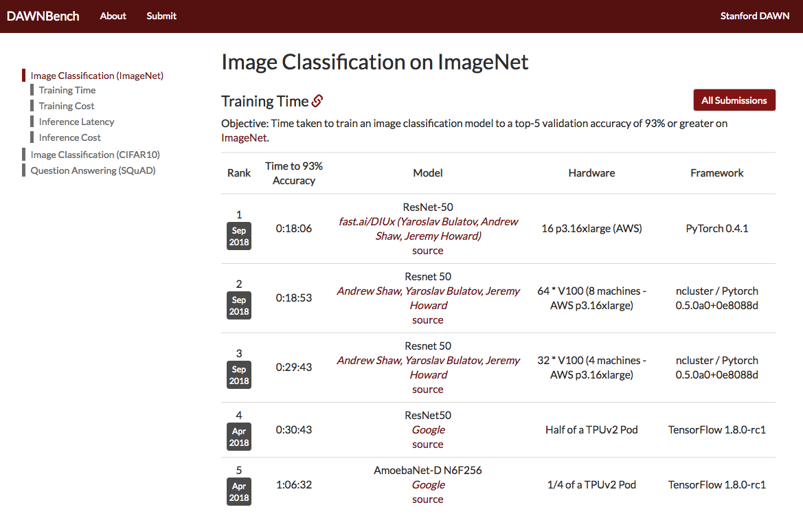

The main reason you might want a different architecture is if you want to do edge computing, so if you want to create a model that's going to sit on somebody's mobile phone. Having said that, even there, most of the time, I reckon the best way to get a model onto somebody's mobile phone is to run it on your server and then have your mobile phone app talk to it. It really makes life a lot easier and you get a lot more flexibility. But if you really do need to run something on a low powered device, then there are special architectures for that. So the particular question was about Inception. That's a particular another architecture which tends to be pretty memory intensive but it's okay. It's not terribly resilient. One of the things we try to show you is stuff which just tends to always work even if you don't quite tune everything perfectly. So ResNet tends to work pretty well across a wide range of different kind of details around choices that you might make. So I think it's pretty good.


[[1:07:58](https://youtu.be/BWWm4AzsdLk?t=4078)]

We've got this trained model and what's actually happened as we'll learn is it's basically creating a set of weights. If you've ever done anything like a linear regression or logistic regression, you'll be familiar with coefficients. We basically found some coefficients and parameters that work pretty well and it took us a minute and 56 seconds. So if we want to start doing some more playing around and come back later, we probably should save those weights. You can just go `learn.save` and give it a name. It's going to put it in a model subdirectory in the same place the data came from, so if you save different models or different data bunches from different datasets, they'll all be kept separate. So don't worry about it.

```python
learn.save('stage-1')
```


## Results [[1:08:54](https://youtu.be/BWWm4AzsdLk?t=4134)]

To see what comes out, we could use this class for class interpretation. We are going to use this factory method from learner, so we pass in a learn object. Remember a learn object knows two things:
1. What's your data
2. What is your model. Now it's not just an architecture, it's actually a trained model

That's all the information we need to interpret that model.


```python
interp = ClassificationInterpretation.from_learner(learn)
```

One of the things, perhaps the most useful things to do is called plot_top_losses. We are going to be learning a lot about this idea of loss functions shortly but in short, a loss function is something that tells you how good was your prediction. Specifically that means if you predicted one class of cat with great confidence, but actually you were wrong, then that's going to have a high loss because you were very confident about the wrong answer. So that's what it basically means to have high loss. By plotting the top losses, we are going to find out what were the things that we were the most wrong on, or the most confident about what we got wrong.


```python
interp.plot_top_losses(9, figsize=(15,11))

```
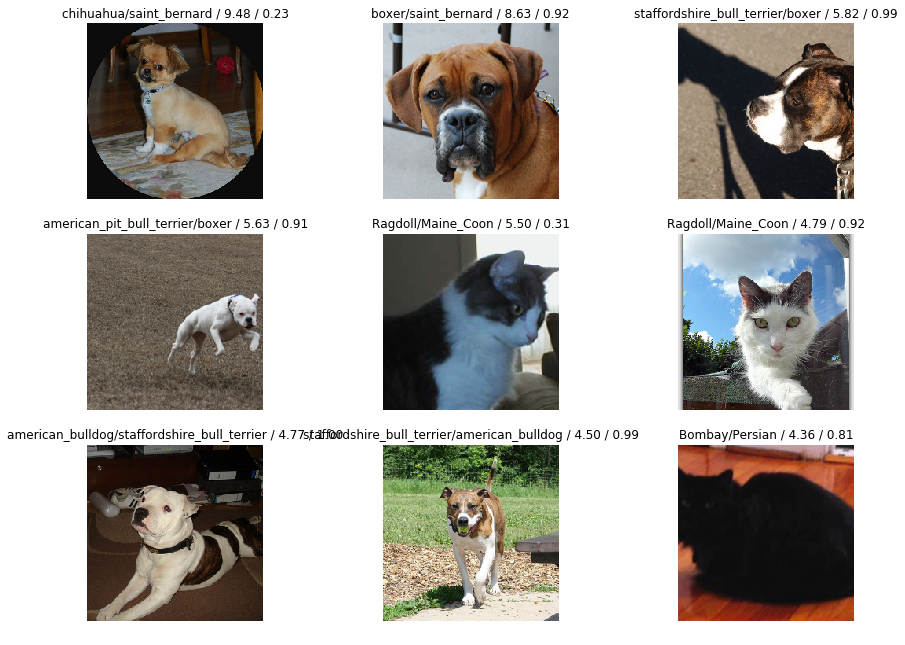

It prints out four things. What do they mean? Perhaps we should look at the document.

We have already seen `help`, and `help` just prints out a quick little summary. But if you want to really see how to do something use `doc`.


`doc` tells you the same information as `help` but it has this very important thing which is `Show in docs`. When you click on it, it pops up the documentation for that method or class or function or whatever:

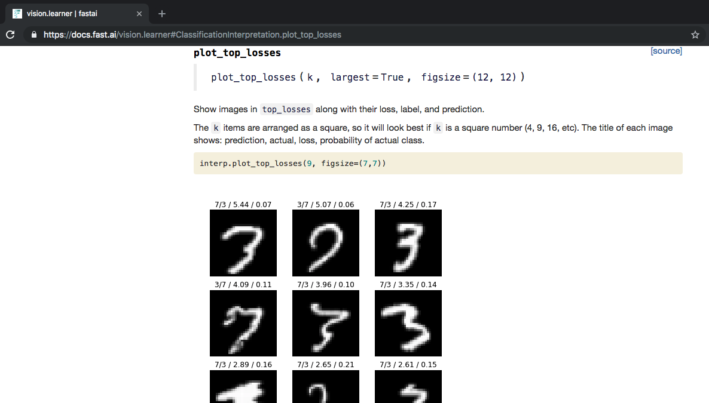

It starts out by showing us the same information about what are the parameters it takes a long with the doc string. But then tells you more information:

> The title of each image shows: prediction, actual, loss, probability of actual class.

The documentation always has working code. This is your friend when you're trying to figure out how to use these things. The other thing I'll mention is if you're somewhat experienced Python programmer, you'll find the source code of fastai really easy to read. We are trying to write everything in just a small number (much less than half a screen) of code. If you click on `[source]` you can jump straight to the source code.

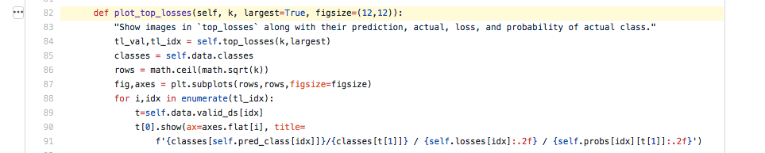

Here is plot_top_loss, and this is also a great way to find out how to use the fastai library. Because nearly every line of code here,  is calling stuff in the fastai library. So don't be afraid to look at the source code.


[[1:12:48](https://youtu.be/BWWm4AzsdLk?t=4368)]

So that's how we can look at top losses and these are perhaps the most important image classification interpretation tools that we have because it lets us see what we are getting wrong. In this case, if you are a dog and cat expert, you'll realize that the things that's getting wrong are breeds that are actually very difficult to tell apart and you'd be able to look at these and say "oh I can see why they've got this one wrong". So this is a really useful tool.


### Confusion matrix [1:13:21](https://youtu.be/BWWm4AzsdLk?t=4401)

Another useful tool, kind of, is to use something called a confusion matrix which basically shows you for every actual type of dog or cat, how many times was it predicted to be that dog or cat. But unfortunately, in this case, because it's so accurate, this diagonal basically says how it's pretty much right all the time.
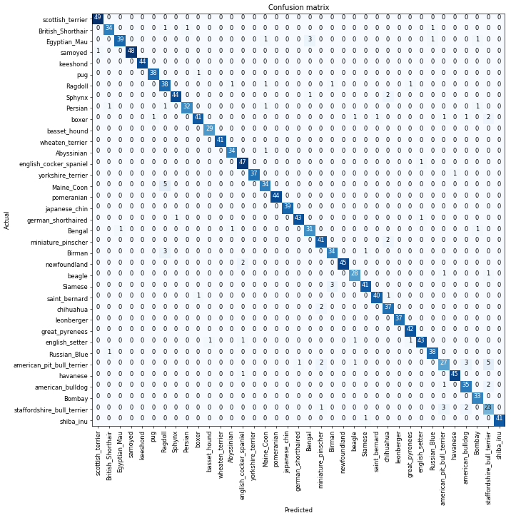

And you can see there is slightly darker ones like a five here, it's really hard to read exactly what their combination is. So what I suggest you use is instead of, if you've got lots of classes, don't use confusion matrix, but this is my favorite named function in fastai and I'm very proud of this - you can call "most confused".

### Most confused [[1:13:52](https://youtu.be/BWWm4AzsdLk?t=4432)]

```python
interp.most_confused(min_val=2)
```
```
[('american_pit_bull_terrier', 'staffordshire_bull_terrier', 5),
 ('Birman', 'Ragdoll', 5),
 ('english_setter', 'english_cocker_spaniel', 4),
 ('staffordshire_bull_terrier', 'american_pit_bull_terrier', 4),
 ('boxer', 'american_bulldog', 4),
 ('Ragdoll', 'Birman', 3),
 ('miniature_pinscher', 'chihuahua', 3),
 ('Siamese', 'Birman', 3)]
```
`most_confused` will simply grab out of the confusion matrix the particular combinations of predicted and actual that got wrong the most often. So this case, `('american_pit_bull_terrier', 'staffordshire_bull_terrier', 7)`:
- Actual `'american_pit_bull_terrier'`
- Prediction `'staffordshire_bull_terrier'`
- This particular combination happened 7 times.

So this is a very useful thing because you can look and say "with my domain expertise, does it make sense?"


### Unfreezing, fine-tuning, and learning rates [[1:14:38](https://youtu.be/BWWm4AzsdLk?t=4478)]

Let's make our model better. How? We can make it better by using fine-tuning. So far we fitted 4 epochs and it ran pretty quickly. The reason it ran pretty quickly is that there was a little trick we used. These convolutional networks, they have many layers. We'll learn a lot about exactly what layers are, but for now, just know it goes through a lot of computations. What we did was we added a few extra layers to the end and we only trained those. We basically left most of the model exactly as it was, so that's really fast. If we are trying to build a model at something that's similar to the original pre-trained model (in this case, similar to the ImageNet data), that works pretty well.

But what we really want to do is to go back and train the whole model. This is why we pretty much always use this two stage process. By default, when we call `fit` or `fit_one_cycle` on a ConvLearner, it'll just fine-tune these few extra layers added to the end and it will run very fast. It will basically never overfit but to really get it good, you have to call `unfreeze`. `unfreeze` is the thing that says please train the whole model. Then I can call fit_one_cycle again.

```python
learn.unfreeze()
learn.fit_one_cycle(1)
```
```

Total time: 00:20
epoch  train_loss  valid_loss  error_rate
1      1.045145    0.505527    0.159681    (00:20)
```

Uh-oh. The error got much worse. Why? In order to understand why, we are actually going to have to learn more about exactly what's going on behind the scenes. So let's start out by trying to get an intuitive understanding of what's going on behind the scenes. We are going to do it by looking at pictures.


[[1:16:28](https://youtu.be/BWWm4AzsdLk?t=4588)]


These pictures come from [a fantastic paper](https://cs.nyu.edu/~fergus/papers/zeilerECCV2014.pdf) by Matt Zeiler who nowadays is a CEO of Clarify which is a very successful computer vision startup and his supervisor for his PhD Rob Fergus. They wrote a paper showing how you can visualize the layers of a convolutional neural network. A convolutional neural network, which we will learn mathematically about what the layers are shortly, but the basic idea is that your red, green, and blue pixel values that are numbers from nought to 255 go into the simple computation (i.e. the first layer) and something comes out of that, and then the result of that goes into a second layer, and the result of that goes into the third layer and so forth. There can be up to a thousand layers of neural network. ResNet34 has 34 layers, and ResNet50 has 50 layers, but let's look at layer one. There's this very simple computation which is a convolution if you know what they are. What comes out of this first layer? Well, we can actually visualize these specific coefficients, the specific parameters by drawing them as a picture. There's actually a few dozen of them in the first layer, so we don't draw all of them. Let's just look at 9 at random.


[[1:17:45](https://youtu.be/BWWm4AzsdLk?t=4665)]

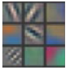

Here are nine examples of the actual coefficients from the first layer. So these operate on groups of pixels that are next to each other. So this first one basically finds groups of pixels that have a little diagonal line, the second one finds diagonal line in the other direction, the third one finds gradients that go from yellow to blue, and so forth. They are very simple little filters. That's layer one of ImageNet pre-trained convolutional neural net.

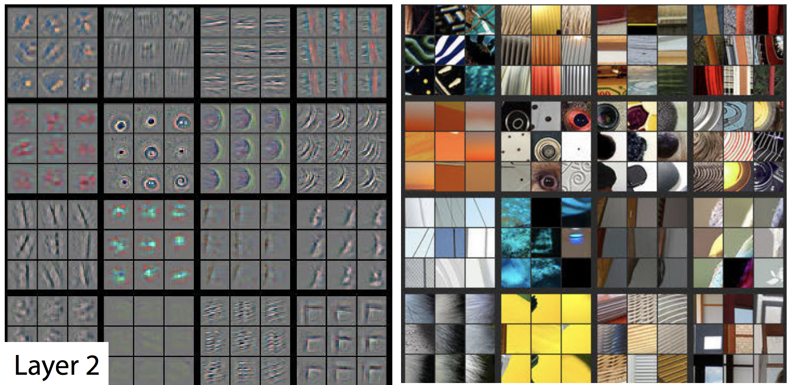

Layer 2 takes the results of those filters and does a second layer of computation. The bottom right are nine examples of a way of visualizing one of the second layer features. AS you can see, it basically learned to create something that looks for top left corners. There are ones that learned to find right-hand curves, and little circles, etc. In layer one, we have things that can find just one line, and in layer 2, we can find things that have two lines joined up or one line repeated. If you then look over to the right, these nine show you nine examples of actual bits of the actual photos that activated this filter a lot. So in other words, the filter on the bottom right was good at finding these window corners etc.

So this is the kind of stuff you've got to get a really good intuitive understanding for. The start of my neural net is going to find very simple gradients and lines, the second layer can find very simple shapes, the third layer can find  combination of those.


Now we can find repeating pattern of two dimensional objects or we can find things that joins together, or bits of text (although sometimes windows) - so it seems to find repeated horizontal patterns. There are also ones that seem to find edges of fluffy or flowery things or geometric patterns. So layer 3 was able to take all the stuff from layer 2 and combine them together.


Layer 4 can take all the stuff from layer 3 and combine them together. By layer 4, we got something that can find dog faces or bird legs.

By layer 5, we've got something that can find the eyeballs of bird and lizards, or faces of particular breeds of dogs and so forth. So you can see how by the time you get to layer 34, you can find specific dog breeds and cat breeds. This is kind of how it works.

So when we first trained (i.e. fine-tuned) the pre-trained model, we kept all of these layers that you've seen so far and we just trained a few more layers on top of all of those sophisticated features that are already being created. So now we are going back and saying "let's change all of these". We will start with where they are, but let's see if we can make them better.

Now, it seems very unlikely that we can make layer 1 features better. It's very unlikely that the definition of a diagonal line is going to be different when we look at dog and cat breeds versus the ImageNet data that this was originally trained on. So we don't really want to change the layer 1 very much if at all. Or else, the last layers, like types of dog face seems very likely that we do want to change that. So you want this intuition, this understanding that the different layers of a neural network represents different level of semantic complexity.


[[1:22:06](https://youtu.be/BWWm4AzsdLk?t=4926)]

This is why our attempt to fine-tune this model didn't work because by default, it trains all the layers at the same speed which is to say it will update those things representing diagonal lines and gradients just as much as it tries to update the things that represent the exact specifics of what an eyeball looks like, so we have to change that.

To change it, we first of all need to go back to where we were before. We just broke this model, much worse than it started out. So if we just go:

```python
learn.load('stage-1')
```
This brings back the model that we saved earlier. So let's load that back up and now our models back to where it was before we killed it.

### Learning rate finder [[1:22:58](https://youtu.be/BWWm4AzsdLk?t=4978)]

Let's run learning rate finder. We are learning about what that is next week, but for now, just know this is the thing that figures out what is the fastest I can train this neural network at without making it zip off the rails and get blown apart.


```python
learn.lr_find()
learn.recorder.plot()
```
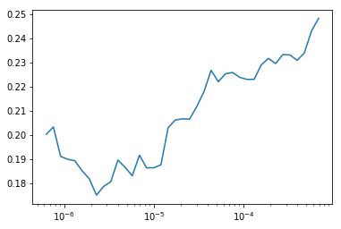

This will plot the result of our LR finder and what this basically shows you is this key parameter called a learning rate. The learning rate basically says how quickly am I updating the parameters in my model. The x-axis one here shows me what happens as I increase the learning rate. The y axis show what the loss is. So you can see, once the learning rate gets passed 10^-4, my loss gets worse. It actually so happens, in fact I can check this if I press <kbd>shift</kbd>+<kbd>tab</kbd> here, my learning defaults to 0.003. So you can see why our loss got worse. Because we are trying to fine-tune things now, we can't use such a high learning rate. So based on the learning rate finder, I tried to pick something well before it started getting worse. So I decided to pick `1e-6`. But there's no point training all the layers at that rate, because we know that the later layers worked just fine before when we were training much more quickly. So what we can actually do is we can pass a range of learning rates to `learn.fit_one_cycle`. And we do it like this:

```python
learn.unfreeze()
learn.fit_one_cycle(2, max_lr=slice(1e-6,1e-4))
```
```
Total time: 00:41
epoch  train_loss  valid_loss  error_rate
1      0.226494    0.173675    0.057219    (00:20)
2      0.197376    0.170252    0.053227    (00:20)
```

You use this keyword in Python called `slice` and that can take a start value and a stop value and basically what this says is train the very first layers at a learning rate of 1e-6, and the very last layers at a rate of 1e-4, and distribute all the other layers across that (i.e. between those two values equally).


### How to pick learning rates after unfreezing [[1:25:23](https://youtu.be/BWWm4AzsdLk?t=5123)]

A good rule of thumb is after you unfreeze (i.e. train the whole thing), pass a max learning rate parameter, pass it a slice, make the second part of that slice about 10 times smaller than your first stage. Our first stage defaulted to about 1e-3 so it's about 1e-4. And the first part of the slice should be a value from your learning rate finder which is well before things started getting worse. So you can see things are starting to get worse maybe about here:

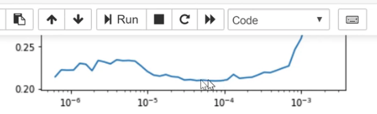

So I picked something that's at least 10 times smaller than that.

If I do that, then the error rate gets a bit better. So I would perhaps say for most people most of the time, these two stages are enough to get pretty much a world-class model. You won't win a Kaggle competition, particularly because now a lot of fastai alumni are competing on Kaggle and this is the first thing that they do. But in practice, you'll get something that's about as good in practice as the vast majority of practitioners can do.

## ResNet50 [[1:26:55](https://youtu.be/BWWm4AzsdLk?t=5215)]

We can improve it by using more layers and we will do this next week but by basically doing a ResNet50 instead of ResNet34. And you can try running this during the week if you want to. You'll see it's exactly the same as before, but I'm using ResNet50.

```python

data = ImageDataBunch.from_name_re(path_img, fnames, pat, ds_tfms=get_transforms(), size=320, bs=bs//2)
data.normalize(imagenet_stats)
```

```python

learn = ConvLearner(data, models.resnet50, metrics=error_rate)
```

What you'll find is it's very likely if you try to do this, you will get an error and the error will be your GPU has ran out of memory. The reason for that is that ResNet50 is bigger than ResNet34, and therefore, it has more parameters and use more of your graphics card memory, just totally separate to your normal computer RAM, this is GPU RAM. If you're using the default Salamander,  AWS, then you'll be having a 16G of GPU memory. The card I use most of the time has 11G GPU memory, the cheaper ones have 8G. That's kind of the main range you tend to get. If yours have less than 8G of GPU memory, it's going to be frustrating for you.

It's very likely that if you try to run this, you'll get an out of memory error and that's because it's just trying to do too much - too many parameter updates for the amount of RAM you have. That's easily fixed. `ImageDataBunch` constructor has a parameter at the end `bs` - a batch size. This basically says how many images do you train at one time. If you run out of memory, just make it smaller.

It's fine to use a smaller bath size. It might take a little bit longer. That's all. So that's just one number you'll need to try during the week.

```python
learn.fit_one_cycle(8, max_lr=slice(1e-3))
```
```
Total time: 07:08
epoch  train_loss  valid_loss  error_rate
1      0.926640    0.320040    0.076555    (00:52)
2      0.394781    0.205191    0.063568    (00:52)
3      0.307754    0.203281    0.069036    (00:53)
4      0.244182    0.160488    0.054682    (00:53)
5      0.185785    0.153520    0.049214    (00:53)
6      0.157732    0.149660    0.047163    (00:53)
7      0.107212    0.136898    0.043062    (00:53)
8      0.097324    0.136638    0.042379    (00:54)
```

Again, we fit it for a while and we get down to 4.2% error rage. So this is pretty extraordinary. I was pretty surprised because when we first did in the first course, this cats vs. dogs, we were getting somewhere around 3% error for something where you've got a 50% chance of being right and the two things look totally different. So the fact that we can get 4.2% error for such a fine grain thing, it's quite extraordinary.

### Interpreting the results again [1:29:41](https://youtu.be/BWWm4AzsdLk?t=5381)

```python
interp = ClassificationInterpretation.from_learner(learn)
interp.most_confused(min_val=2)
```
```
[('Ragdoll', 'Birman', 7),
 ('american_pit_bull_terrier', 'staffordshire_bull_terrier', 6),
 ('Egyptian_Mau', 'Bengal', 6),
 ('Maine_Coon', 'Bengal', 3),
 ('staffordshire_bull_terrier', 'american_pit_bull_terrier', 3)]
```

You can call the most_confused here and you can see the kinds of things that it's getting wrong. Depending on when you run it, you're going to get slightly different numbers, but you'll get roughly the same kind of things. So quite often, I find the Ragdoll and Birman are things that it gets confused. I actually have never heard of either of those things, so I actually looked them up and found a page on the cat site called "Is this a Birman or Ragdoll kitten?" and there was a long thread of cat experts arguing intensely about which it is. So I feel fine that my computer had problems.   

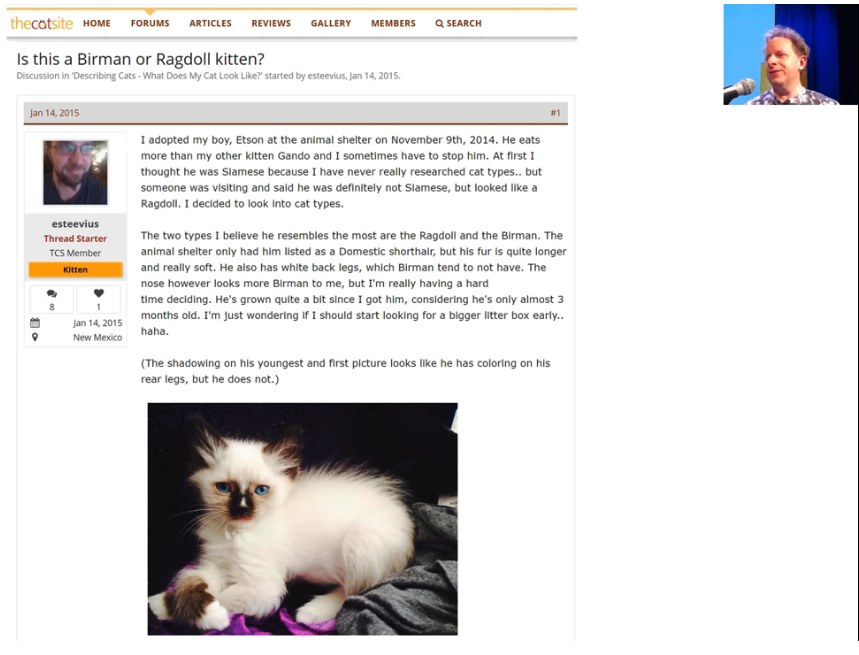

I found something similar, I think it was this pitbull versus staffordshire bull terrier, apparently the main difference is the particular kennel club guidelines as to how they are assessed. But some people thing that one of them might have a slightly redder nose. So this is the kind of stuff where actually even if you're not a domain expert, it helps you become one. Because I now know more about which kinds of pet breeds are hard to identify than I used to. So model interpretation works both ways.

## Homework [[1:30:58](https://youtu.be/BWWm4AzsdLk?t=5458)]

So what I want you to do this week is to run this notebook, make sure you can get through it, but then I really want you to do is to get your own image dataset and actually Francisco is putting together a guide that will show you how to download data from Google Images so you can create your own dataset to play with. But before I do, I want to show you how to create labels in lots of different ways because your dataset where you get it from won't necessarily be that kind of regex based approach. It could be in lots of different formats. So to show you how to do this, I'm going to use the MNIST sample. MNIST is a picture of hand drawn numbers - just because I want to show you different ways of creating these datasets.

```python
path = untar_data(URLs.MNIST_SAMPLE); path
```

```python
path.ls()
```
```
['train', 'valid', 'labels.csv', 'models']
```

You see there are a training set and the validation set already. So basically the people that put together this dataset have already decided what they want you to use as a validation set.

### Scenario 1: Labels are folder names

```python
(path/'train').ls()
```
```
['3', '7']
```

There are a folder called 3 and a folder called 7. Now this is really common way to give people labels. Basically it says everything that's a three, I put in a folder called three. Everything that's a seven, I'll put in a folder called seven. This is often called an "ImageNet style dataset" because this is how ImageNet is distributed. So if you have something in this format where the labels are just whatever the folders are called, you can say `from_folder`.

```python
tfms = get_transforms(do_flip=False)
data = ImageDataBunch.from_folder(path, ds_tfms=tfms, size=26)
```

This will create an ImageDataBunch for you and as you can see it created the labels:

```python
data.show_batch(rows=3, figsize=(5,5))
```
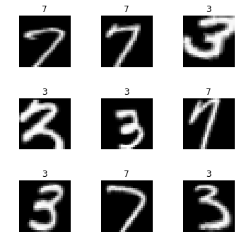


### Scenario 2: CSV file [[1:33:17](https://youtu.be/BWWm4AzsdLk?t=5597)]

Another possibility, and for this MNIST sample, I've got both, it might come with a CSV file that would look something like this.

```python
df = pd.read_csv(path/'labels.csv')
df.head()
```

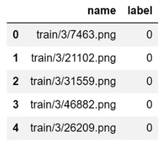

For each file name, what's its label. In this case, labels are not three or seven, they are 0 or 1 which basically is it a 7 or not. So that's another possibility. If this is how your labels are, you can use `from_csv`:

```python
data = ImageDataBunch.from_csv(path, ds_tfms=tfms, size=28)
```

And if it is called `labels.csv`, you don't even have to pass in a file name. If it's called something else, then you can pass in the `csv_labels`

```python
data.show_batch(rows=3, figsize=(5,5))
data.classes
```
```
[0, 1]
```

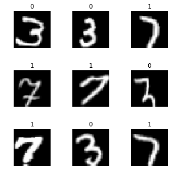


### Scenario 3: Using regular expression

```python
fn_paths = [path/name for name in df['name']]; fn_paths[:2]
```

```
[PosixPath('/home/jhoward/.fastai/data/mnist_sample/train/3/7463.png'),
 PosixPath('/home/jhoward/.fastai/data/mnist_sample/train/3/21102.png')]
```

This is the same thing, these are the folders. But I could actually grab the label by using a regular expression. We've already seen this approach:


```python
pat = r"/(\d)/\d+\.png$"
data = ImageDataBunch.from_name_re(path, fn_paths, pat=pat, ds_tfms=tfms, size=24)
data.classes
```

```
['3', '7']
```


### Scenario 4: Something more complex [[1:34:21](https://youtu.be/BWWm4AzsdLk?t=5661)]

You can create an arbitrary function that extracts a label from the file name or path. In that case, you would say `from_name_func`:

```python
data = ImageDataBunch.from_name_func(path, fn_paths, ds_tfms=tfms, size=24,
        label_func = lambda x: '3' if '/3/' in str(x) else '7')
data.classes
```


### Scenario 5: You need something even more flexible

If you need something even more flexible than that, you're going to write some code to create an array of labels. So in that case, you can just use `from_lists` and pass in the array.

```python
labels = [('3' if '/3/' in str(x) else '7') for x in fn_paths]
labels[:5]
```

```python
data = ImageDataBunch.from_lists(path, fn_paths, labels=labels, ds_tfms=tfms, size=24)
data.classes
```

So you can see there's lots of different ways of creating labels. So during the week, try this out.

Now you might be wondering how would you know to do all these things? Where am I going to find this kind of information? So I'll show you something incredibly cool. You know how to get documentation:

```python
doc(ImageDataBunch.from_name_re)
```

[[Show in docs](https://docs.fast.ai/vision.data.html#ImageDataBunch.from_name_re)]


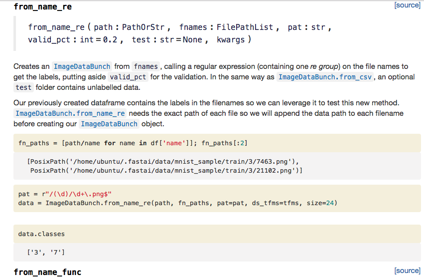
