# CNN's - segmentation using abbreviated Lesson 3

## Segmentation example: CamVid [[56:31](https://youtu.be/PW2HKkzdkKY?t=3391)]

[Notebook](https://github.com/fastai/course-v3/blob/master/nbs/dl1/lesson3-camvid.ipynb)

The next example we're going to look at is this dataset called CamVid. It's going to be doing something called segmentation. We're going to start with a picture like the left:

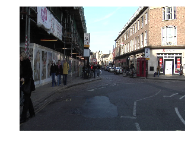 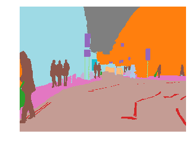

and we're going to try and create a color-coded picture like the right where all of the bicycle pixels are the same color all of the road line pixels are the same color all of the tree pixels of the same color all of the building pixels are same color the sky the same color and so forth.

Now we're not actually going to make them colors, we're actually going to do it where each of those pixels has a unique number. In this case the top of left is building, so I guess building this number 4, the top right is tree, so tree is 26, and so forth.

In other words, this single top left pixel, we're going to do a classification problem just like the pet's classification for the very top left pixel. We're going to say "what is that top left pixel? Is it bicycle, road lines, sidewalk, building?" Then what is the next pixel along? So we're going to do a little classification problem for every single pixel in every single image. That's called segmentation.

In order to build a segmentation model, you actually need to download or create a dataset where someone has actually labeled every pixel. As you can imagine, that's a lot of work, so you're probably not going to create your own segmentation datasets but you're probably going to download or find them from somewhere else.

This is very common in medicine and life sciences. If you're looking through slides at nuclei, it's very likely you already have a whole bunch of segmented cells and segmented nuclei. If you're in radiology, you probably already have lots of examples of segmented lesions and so forth. So there's a lot of different domain areas where there are domain-specific tools for creating these segmented images. As you could guess from this example, it's also very common in self-driving cars and stuff like that where you need to see what objects are around and where are they.

In this case, there's a nice dataset called CamVid which we can download and they have already got a whole bunch of images and segment masks prepared for us. Remember, pretty much all of the datasets that we have provided inbuilt URLs for, you can see their details at https://course.fast.ai/datasets and nearly all of them are academic datasets where some very kind people have gone to all of this trouble for us so that we can use this dataset and made it available for us to use. So if you do use one of these datasets for any kind of project, it would be very very nice if you were to go and find the citation and say "thanks to these people for this dataset." Because they've provided it and all they're asking in return is for us to give them that credit. So here is the CamVid dataset and the citation (on our data sets page, that will link to the academic paper where it came from).

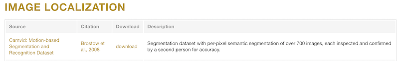


**Question**: Is there a way to use `learn.lr_find()` and have it return a suggested number directly rather than having to plot it as a graph and then pick a learning rate by visually inspecting that graph? (And there are a few other questions around more guidance on reading the learning rate finder graph) [[1:00:26](https://youtu.be/PW2HKkzdkKY?t=3626)]

The short answer is no and the reason the answer is no is because this is still a bit more artisinal than I would like. As you can see, I've been saying how I read this learning rate graph depends a bit on what stage I'm at and what the shape of it is. I guess when you're just training the head (so before you unfreeze), it pretty much always looks like this:

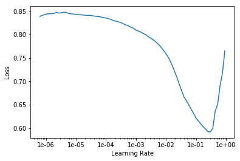

And you could certainly create something that creates a smooth version of this, finds the sharpest negative slope and picked that you would probably be fine nearly all the time.

But then for you know these kinds of ones, it requires a certain amount of experimentation:

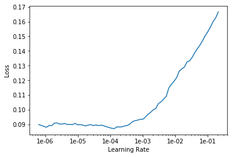

But the good news is you can experiment. Obviously if the lines going up, you don't want it. Almost certainly at the very bottom point, you don't want it right because you needed to be going downwards. But if you kind of start with somewhere around 10x smaller than that, and then also you could try another 10x smaller than that, try a few numbers and find out which ones work best.

And within a small number of weeks, you will find that you're picking the best learning rate most of the time. So at this stage, it still requires a bit of playing around to get a sense of the different kinds of shapes that you see and how to respond to them. Maybe by the time this video comes out, someone will have a pretty reliable auto learning rate finder. We're not there yet. It's probably not a massively difficult job to do. It would be an interesting project﹣collect a whole bunch of different datasets, maybe grab all the datasets from our datasets page, try and come up with some simple heuristic, compare it to all the different lessons I've shown. It would be a really fun project to do. But at the moment, we don't have that. I'm sure it's possible but we haven't got them.


### Image Segmentation [[1:03:05](https://youtu.be/PW2HKkzdkKY?t=3785)]

So how do we do image segmentation? The same way we do everything else. Basically we're going to start with some path which has got some information in it of some sort.

```python
%reload_ext autoreload
%autoreload 2
%matplotlib inline
```

```python
from fastai import *
from fastai.vision import *
```

So I always start by un-taring my data, do an `ls`, see what I was given. In this case there's a label a folder called `labels` and a folder called `images`, so I'll create paths for each of those.

```python
path = untar_data(URLs.CAMVID)
path.ls()
```

```
[PosixPath('/home/ubuntu/course-v3/nbs/dl1/data/camvid/images'),
 PosixPath('/home/ubuntu/course-v3/nbs/dl1/data/camvid/codes.txt'),
 PosixPath('/home/ubuntu/course-v3/nbs/dl1/data/camvid/valid.txt'),
 PosixPath('/home/ubuntu/course-v3/nbs/dl1/data/camvid/labels')]
```

```python
path_lbl = path/'labels'
path_img = path/'images'
```


We'll take a look inside each of those.

```
fnames = get_image_files(path_img)
fnames[:3]
```

```
[PosixPath('/home/ubuntu/course-v3/nbs/dl1/data/camvid/images/0016E5_08370.png'),
 PosixPath('/home/ubuntu/course-v3/nbs/dl1/data/camvid/images/Seq05VD_f04110.png'),
 PosixPath('/home/ubuntu/course-v3/nbs/dl1/data/camvid/images/0001TP_010170.png')]
```


```
lbl_names = get_image_files(path_lbl)
lbl_names[:3]
```

```
[PosixPath('/home/ubuntu/course-v3/nbs/dl1/data/camvid/labels/0016E5_01890_P.png'),
 PosixPath('/home/ubuntu/course-v3/nbs/dl1/data/camvid/labels/Seq05VD_f00330_P.png'),
 PosixPath('/home/ubuntu/course-v3/nbs/dl1/data/camvid/labels/Seq05VD_f01140_P.png')]
```

You can see there's some kind of coded file names for the images and some kind of coded file names for the segment masks. Then you kind of have to figure out how to map from one to the other. Normally, these kind of datasets will come with a README you can look at or you can look at their website.

```python
img_f = fnames[0]
img = open_image(img_f)
img.show(figsize=(5,5))
```


```python
get_y_fn = lambda x: path_lbl/f'{x.stem}_P{x.suffix}'
```


Often it's obvious﹣in this case I just guessed. I thought it's probably the same thing `_P`, so I created a little function that basically took the filename and added the `_P` and put it in the different place (`path_lbl`) and I tried opening it and I noticed it worked.

```python
mask = open_mask(get_y_fn(img_f))
mask.show(figsize=(5,5), alpha=1)
```


So I've created this little function that converts from the image file names to the equivalent label file names. I opened up that to make sure it works. Normally, we use `open_image` to open a file and then you can go `.show` to take a look at it, but as we described, this is not a usual image file that contains integers. So you have to use `open_masks` rather than `open_image` because we want to return integers not floats. Fastai knows how to deal with masks, so if you go `mask.show`, it will automatically color code it for you in some appropriate way. That's why we said `open_masks`.

```python
src_size = np.array(mask.shape[1:])
src_size,mask.data
```

```
(array([720, 960]), tensor([[[30, 30, 30,  ...,  4,  4,  4],
          [30, 30, 30,  ...,  4,  4,  4],
          [30, 30, 30,  ...,  4,  4,  4],
          ...,
          [17, 17, 17,  ..., 17, 17, 17],
          [17, 17, 17,  ..., 17, 17, 17],
          [17, 17, 17,  ..., 17, 17, 17]]]))
```

We can kind of have a look inside look at the data see what the size is so there's 720 by 960. We can take a look at the data inside, and so forth. The other thing you might have noticed is that they gave us a file called `codes.txt` and a file called `valid.txt`.

```python
codes = np.loadtxt(path/'codes.txt', dtype=str); codes
```

```
array(['Animal', 'Archway', 'Bicyclist', 'Bridge', 'Building', 'Car', 'CartLuggagePram', 'Child', 'Column_Pole',
       'Fence', 'LaneMkgsDriv', 'LaneMkgsNonDriv', 'Misc_Text', 'MotorcycleScooter', 'OtherMoving', 'ParkingBlock',
       'Pedestrian', 'Road', 'RoadShoulder', 'Sidewalk', 'SignSymbol', 'Sky', 'SUVPickupTruck', 'TrafficCone',
       'TrafficLight', 'Train', 'Tree', 'Truck_Bus', 'Tunnel', 'VegetationMisc', 'Void', 'Wall'], dtype='<U17')
```

`code.txt` contains a list telling us that, for example, number 4 is`building`. Just like we had grizzlies, black bears, and teddies, here we've got the coding for what each one of these pixels means.

#### Creating a data bunch [[1:05:53](https://youtu.be/PW2HKkzdkKY?t=3953)]

To create a data bunch, we can go through the data block API and say:

- We've got a list of image files that are in a folder
- We then need to split into training and validation. In this case I don't do it randomly because the pictures they've given us are frames from videos. If I did them randomly I would be having two frames next to each other: one in the validation set, one in the training set. That would be far too easy and treating. So the people that created this dataset actually gave us a list of file names (`valid.txt`) that are meant to be in your validation set and they are non-contiguous parts of the video. So here's how you can split your validation and training using a file name file.
- We need to create labels which we can use that `get_y_fn` (get Y file name function) we just created .

```python
size = src_size//2
bs=8
```

```python
src = (SegmentationItemList.from_folder(path_img)
       .split_by_fname_file('../valid.txt')
       .label_from_func(get_y_fn, classes=codes))
```

From that, I can create my datasets.

So I actually have a list of class names. Often with stuff like the planet dataset or the pets dataset, we actually have a string saying this is a pug, this is a ragdoll, or this is a birman, or this is cloudy or whatever. In this case, you don't have every single pixel labeled with an entire string (that would be incredibly inefficient). They're each labeled with just a number and then there's a separate file telling you what those numbers mean. So here's where we get to tell the data block API this is the list of what the numbers mean. So these are the kind of parameters that the data block API gives you.


```python
data = (src.transform(get_transforms(), size=size, tfm_y=True)
        .databunch(bs=bs)
        .normalize(imagenet_stats))
```

Here's our transformations. Here's an interesting point. Remember I told you that, for example, sometimes we randomly flip an image? What if we randomly flip the independent variable image but we don't also randomly flip the target mask? Now I'm not matching anymore. So we need to tell fastai that I want to transform the Y (X is our independent variable, Y is our dependent)﹣I want to transform the Y as well. So whatever you do to the X, I also want you to do to the Y (`tfm_y=True`). There's all these little parameters that we can play with.

I can create our data bunch. I'm using a smaller batch size (`bs=8`) because, as you can imagine, I'm creating a classifier for every pixel, that's going to take a lot more GPU right. I found a batch size of 8 is all I could handle. Then normalize in the usual way.

```python
data.show_batch(2, figsize=(10,7))
```

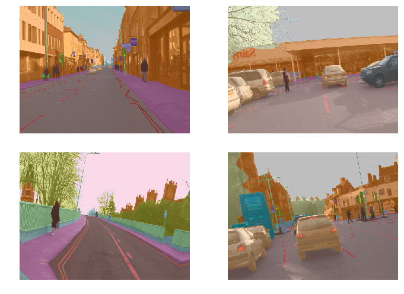

This is quite nice. Because fastai knows that you've given it a segmentation problem, when you call show batch, it actually combines the two pieces for you and it will color code the photo. Isn't that nice? So this is what the ground truth data looks.

#### Training [[1:09:00](https://youtu.be/PW2HKkzdkKY?t=4140)]

Once we've got that, we can go ahead and

- Create a learner. I'll show you some more details in a moment.
- Call `lr_find`, find the sharpest bit which looks about 1e-2.
- Call `fit` passing in `slice(lr)` and see the accuracy.
- Save the model.
- Unfreeze and train a little bit more.

That's the basic idea.  

```python
name2id = {v:k for k,v in enumerate(codes)}
void_code = name2id['Void']

def acc_camvid(input, target):
    target = target.squeeze(1)
    mask = target != void_code
    return (input.argmax(dim=1)[mask]==target[mask]).float().mean()
```

```python
metrics=acc_camvid
# metrics=accuracy
```

```python
learn = Learner.create_unet(data, models.resnet34, metrics=metrics)
```

```python
lr_find(learn)
learn.recorder.plot()
```


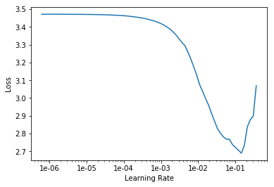

```
lr=1e-2
```

```python
learn.fit_one_cycle(10, slice(lr))
```

```
Total time: 02:46
epoch  train_loss  valid_loss  acc_camvid
1      1.537235    0.785360    0.832015    (00:20)
2      0.905632    0.677888    0.842743    (00:15)
3      0.755041    0.759045    0.844444    (00:16)
4      0.673628    0.522713    0.854023    (00:16)
5      0.603915    0.495224    0.864088    (00:16)
6      0.557424    0.433317    0.879087    (00:16)
7      0.504053    0.419078    0.878530    (00:16)
8      0.457378    0.371296    0.889752    (00:16)
9      0.428532    0.347722    0.898966    (00:16)
10     0.409673    0.341935    0.901897    (00:16)
```

```python
learn.save('stage-1')
```

```python
learn.load('stage-1');
```

```python
learn.unfreeze()
```

```python
lr_find(learn)
learn.recorder.plot()
```

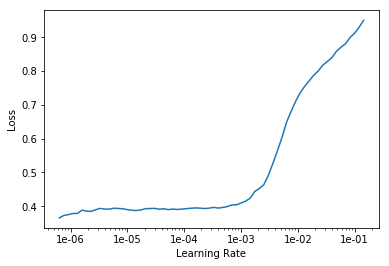

```python
lrs = slice(1e-5,lr/5)
```

```python
learn.fit_one_cycle(12, lrs)
```

```
Total time: 03:36
epoch  train_loss  valid_loss  acc_camvid
1      0.399582    0.338697    0.901930    (00:18)
2      0.406091    0.351272    0.897183    (00:18)
3      0.415589    0.357046    0.894615    (00:17)
4      0.407372    0.337691    0.904101    (00:18)
5      0.402764    0.340527    0.900326    (00:17)
6      0.381159    0.317680    0.910552    (00:18)
7      0.368179    0.312087    0.910121    (00:18)
8      0.358906    0.310293    0.911405    (00:18)
9      0.343944    0.299595    0.912654    (00:18)
10     0.332852    0.305770    0.911666    (00:18)
11     0.325537    0.294337    0.916766    (00:18)
12     0.320488    0.295004    0.916064    (00:18)
```

**Question**: Could you use unsupervised learning here (pixel classification with the bike example) to avoid needing a human to label a heap of images[[1:10:03](https://youtu.be/PW2HKkzdkKY?t=4203)]

Not exactly unsupervised learning, but you can certainly get a sense of where things are without needing these kind of labels. Time permitting, we'll try and see some examples of how to do that. You're certainly not going to get as such a quality and such a specific output as what you see here though. If you want to get this level of segmentation mask, you need a pretty good segmentation mask ground truth to work with.

**Question**: Is there a reason we shouldn’t deliberately make a lot of smaller datasets to step up from in tuning? let’s say 64x64, 128x128, 256x256, etc… [[1:10:51](https://youtu.be/PW2HKkzdkKY?t=4251)]

Yes, you should totally do that. It works great. This idea, it's something that I first came up with in the course a couple of years ago and I thought it seemed obvious and just presented it as a good idea, then I later discovered that nobody had really published this before. And then we started experimenting with it. And it was basically the main tricks that we use to win the DAWNBench ImageNet training competition.

Not only was this not standard, but nobody had heard of it before. There's been now a few papers that use this trick for various specific purposes but it's still largely unknown. It means that you can train much faster, it generalizes better. There's still a lot of unknowns about exactly how small, how big, and how much at each level and so forth. We call it "progressive resizing". I found that going much under 64 by 64 tends not to help very much. But yeah, it's a great technique and I definitely try a few a few different sizes.

**Question**: [[1:12:35](https://youtu.be/PW2HKkzdkKY?t=4355)] What does accuracy mean for pixel wise segmentation? Is it

`#correctly classified pixels / #total number of pixels`?

Yep, that's it. So if you imagined each pixel was a separate object you're classifying, it's exactly the same accuracy. So you actually can just pass in `accuracy` as your metric, but in this case, we actually don't. We've created a new metric called `acc_camvid` and the reason for that is that when they labeled the images, sometimes they labeled a pixel as `Void`. I'm not quite sure why but some of the pixels are `Void`. And in the CamVid paper, they say when you're reporting accuracy, you should remove the void pixels. So we've created a accuracy CamVid. so all metrics take the actual output of the neural net (i.e. that's the `input` to the metric) and the target (i.e. the labels we are trying to predict).

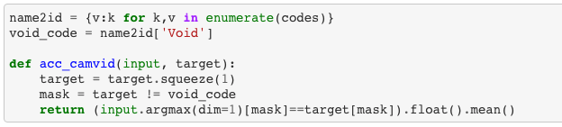

We then basically create a mask (we look for the places where the target is not equal to `Void`) and then we just take the input, do the `argmax` as per usual, but then we just grab those that are not equal to the void code. We do the same for the target and we take the mean, so it's just a standard accuracy.

It's almost exactly the same as the accuracy source code we saw before with the addition of this mask. This quite often happens. The particular Kaggle competition metric you're using or the particular way your organization scores things, there's often little tweaks you have to do. And this is how easy it is. As you'll see, to do this stuff, the main thing you need to know pretty well is how to do basic mathematical operations in PyTorch so that's just something you kind of need to practice.

**Question**:  I've noticed that most of the examples and most of my models result in a training loss greater than the validation loss. What are the best ways to correct that? I should add that this still happens after trying many variations on number of epochs and learning rate. [[1:15:03](https://youtu.be/PW2HKkzdkKY?t=4503)]

Remember from last week, if you're training loss is higher than your validation loss then you're **underfitting**. It definitely means that your underfitting. You want your training loss to be lower than your validation loss. If you're underfitting, you can:

- Train for longer.
- Train the last bit at a lower learning rate.

But if you're still under fitting, then you're going to have to decrease regularization. We haven't talked about that yet. In the second half of this part of the course, we're going to be talking quite a lot about regularization and specifically how to avoid overfitting or underfitting by using regularization. If you want to skip ahead, we're going to be learning about:

- weight decay
- dropout
- data augmentation

They will be the key things that are we talking about.

### U-Net [[1:16:24](https://youtu.be/PW2HKkzdkKY?t=4584)]

For segmentation, we don't just create a convolutional neural network. We can, but actually a architecture called U-Net turns out to be better.


This is what a U-Net looks like. This is from the [University website](https://lmb.informatik.uni-freiburg.de/people/ronneber/u-net/) where they talk about the U-Net. So we'll be learning about this both in this part of the course and in part two if you do it. But basically this bit down on the left hand side is what a normal convolutional neural network looks like. It's something which starts with a big image and gradually makes it smaller and smaller until eventually you just have one prediction. What a U-Net does is it then takes that and makes it bigger and bigger and bigger again, and then it takes every stage of the downward path and copies it across, and it creates this U shape.

It's was originally actually created/published as a biomechanical image segmentation method. But it turns out to be useful for far more than just biomedical image segmentation. It was presented at MICCAI which is the main medical imaging conference, and as of just yesterday, it actually just became the most cited paper of all time from that conference. So it's been incredibly useful﹣over 3,000 citations.

You don't really need to know any details at this stage. All you need to know is if you want to create a segmentation model, you want to be saying `Learner.create_unet` rather than `create_cnn`. But you pass it the normal stuff: their data bunch, architecture, and some metrics.

Having done that, everything else works the same.

#### A little more about `learn.recorder` [[1:18:54](https://youtu.be/PW2HKkzdkKY?t=4734)]

Here's something interesting. `learn.recorder` is where we keep track of what's going on during training. It's got a number nice methods one of which is plot losses.


```python
learn.recorder.plot_losses()
```

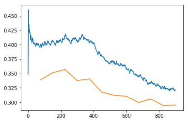

```python
learn.recorder.plot_lr()
```

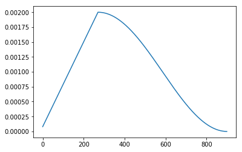

This plots your training loss and your validation loss. Quite often, they actually go up a bit before they go down. Why is that? That's because (you can also plot your learning rate over time and you'll see that) the learning rate goes up and then it goes down. Why is that? Because we said `fit_one_cycle`. That's what fit one cycle does. It actually makes the learning rate start low, go up, and then go down again.

Why is that a good idea? To find out why that's a good idea, let's first of all look at [a really cool project]((https://forums.fast.ai/t/share-your-work-here/27676/300)) done by José Fernández Portal during the week. He took our gradient descent demo notebook and actually plotted the weights over time, not just the ground truth and model over time. He did it for a few different learning rates.

Remember we had two weights we were doing basically  or in his nomenclature .


We can actually look and see what happens to those weights over time. And we know this is the correct answer (marked with red X). A learning rate of 0.1, they're kind of like slides on in here and you can see that it takes a little bit of time to get to the right point. You can see the loss improving.


At a higher learning rate of 0.7, you can see that the model jumps to the ground truth really quickly. And you can see that the weights jump straight to the right place really quickly:

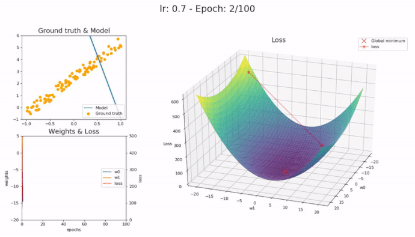


What if we have a learning rate that's really too high you can see it takes a very very long time to get to the right point:


Or if it's really too high, it diverges:

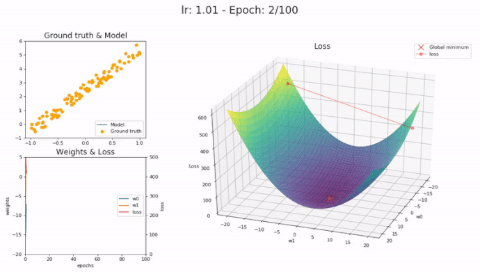


So you can see why getting the right learning rate is important. When you get the right learning rate, it zooms into the best spot very quickly.

Now as you get closer to the final spot, something interesting happens which is that you really want your learning rate to decrease because you're getting close to the right spot.

So what actually happens is (I can only draw 2d sorry), you don't generally have some kind of loss function surface that looks like that (remember there's lots of dimensions), but it actually tends to look bumpy like that. So you want a learning rate that's like high enough to jump over the bumps, but once you get close to the best answer, you don't want to be just jumping backwards and forwards between bumps. You want your learning rate to go down so that as you get closer, you take smaller and smaller steps. That's why it is that we want our learning rate to go down at the end.


This idea of decreasing the learning rate during training has been around forever. It's just called **learning rate annealing**. But the idea of gradually increasing it at the start is much more recent and it mainly comes from a guy called Leslie Smith ([meetup with Leslie Smith](https://youtu.be/dxpyg3mP_rU)).

Loss function surfaces tend have flat areas and bumpy areas. If you end up in the bottom of a bumpy area, that solution will tend not to generalize very well because you've found a solution that's good in that one place but it's not very good in other places. Where else if you found one in the flat area, it probably will generalize well because it's not only good in that one spot but it's good to kind of around it as well.


If you have a really small learning rate, it'll tend to kind of plud down and stick in these places. But if you gradually increase the learning rate, then it'll kind of like jump down and as the learning rate goes up, it's going to start going up again like this. Then the learning rate is now going to be up here, it's going to be bumping backwards and forwards. Eventually the learning rate starts to come down again, and it'll tend to find its way to these flat areas.

So it turns out that gradually increasing the learning rate is a really good way of helping the model to explore the whole function surface, and try and find areas where both the loss is low and also it's not bumpy. Because if it was bumpy, it would get kicked out again. This allows us to train at really high learning rates, so it tends to mean that we solve our problem much more quickly, and we tend to end up with much more generalizable solutions.

### What you are looking for in `plot_losses` [[1:25:01](https://youtu.be/PW2HKkzdkKY?t=5101)]

If you call `plot_losses` and find that it's just getting a little bit worse and then it gets a lot better you've found a really good maximum learning rate.


So when you actually call fit one cycle, you're not actually passing in a learning rate. You're actually passing in a maximum learning rate. if it's kind of always going down, particularly after you unfreeze, that suggests you could probably bump your learning rates up a little bit﹣because you really want to see this kind of shape. It's going to train faster and generalize better. You'll to tend to particularly see it in the validation set (the orange is the validation set). Again, the difference between kind of knowing this theory and being able to do it, is looking at lots of these pictures. So after you train stuff, type `learn.recorder.` and hit tab, and see what's in there﹣particularly the things that start with "plot" and start getting a sense of what are these pictures looking like when you're getting good results.  Then try making the learning rate much higher, try making it much lower, more epochs, less epochs, and get a sense for what these look like.

#### Go big [[1:26:16](https://youtu.be/PW2HKkzdkKY?t=5176)]

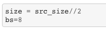

In this case, we used  the size (in our transforms) of the `original image size/2`. These two slashes in Python means integer divide because obviously we can't have half pixel amounts in our sizes. We use the batch size of 8. Now I found that fits on my GPU, it might not fit on yours. If it doesn't, you can just decrease the batch size down to 4.

This isn't really solving the problem because the problem is to segment all of the pixels﹣not half of the pixels. So I'm going to use the same trick that I did last time which is I'm now going to put the size up to the full size of the source images which means I now have to halve my batch size otherwise I'll run out of GPU memory.

```python
size = src_size
bs=4
```

```python
data = (src.transform(get_transforms(), size=size, tfm_y=True)
        .databunch(bs=bs)
        .normalize(imagenet_stats))
```

```python
learn = Learner.create_unet(data, models.resnet34, metrics=metrics)
```

```python
learn.load('stage-2');
```

I can either say `learn.data = data` but I actually found it had a lot of trouble with GPU memory, so I generally restarted my kernel, came back here, created a new learner, and loaded up the weights that I saved last time.

The key thing is that this learner now has the same weights that I had before, but the data is now the full image size.

```python
lr_find(learn)
learn.recorder.plot()
```

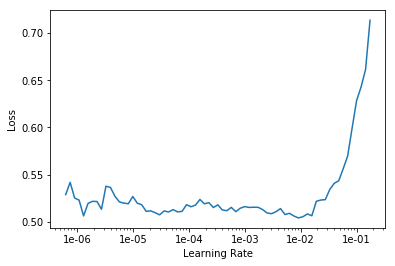

```python
lr=1e-3
```

```python
learn.fit_one_cycle(10, slice(lr))
```

```
Total time: 08:44
epoch  train_loss  valid_loss  acc_camvid
1      0.454597    0.349557    0.900428    (01:02)
2      0.418897    0.351502    0.897495    (00:51)
3      0.402104    0.330255    0.906775    (00:50)
4      0.385497    0.313330    0.911832    (00:51)
5      0.359252    0.297264    0.916108    (00:52)
6      0.335910    0.297875    0.917553    (00:50)
7      0.336133    0.305602    0.913439    (00:51)
8      0.321016    0.305374    0.914063    (00:51)
9      0.311554    0.299226    0.915997    (00:51)
10     0.308389    0.301060    0.915253    (00:51)
```

```python
learn.save('stage-1-big')
```

```python
learn.load('stage-1-big');
```

```python
learn.unfreeze()
```

```python
lrs = slice(1e-6,lr)
```

```python
learn.fit_one_cycle(10, lrs, wd=1e-3)
```

```
Total time: 09:30
epoch  train_loss  valid_loss  acc_camvid
1      0.323283    0.300749    0.915948    (00:56)
2      0.329482    0.290447    0.918337    (00:56)
3      0.324378    0.298494    0.920271    (00:57)
4      0.316414    0.296469    0.918053    (00:56)
5      0.305226    0.284694    0.920893    (00:57)
6      0.301774    0.306676    0.914202    (00:57)
7      0.279722    0.285487    0.919991    (00:57)
8      0.269306    0.285219    0.920963    (00:57)
9      0.260325    0.284758    0.922026    (00:57)
10     0.251017    0.285375    0.921562    (00:57)
```

```python
learn.save('stage-2-big')
```

```python
learn.load('stage-2-big')
```

```python
learn.show_results()
```

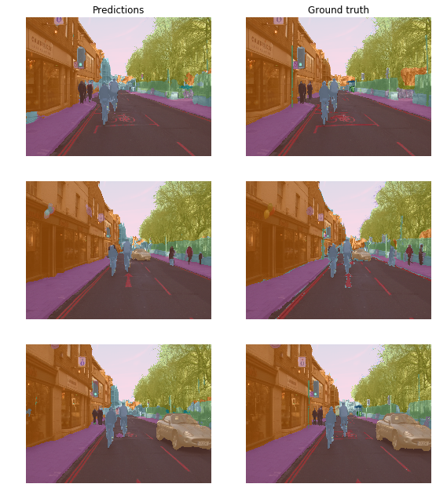

You can go `learn.show_results()` to see how your predictions compare to the ground truth, and they really look pretty good.

How good is pretty good? An accuracy of 92.15%, the best paper I know of for segmentation was a paper called [The One Hundred Layers Tiramisu](https://arxiv.org/abs/1611.09326) which developed a convolutional dense net came out about two years ago. After I trained this today, I went back and looked at the paper to find their state-of-the-art accuracy and their best was 91.5% and we got 92.1%. I don't know if better results have come out since this paper, but I remember when this paper came out and it was a really big deal. I said "wow, this this is an exceptionally good segmentation result." When you compare it to the previous bests that they compared it to it was a big step up.

In last year's course, we spent a lot of time re-implementing the hundred layers tiramisu. Now with our totally default fastai class, and it's easily beating 91.5%. I also remember I had to train for hours and hours. Where else, today's version, I trained in minutes. So this is a super strong architecture for segmentation.

I'm not going to promise that this is the definite state-of-the-art today, because I haven't done a complete literature search to see what's happened in the last two years. But it's certainly beating the world's best approach the last time I looked into this which was in last year's course basically. So these are all the little tricks we've picked up along the way in terms of how to train things well: things like using the pre-trained model and the one cycle convergence. All these little tricks they work extraordinarily well.

We actually haven't published the paper on the exact details of how this variation of the U-Net works﹣there's a few little tweaks we do, but if you come back for part 2, we'll be going into all of the details about how we make this work so well. But for you, all you have to know at this stage is that you can say `learner.create_unet` and you should get great results also.

#### Another trick: Mixed precision training [[1:30:59](https://youtu.be/PW2HKkzdkKY?t=5459)]

There's another trick you can use if you're running out of memory a lot which is you can actually do something called mixed precision training. Mixed precision training means that (for those of you that have done a little bit of computer science) instead of using single precision floating point numbers, you can do most of the calculations in your model with half precision floating point numbers﹣so 16 bits instead of 32 bits. The very idea of this has only been around for the last couple of years﹣in terms of like hardware that actually does this reasonably quickly. Then fastai library, I think, is the first and probably still the only that makes it actually easy to use this.

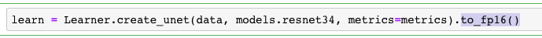

If you add `to_fp16()` on the end of any learner call, you're actually going to get a model that trains in 16-bit precision. Because it's so new, you'll need to have the most recent CUDA drivers and all that stuff for this even to work. When I tried it this morning on some of the platforms, it just killed the kernel, so you need to make sure you've got the most recent drivers. If you've got a really recent GPU like 2080Ti, not only will it work, but it'll work about twice as fast as otherwise. The reason I'm mentioning it is that it's going to use less GPU RAM, so even if you don't have a 2080Ti, you'll probably find that things that didn't fit into your GPU without this do fit in.

I actually have never seen people use mixed precision floating point for segmentation before, just for a bit of a laugh I tried it and actually discovered that I got even better result. I only found this this morning so I don't have anything more to add here rather than quite often when you make things a little bit less precise in deep learning, it generalizes a little bit better.  I've never seen a 92.5% accuracy on CamVid before, so not only will this be faster, you'll be able to use bigger batch sizes, but you might even find like I did that you get an even better result. So that's a cool little trick.

You just need to make sure that every time you create a learner you add at this `to_fp16()`. If your kernel dies, it probably means you have slightly out of date CUDA drivers or maybe even a too old graphics card I'm not sure exactly which cards support FP16.

## Regression with BIWI head pose dataset [[1:34:03](https://youtu.be/PW2HKkzdkKY?t=5643)]

[lesson3-head-pose.ipynb](https://github.com/fastai/course-v3/blob/master/nbs/dl1/lesson3-head-pose.ipynb)

Two more before we kind of rewind. The first one I'm going to show you is an interesting data set called the [BIWI head pose dataset](https://data.vision.ee.ethz.ch/cvl/gfanelli/head_pose/head_forest.html#db). Gabriele Fanelli was kind enough to give us permission to use this in the class. His team created this cool dataset.

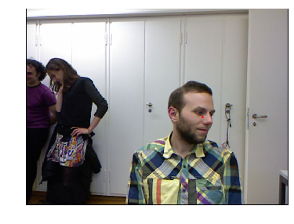

Here's what the data set looks like. It's actually got a few things in it. We're just going to do a simplified version, and one of the things they do is they have a dot saying this is the center of the face. So we're going to try and create a model that can find this ever face.

```python
%reload_ext autoreload
%autoreload 2
%matplotlib inline
```

```python
from fastai import *
from fastai.vision import *
```

For this dataset, there's a few dataset specific things we have to do which I don't really even understand but I just know from the readme that you have to. They use some kind of depth sensing camera, I think they actually use Xbox Kinect.

```python
path = untar_data(URLs.BIWI_HEAD_POSE)
```

There's some kind of calibration numbers that they provide in a little file which I had to read in:

```python
cal = np.genfromtxt(path/'01'/'rgb.cal', skip_footer=6); cal
```

```
array([[517.679,   0.   , 320.   ],
       [  0.   , 517.679, 240.5  ],
       [  0.   ,   0.   ,   1.   ]])
```

```python
fname = '09/frame_00667_rgb.jpg'
```

```python
def img2txt_name(f): return path/f'{str(f)[:-7]}pose.txt'
```

```python
img = open_image(path/fname)
img.show()
```

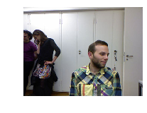


```python
ctr = np.genfromtxt(img2txt_name(fname), skip_header=3); ctr
```
```
array([187.332 ,  40.3892, 893.135 ])
```
Then they provided a little function that you have to use to take their coordinates to change it from this depth sensor calibration thing to end up with actual coordinates.
```python
def convert_biwi(coords):
    c1 = coords[0] * cal[0][0]/coords[2] + cal[0][2]
    c2 = coords[1] * cal[1][1]/coords[2] + cal[1][2]
    return tensor([c2,c1])

def get_ctr(f):
    ctr = np.genfromtxt(img2txt_name(f), skip_header=3)
    return convert_biwi(ctr)

def get_ip(img,pts): return ImagePoints(FlowField(img.size, pts), scale=True)
```


So when you open this and you see these conversion routines, I'm just doing what they told us to do basically. It's got nothing particularly to do with deep learning to end up with this red dot.

```
get_ctr(fname)
```

```
tensor([263.9104, 428.5814])
```

```
ctr = get_ctr(fname)
img.show(y=get_ip(img, ctr), figsize=(6, 6))
```


The interesting bit really is where we create something which is not an image or an image segment but an image points. We'll mainly learn about this later in the course, but basically image points use this idea of coordinates. They're not pixel values, they're XY coordinates (just two numbers).

Here's an example for a particular image file name (`09/frame_00667_rgb.jpg`). The coordinates of the centre of the face are `[263.9104, 428.5814]`. So there's just two numbers which represent whereabouts on this picture is the center of the face. So if we're going to create a model that can find the center of a face, we need a neural network that spits out two numbers. But note, this is not a classification model. These are not two numbers that you look up in a list to find out that they're road or building or ragdoll cat or whatever. They're actual locations.

So far, everything we've done has been a classification model﹣something that created labels or classes. This, for the first time, is what we call a regression model. A lot of people think regression means linear regression, it doesn't. Regression just means any kind of model where your output is some continuous number or set of numbers. So we need to create an image regression model (i.e. something that can predict these two numbers). How do you do that? Same way as always.

```python
data = (ImageItemList.from_folder(path)
        .split_by_valid_func(lambda o: o.parent.name=='13')
        .label_from_func(get_ctr, label_cls=PointsItemList)
        .transform(get_transforms(), tfm_y=True, size=(120,160))
        .databunch().normalize(imagenet_stats)
       )
```

We can actually just say:

- I've got a list of image files.
- It's in a folder.
- I'm going to split it according to some function. So in this case, the files they gave us are from videos. So I picked just one folder (`13`) to be my validation set (i.e. a different person). So again, I was trying to think about how do I validate this fairly, so I said the the fair validation would be to make sure that it works well on a person that it's never seen before. So my validation set is all going to be a particular person.
- I want to label them using this function that we wrote that basically does the stuff that the readme says to grab the coordinates out of their text files. So that's going to give me the two numbers for every one.
- Create a dataset. This data set, I just tell it what kind of data set it is ﹣ they're going to be a set of points of specific coordinates.
- Do some transforms. Again, I have to say `tfm_y=True` because that red dot needs to move if I flip or rotate or warp.
- Pick some size. I just picked a size that's going to work pretty quickly.
- Create a data bunch.
- Normalize it.

```python
data.show_batch(3, figsize=(9,6)
```

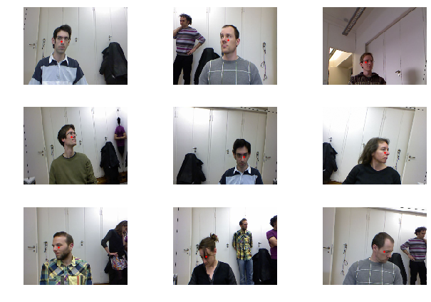

I noticed that their red dots don't always seem to be quite in the middle of the face. I don't know exactly what their internal algorithm for putting dots on. It sometimes looks like it's meant to be the nose, but sometimes it's not quite the nose. Anyway it's somewhere around the center of the face or the nose.

#### Create a regression model [[1:38:59](https://youtu.be/PW2HKkzdkKY?t=5939)]

So how do we create a model? We create a CNN. We're going to be learning a lot about loss functions in the next few lessons, but basically the loss function is that number that says how good is the model. For classification, we use this loss function called cross-entropy loss which says basically "did you predict the correct class and were you confident of that prediction?" We can't use that for regression, so instead we use something called mean squared error. If you remember from last lesson, we actually implemented mean squared error from scratch. It's just the difference between the two, squared, and added up together.

```python
learn = create_cnn(data, models.resnet34)
learn.loss_func = MSELossFlat()
```

So we need to tell it this is not classification so we have to use mean squared error.

```
learn.lr_find()
learn.recorder.plot()
```
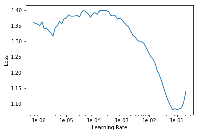

```
lr = 2e-2
```

```
learn.fit_one_cycle(5, slice(lr))
```

```
Total time: 07:28
epoch  train_loss  valid_loss
1      0.043327    0.010848    (01:34)
2      0.015479    0.001792    (01:27)
3      0.006021    0.001171    (01:28)
4      0.003105    0.000521    (01:27)
5      0.002425    0.000381    (01:29)
```

Once we've created the learner, we've told it what loss function to use, we can go ahead and do `lr_find`, then `fit` and you can see here within a minute and a half our mean squared error is 0.0004.

The nice thing is about mean squared error, that's very easy to interpret. We're trying to predict something which is somewhere around a few hundred, and we're getting a squared error on average of 0.0004. So we can feel pretty confident that this is a really good model. Then we can look at the results:

```
learn.show_results()
```

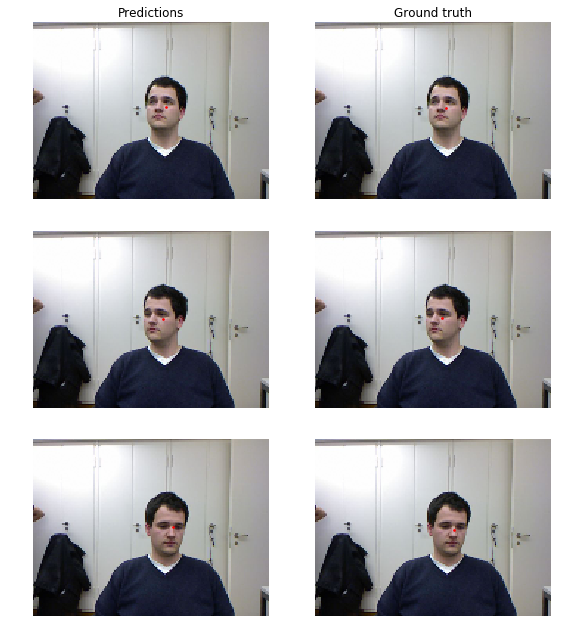

It's doing nearly perfect job. That's how you can do image regression models. Anytime you've got something you're trying to predict which is some continuous value, you use an approach that's something like this.


Question:  For a dataset very different than ImageNet like the satellite images or genomic images shown in lesson 2, we should use our own stats.

Jeremy once said:

> If you’re using a pretrained model you need to use the same stats it was trained with.

Why it is that? Isn’t it that, normalized dataset with its own stats will have roughly the same distribution like ImageNet? The only thing I can think of, which may differ is skewness. Is it the possibility of skewness or something else the reason of your statement? And does that mean you don’t recommend using pre-trained model with very different dataset like the one-point mutation that you showed us in lesson 2? [[1:46:53](https://youtu.be/PW2HKkzdkKY?t=6413)]

Nope. As you can see, I've used pre-trained models for all of those things. Every time I've used an ImageNet pre-trained model, I've used ImageNet stats. Why is that? Because that model was trained with those stats. For example, imagine you're trying to classify different types of green frogs. If you were to use your own per-channel means from your dataset, you would end up converting them to a mean of zero, a standard deviation of one for each of your red, green, and blue channels. Which means they don't look like green frogs anymore. They now look like grey frogs. But ImageNet expects frogs to be green. So you need to normalize with the same stats that the ImageNet training people normalized with. Otherwise the unique characteristics of your dataset won't appear anymore﹣you've actually normalized them out in terms of the per-channel statistics. So you should always use the same stats that the model was trained with.

In every case, what we're doing here is we're using gradient descent with mini batches (i.e. stochastic gradient descent) to fit some parameters of a model. And those parameters are parameters to matrix multiplications. The second half of this part, we're actually going to learn about a little tweak called convolutions, but it's basically a type of matrix multiplication.

The thing is though, no amount of matrix multiplications is possibly going to create something that can read IMDB movie reviews and decide if it's positive or negative or look at satellite imagery and decide whether it's got a road in it﹣that's far more than a linear classifier can do. Now we know these are deep neural networks. Deep neural networks contain lots of these matrix multiplications, but every matrix multiplication is just a linear model. A linear function on top of a linear function is just another linear function. If you remember back to your high school math, you might remember that if you have a  and then you stick another on top of that, it's still just another slope and another intercept. So no amount of stacking matrix multiplications is going to help in the slightest.

So what are these models actually? What are we actually doing? And here's the interesting thing﹣all we're actually doing is we literally do have a matrix multiplication (or a slight variation like a convolution that we'll learn about) but after each one, we do something called a non-linearity or an **activation function**. An activation function is something that takes the result of that matrix multiplication and sticks it through some function. These are some of the functions that we use ([by Sagar Sharma](https://towardsdatascience.com/activation-functions-neural-networks-1cbd9f8d91d6)):

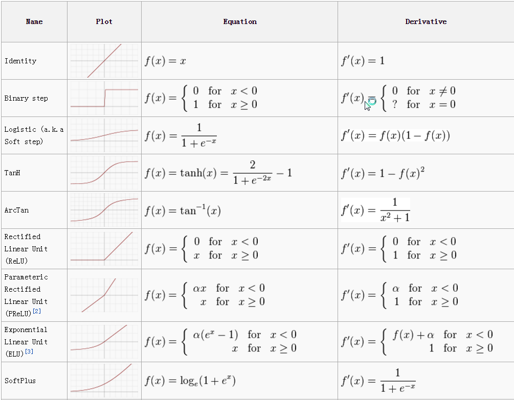


In the old days, the most common function that we used to use was **sigmoid**. And they have particular mathematical definitions. Nowadays, we almost never use those for these between each matrix multiply. Nowadays, we nearly always use this one﹣it's called a **rectified linear unit**. It's very important, when you're doing deep learning, to use big long words that sound impressive. Otherwise normal people might think they can do it too 😆 But just between you and me,  a rectified linear unit is defined using the following function:

```python
max(x, 0)
```


That's it. And if you want to be really exclusive, of course, you then shorten the long version and you call it a ReLU to show that you're really in the exclusive team. So this is a ReLU activation.

Here's the crazy thing. If you take your red green blue pixel inputs, and you chuck them through a matrix modification, and then you replace the negatives with zero, and you put it through another matrix modification, replace the negatives at zero, and you keep doing that again and again, you have a deep learning neural network. That's it.

#### Universal approximation theorem [[1:52:27](https://youtu.be/PW2HKkzdkKY?t=6747)]

So how the heck does that work? An extremely cool guy called Michael Nielsen showed how this works. He has a very nice website (actually a book) http://neuralnetworksanddeeplearning.com and he has these beautiful little JavaScript things where you can get to play around. Because this was back in the old days, this was back when we used to use sigmoids. What he shows is that if you have enough little matrix multiplications followed by sigmoids (exactly the same thing works for a matrix multiplication followed by a ReLU), you can actually create arbitrary shapes. So this idea that these combinations of  linear functions and nonlinearities can create arbitrary shapes actually has a name and this name is the universal approximation theorem.

What it says is that if you have stacks of linear functions and nonlinearities, the thing you end up with can approximate any function arbitrarily closely. So you just need to make sure that you have a big enough matrix to multiply by or enough of them. If you have this function which is just a sequence of matrix multiplies and nonlinearities where the nonlinearities can be basically any of these activation functions, if that can approximate anything, then all you need is some way to find the particular values of the weight matrices in your matrix multiplies that solve the problem you want to solve. We already know how to find the values of parameters. We can use gradient descent. So that's actually it.

And this is the bit I find the hardest thing normally to explain to students is that we're actually done now. People often come up to me after this lesson and they say "what's the rest? Please explain to me the rest of deep learning." But no, there's no rest. We have a function where we take our input pixels or whatever, we multiply them by some weight matrix, we replace the negatives with zeros, we multiply it by another weight matrix, replace the negative zeros, we do that a few times. We see how close it is to our target and then we use gradient descent to update our weight matrices using the derivatives, and we do that a few times. And eventually, we end up with something that can classify movie reviews or can recognize pictures of ragdoll cats. That's actually it.

The reason it's hard to understand intuitively is because we're talking about weight matrices that have (once you add them all up) something like a hundred million parameters. They're very big weight matrices. So your intuition about what multiplying something by a linear model and replacing the negative zeros a bunch of times can do, your intuition doesn't hold. You just have to accept empirically the truth is doing that works really well.

In part two of the course, we're actually going to build these from scratch. But just to skip ahead, you basically will find that it's going to be five lines of code. It's going to be a little for loop that goes `t = x @ w1 ` , `t2 = max(t, 0)` , stick that in a for loop that goes through each weight matrix, and at the end calculate my loss function. Of course, we're not going to calculate the gradients ourselves because PyTorch does that for us. And that's about it.


**Question**: Some satellite images have 4 channels. How can we deal with data that has 4 channels or 2 channels when using pre-trained models? [[1:59:09](https://youtu.be/PW2HKkzdkKY?t=7149)]  

I think that's something that we're going to try and incorporate into fast AI. So hopefully, by the time you watch this video, there'll be easier ways to do this. But the basic idea is a pre-trained ImageNet model expects a red green and blue pixels. So if you've only got two channels, there's a few things you can do but basically you'll want to create a third channel. You can create the third channel as either being all zeros, or it could be the average of the other two channels. So you can just use you know normal PyTorch arithmetic to create that third channel. You could either do that ahead of time in a little loop and save your three channel versions, or you could create a custom dataset class that does that on demand.

For 4 channel, you probably don't want to get rid of the 4th channel. So instead, what you'd have to do is to actually modify the model itself. So to know how to do that, we'll only know how to do in a couple more lessons time. But basically the idea is that the initial weight matrix (weight matrix is really the wrong term, they're not weight matrices; their weight tensors so they can have more than just two dimensions), so that initial weight tensor in the neural net, one of its axes is going to have three slices in it. So you would just have to change that to add an extra slice, which I would generally just initialize to zero or to some random numbers. So that's the short version. But really to understand exactly what I meant by that, we're going to need a couple more lessons to get there.


#### Wrapping up [[2:01:19](https://youtu.be/PW2HKkzdkKY?t=7279)]

What have we looked at today? We started out by saying it's really easy now to create web apps. We've got starter kits for you that show you how to create web apps, and people have created some really cool web apps using what we've learned so far which is single label classification.

But the cool thing is the exact same steps we use to do single label classification, you can also do to do:

- Multi-label classification such as in the planet
- Image segmentation
- Any kind of image regression
- NLP classification
-  and a lot more

In each case, all we're actually doing is:

- Gradient descent
- Non-linearity

Universal approximation theorem tells us it lets us arbitrarily accurately approximate any given function including functions such as:

- Converting a spoken waveform into the thing the person was saying
- Converting a sentence in Japanese to a sentence in English
- Converting a picture of a dog into the word dog

These are all mathematical functions that we can learn using this approach.

So this week, see if you can come up with an interesting idea of a problem that you would like to solve which is either multi-label classification, image regression, image segmentation, or something like that and see if you can try to solve that problem. You will probably find the hardest part of solving that problem is creating the data bunch and so then you'll need to dig into the data block API to try to figure out how to create the data bunch from the data you have. With some practice, you will start to get pretty good at that. It's not a huge API. There's a small number of pieces. It's also very easy to add your own, but for now, ask on the forum if you try something and you get stuck.

Next week, we're going to come back and we're going to look at some more NLP. We're going to learn some more about some details about how we actually train with SGD quickly. We're going to learn about things like Adam and RMSProp and so forth. Snd hopefully, we're also going to show off lots of really cool web apps and models that you've all built during the week, so I'll see you then Thanks!

# Lesson 4 start

### Correction on CamVid result 

Before we do, somebody on the forum is kind enough to point out that when we compared ourselves to what we think might be the state of the art or was recently the state of the art for CamVid, there wasn't a fair comparison because the paper actually used a small subset of the classes, and we used all of the classes. So Jason in our study group was kind enough to rerun the experiments with the correct subset of classes from the paper, and our accuracy went up to 94% compared to 91.5% of the paper. So I think that's a really cool result. and a great example of how pretty much just using the defaults nowadays can get you far beyond what was the best of a year or two ago. It was certainly the best last year when we were doing this course because we started it quite intensely. So that's really exciting.