# CNN's - multilabel classification using abbreviated Lesson 3

[Video](https://youtu.be/PW2HKkzdkKY) / [Lesson Forum](https://forums.fast.ai/t/lesson-3-official-resources-and-updates/29732)


### Multi-label classification with Planet Amazon dataset [9:51](https://youtu.be/PW2HKkzdkKY?t=591)

[lesson3-planet.ipynb](https://github.com/fastai/course-v3/blob/master/nbs/dl1/lesson3-planet.ipynb)

The first one we're going to look at is a dataset of satellite images. Satellite imaging is a really fertile area for deep learning. Certainly a lot of people are already using deep learning in satellite imaging but only scratching the surface. The dataset we are going to look at looks like this:

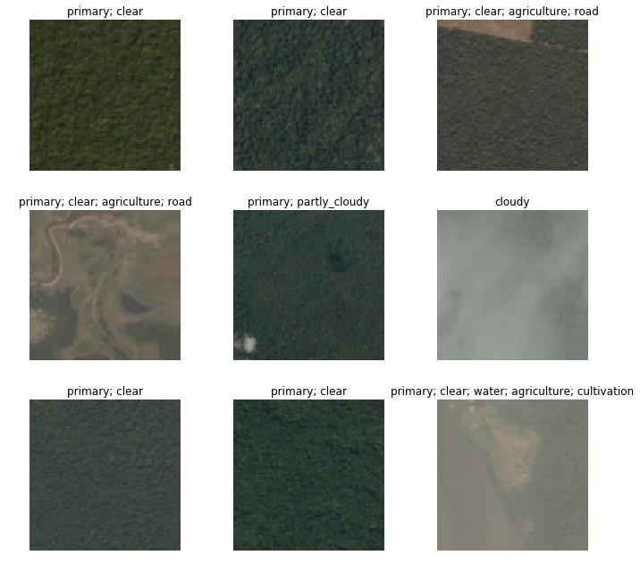

It has satellite tiles and for each one, as you can see, there's a number of different labels for each tile. One of the labels always represents the weather (e.g. cloudy, partly_cloudy). And all of the other labels tell you any interesting features that are seen there. So primary means primary rainforest, agriculture means there's some farming, road means road, and so forth. As I am sure you can tell, this is a little different to all the classifiers we've seen so far because there's not just one label, there's potentially multiple labels. So multi-label classification can be done in a very similar way but the first thing we are going to need to do is to download the data.

#### Downloading the data [11:02](https://youtu.be/PW2HKkzdkKY?t=662)

 This data comes from Kaggle. Kaggle is mainly known for being a competitions website and it's really great to download data from Kaggle when you're learning because you can see how would I have gone in that competition. And it's a good way to see whether you know what you are doing. I tend to think the goal is to try and get in the top 10%. In my experience, all the people in the top 10% of a competition really know what they're doing. So if you can get in the top 10%, then that's a really good sign.

Pretty much every Kaggle dataset is not available for download outside of Kaggle (at least competition datasets) so you have to download it through Kaggle. The good news is that Kaggle provides a python-based downloader tool which you can use, so we've got a quick description here of how to download stuff from Kaggle.

You first have to install the Kaggle download tool via `pip`.

```bash
#! pip install kaggle --upgrade
```

What we tend to do when there's one-off things to do is we show you the commented out version in the notebook and you can just remove the comment. If you select a few lines and then hit <kbd>ctrl</kbd>+<kbd>/</kbd>, it uncomment them all. Then when you are done, select them again, <kbd>ctrl</kbd>+<kbd>/</kbd> again and re-comments them all. So this line will install `kaggle` for you. Depending on your platform, you may need `sudo` or `/something/pip`, you may need `source activate` so have a look on the setup instructions instructions or the returning to work instructions on the course website to see when we do `conda	` install, you have to the same basic steps for your pip install.

Once you've got that module installed, you can then go ahead and download the data. Basically it's as simple as saying `kaggle competitions download -c competition_name -f file_name` the only other steps you do that is you have to authenticate yourself and there is a little bit of information here on exactly how you can go about downloading from Kaggle the file containing your API authentication information. I wouldn't bother going through it here, but just follow these steps.

> Then you need to upload your credentials from Kaggle on your instance. Login to kaggle and click on your profile picture on the top left corner, then 'My account'. Scroll down until you find a button named 'Create New API Token' and click on it. This will trigger the download of a file named 'kaggle.json'.

> Upload this file to the directory this notebook is running in, by clicking "Upload" on your main Jupyter page, then uncomment and execute the next two commands (or run them in a terminal).

```bash
#! mkdir -p ~/.kaggle/
#! mv kaggle.json ~/.kaggle/
```


> You're all set to download the data from [planet competition](https://www.kaggle.com/c/planet-understanding-the-amazon-from-space). You **first need to go to its main page and accept its rules**, and run the two cells below (uncomment the shell commands to download and unzip the data). If you get a `403 forbidden` error it means you haven't accepted the competition rules yet (you have to go to the competition page, click on *Rules* tab, and then scroll to the bottom to find the *accept* button).

```python
path = Config.data_path()/'planet'
path.mkdir(exist_ok=True)
path
```

```
PosixPath('/home/jhoward/.fastai/data/planet')
```

```bash
# ! kaggle competitions download -c planet-understanding-the-amazon-from-space -f train-jpg.tar.7z -p {path}  
# ! kaggle competitions download -c planet-understanding-the-amazon-from-space -f train_v2.csv -p {path}  
# ! unzip -q -n {path}/train_v2.csv.zip -d {path}
```


Sometimes stuff on Kaggle is not just zipped or `tar`ed but it's compressed with a program called 7zip which will have a .7z extension. If that's the case, you'll need to either `apt install p7zip` or here is something really nice. Some kind person has created a `conda` installation of 7zip that works on every platform. So you can always just run this `conda install` ﹣doesn't even require a `sudo` or anything like that. This is actually a good example of where conda is super handy. You can actually install binaries and libraries and stuff like that and it's nicely cross-platform. So if you don't have 7zip installed, that's a good way to get it.

> To extract the content of this file, we'll need 7zip, so uncomment the following line if you need to install it (or run `sudo apt install p7zip` in your terminal).

```bash
# ! conda install -y -c haasad eidl7zip
```


This is how you unzip a 7zip file. In this case, it's tared and 7zipped, so you can do this all in one step. `7za` is the name of the 7zip archival program you would run.

That's all basic stuff which if you are not familiar with the command line and stuff, it might take you a little bit of experimenting to get it working. Feel free to ask on the forum, make sure you search the forum first to get started.

```bash
# ! 7za -bd -y -so x {path}/train-jpg.tar.7z | tar xf - -C {path}
```


#### Multiclassification [14:49](https://youtu.be/PW2HKkzdkKY?t=889)

Once you've got the data downloaded and unzipped, you can take a look at it. In this case, because we have multiple labels for each tile, we clearly can't have a different folder for each image telling us what the label is. We need some different way to label it. The way Kaggle did it was they provided a CSV file that had each file name along with a list of all the labels. So in order to just take a look at that CSV file, we can read it using the Pandas library. If you haven't used pandas before, it's kind of  the standard way of dealing with tabular data in Python. It pretty much always appears in the `pd` namespace. In this case we're not really doing anything with it other than just showing you the contents of this file. So we can read it, take a look at the first few lines, and there it is:

```python
df = pd.read_csv(path/'train_v2.csv')
df.head()
```

|      | image_name | tags                                      |
| ---- | ---------- | ----------------------------------------- |
| 0    | train_0    | haze primary                              |
| 1    | train_1    | agriculture clear primary water           |
| 2    | train_2    | clear primary                             |
| 3    | train_3    | clear primary                             |
| 4    | train_4    | agriculture clear habitation primary road |

We want to turn this into something we can use for modeling. So the kind of object that we use for modeling is an object of the DataBunch class. We have to somehow create a data bunch out of this. Once we have a data bunch, we'll be able to go `.show_banch` to take a look at it.  And then we'll be able to go `create_cnn` with it, and we would be able to start training.

So really the the trickiest step previously in deep learning has often been getting your data into a form that you can get it into a model. So far we've been showing you how to do that using various "factory methods" which are methods where you say "I want to create this kind of data from this kind of source with these kinds of options." That works fine, sometimes, and we showed you a few ways of doing it over the last couple of weeks. But  sometimes you want more flexibility, because there's so many choices that you have to make about:

- Where do the files live
- What's the structure they're in
- How do the labels appear
- How do you spit out the validation set
- How do you transform it

So we've got this unique API that I'm really proud of called the [data block API](https://docs.fast.ai/data_block.html). The data block API makes each one of those decisions a separate decision that you make. There are separate methods with their own parameters for every choice that you make around how to create/set up my data.

```python
tfms = get_transforms(flip_vert=True, max_lighting=0.1, max_zoom=1.05, max_warp=0.)
```

```python
np.random.seed(42)
src = (ImageFileList.from_folder(path)            
       .label_from_csv('train_v2.csv',sep=' ',folder='train-jpg',suffix='.jpg')
       .random_split_by_pct(0.2))
```

```python
data = (src.datasets()
        .transform(tfms, size=128)
        .databunch().normalize(imagenet_stats))
```

For example, to grab the planet data we would say:

- We've got a list of image files that are in a folder
- They're labeled based on a CSV with this name (`train_v2.csv`)
  - They have this separator (` `) ﹣remember I showed you back here that there's a space between them. By passing in separator, it's going to create multiple labels.
  - The images are in this folder (`train-jpg`)
  - They have this suffix (`.jpg`)
- They're going to randomly spit out a validation set with 20% of the data
- We're going to create datasets from that, which we are then going to transform with these transformations (`tfms`)
- Then we going to create a data bunch out of that, which we will then normalize using these statistics (`imagenet_stats`)

So there's all these different steps. To give you a sense of what that looks like, the first thing I'm going to do is go back and explain what are all of the PyTorch and fastai classes you need to know about that are going to appear in this process. Because you're going to see them all the time in the fastai docs and PyTorch docs.

##### Dataset (PyTorch) [18:30](https://youtu.be/PW2HKkzdkKY?t=1110)

The first one you need to know about is a class called a Dataset. The Dataset class is part of PyTorch and this is the source code for the Dataset class:

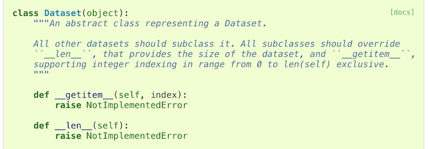

As you can see. it actually does nothing at all. The Dataset class in PyTorch defines two things: `__getitem__` and `__len__`. In Python these special things that are "underscore underscore something underscore underscore" ﹣Pythonists call them "dunder" something. So these would be "dunder get items" and "dunder len". They're basically special magical methods with some special behavior. This particular method means that your object, if you had an object called `O`, it can be indexed with square brackets (e.g. `O[3]`).  So that would call `__getitem__` with 3 as the index.

Then this one called `__len__` means that you can go `len(o)` and it will call that method. In this case, they're both not implemented. That is to say, although PyTorch says "in order to tell PyTorch about your data, you have to create a dataset", it doesn't really do anything to help you create the dataset. It just defines what the dataset needs to do. In other words, the starting point for your data is something where you can say:

- What is the third item of data in my dataset (that's what `__getitem__` does)
- How big is my dataset (that's what `__len__` does)

Fastai has lots of Dataset subclasses that do that for all different kinds of stuff. So far, you've been seeing image classification datasets. They are datasets where `__getitem__`  will return an image and a single label of what is that image. So that's what a dataset is.

##### DataLoader (PyTorch) [20:37](https://youtu.be/PW2HKkzdkKY?t=1237)

Now a dataset is not enough to train a model. The first thing we know we have to do, if you think back to the gradient descent tutorial last week is we have to have a few images/items at a time so that our GPU can work in parallel. Remember we do this thing called a "mini-batch"? Mini-batch is a few items that we present to the model at a time that it can train from in parallel. To create a mini-batch, we use another PyTorch class called a DataLoader.

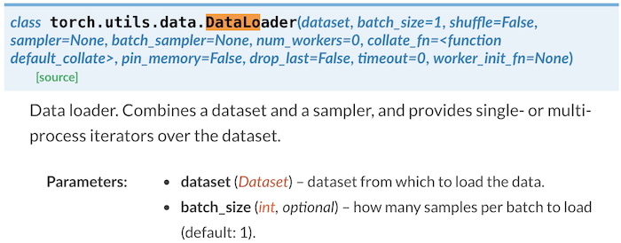

A DataLoader takes a dataset in its constructor, so it's now saying "oh this is something I can get the third item and the fifth item and the ninth item." It's going to:

- Grab items at random
- Create a batch of whatever size you asked for
- Pop it on the GPU
- Send it off to your model for you

So a DataLoader is something that grabs individual items, combines them into a mini-batch, pops them on the GPU for modeling. So that's called a DataLoader and that comes from a Dataset.

You can see, already there are choices you have to make: what kind of dataset am I creating, what is the data for it, where it's going to come from. Then when I create my DataLoader: what batch size do I want to use.  

##### DataBunch (fastai) [21:59](https://youtu.be/PW2HKkzdkKY?t=1319)

It still isn't enough to train a model, because we've got no way to validate the model. If all we have is a training set, then we have no way to know how we're doing because we need a separate set of held out data, a validation set, to see how we're getting along.


For that we use a fastai class called a DataBunch. A DataBunch is something which binds together a training data loader (`train_dl`) and a valid data loader (`valid_dl`).  When you look at the fastai docs when you see these mono spaced font things, they're always referring to some symbol you can look up elsewhere. In this case you can see `train_dl` is the first argument of DataBunch. There's no point knowing that there's an argument with a certain name unless you know what that argument is, so you should always look after the `:` to find out that is a DataLoader. So when you create a DataBunch, you're basically giving it a training set data loader and a validation set data loader. And that's now an object that you can send off to a learner and start fitting,

They're the basic pieces. Coming back to here, these are all the stuff which is creating the dataset:

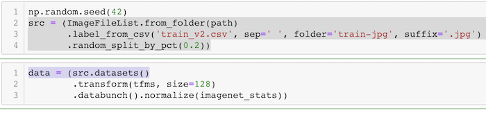

With the dataset, the indexer returns two things:  the image and the labels (assuming it's an image dataset).

- where do the images come from
- where do the labels come from
- then I'm going to create two separate data sets the training and the validation
- `.datasets()` actually turns them into PyTorch datasets
- `.transform()` is the thing that transforms them
- `.databunch()` is actually going to create the the DataLoader and the DataBunch in one go


#### Data block API examples [23:56](https://youtu.be/PW2HKkzdkKY?t=1436)

Let's look at some examples of this data block API because once you understand the data block API, you'll never be lost for how to convert your dataset into something you can start modeling with.

[data_block.ipynb](https://github.com/fastai/fastai/blob/master/docs_src/data_block.ipynb)


#### MNIST

Here are some examples of using the data block API. For example, if you're looking at MNIST (the pictures and classes of handwritten numerals), you can do something like this:

```python
path = untar_data(URLs.MNIST_TINY)
tfms = get_transforms(do_flip=False)
path.ls()
```

```
[PosixPath('/home/jhoward/.fastai/data/mnist_tiny/valid'),
 PosixPath('/home/jhoward/.fastai/data/mnist_tiny/models'),
 PosixPath('/home/jhoward/.fastai/data/mnist_tiny/train'),
 PosixPath('/home/jhoward/.fastai/data/mnist_tiny/test'),
 PosixPath('/home/jhoward/.fastai/data/mnist_tiny/labels.csv')]
```

```python
(path/'train').ls()
```

```
[PosixPath('/home/jhoward/.fastai/data/mnist_tiny/train/3'),
 PosixPath('/home/jhoward/.fastai/data/mnist_tiny/train/7')]
```

```python
data = (ImageFileList.from_folder(path)  #Where to find the data? -> in path and its subfolders
        .label_from_folder()             #How to label? -> depending on the folder of the filenames
        .split_by_folder()               #How to split in train/valid? -> use the folders
        .add_test_folder()               #Optionally add a test set
        .datasets()                      #How to convert to datasets?
        .transform(tfms, size=224)       #Data augmentation? -> use tfms with a size of 224
        .databunch())                    #Finally? -> use the defaults for conversion to ImageDataBunch
```


- What kind of data set is this going to be?
  - It's going to come from a list of image files which are in some folder.
  - They're labeled according to the folder name that they're in.
  - We're going to split it into train and validation according to the folder that they're in (`train` and `valid`).
  - You can optionally add a test set. We're going to be talking more about test sets later in the course.
  - We'll convert those into PyTorch datasets now that that's all set up.
  - We will then transform them using this set of transforms (`tfms`), and we're going to transform into something of this size (`224`).
  - Then we're going to convert them into a data bunch.

So each of those stages inside these parentheses are various parameters you can pass to customize how that all works. But in the case of something like this MNIST dataset, all the defaults pretty much work, so this is all fine.

```python
data.train_ds[0]
```

```
(Image (3, 224, 224), 0)
```

Here it is. `data.train_ds` is the dataset (not the data loader) so I can actually index into it with a particular number. So here is the zero indexed item in the training data set: it's got an image and a label.
```python
data.show_batch(rows=3, figsize=(5,5))
```

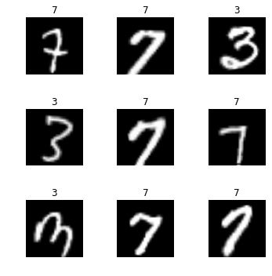

We can show batch to see an example of the pictures of it. And we could then start training.

```python
data.valid_ds.classes
```

```
['3', '7']
```

Here are the classes that are in that dataset. This little cut-down sample of MNIST has 3's and 7's.

#### Planet [26:01](https://youtu.be/PW2HKkzdkKY?t=1561)

Here's an example using planet dataset. This is actually again a little subset of planet we use to make it easy to try things out.

```python
planet = untar_data(URLs.PLANET_TINY)
planet_tfms = get_transforms(flip_vert=True, max_lighting=0.1, max_zoom=1.05, max_warp=0.)
data = ImageDataBunch.from_csv(planet, folder='train', size=128, suffix='.jpg', sep = ' ', ds_tfms=planet_tfms)
```

> With the data block API we can rewrite this like that:

```python
data = (ImageFileList.from_folder(planet)            
        #Where to find the data? -> in planet and its subfolders
        .label_from_csv('labels.csv', sep=' ', folder='train', suffix='.jpg')  
        #How to label? -> use the csv file labels.csv in path,
        #add .jpg to the names and take them in the folder train
        .random_split_by_pct()                     
        #How to split in train/valid? -> randomly with the default 20% in valid
        .datasets()
        #How to convert to datasets? -> use ImageMultiDataset
        .transform(planet_tfms, size=128)             
        #Data augmentation? -> use tfms with a size of 128
        .databunch())                          
        #Finally? -> use the defaults for conversion to databunch
```

In this case:

- Again, it's an ImageFileList
- We are grabbing it from a folder
- This time we're labeling it based on a CSV file
- We're randomly splitting it (by default it's 20%)
- Creating data sets
- Transforming it using these transforms (`planet_tfms`), we're going to use a smaller size (`128`).
- Then create a data bunch

```python
data.show_batch(rows=3, figsize=(10,8))
```

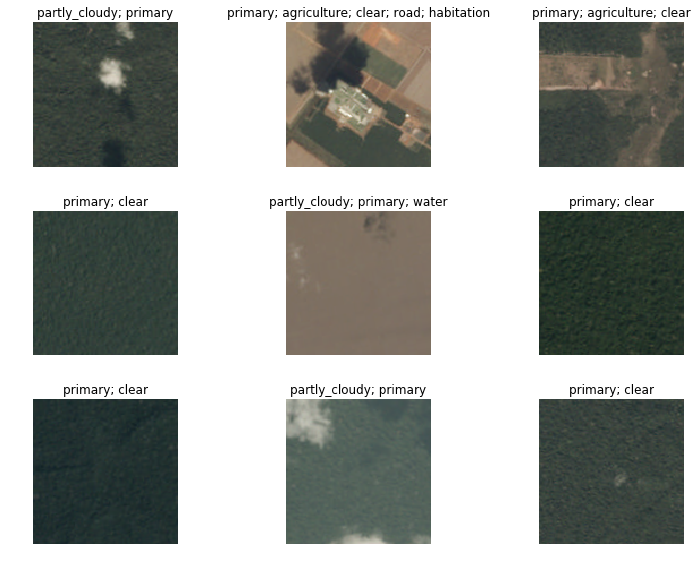

There it is. Data bunches know how to draw themselves amongst other things.

#### CAMVID [26:38](https://youtu.be/PW2HKkzdkKY?t=1598)

Here's some more examples we're going to be seeing later today.

```python
camvid = untar_data(URLs.CAMVID_TINY)
path_lbl = camvid/'labels'
path_img = camvid/'images'
```

```python
codes = np.loadtxt(camvid/'codes.txt', dtype=str); codes
```

```
array(['Animal', 'Archway', 'Bicyclist', 'Bridge', 'Building', 'Car', 'CartLuggagePram', 'Child', 'Column_Pole',
       'Fence', 'LaneMkgsDriv', 'LaneMkgsNonDriv', 'Misc_Text', 'MotorcycleScooter', 'OtherMoving', 'ParkingBlock',
       'Pedestrian', 'Road', 'RoadShoulder', 'Sidewalk', 'SignSymbol', 'Sky', 'SUVPickupTruck', 'TrafficCone',
       'TrafficLight', 'Train', 'Tree', 'Truck_Bus', 'Tunnel', 'VegetationMisc', 'Void', 'Wall'], dtype='<U17')
```

```python
get_y_fn = lambda x: path_lbl/f'{x.stem}_P{x.suffix}'
```

```python
data = (ImageFileList.from_folder(path_img)                #Where are the input files? -> in path_img
        .label_from_func(get_y_fn)                         #How to label? -> use get_y_fn
        .random_split_by_pct()                             #How to split between train and valid? -> randomly
        .datasets(SegmentationDataset, classes=codes)      #How to create a dataset? -> use SegmentationDataset
        .transform(get_transforms(), size=96, tfm_y=True)  #Data aug -> Use standard tfms with tfm_y=True
        .databunch(bs=64))                                 #Lastly convert in a databunch.
```

```python
data.show_batch(rows=2, figsize=(5,5))
```

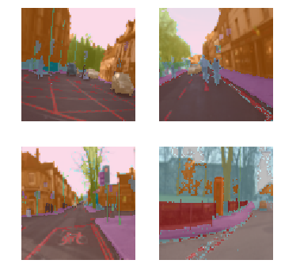

What if we look at this data set called CAMBID?  CAMVID looks like this. It contains pictures and every pixel in the picture is color coded. So in this case :

- We have a list of files in a folder
- We're going to label them using a function. So this function (`get_y_fn`) is basically the thing which tells it whereabouts of the color coding for each pixel. It's in a different place.
- Randomly split it in some way
- Create some datasets in some way. We can tell it for our particular list of classes, how do we know what pixel you know value 1 versus pixel value 2 is. That was something that we can read in.
- Some transforms
- Create a data bunch. You can optionally pass in things like what batch size do you want.

Again, it knows how to draw itself and you can start learning with that.

#### COCO [27:41](https://youtu.be/PW2HKkzdkKY?t=1661)

One more example. What if we wanted to create something like this:

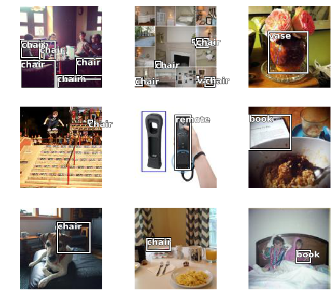

This is called an object detection dataset. Again, we've got a little minimal COCO dataset. COCO is the most famous academic dataset for object detection.

```
coco = untar_data(URLs.COCO_TINY)
images, lbl_bbox = get_annotations(coco/'train.json')
img2bbox = {img:bb for img, bb in zip(images, lbl_bbox)}
get_y_func = lambda o:img2bbox[o.name]
```

```python
data = (ImageFileList.from_folder(coco)
        #Where are the images? -> in coco
        .label_from_func(get_y_func)                    
        #How to find the labels? -> use get_y_func
        .random_split_by_pct()                          
        #How to split in train/valid? -> randomly with the default 20% in valid
        .datasets(ObjectDetectDataset)                  
        #How to create datasets? -> with ObjectDetectDataset
        #Data augmentation? -> Standard transforms with tfm_y=True
        .databunch(bs=16, collate_fn=bb_pad_collate))   
        #Finally we convert to a DataBunch and we use bb_pad_collate
```

We can create it using the same process:

- Grab a list of files from a folder.
- Label them according to this little function (`get_y_func`).
- Randomly split them.
- Create an object detection dataset.
- Create a data bunch. In this case you have to use generally smaller batch sizes or you'll run out of memory. And you have to use something called a "collation function".

Once that's all done we can again show it and here is our object detection data set. So you get the idea. So here's a really convenient notebook. Where will you find this? Ah, this notebook is the documentation. Remember how I told you that all of the documentation comes from notebooks? You'll find them in [fastai repo in docs_src](https://github.com/fastai/fastai/tree/master/docs_src) . This which you can play with and experiment with inputs and outputs, and try all the different parameters, you will find [the data block API examples of use](https://github.com/fastai/fastai/blob/master/docs_src/data_block.ipynb), if you go to the documentation here it is - the [data block API examples of use](https://docs.fast.ai/data_block.html#Examples-of-use).

Everything that you want to use in fastai, you can look it up in the documentation. There is also search functionality available:

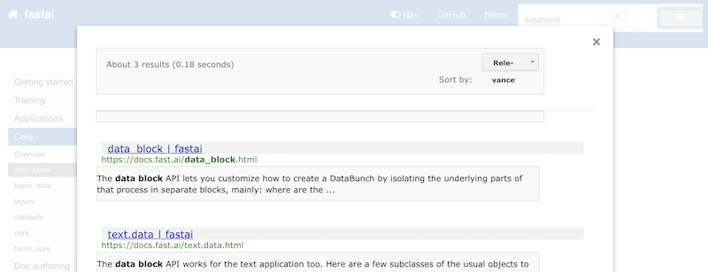


So once you find some documentation that you actually want to try playing with yourself, just look up the name (e.g. `data_block.html`) and then you can open up a notebook with the same name (e.g. `data_block.ipynb`) in the fastai repo and play with it yourself.

#### Creating satellite image data bunch [29:35](https://youtu.be/PW2HKkzdkKY?t=1775)

That was a quick overview of this really nice data block API, and there's lots of documentation for all of the different ways you can label inputs, split data, and create datasets. So that's what we're using for planet.

In the documentation, these two steps were all joined up together:

```python
np.random.seed(42)
src = (ImageFileList.from_folder(path)            
       .label_from_csv('train_v2.csv', sep=' ', folder='train-jpg', suffix='.jpg')  
       .random_split_by_pct(0.2))
```

```python
data = (src.datasets()
        .transform(tfms, size=128)
        .databunch().normalize(imagenet_stats))
```

We can certainly do that here too, but you'll learn in a moment why it is that we're actually splitting these up into two separate steps which is also fine as well.

A few interesting points about this.

- **Transforms**: transforms by default will flip randomly each image, but they'll actually randomly only flip them horizontally. If you're trying to tell if something is a cat or a dog, it doesn't matter whether it's pointing left or right. But you wouldn't expect it to be upside down On the other hand satellite imagery whether something's cloudy or hazy or whether there's a road there or not could absolutely be flipped upside down. There's no such thing as a right way up from space. So `flip_vert` which defaults to `False`, we're going to flip over to `True` to say you should actually do that. And it doesn't just flip it vertically, it actually tries each possible 90-degree rotation (i.e. there are 8 possible symmetries that it tries out).
- **Warp**: perspective warping is something which very few libraries provide, and those that do provide it it tends to be really slow. I think fastai is the first one to provide really fast perspective warping. Basically, the reason this is interesting is if I look at you from below versus above, your shape changes. So when you're taking a photo of a cat or a dog, sometimes you'll be higher, sometimes you'll be lower, then that kind of change of shape is certainly something that you would want to include as you're creating your training batches. You want to modify it a little bit each time. Not true for satellite images. A satellite always points straight down at the planet. So if you added perspective warping, you would be making changes that aren't going to be there in real life. So I turn that off.

This is all something called data augmentation. We'll be talking a lot more about it later in the course. But you can start to get a feel for the kinds of things that you can do to augment your data. In general, maybe the most important one is if you're looking at astronomical data, pathology digital slide data, or satellite data where there isn't really an up or down, turning on flip verticals true is generally going to make your models generalize better.

#### Creating multi-label classifier [35:59](https://youtu.be/PW2HKkzdkKY?t=1979)

Now to create a multi-label classifier that's going to figure out for each satellite tile what's the weather and what else what can I see in it, there's basically nothing else to learn. Everything else that you've already learned is going to be exactly nearly the same.

```python
arch = models.resnet50
```

```python
acc_02 = partial(accuracy_thresh, thresh=0.2)
f_score = partial(fbeta, thresh=0.2)
learn = create_cnn(data, arch, metrics=[acc_02, f_score])
```

When I first built built this notebook, I used `resnet34` as per usual. Then I tried `resnet50` as I always like to do. I found `resnet50` helped a little bit and I had some time to run it, so in this case I was using `resnet50`.

There's one more change I make which is metrics. To remind you, a metric has got nothing to do with how the model trains. Changing your metrics will not change your resulting model at all. The only thing that we use metrics for is we print them out during training.

```python
lr = 0.01
```

```python
learn.fit_one_cycle(5, slice(lr))
```

```
Total time: 04:17
epoch  train_loss  valid_loss  accuracy_thresh  fbeta   
1      0.115247    0.103319    0.950703         0.910291  (00:52)
2      0.108289    0.099074    0.953239         0.911656  (00:50)
3      0.102342    0.092710    0.953348         0.917987  (00:51)
4      0.095571    0.085736    0.957258         0.926540  (00:51)
5      0.091275    0.085441    0.958006         0.926234  (00:51)
```

Here it's printing out accuracy and this other metric called `fbeta`. If you're trying to figure out how to do a better job with your model, changing the metrics will never be something that you need to do. They're just to show you how you're going.

You can have one metric, no metrics, or a list of multiple metrics to be printed out as your models training. In this case, I want to know two things:

1. The accuracy
2. How would I go on Kaggle

Kaggle told me that I'm going to be judged on a particular metric called the F score. I'm not going to bother telling you about the F score﹣it's not really interesting enough to be worth spending your time on. But it's basically this. When you have a classifier, you're going to have some false positives and some false negatives. How do you weigh up those two things to create a single number? There's lots of different ways of doing that and something called the F score is a nice way of combining that into a single number. And there are various kinds of F scores: F1, F2 and so forth. And Kaggle said in the competition rules, we're going to use a metric called F2.

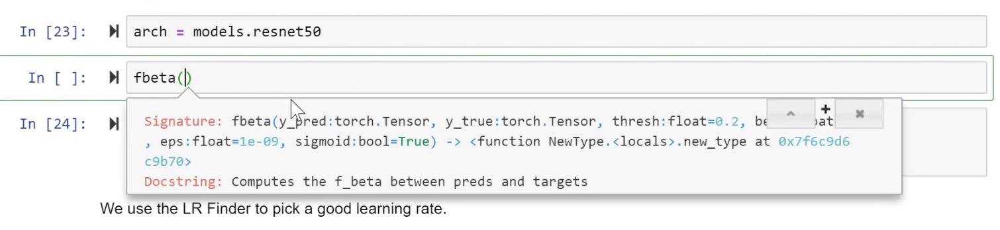

We have a metric called `fbeta`. In other words, it's F with 1, 2, or whatever depending on the value of beta. We can have a look at its signature and it has a threshold and a beta. The beta is 2 by default, and Kaggle said that they're going to use F 2 so I don't have to change that. But there's one other thing that I need to set which is a threshold.

What does that mean? Here's the thing. Do you remember we had a little look the other day at the source code for the accuracy metric? And we found that it used this thing called `argmax`. The reason for that was we had this input image that came in, it went through our model, and at the end it came out with a table of ten numbers. This is if we're doing MNIST digit recognition and the ten numbers were the probability of each of the possible digits. Then we had to look through all of those and find out which one was the biggest. So the function in Numpy, PyTorch, or just math notation that finds the biggest in returns its index is called `argmax`.

To get the accuracy for our pet detector, we use this accuracy function the called `argmax` to find out which class ID pet was the one that we're looking at. Then it compared that to the actual, and then took the average. That was the accuracy.


[37:23](https://youtu.be/PW2HKkzdkKY?t=2243)

We can't do that for satellite recognition because there isn't one label we're looking for﹣there's lots. A data bunch has a special attribute called `c` and `c` is going to be how many outputs do we want our model to create. For any kind of classifier, we want one probability for each possible class. In other words, `data.c` for classifiers is always going to be equal to the length of `data.classes`.

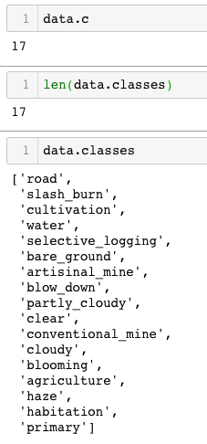

They are the 17 possibilities. So we're going to have one probability for each of those. But then we're not just going to pick out one of those 17, we're going to pick out *n* of those 17. So what we do is, we compare each probability to some threshold. Then we say anything that's higher than that threshold, we're going to assume that the models saying it does have that feature. So we can pick that threshold.

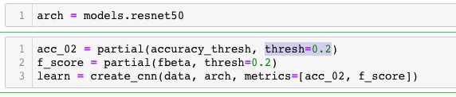

I found that for this particular dataset, a threshold of 0.2 seems to generally work pretty well. This is the kind of thing you can easily just experiment to find a good threshold. So I decided I want to print out the accuracy at a threshold of 0.2.

The normal accuracy function doesn't work that way. It doesn't `argmax`. We have to use a different accuracy function called `accuracy_thresh`. That's the one that's going to compare every probability to a threshold and return all the things higher than that threshold and compare accuracy that way.

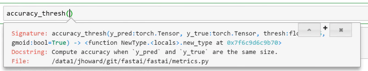


#### Python3 `partial` [[39:17](https://youtu.be/PW2HKkzdkKY?t=2357)]

One of the things we had passed in is `thresh`. Now of course our metric is going to be calling our function for us, so we don't get to tell it every time it calls back what threshold do we want, so we really want to create a special version of this function that always uses a threshold of 0.2. One way to do that would be defining a function `acc_02` as below:

```python
def acc_02(inp, targ): return accuracy_thresh(inp, targ, thresh=0.2)
```

We could do it that way. But it's so common that computer science has a term for that it's called a "partial" / "partial function application" (i.e. create a new function that's just like that other function but we are always going to call it with a particular parameter).

Python3 has something called `partial` that takes some function and some list of keywords and values, and creates a new function that is exactly the same as this function (`accurasy_thresh`) but is always going to call it with that keyword argument (`thresh=0.2`).

```python
acc_02 = partial(accuracy_thresh, thresh=0.2)
```

This is a really common thing to do particularly with the fastai library because there's lots of places where you have to pass in functions and you very often want to pass in a slightly customized version of a function so here's how you do it.

Similarly, `fbeta` with `thresh=0.2`:

```python
acc_02 = partial(accuracy_thresh, thresh=0.2)
f_score = partial(fbeta, thresh=0.2)
learn = create_cnn(data, arch, metrics=[acc_02, f_score])
```

I can pass them both in as metrics and I can then go ahead and do all the normal stuff.

```python
learn.lr_find()
```

```python
learn.recorder.plot()
```


Find the thing with the steepest slope ﹣so somewhere around 1e-2, make that our learning rate.

```python
lr = 0.01
```

Then fit for awhile with `5, slice(lr)` and see how we go.

```python
learn.fit_one_cycle(5, slice(lr))
```

```
Total time: 04:17
epoch  train_loss  valid_loss  accuracy_thresh  fbeta   
1      0.115247    0.103319    0.950703         0.910291  (00:52)
2      0.108289    0.099074    0.953239         0.911656  (00:50)
3      0.102342    0.092710    0.953348         0.917987  (00:51)
4      0.095571    0.085736    0.957258         0.926540  (00:51)
5      0.091275    0.085441    0.958006         0.926234  (00:51)
```

So we've got an accuracy of about 96% and F beta of about 0.926 and so you could then go and have a look at [Planet private leaderboard](https://www.kaggle.com/c/planet-understanding-the-amazon-from-space/leaderboard). The top 50th is about 0.93 so we kind of say like oh we're on the right track. So as you can see, once you get to a point that the data is there, there's very little extra to do most of the time.

**Question**: When your model makes an incorrect prediction in a deployed app, is there a good way to “record” that error and use that learning to improve the model in a more targeted way? [[42:01](https://youtu.be/PW2HKkzdkKY?t=2522)]

That's a great question. The first bit﹣is there a way to record that? Of course there is. You record it. That's up to you. Maybe some of you can try it this week. You need to have your user tell you that you were wrong. This Australian car you said it was a Holden and actually it's a Falcon. So first of all. you'll need to collect that feedback and the only way to do that is to ask the user to tell you when it's wrong. So you now need to record in some log somewhere﹣something saying you know this was the file, I've stored it here, this was the prediction I made, this was the actual that they told me. Then at the end of the day or at the end of the week, you could set up a little job to run something or you can manually run something. What are you going to do? You're going to do some fine-tuning. What does fine-tuning look like? Good segue Rachel! It looks like this.

So let's pretend here's your saved model:

```python
learn.save('stage-1-rn50')
```

Then we unfreeze:

```python
learn.unfreeze()
```

```python
learn.lr_find()
learn.recorder.plot()
```


Then we fit a little bit more. Now in this case, I'm fitting with my original dataset. But you could create a new data bunch with just the misclassified instances and go ahead and fit. The misclassified ones are likely to be particularly interesting. So you might want to fit at a slightly higher learning rate to make them really mean more or you might want to run them through a few more epochs. But it's exactly the same thing. You just call fit with your misclassified examples and passing in the correct classification. That should really help your model quite a lot.

There are various other tweaks you can do to this but that's the basic idea.

```python
learn.fit_one_cycle(5, slice(1e-5, lr/5))
```

```
Total time: 05:48
epoch  train_loss  valid_loss  accuracy_thresh  fbeta   
1      0.096917    0.089857    0.964909         0.923028  (01:09)
2      0.095722    0.087677    0.966341         0.924712  (01:09)
3      0.088859    0.085950    0.966813         0.926390  (01:09)
4      0.085320    0.083416    0.967663         0.927521  (01:09)
5      0.081530    0.082129    0.968121         0.928895  (01:09)
```

```python
learn.save('stage-2-rn50')
```


**Question**: Could someone talk a bit more about the data block ideology? I'm not quite sure how the blocks are meant to be used. Do they have to be in a certain order? Is there any other library that uses this type of programming that I could look at? [[44:01](https://youtu.be/PW2HKkzdkKY?t=2641)]

Yes, they do have to be in a certain order and it's basically the order that you see in [the example of use](https://docs.fast.ai/data_block.html#Examples-of-use).

```python
data = (ImageItemList.from_folder(path) #Where to find the data? -> in path and its subfolders
        .split_by_folder()              #How to split in train/valid? -> use the folders
        .label_from_folder()            #How to label? -> depending on the folder of the filenames
        .add_test_folder()              #Optionally add a test set (here default name is test)
        .transform(tfms, size=64)       #Data augmentation? -> use tfms with a size of 64
        .databunch())                   #Finally? -> use the defaults for conversion to ImageDataBunch
```

- What kind of data do you have?
- Where does it come from?
- How do you split it?
- How do you label it?
- What kind of datasets do you want?
- Optionally, how do I transform it?
- How do I create a data bunch from?

They're the steps. We invented this API. I don't know if other people have independently invented it. The basic idea of a pipeline of things that dot into each other is pretty common in a number of places﹣not so much in Python, but you see it more in JavaScript. Although this kind of approach of each stage produces something slightly different, you tend to see it more in like ETL software (extraction transformation and loading software) where this particular stages in a pipeline. It's been inspired by a bunch of things. But all you need to know is to use this example to guide you, and then look up the documentation to see which particular kind of thing you want. In this case, the `ImageItemList`, you're actually not going to find the documentation of `ImageItemList` in datablocks documentation because this is specific to the vision application. So to, then, go and actually find out how to do something for your particular application, you would then go to look at text, vision, and so forth. That's where you can find out what are the datablock API pieces available for that application.

Of course, you can then look at the source code if you've got some totally new application. You could create your own "part" of any of these stages. Pretty much all of these functions are very few lines of code. Maybe we could look an example of one. Let's try.

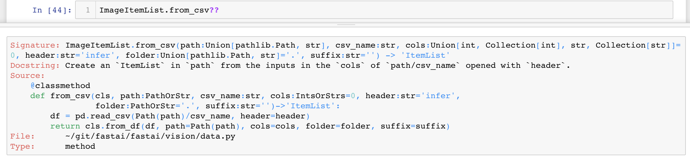

You can look at the documentation to see exactly what that does. As you can see, most fastai functions are no more than a few lines of code. They're normally pretty straightforward to see what are all the pieces there and how can you use them. It's probably one of these things that, as you play around with it, you'll get a good sense of how it all gets put together. But if during the week there are particular things where you're thinking I don't understand how to do this please let us know and we'll try to help you.

**Question**: What resources do you recommend for getting started with video? For example, being able to pull frames and submit them to your model. [[47:39](https://youtu.be/PW2HKkzdkKY?t=2859)]

The answer is it depends. If you're using the web which I guess probably most of you will be then there's there's web API's  that basically do that for you. So you can grab the frames with the web api and then they're just images which you can pass along. If you're doing a client side, i guess most people would tend to use OpenCV for that. But maybe during the week, people who are doing these video apps can tell us what have you used and found useful, and we can start to prepare something in the lesson wiki with a list of video resources since it sounds like some people are interested.


### How to choose good learning rates [[48:50](https://youtu.be/PW2HKkzdkKY?t=2930)]

One thing to notice here is that before we unfreeze you'll tend to get this shape pretty much all the time:


If you do your learning rate finder before you unfreeze. It's pretty easy ﹣ find the steepest slope, **not the bottom**. Remember, we're trying to find the bit where we can like slide down it quickly. So if you start at the bottom it's just gonna send you straight off to the end here.

Then we can call it again after you unfreeze, and you generally get a very different shape.


[49:24](https://youtu.be/PW2HKkzdkKY?t=2964)

This is a little bit harder to say what to look for because it tends to be this kind of shape where you get a little bit of upward and then it kind of very gradual downward and then up here. So I tend to kind of look for just before it shoots up and go back about 10x as a kind of a rule of thumb. So one 1e-5. That is what I do for the first half of my slice. And then for the second half of my slice, I normally do whatever learning rate are used for the the frozen part.  So lr which was 0.01 kind of divided by five or ten. Somewhere around that. That's my rule of thumb:

- look for the bit kind of at the bottom find about 10x smaller that's the number that I put as the first half of my slice
- `lr/5` or `lr/10`  is kind of what I put as the second half of my slice

This is called discriminative learning rates as the course continues.

### Making the model better [50:30](https://youtu.be/PW2HKkzdkKY?t=3030)

How am I going to get this better? We want to get into the top 10% which is going to be about 0.929 ish so we're not quite there (0.9288).

So here's the trick [[51:01](https://youtu.be/PW2HKkzdkKY?t=3061)]. When I created my dataset, I put `size=128` and actually the images that Kaggle gave us are 256. I used the size of 128 partially because I wanted to experiment quickly. It's much quicker and easier to use small images to experiment. But there's a second reason. I now have a model that's pretty good at recognizing the contents of 128 by 128 satellite images. So what am I going to do if I now want to create a model that's pretty good at 256 by 256 satellite images? Why don't I use transfer learning? Why don't I start with the model that's good at 128 by 128 images and fine-tune that? So don't start again. That's actually going to be really interesting because if I trained quite a lot and I'm on the verge of overfitting then I'm basically creating a whole new dataset effectively﹣one where my images are twice the size on each axis right so four times bigger. So it's really a totally different data set as far as my convolutional neural networks concerned. So I got to lose all that overfitting. I get to start again. Let's keep our same learner but use a new data bunch where the data bunch is 256 by 256. That's why I actually stopped here before I created my data sets:

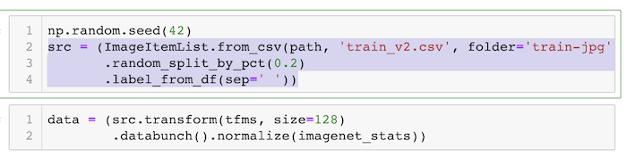

Because I'm going to now take this this data source (`src`) and I'm going to create a new data bunch with 256 instead so let's have a look at how we do that.


```python
data = (src.transform(tfms, size=256)
        .databunch().normalize(imagenet_stats))
```

So here it is. Take that source, transform it with the same transforms as before but this time use size 256. That should be better anyway because this is going to be higher resolution images. But also I'm going to start with this kind of pre-trained model (I haven't got rid of my learner it's the same learner I had before).

 I'm going to replace the data inside my learner with this new data bunch.

```python
learn.data = data
data.train_ds[0][0].shape
```
```
torch.Size([3, 256, 256])
```

```python
learn.freeze()
```

Then I will freeze again (i.e. I'm going back to just training the last few layers) and I will do a new `lr_find()`.

```python
learn.lr_find()
learn.recorder.plot()
```


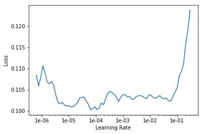

Because I actually now have a pretty good model (it's pretty good for 128 by 128 so it's probably gonna be like at least okay for 256 by 256), I don't get that same sharp shape that I did before. But I can certainly see where it's way too high. So I'm gonna pick something well before where it's way too high. Again maybe 10x smaller. So here I'm gonna go `1e-2/2` ﹣ that seems well before it shoots up.

```python
lr=1e-2/2
```

So let's fit a little bit more.

```python
learn.fit_one_cycle(5, slice(lr))
```

```
Total time: 14:21
epoch  train_loss  valid_loss  accuracy_thresh  fbeta   
1      0.088628    0.085883    0.966523         0.924035  (02:53)
2      0.089855    0.085019    0.967126         0.926822  (02:51)
3      0.083646    0.083374    0.967583         0.927510  (02:51)
4      0.084014    0.081384    0.968405         0.931110  (02:51)
5      0.083445    0.081085    0.968659         0.930647  (02:52)
```
We frozen again so we're just trading the last few layers and fit a little bit more. As you can see, I very quickly remember 0.928 was where we got to before after quite a few epochs. we're straight up there and suddenly we've passed 0.93. So we're now already into the top 10%. So we've hit our first goal. We're, at the very least, pretty confident at the problem of recognizing satellite imagery.
```python
learn.save('stage-1-256-rn50')
```

But of course now, we can do the same thing as before. We can unfreeze and train a little more.

```python3
learn.unfreeze()
```

Again using the same kind of approach I described before lr/5 on the right and even smaller one on the left.

```python3
learn.fit_one_cycle(5, slice(1e-5, lr/5))
```

```
Total time: 18:23
epoch  train_loss  valid_loss  accuracy_thresh  fbeta   
1      0.083591    0.082895    0.968310         0.928210  (03:41)
2      0.088286    0.083184    0.967424         0.928812  (03:40)
3      0.083495    0.083084    0.967998         0.929224  (03:40)
4      0.080143    0.081338    0.968564         0.931363  (03:40)
5      0.074927    0.080691    0.968819         0.931414  (03:41)
```

Train a little bit more. 0.9314 so that's actually pretty good﹣somewhere around top 25ish. Actually when my friend Brendan and I entered this competition we came 22nd with 0.9315 and we spent (this was a year or two ago) months trying to get here. So using pretty much defaults with the minor tweaks and one trick which is the resizing tweak you can get right up into the top of the leaderboard of this very challenging competition. Now I should say we don't really know where we'd be﹣we would actually have to check it on the test set that Kaggle gave us and actually submit to the competition which you can do. You can do a late submission. So later on in the course, we'll learn how to do that. But we certainly know we're doing very well so that's great news.

```python
learn.recorder.plot_losses()
```

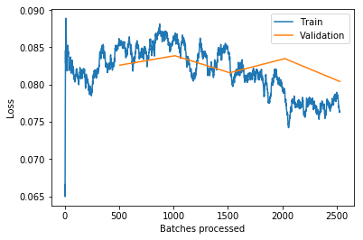

```python
learn.save('stage-2-256-rn50')
```

You can see as I kind of go along I tend to save things. You can name your models whatever you like but I just want to basically know you know is it before or after the unfreeze (stage 1 or 2), what size was I training on, what architecture was I training on. That way I could have always go back and experiment pretty easily. So that's planet. Multi label classification.
