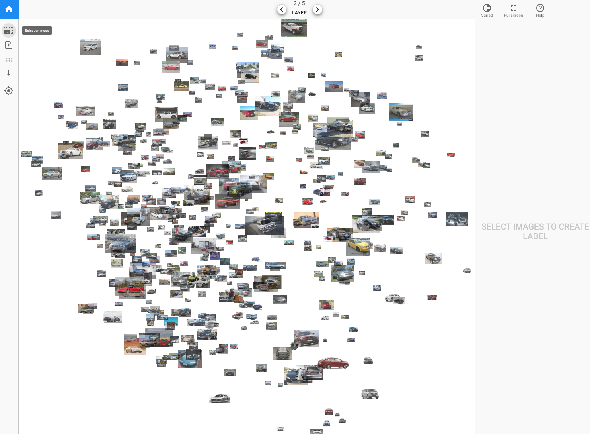

# CNNs section from lesson 6 on Platform.ai

### Platform.ai 

I want to start by showing you something that I'm really excited about and I've had a small hand and helping to to create. For those of you that saw [my talk on ted.com](https://www.ted.com/talks/jeremy_howard_the_wonderful_and_terrifying_implications_of_computers_that_can_learn/up-next?language=en), you might have noticed this really interesting demo that we did about four years ago showing a way to quickly build models with unlabeled data. It's been four years but we're finally at a point where we're ready to put this out in the world and let people use it. And the first people we're going to let use it are you folks.

So the company is called [platform.ai](https://platform.ai/) and the reason I'm mentioning it here is that it's going to let you create models on different types of datasets to what you can do now, that is to say datasets that you don't have labels for yet. We're actually going to help you label them. So this is the first time this has been shown before, so I'm pretty thrilled about it. Let me give you a quick demo.

If you'd go to platform.ai and choose "get started" you'll be able to create a new project. And if you create a new project you can either upload your own images. Uploading it at 500 or so works pretty well. You can upload a few thousand, but to start, upload 500 or so. They all have to be in a single folder. So we're assuming that you've got a whole bunch of images that you haven't got any labels for or you can start with one of the existing collections if you want to play around, so I've started with the cars collection kind of going back to what we did four years ago.

This is what happens when you first go into platform.ai and look at the collection of images you've uploaded - a random sample of them will appear on the screen. As you'll recognize, they are projected from a deep learning space into a 2D space using a pre-trained model. For this initial version, it's an ImageNet model we're using. As things move along, we'll be adding more and more pre train models. And what I'm going to do is I want to add labels to this data set representing which angle a photo of the car was taken from which is something that actually ImageNet is going to be really bad at because ImageNet has learnt to recognize the difference between cars versus bicycles and ImageNet knows that the angle you take a photo on actually doesn't matter. So we want to try and create labels using the kind of thing that actually ImageNet specifically learn to ignore. 

So the projection that you see, we can click these layer buttons at the top to switch to user projection using a different layer of the neural net. Here's the last layer which is going to be a total waste of time for us because it's really going to be projecting things based on what kind of thing it thinks it is. The first layer is probably going to be a waste of time for us as well because there's very little interesting semantic content there. But if I go into the middle, in layer 3, we may well be able to find some differences there.

Then what you can do is you can click on the projection button here (you can actually just press up and down rather than just pressing the the arrows at the top) to switch between projections or left and right so switch between layers. And what you can do is you can basically look around until you notice that there's a projection which is kind of separated out things you're interested in. So this one actually I notice that it's got a whole bunch of cars that are from the front right over here. So if we zoom in a little bit, we can double check - "yeah that looks pretty good, they're all kind of front right." So we can click on here to go to selection mode, and we can grab a few, and then you should check:

What we're doing here is we're trying to take advantage of the combination of human plus machine. The machine is pretty good at quickly doing calculations, but as a human I'm pretty good at looking at a lot of things at once and seeing the odd one out. So in this case I'm looking for cars that aren't front right, and so by laying them in front of me, I can do that really quickly. It's like "okay definitely that one" so just click on the ones that you don't want. All right, it's all good. 

Then you can just go back. Then what you can do is you can either put them into a new category by typing in "create a new label" or you can click on one of the existing ones. So before I came, I just created a few. So here's front right, so I just click on it here. 

The basic idea is that you keep flicking through different layers or projections to try and find groups that represent the things you're interested in, and then over time you'll start to realize that there are some things that are a little bit harder. For example, I'm having trouble finding sides, so what I can do is I can see over here there's a few sides, so I can zoom in here and click on a couple of them. Then I'll say "find similar" and this is going to basically look in that projection space and not just at the images that are currently displayed but all of the images that you uploaded, and hopefully I might be able to label a few more side images at that point. It's going through and checking  all of the images that you uploaded to see if any of them have projections in this space which are similar to the ones I've selected. Hopefully we'll find a few more of what I'm interested in.

Now if I want to try to find a projection that separates the sides from the front right, I can click on each of those two and then over here this button is now called "switch to the projection that maximizes the distance between the labels." What this is going to do is it's going to try and find the best projection that separates out those classes. The goal here is to help me visually inspect and quickly find a bunch of things that I can use to label. 

They're the kind of the the key features and it's done a good job. You can see down here, we've now got a whole bunch of sides which I can now grab because I was having a lot of trouble finding them before. And it's always worth double-checking. It's kind of interesting to see how the neural nets behave - like there seems to be more sports cars in this group than average as well. So it's kind of found side angles of sports cars, so that's kind of interesting. So I've got those, now I clicks "side" and there we go.

Once you've done that a few times, I find if you've got a hundred or so labels, you can then click on the train model button, and it'll take a couple of minutes, and come back and show you your train model. After it's trained, which I did it on a smaller number of labels earlier, you can then switch this vary opacity button, and it'll actually fade out the ones that are already predicted pretty well. It'll also give you a estimate as to how accurate it thinks the model is. The main reason I mentioned this for you is so that you can now click the download button and it'll download the predictions, which is what we hope will be interesting to most people. But what I think will be interesting to you as deep learning students is it'll download your labels. So now you can use that labeled subset of data along with the unlabeled set that you haven't labeled yet to see if you can build a better model than platform.ai has done for you. See if you can use that initial set of data to get going, creating models which you weren't able to label before.

Clearly, there are some things that this system is better at than others. For things that require really zooming in closely and taking a very very close inspection, this isn't going to work very well. This is really designed for things that the human eye can kind of pick up fairly readily. But we'd love to get feedback as well, and you can click on the Help button to give feedback. Also there's a [platform.ai discussion topic](https://forums.fast.ai/t/platform-ai-discussion/31445) in our forum. So Arshak if you can stand up, Arshak is the CEO of the company. He'll be there helping out answering questions and so forth. I hope people find that useful. It's been many years getting to this point, and I'm glad we're finally there.