# GANs based on abbreviated Lesson 7


### Image restoration [[48:31](https://youtu.be/nWpdkZE2_cc?t=2911)]

The next task I want to look at is image restoration. Image restoration refers to starting with an image and this time we're not going to create a segmentation mask but we're going to try and create a better image. There's lots of kind of versions of better - there could be different image. The kind of things we can do with this kind of image generation would be:

- take a low res image make it high res
- take a black-and-white image make a color
- take an image where something's being cut out of it and trying to replace the cutout thing
- take a photo and try and turn it into what looks like a line drawing
- take a photo and try and talk like it look like a Monet painting

These are all examples of image to image generation tasks which you'll know how to do after this part class.

So in our case, we're going to try to do image restoration which is going to start with low resolution, poor quality JPEGs, with writing written over the top of them, and get them to replace them with high resolution, good quality pictures in which the text has been removed.

#### Back to image restoration [[52:01](https://youtu.be/nWpdkZE2_cc?t=3121)]

[lesson7-superres-gan.ipynb](https://github.com/fastai/course-v3/blob/master/nbs/dl1/lesson7-superres-gan.ipynb)

In order to create something which can turn crappy images into nice images, we needed dataset containing nice versions of images and crappy versions of the same images. The easiest way to do that is to start with some nice images and "crappify" them.

```python
from PIL import Image, ImageDraw, ImageFont
```

```python
def crappify(fn,i):
    dest = path_lr/fn.relative_to(path_hr)
    dest.parent.mkdir(parents=True, exist_ok=True)
    img = PIL.Image.open(fn)
    targ_sz = resize_to(img, 96, use_min=True)
    img = img.resize(targ_sz, resample=PIL.Image.BILINEAR).convert('RGB')
    w,h = img.size
    q = random.randint(10,70)
    ImageDraw.Draw(img).text((random.randint(0,w//2),random.randint(0,h//2)), str(q), fill=(255,255,255))
    img.save(dest, quality=q)
```

The way to crappify them is to create a function called crappify which contains your crappification logic. My crappification logic, you can pick your own, is that:

- I open up my nice image
- I resize it to be really small 96 by 96 pixels with bilinear interpolation
- I then pick a random number between 10 and 70
- I draw that number into my image at some random location
- Then I save that image with a JPEG quality of that random number.

A JPEG quality of 10 is like absolute rubbish, a JPEG a quality of 70 is not bad at all. So I end up with high quality images and low quality images that look something like these:

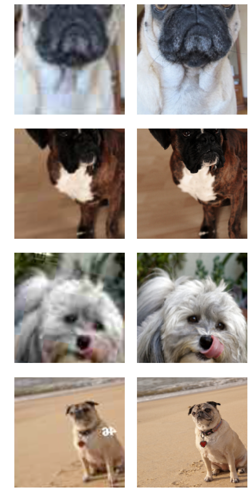

You can see this one (bottom row) there's the number, and this is after transformation so that's why it's been flipped and you won't always see the number because we're zooming into them, so a lot of the time, the number is cropped out.

It's trying to figure out how to take this incredibly JPEG artifactory thing with text written over the top, and turn it into this (image on the right). I'm using the Oxford pets data set again. The same one we used in lesson one. So there's nothing more high quality than pictures of dogs and cats, I think we can all agree with that.

#### `parallel` [[53:48](https://youtu.be/nWpdkZE2_cc?t=3228)]

The crappification process can take a while, but fast.ai has a function called `parallel`. If you pass `parallel` a function name and a list of things to run that function on, it will run that function on them all in parallel. So this actually can run pretty quickly.

```python
il = ImageItemList.from_folder(path_hr)
parallel(crappify, il.items)
```

The way you write this `crappify` function is where you get to do all the interesting stuff in this assignment. Try and think of an interesting crappification which does something that you want to do. So if you want to colorize black-and-white images, you would replace it with black-and-white. If you want something which can take large cutout blocks of image and replace them with kind of hallucinatin image, add a big black box to these. If you want something which can take old families photos scans that have been like folded up and have crinkles in, try and find a way of adding dust prints and crinkles and so forth.

Anything that you don't include in `crappify`, your model won't learn to fix. Because every time it sees that in your photos, the input and output will be the same. So it won't consider that to be something worthy of fixing.

[[55:09](https://youtu.be/nWpdkZE2_cc?t=3309)]

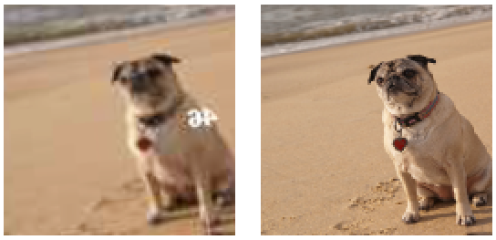

We now want to create a model which can take an input photo that looks like that (left) and output something that looks like that (right). So obviously, what we want to do is use U-Net because we already know that U-Net can do exactly that kind of thing, and we just need to pass the U-Net that data.

```python
arch = models.resnet34
src = ImageImageList.from_folder(path_lr).random_split_by_pct(0.1, seed=42)
```

```python
def get_data(bs,size):
    data = (src.label_from_func(lambda x: path_hr/x.name)
           .transform(get_transforms(max_zoom=2.), size=size, tfm_y=True)
           .databunch(bs=bs).normalize(imagenet_stats, do_y=True))

    data.c = 3
    return data
```

```python
data_gen = get_data(bs,size)
```

Our data is just literally the file names from each of those two folders, do some transforms, data bunch, normalize. We'll use ImageNet stats because we're going to use a pre-trained model. Why are we using a pre-trained model? Because if you're going to get rid of this 46, you need to know what probably was there, and to know what probably was there you need to know what this is a picture of. Otherwise, how can you possibly know what it ought to look like. So let's use a pre-trained model that knows about these kinds of things.

```python
wd = 1e-3
```

```python
y_range = (-3.,3.)
```

```python
loss_gen = MSELossFlat()
```

```python
def create_gen_learner():
    return unet_learner(data_gen, arch, wd=wd, blur=True, norm_type=NormType.Weight,
                         self_attention=True, y_range=y_range, loss_func=loss_gen)
```

```python
learn_gen = create_gen_learner()
```

So we created our U-Net with that data, the architecture is ResNet 34. These three things (`blur`, `norm_type`, `self_attention`) are important and interesting and useful, but I'm going to leave them to part 2. For now, you should always include them when you use U-Net for this kind of problem.

This whole thing, I'm calling a "generator". It's going to generate. This is generative modeling. There's not a really formal definition, but it's basically something where the thing we're outputting is like a real object, in this case an image - it's not just a number. So we're going to create a generator learner which is this U-Net learner, and then we can fit. We're using MSE loss, so in other words what's the mean squared error between the actual pixel value that it should be in the pixel value that we predicted. MSE loss normally expects two vectors. In our case, we have two images so we have a version called MSE loss flat which simply flattens out those images into a big long vector. There's never any reason not to use this, even if you do have a vector, it works fine, if you don't have a vector, it'll also work fine.

```python
learn_gen.fit_one_cycle(2, pct_start=0.8)
```

Total time: 01:35

| epoch | train_loss | valid_loss |
| ----- | ---------- | ---------- |
| 1     | 0.061653   | 0.053493   |
| 2     | 0.051248   | 0.047272   |

We're already down to 0.05 mean squared error on the pixel values which is not bad after 1 minute 35. Like all things in fast.ai pretty much, because we're doing transfer learning by default when you create this, it'll freeze the the pre-trained part. And the pre-trained part of a U-Net is the downsampling part. That's where the ResNet is.

```python
learn_gen.unfreeze()
```

```python
learn_gen.fit_one_cycle(3, slice(1e-6,1e-3))
```

Total time: 02:24

| epoch | train_loss | valid_loss |
| ----- | ---------- | ---------- |
| 1     | 0.050429   | 0.046088   |
| 2     | 0.049056   | 0.043954   |
| 3     | 0.045437   | 0.043146   |

```python
learn_gen.show_results(rows=4)
```

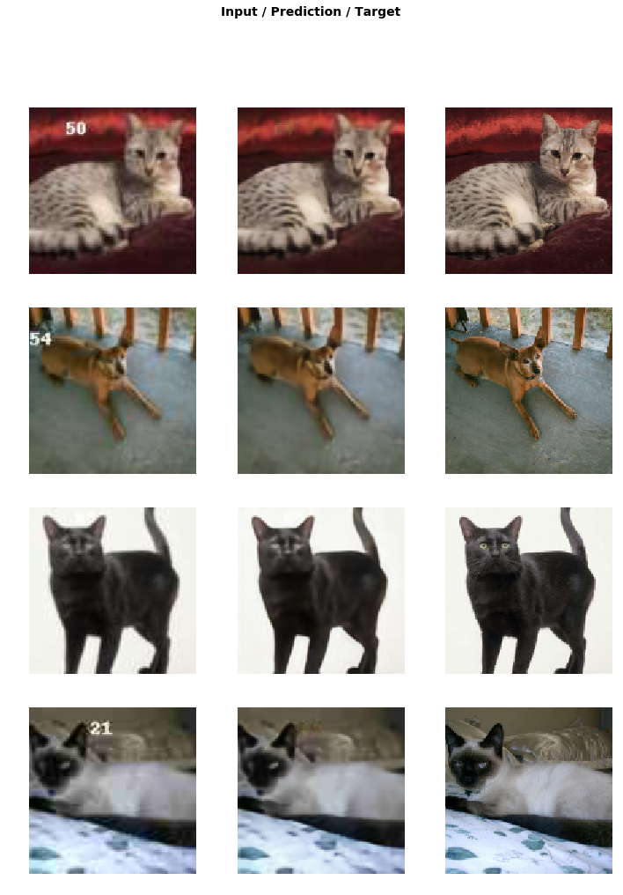

Let's unfreeze that and train a little more and look at that! With four minutes of training, we've got something which is basically doing a perfect job of removing numbers. It's certainly not doing a good job of upsampling, but it's definitely doing a nice job. Sometimes when it removes a number, it maybe leaves a little bit of JPEG artifact. But it's certainly doing something pretty useful. So if all we wanted to do was kind of watermark removal, we would be finished.

We're not finished because we actually want this thing (middle) to look more like this thing (right). So how are we going to do that? The reason that we're not making as much progress with that as we'd like is that our loss function doesn't really describe what we want. Because actually, the mean squared error between the pixels of this (middle) and this (right) is actually very small. If you actually think about it, most of the pixels are very nearly the right color. But we're missing the texture of the pillow, and we're missing the eyeballs entirely pretty much. We're missing the texture of the fur. So we want some lost function that does a better job than pixel mean squared error loss of saying like is this a good quality picture of this thing.

### Generative Adversarial Network [[59:23](https://youtu.be/nWpdkZE2_cc?t=3563)]

There's a fairly general way of answering that question, and it's something called a Generative adversarial network or GAN. A GAN tries to solve this problem by using a loss function which actually calls another model. Let me describe it to you.

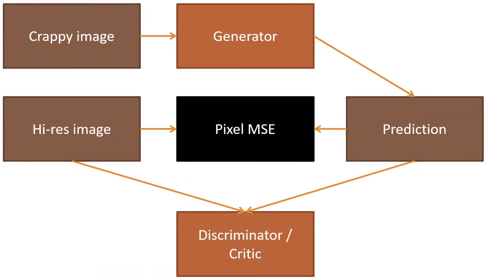

We've got our crappy image, and we've already created a generator. It's not a great one, but it's not terrible and that's creating predictions (like the middle picture). We have a high-res image (like the right picture) and we can compare the high-res image to the prediction with pixel MSE.

We could also train another model which we would variously call either the discriminator or the critic - they both mean the same thing. I'll call it a critic. We could try and build a binary classification model that takes all the pairs of the generated image and the real high-res image, and learn to classify which is which. So look at some picture and say "hey, what do you think? Is that a high-res cat or is that a generated cat? How about this one? Is that a high-res cat or a generated cat?" So just a regular standard binary cross-entropy classifier. We know how to do that already. If we had one of those, we could fine tune the generator and rather than using pixel MSE is the loss, the loss could be <u>how good are we at fooling the critic?</u> Can we create generated images that the critic thinks are real?

That would be a very good plan, because if it can do that, if the loss function is "am I fooling the critic?"  then it's going to learn to create images which the critic can't tell whether they're real or fake. So we could do that for a while, train a few batches. But the critic isn't that great. The reason the critic isn't that great is because it wasn't that hard. These images are really crappy, so it's really easy to tell the difference. So after we train the generator a little bit more using that critic as the loss function, the generators going to get really good at falling the critic. So now we're going to stop training the generator, and we'll train the critic some more on these newly generated images. Now that the generator is better, it's now a tougher task for the critic to decide which is real and which is fake. So we'll train that a little bit more. Then once we've done that and the critic is now pretty good at recognizing the difference between the better generated images and the originals, we'll go back and we'll fine tune the generator some more using the better discriminator (i.e. the better critic) as the loss function.

So we'll just go ping pong ping pong, backwards and forwards. That's a GAN. That's our version of GAN. I don't know if anybody's written this before, we've created a new version of GAN which is kind of a lot like the original GANs but we have this neat trick where we pre-train the generator and we pre-train the critic. GANs have been kind of in the news a lot. They're pretty fashionable tool, and if you've seen them, you may have heard that they're a real pain to train. But it turns out we realized that really most of the pain of training them was at the start. If you don't have a pre-trained generator and you don't have a pre-trained critic, then it's basically the blind leading the blind. The generator is trying to generate something which fools a critic, but the critic doesn't know anything at all, so it's basically got nothing to do. Then the critic is trying to decide whether the generated images are real or not, and that's really obvious so that just does it. So they don't go anywhere for ages. Then once they finally start picking up steam, they go along pretty quickly,

If you can find a way to generate things without using a GAN like mean squared pixel loss, and discriminate things without using a GAN like predict on that first generator, you can make a lot of progress.

#### Creating a critic/discriminator [[1:04:04](https://youtu.be/nWpdkZE2_cc?t=3844)]

Let's create the critic. To create just a totally standard fast.ai binary classification model, we need two folders; one folder containing high-res images, one folder containing generated images. We already have the folder with high-res images, so we just have to save our generated images.

```python
name_gen = 'image_gen'
path_gen = path/name_gen
```

```python
# shutil.rmtree(path_gen)
```

```python
path_gen.mkdir(exist_ok=True)
```

```python
def save_preds(dl):
    i=0
    names = dl.dataset.items
    for b in dl:
        preds = learn_gen.pred_batch(batch=b, reconstruct=True)
        for o in preds:
            o.save(path_gen/names[i].name)
            i += 1
```

```python
save_preds(data_gen.fix_dl)
```

Here's a teeny tiny bit of code that does that. We're going to create a directory called `image_gen`, pop it into a variable called `path_gen`. We got a little function called `save_preds` which takes a data loader. We're going to grab all of the file names. Because remember that in an item list, `.items` contains the file names if it's an image item list. So here's the file names in that data loader's dataset. Now let's go through each batch of the data loader, and let's grab a batch of predictions for that batch, and then `reconstruct=True` means it's actually going to create fast.ai image objects for each thing in the batch. Then we'll go through each of those predictions and save them. The name we'll save it with is the name of the original file, but we're going to pop it into our new directory.

That's it. That's how you save predictions. So you can see, I'm increasingly not just using stuff that's already in the fast.ai library, but try to show you how to write stuff yourself. And generally it doesn't require heaps of code to do that. So if you come back for part 2, lots of part 2 are like here's how you use things inside the library, and of course, here's how we wrote the library. So increasingly, writing our own code.

Okay, so save those predictions and let's just do a `PIL.Image.open` on the first one, and yep there it is. So there's an example of the generated image.

```python
PIL.Image.open(path_gen.ls()[0])
```

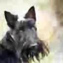


Now I can train a critic in the usual way. It's really annoying to have to restart Jupyter notebook to reclaim GPU memory. One easy way to handle this is if you just set something that you knew was using a lot of GPU to `None` like this learner, and then just go `gc.collect`, that tells Python to do memory garbage collection, and after that you'll generally be fine. You'll be able to use all of your GPU memory again.

```python
learn_gen=None
gc.collect()
```

If you're using `nvidia-smi` to actually look at your GPU memory, you won't see it clear because PyTorch still has a kind of allocated cache, but it makes it available. So you should find this is how you can avoid restarting your notebook.

```python
def get_crit_data(classes, bs, size):
    src = ImageItemList.from_folder(path, include=classes).random_split_by_pct(0.1, seed=42)
    ll = src.label_from_folder(classes=classes)
    data = (ll.transform(get_transforms(max_zoom=2.), size=size)
           .databunch(bs=bs).normalize(imagenet_stats))
    data.c = 3
    return data
```

We're going to create our critic. It's just an image item list from folder in the totally usual way, and the classes will be the `image_gen` and `images`. We will do a random split because we want to know how well we're doing with the critic to have a validation set. We just label it from folder in the usual way, add some transforms, data bunch, normalized. So we've got a totally standard classifier. Here's what some of it looks like:

```python
data_crit = get_crit_data([name_gen, 'images'], bs=bs, size=size)
```

```python
data_crit.show_batch(rows=3, ds_type=DatasetType.Train, imgsize=3)
```

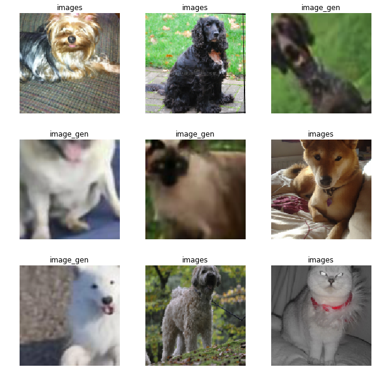

Here's one from the real images, real images, generated images, generated images, ... So it's got to try and figure out which class is which.

```python
loss_critic = AdaptiveLoss(nn.BCEWithLogitsLoss())
```

We're going to use binary cross entropy as usual. However, we're not going to use a ResNet here. The reason, we'll get into in more detail in part 2, but basically when you're doing a GAN, you need to be particularly careful that the generator and the critic can't both push in the same direction and increase the weights out of control. So we have to use something called spectral normalization to make GANs work nowadays. We'll learned about that in part 2.

```python
def create_critic_learner(data, metrics):
    return Learner(data, gan_critic(), metrics=metrics, loss_func=loss_critic, wd=wd)
```

```python
learn_critic = create_critic_learner(data_crit, accuracy_thresh_expand)
```

Anyway, if you say `gan_critic`, fast.ai will give you a binary classifier suitable for GANs. I strongly suspect we probably can use a ResNet here. We just have to create a pre trained ResNet with spectral norm. Hope to do that pretty soon. We'll see how we go, but as of now, this is kind of the best approach is this thing called `gan_critic`. A GAN critic uses a slightly different way of averaging the different parts of the image when it does the loss, so anytime you're doing a GAN at the moment, you have to wrap your loss function with `AdaptiveLoss`. Again, we'll look at the details in part 2. For now, just know this is what you have to do and it'll work.

Other than that slightly odd loss function and that slightly odd architecture, everything else is the same. We can call that (`create_critic_learner` function) to create our critic. Because we have this slightly different architecture and slightly different loss function, we did a slightly different metric. This is the equivalent GAN version of accuracy for critics. Then we can train it and you can see it's 98% accurate at recognizing that kind of crappy thing from that kind of nice thing. But of course we don't see the numbers here anymore. Because these are the generated images, the generator already knows how to get rid of those numbers that are written on top.

```python
learn_critic.fit_one_cycle(6, 1e-3)
```

Total time: 09:40

| epoch | train_loss | valid_loss | accuracy_thresh_expand |
| ----- | ---------- | ---------- | ---------------------- |
| 1     | 0.678256   | 0.687312   | 0.531083               |
| 2     | 0.434768   | 0.366180   | 0.851823               |
| 3     | 0.186435   | 0.128874   | 0.955214               |
| 4     | 0.120681   | 0.072901   | 0.980228               |
| 5     | 0.099568   | 0.107304   | 0.962564               |
| 6     | 0.071958   | 0.078094   | 0.976239               |

#### Finishing up GAN [[1:09:52](https://youtu.be/nWpdkZE2_cc?t=4192)]

```python
learn_crit=None
learn_gen=None
gc.collect()
```

```python
data_crit = get_crit_data(['crappy', 'images'], bs=bs, size=size)
```

```python
learn_crit = create_critic_learner(data_crit, metrics=None).load('critic-pre2')
```

```python
learn_gen = create_gen_learner().load('gen-pre2')
```

Let's finish up this GAN. Now that we have pre-trained the generator and pre-trained the critic, we now need to get it to kind of ping pong between training a little bit of each. The amount of time you spend on each of those things and the learning rates you use is still a little bit on the fuzzy side, so we've created a `GANLearner` for you which you just pass in your generator and your critic (which we've just simply loaded here from the ones we just trained) and it will go ahead and when you go `learn.fit`, it will do that for you - it'll figure out how much time to train generator and then when to switch to training the discriminator/critic and it'll go backward and forward.

```python
switcher = partial(AdaptiveGANSwitcher, critic_thresh=0.65)
learn = GANLearner.from_learners(learn_gen, learn_crit, weights_gen=(1.,50.), show_img=False, switcher=switcher,
                                 opt_func=partial(optim.Adam, betas=(0.,0.99)), wd=wd)
learn.callback_fns.append(partial(GANDiscriminativeLR, mult_lr=5.))
```

[[1:10:43](https://youtu.be/nWpdkZE2_cc?t=4243)]

 These weights here (`weights_gen=(1.,50.)`) is that, what we actually do is we don't only use the critic as the loss function. If we only use the critic as the loss function, the GAN could get very good at creating pictures that look like real pictures, but they actually have nothing to do with the original photo at all. So we actually add together the pixel loss and the critic loss. Those two losses on different scales, so we multiplied the pixel loss by something between about 50 and about 200 - something in that range generally works pretty well.

Something else with GANs. **GANs hate momentum** when you're training them. It kind of doesn't make sense to train them with momentum because you keep switching between generator and critic, so it's kind of tough. Maybe there are ways to use momentum, but I'm not sure anybody's figured it out. So this number here (`betas=(0.,...)`) when you create an Adam optimizer is where the momentum goes, so you should set that to zero.

Anyways, if you're doing GANs, use these hyper parameters:

```python
GANLearner.from_learners(learn_gen, learn_crit, weights_gen=(1.,50.), show_img=False,
                         switcher=switcher, opt_func=partial(optim.Adam, betas=(0.,0.99)),
                         wd=wd)
```

 It should work. That's what GAN learner does. Then you can go fit, and it trains for a while.

```python
lr = 1e-4
```

```python
learn.fit(40,lr)
```

Total time: 1:05:41

| epoch | train_loss | gen_loss | disc_loss |
| ----- | ---------- | -------- | --------- |
| 1     | 2.071352   | 2.025429 | 4.047686  |
| 2     | 1.996251   | 1.850199 | 3.652173  |
| 3     | 2.001999   | 2.035176 | 3.612669  |
| 4     | 1.921844   | 1.931835 | 3.600355  |
| 5     | 1.987216   | 1.961323 | 3.606629  |
| 6     | 2.022372   | 2.102732 | 3.609494  |
| 7     | 1.900056   | 2.059208 | 3.581742  |
| 8     | 1.942305   | 1.965547 | 3.538015  |
| 9     | 1.954079   | 2.006257 | 3.593008  |
| 10    | 1.984677   | 1.771790 | 3.617556  |
| 11    | 2.040979   | 2.079904 | 3.575464  |
| 12    | 2.009052   | 1.739175 | 3.626755  |
| 13    | 2.014115   | 1.204614 | 3.582353  |
| 14    | 2.042148   | 1.747239 | 3.608723  |
| 15    | 2.113957   | 1.831483 | 3.684338  |
| 16    | 1.979398   | 1.923163 | 3.600483  |
| 17    | 1.996756   | 1.760739 | 3.635300  |
| 18    | 1.976695   | 1.982629 | 3.575843  |
| 19    | 2.088960   | 1.822936 | 3.617471  |
| 20    | 1.949941   | 1.996513 | 3.594223  |
| 21    | 2.079416   | 1.918284 | 3.588732  |
| 22    | 2.055047   | 1.869254 | 3.602390  |
| 23    | 1.860164   | 1.917518 | 3.557776  |
| 24    | 1.945440   | 2.033273 | 3.535242  |
| 25    | 2.026493   | 1.804196 | 3.558001  |
| 26    | 1.875208   | 1.797288 | 3.511697  |
| 27    | 1.972286   | 1.798044 | 3.570746  |
| 28    | 1.950635   | 1.951106 | 3.525849  |
| 29    | 2.013820   | 1.937439 | 3.592216  |
| 30    | 1.959477   | 1.959566 | 3.561970  |
| 31    | 2.012466   | 2.110288 | 3.539897  |
| 32    | 1.982466   | 1.905378 | 3.559940  |
| 33    | 1.957023   | 2.207354 | 3.540873  |
| 34    | 2.049188   | 1.942845 | 3.638360  |
| 35    | 1.913136   | 1.891638 | 3.581291  |
| 36    | 2.037127   | 1.808180 | 3.572567  |
| 37    | 2.006383   | 2.048738 | 3.553226  |
| 38    | 2.000312   | 1.657985 | 3.594805  |
| 39    | 1.973937   | 1.891186 | 3.533843  |
| 40    | 2.002513   | 1.853988 | 3.554688  |

One of the tough things about GANs is that these loss numbers, they're meaningless. You can't expect them to go down because as the generator gets better, it gets harder for the discriminator (i.e. the critic) and then as the critic gets better, it's harder for the generator. So the numbers should stay about the same.So that's one of the tough things about training GANs is it's hard to know how are they doing. The only way to know how are they doing is to actually take a look at the results from time to time. If you put `show_img=True` here:

```python
GANLearner.from_learners(learn_gen, learn_crit, weights_gen=(1.,50.), show_img=False,
                         switcher=switcher, opt_func=partial(optim.Adam, betas=(0.,0.99)),
                         wd=wd)
```

It'll actually print out a sample after every epoch. I haven't put that in the notebook because it makes it too big for the repo, but you can try that. So I've just put the results at the bottom, and here it is.

```python
learn.show_results(rows=16)
```

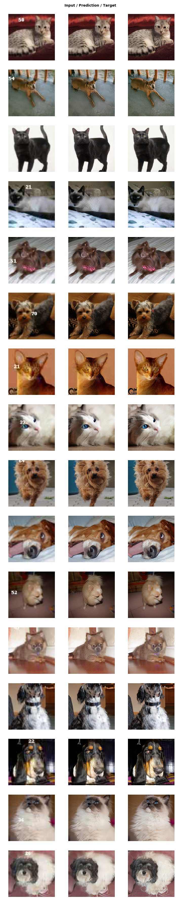

Pretty beautiful, I would say. We already knew how to get rid of the numbers, but we now don't really have that kind of artifact of where it used to be, and it's definitely sharpening up this little kitty cat quite nicely. It's not great always. There's some weird kind of noise going on here. Certainly a lot better than the horrible original. This is a tough job to turn that into that. But there are some really obvious problems. Like here (the third row), these things ought to be eyeballs and they're not. So why aren't they? Well, our critic doesn't know anything about eyeballs. Even if it did, it wouldn't know that eyeballs are particularly important. We care about eyes. When we see a cat without eyes, it's a lot less cute. I mean I'm more of a dog person, but you know. It just doesn't know that this is a feature that matters. Particularly because the critic, remember, is not a pre-trained network. So I kind of suspect that if we replace the critic with a pre-trained network that's been pre-trained on ImageNet but is also compatible with GANs, it might do a better job here. But it's definitely a shortcoming of this approach. After the break I will show you how to find the cat's eye balls.

**Question**: For what kind of problems, do you not want to use U-Net? [[1:14:48](https://youtu.be/nWpdkZE2_cc?t=4488)]

U-Nets are for when the the size of your output is similar to the size of your input and kind of aligned with it. There's no point having cross connections if that level of spatial resolution in the output isn't necessary or useful. So yeah, any kind of generative modeling and segmentation is kind of generative modeling. It's generating a picture which is a mask of the original objects. So probably anything where you want that kind of resolution of the output to be at the same kind of fidelity as a resolution of the input. Obviously something like a classifier makes no sense. In a classifier, you just want the downsampling path because at the end you just want a single number which is like is it a dog, or a cat, or what kind of pet is it or whatever.

### Wasserstein GAN [[1:15:59](https://youtu.be/nWpdkZE2_cc?t=4559)]

Just before we leave GANs, I just mention there's another notebook you might be interested in looking at which is [lesson7-wgan.ipynb](https://github.com/fastai/course-v3/blob/master/nbs/dl1/lesson7-wgan.ipynb). When GANs started a few years ago, people generally use them to create images out of thin air which I personally don't think is a particularly useful or interesting thing to do. But it's a good research exercise, I guess. So we implemented this [WGAN paper](https://arxiv.org/abs/1701.07875) which was kind of really the first one to do a somewhat adequate job somewhat easily. You can see how to do that with the fast.ai library.

It's kind of interesting because the the dataset that we use is this LSUN bedrooms dataset which we've provided in our URLs which just has bedrooms, lots and lots and lots of bedrooms. The approach we use in this case is to just say "can we create a bedroom?" So what we actually do is that the input to the generator isn't an image that we clean up. We actually feed to the generator random noise. Then the generator's task is "can you turn random noise into something which the critic can't tell the difference between that output and a real bedroom?" We're not doing any pre-training here or any of the stuff that makes this fast and easy, so this is a very traditional approach. But you can see, you still just go `GANLearner` and there's actually a `wgan` version which is this older style approach. But you just pass in the data, the generator, and the critic in the usual way and you call `fit`.

You'll see (in this case, we have a `show_image` on) after a epoch one, it's not creating great bedrooms or two or three. And you can really see that in the early days of these kinds of GANs, it doesn't do a great job of anything. But eventually, after a couple of hours of training, it's producing somewhat like bedroom-ish things. Anyway, it's a notebook you can have a play with, and it's a bit of fun.

### Feature Loss [[1:18:37](https://youtu.be/nWpdkZE2_cc?t=4717)]

I was very excited when we got fast.ai to the point in the last week or so that we had GAN's working in a way where API wise, they're far more concise and more flexible than any other library that exists. But also kind of disappointed with them. They take a long time to train and the outputs are still like so-so, and so the next step was "can we get rid of GANs entirely?" Obviously, the thing we really want to do is come up with a better loss function. We want a loss function that does a good job of saying this is a high-quality image without having to go all the GAN trouble, and preferably it also doesn't just say it's a high-quality image but it's an image which actually looks like the thing is meant to. So the real trick here comes back to this paper from a couple of years ago, [Perceptual Losses for Real-Time Style Transfer and Super-Resolution](https://arxiv.org/abs/1603.08155) - Justin Johnson et al. created this thing they call perceptual losses. It's a nice paper, but I hate this term because they're nothing particularly perceptual about them. I would call them "feature losses", so in the fast.ai library, you'll see this referred to as feature losses.
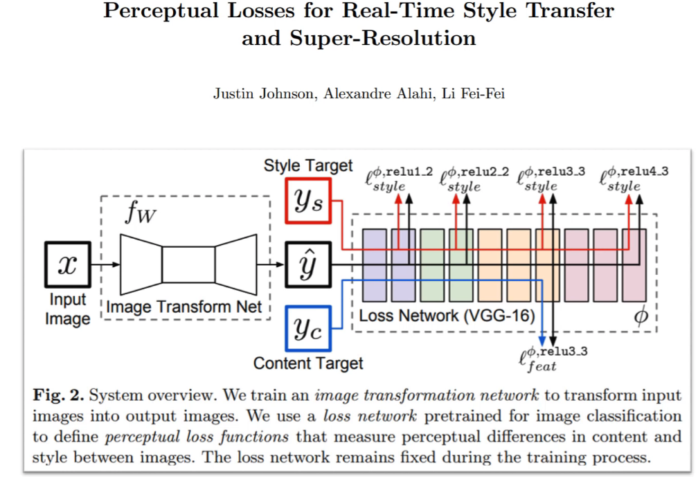

It shares something with GANs which is that after we go through our generator which they call the "image transform net" and you can see it's got this kind of U-Net shaped thing. They didn't actually use U-Nets because at the time this came out, nobody in the machine learning world knew about U-Nets. Nowadays, of course, we use U-Nets. But anyway, something U-Net-ish.

In these kind of architectures where you have a downsampling path followed by an upsampling path, the downsampling path is very often called the **encoder** as you saw in our code. And the upsampling path is very often called the **decoder**. In generative models, generally including generative text models, neural translation, stuff like that, they tend to be called the encoder and the decoder - two pieces.

Anyway, so we have this generator and we want a loss function that says "is the thing that it's created like the thing that we want?" and so the way they do that is they take the prediction, remember,  is what we normally use for a prediction from a model. We take the prediction and we put it through a pre-trained ImageNet network. At the time that this came out, the pre-trained ImageNet network they were using was VGG. It's kind of old now, but people still tend to use it because it works fine for this process. So they take the prediction, and they put it through VGG - the pre-trained ImageNet network. It doesn't matter too much which one it is.

So normally, the output of that would tell you "hey, is this generated thing a dog, a cat, an airplane, or a fire engine or whatever?"  But in the process of getting to that final classification, it goes through lots of different layers. In this case, they've color-coded all the layers with the same grid size and the feature map with the same color. So every time we switch colors, we're switching grid size. So there's a stride 2 conv or in VGG's case they still used to use some maxpooling layers which is a similar idea.

What we could do is say let's not take the final output of the VGG model on this generated image, but let's take something in the middle. Let's take the activations of some layer in the middle. Those activations, it might be a feature map of like 256 channels by 28 by 28. So those kind of 28 by 28 grid cells will kind of roughly semantically say things like "in this part of that 28 by 28 grid, is there something that looks kind of furry? Or is there something that looks kind of shiny? Or is there something that was kind of circular? Is there something that kind of looks like an eyeball?"

So what we do is that we then take the target (i.e. the actual  value) and we put it through the same pre-trained VGG network, and we pull out the activations of the same layer. Then we do a mean square error comparison. So it'll say "in the real image, grid cell (1, 1) of that 28 by 28 feature map is furry and blue and round shaped. And in the generated image, it's furry and blue and not round shape." So it's an okay match.

That ought to go a long way towards fixing our eyeball problem, because in this case, the feature map is going to say "there's eyeballs here (in the target), but there isn't here (in the generated version), so do a better job of that please. Make better eyeballs." So that's the idea. That's what we call feature losses or Johnson et al. called perceptual losses.

To do that, we're going to use the [lesson7-superres.ipynb](https://github.com/fastai/course-v3/blob/master/nbs/dl1/lesson7-superres.ipynb), and this time the task we're going to do is kind of the same as the previous task, but I wrote this notebook a little bit before the GAN notebook - before I came up with the idea of like putting text on it and having a random JPEG quality, so the JPEG quality is always 60, there's no text written on top, and it's 96 by 96. And before I realized what a great word "crappify" is, so it's called `resize_one`.

```python
import fastai
from fastai.vision import *
from fastai.callbacks import *

from torchvision.models import vgg16_bn
```

```python
path = untar_data(URLs.PETS)
path_hr = path/'images'
path_lr = path/'small-96'
path_mr = path/'small-256'
```

```python
il = ImageItemList.from_folder(path_hr)
```

```python
def resize_one(fn,i):
    dest = path_lr/fn.relative_to(path_hr)
    dest.parent.mkdir(parents=True, exist_ok=True)
    img = PIL.Image.open(fn)
    targ_sz = resize_to(img, 96, use_min=True)
    img = img.resize(targ_sz, resample=PIL.Image.BILINEAR).convert('RGB')
    img.save(dest, quality=60)
```

```python
# to create smaller images, uncomment the next line when you run this the first time
# parallel(resize_one, il.items)
```

```python
bs,size=32,128
arch = models.resnet34

src = ImageImageList.from_folder(path_lr).random_split_by_pct(0.1, seed=42)
```

```python
def get_data(bs,size):
    data = (src.label_from_func(lambda x: path_hr/x.name)
           .transform(get_transforms(max_zoom=2.), size=size, tfm_y=True)
           .databunch(bs=bs).normalize(imagenet_stats, do_y=True))

    data.c = 3
    return data
```

```python
data = get_data(bs,size)
```

```python
data.show_batch(ds_type=DatasetType.Valid, rows=2, figsize=(9,9))
```

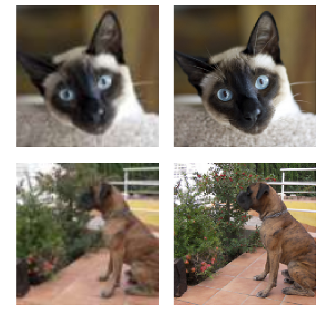

Here's our crappy images and our original images - kind of a similar task to what we had before. I'm going to try and create a loss function which does this (perceptual loss). The first thing I do is I define a base loss function which is basically like "how am I going to compare the pixels and the features?" And the choice is mainly like MSE or L1. It doesn't matter too much which you choose. I tend to like L1 better than MSE actually, so I picked L1.

```python
t = data.valid_ds[0][1].data
t = torch.stack([t,t])
```

```python
def gram_matrix(x):
    n,c,h,w = x.size()
    x = x.view(n, c, -1)
    return (x @ x.transpose(1,2))/(c*h*w)
```

```python
gram_matrix(t)
```

```
tensor([[[0.0759, 0.0711, 0.0643],
         [0.0711, 0.0672, 0.0614],
         [0.0643, 0.0614, 0.0573]],

        [[0.0759, 0.0711, 0.0643],
         [0.0711, 0.0672, 0.0614],
         [0.0643, 0.0614, 0.0573]]])
```

```python
base_loss = F.l1_loss
```

So anytime you see `base_loss`, we mean L1 loss. You could use MSE loss as well.

```python
vgg_m = vgg16_bn(True).features.cuda().eval()
requires_grad(vgg_m, False)
```

Let's create a VGG model - just using the pre-trained model. In VGG, there's a attribute called  `.features` which contains the convolutional part of the model. So `vgg16_bn(True).features` is the convolutional part of the VGG model. Because we don't need the head. We only want the intermediate activations.

Then we'll check that on the GPU, we'll put it into `eval` mode because we're not training it. And we'll turn off `requires_grad` because we don't want to update the weights of this model. We're just using it for inference (i.e. for the loss).

```python
blocks = [i-1 for i,o in enumerate(children(vgg_m)) if isinstance(o,nn.MaxPool2d)]
blocks, [vgg_m[i] for i in blocks]
```

```
([5, 12, 22, 32, 42],
 [ReLU(inplace), ReLU(inplace), ReLU(inplace), ReLU(inplace), ReLU(inplace)])
```

Then let's enumerate through all the children of that model and find all of the max pooling layers, because in the VGG model that's where the grid size changes. And as you could see from this picture, we want to grab features from every time just before the grid size changes:

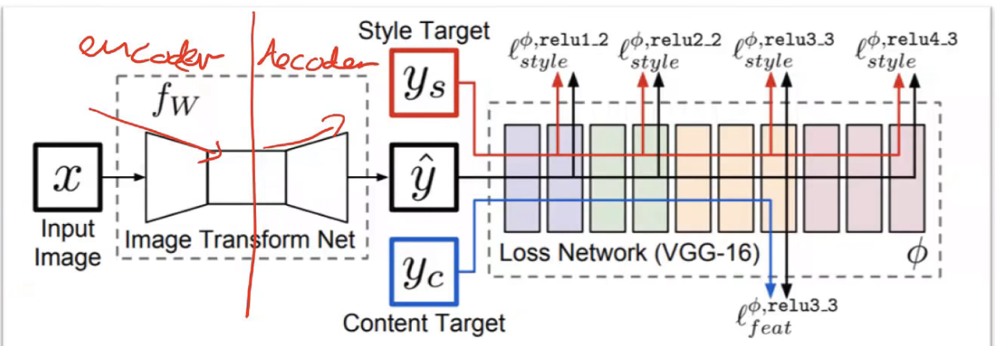

So we grab layer `i-1`. That's the layer before it changes. So there's our list of layer numbers just before the max pooling layers (`[5, 12, 22, 32, 42]`). All of those are ReLU's, not surprisingly. Those are where we want to grab some features from, and so we put that in `blocks` - it's just a list of ID's.

```python
class FeatureLoss(nn.Module):
    def __init__(self, m_feat, layer_ids, layer_wgts):
        super().__init__()
        self.m_feat = m_feat
        self.loss_features = [self.m_feat[i] for i in layer_ids]
        self.hooks = hook_outputs(self.loss_features, detach=False)
        self.wgts = layer_wgts
        self.metric_names = ['pixel',] + [f'feat_{i}' for i in range(len(layer_ids))
              ] + [f'gram_{i}' for i in range(len(layer_ids))]

    def make_features(self, x, clone=False):
        self.m_feat(x)
        return [(o.clone() if clone else o) for o in self.hooks.stored]

    def forward(self, input, target):
        out_feat = self.make_features(target, clone=True)
        in_feat = self.make_features(input)
        self.feat_losses = [base_loss(input,target)]
        self.feat_losses += [base_loss(f_in, f_out)*w
                             for f_in, f_out, w in zip(in_feat, out_feat, self.wgts)]
        self.feat_losses += [base_loss(gram_matrix(f_in), gram_matrix(f_out))*w**2 * 5e3
                             for f_in, f_out, w in zip(in_feat, out_feat, self.wgts)]
        self.metrics = dict(zip(self.metric_names, self.feat_losses))
        return sum(self.feat_losses)

    def __del__(self): self.hooks.remove()
```

Here's our feature loss class which is going to implement this idea (perceptual loss).

```python
feat_loss = FeatureLoss(vgg_m, blocks[2:5], [5,15,2])
```

Basically, when we call the feature loss class, we're going to pass it some pre-trained model which is going to be called `m_feat`. That's the model which contains the features which we want our feature loss on. So we can go ahead and grab all of the layers from that network that we want the features for to create the losses.

We're going to need to hook all of those outputs because that's how we grab intermediate layers in PyTorch is by hooking them. So `self.hook` is going to contain our our hooked outputs.

Now in the `forward` of feature loss, we're going to call `make_features` passing in the `target` (i.e. our actual ) which is just going to call that VGG model and go through all of the stored activations and just grab a copy of them. We're going to do that both for the target (`out_feat`)  and for the input - so that's the output of the generator (`in_feat`). Now let's calculate the L1 loss between the pixels, because we still want the pixel loss a little bit. Then let's also go through all of those layers' features and get the L1 loss on them. So we're basically going through every one of these end of each block and grabbing the activations and getting the L1 on each one.

That's going to end up in this list called `feat_losses`, then sum them all up. By the way, the reason I do it as a list is because we've got this nice little callback that if you put them into thing called `.metrics` in your loss function, it'll print out all of the separate layer loss amounts for you which is super handy.

So that's it. That's our perceptual loss or feature loss class.

```python
wd = 1e-3
learn = unet_learner(data, arch, wd=wd, loss_func=feat_loss, callback_fns=LossMetrics,
                     blur=True, norm_type=NormType.Weight)
gc.collect();
```

Now we can just go ahead and train a U-Net in the usual way with our data and pre-trained architecture which is a ResNet 34, passing in our loss function which is using our pre trained VGG model. This (`callback_fns`) is that callback I mentioned LossMetrics which is going to print out all the different layers losses for us. These are two things (`blur` and `norm_type`) that we'll learn about in part 2 of the course, but you should use them.

```python
learn.lr_find()
learn.recorder.plot()
```

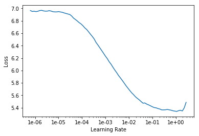

```python
lr = 1e-3
```

```python
def do_fit(save_name, lrs=slice(lr), pct_start=0.9):
    learn.fit_one_cycle(10, lrs, pct_start=pct_start)
    learn.save(save_name)
    learn.show_results(rows=1, imgsize=5)
```

I just created a little function called `do_fit` that does fit one cycle, and then saves the model, and then shows the results.

```python
do_fit('1a', slice(lr*10))
```

Total time: 11:16

| epoch | train_loss | valid_loss | pixel    | feat_0   | feat_1   | feat_2   | gram_0   | gram_1   | gram_2   |
| ----- | ---------- | ---------- | -------- | -------- | -------- | -------- | -------- | -------- | -------- |
| 1     | 3.873667   | 3.759143   | 0.144560 | 0.229806 | 0.314573 | 0.226204 | 0.552578 | 1.201812 | 1.089610 |
| 2     | 3.756051   | 3.650393   | 0.145068 | 0.228509 | 0.308807 | 0.218000 | 0.534508 | 1.164112 | 1.051389 |
| 3     | 3.688726   | 3.628370   | 0.157359 | 0.226753 | 0.304955 | 0.215417 | 0.522482 | 1.157941 | 1.043464 |
| 4     | 3.628276   | 3.524132   | 0.145285 | 0.225455 | 0.300169 | 0.211110 | 0.497361 | 1.124274 | 1.020478 |
| 5     | 3.586930   | 3.422895   | 0.145161 | 0.224946 | 0.294471 | 0.205117 | 0.472445 | 1.089540 | 0.991215 |
| 6     | 3.528042   | 3.394804   | 0.142262 | 0.220709 | 0.289961 | 0.201980 | 0.478097 | 1.083557 | 0.978238 |
| 7     | 3.522416   | 3.361185   | 0.139654 | 0.220379 | 0.288046 | 0.200114 | 0.471151 | 1.069787 | 0.972054 |
| 8     | 3.469142   | 3.338554   | 0.142112 | 0.219271 | 0.287442 | 0.199255 | 0.462878 | 1.059909 | 0.967688 |
| 9     | 3.418641   | 3.318710   | 0.146493 | 0.219915 | 0.284979 | 0.197340 | 0.455503 | 1.055662 | 0.958817 |
| 10    | 3.356641   | 3.187186   | 0.135588 | 0.215685 | 0.277398 | 0.189562 | 0.432491 | 1.018626 | 0.917836 |


As per usual, because we're using a pre-trained network in our U-Net, we start with frozen layers for the downsampling path, train for a while. As you can see, we get not only the loss, but also the pixel loss and the loss at each of our feature layers, and then also something we'll learn about in part 2 called Gram loss which I don't think anybody's used for super resolution before as far as I know. But as you'll see, it turns out great.

That's eight minutes, so much faster than a GAN, and already, as you can see this is our model's output, pretty good. Then we unfreeze and train some more.

```python
learn.unfreeze()
```

```python
do_fit('1b', slice(1e-5,lr))
```

Total time: 11:39

| epoch | train_loss | valid_loss | pixel    | feat_0   | feat_1   | feat_2   | gram_0   | gram_1   | gram_2   |
| ----- | ---------- | ---------- | -------- | -------- | -------- | -------- | -------- | -------- | -------- |
| 1     | 3.303951   | 3.179916   | 0.135630 | 0.216009 | 0.277359 | 0.189097 | 0.430012 | 1.016279 | 0.915531 |
| 2     | 3.308164   | 3.174482   | 0.135740 | 0.215970 | 0.277178 | 0.188737 | 0.428630 | 1.015094 | 0.913132 |
| 3     | 3.294504   | 3.169184   | 0.135216 | 0.215401 | 0.276744 | 0.188395 | 0.428544 | 1.013393 | 0.911491 |
| 4     | 3.282376   | 3.160698   | 0.134830 | 0.215049 | 0.275767 | 0.187716 | 0.427314 | 1.010877 | 0.909144 |
| 5     | 3.301212   | 3.168623   | 0.135134 | 0.215388 | 0.276196 | 0.188382 | 0.427277 | 1.013294 | 0.912951 |
| 6     | 3.299340   | 3.159537   | 0.135039 | 0.214692 | 0.275285 | 0.187554 | 0.427840 | 1.011199 | 0.907929 |
| 7     | 3.291041   | 3.159207   | 0.134602 | 0.214618 | 0.275053 | 0.187660 | 0.428083 | 1.011112 | 0.908080 |
| 8     | 3.285271   | 3.147745   | 0.134923 | 0.214514 | 0.274702 | 0.187147 | 0.423032 | 1.007289 | 0.906138 |
| 9     | 3.279353   | 3.138624   | 0.136035 | 0.213191 | 0.273899 | 0.186854 | 0.420070 | 1.002823 | 0.905753 |
| 10    | 3.261495   | 3.124737   | 0.135016 | 0.213681 | 0.273402 | 0.185922 | 0.416460 | 0.999504 | 0.900752 |

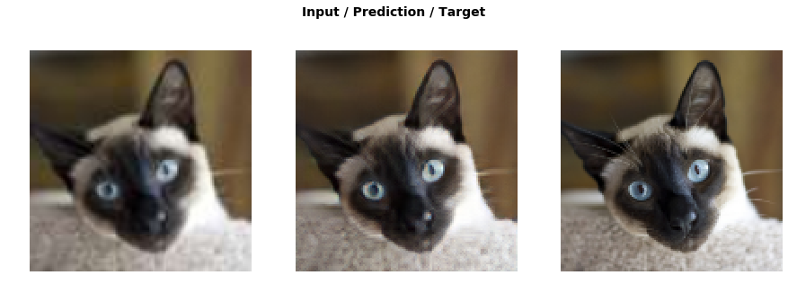

And it's a little bit better. Then let's switch up to double the size. So we need to also halve the batch size to avoid running out of GPU memory, and freeze again, and train some more.

```python
data = get_data(12,size*2)
```

```python
learn.data = data
learn.freeze()
gc.collect()
```

```python
learn.load('1b');
```

```pythoon
do_fit('2a')
```

Total time: 43:44

| epoch | train_loss | valid_loss | pixel    | feat_0   | feat_1   | feat_2   | gram_0   | gram_1   | gram_2   |
| ----- | ---------- | ---------- | -------- | -------- | -------- | -------- | -------- | -------- | -------- |
| 1     | 2.249253   | 2.214517   | 0.164514 | 0.260366 | 0.294164 | 0.155227 | 0.385168 | 0.579109 | 0.375967 |
| 2     | 2.205854   | 2.194439   | 0.165290 | 0.260485 | 0.293195 | 0.154746 | 0.374004 | 0.573164 | 0.373555 |
| 3     | 2.184805   | 2.165699   | 0.165945 | 0.260999 | 0.291515 | 0.153438 | 0.361207 | 0.562997 | 0.369598 |
| 4     | 2.145655   | 2.159977   | 0.167295 | 0.260605 | 0.290226 | 0.152415 | 0.359476 | 0.563301 | 0.366659 |
| 5     | 2.141847   | 2.134954   | 0.168590 | 0.260219 | 0.288206 | 0.151237 | 0.348900 | 0.554701 | 0.363101 |
| 6     | 2.145108   | 2.128984   | 0.164906 | 0.259023 | 0.286386 | 0.150245 | 0.352594 | 0.555004 | 0.360826 |
| 7     | 2.115003   | 2.125632   | 0.169696 | 0.259949 | 0.286435 | 0.150898 | 0.344849 | 0.552517 | 0.361287 |
| 8     | 2.109859   | 2.111335   | 0.166503 | 0.258512 | 0.283750 | 0.148191 | 0.347635 | 0.549907 | 0.356835 |
| 9     | 2.092685   | 2.097898   | 0.169842 | 0.259169 | 0.284757 | 0.148156 | 0.333462 | 0.546337 | 0.356175 |
| 10    | 2.061421   | 2.080940   | 0.167636 | 0.257998 | 0.282682 | 0.147471 | 0.330893 | 0.540319 | 0.353941 |

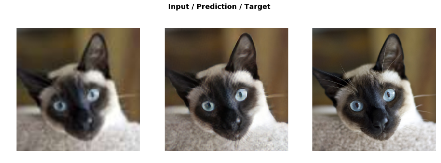

It's now taking half an hour, (the result is) even better. Then unfreeze and train some more.

```python
learn.unfreeze()
```

```python
do_fit('2b', slice(1e-6,1e-4), pct_start=0.3)
```

Total time: 45:19

| epoch | train_loss | valid_loss | pixel    | feat_0   | feat_1   | feat_2   | gram_0   | gram_1   | gram_2   |
| ----- | ---------- | ---------- | -------- | -------- | -------- | -------- | -------- | -------- | -------- |
| 1     | 2.061799   | 2.078714   | 0.167578 | 0.257674 | 0.282523 | 0.147208 | 0.330824 | 0.539797 | 0.353109 |
| 2     | 2.063589   | 2.077507   | 0.167022 | 0.257501 | 0.282275 | 0.146879 | 0.331494 | 0.539560 | 0.352776 |
| 3     | 2.057191   | 2.074605   | 0.167656 | 0.257041 | 0.282204 | 0.146925 | 0.330117 | 0.538417 | 0.352247 |
| 4     | 2.050781   | 2.073395   | 0.166610 | 0.256625 | 0.281680 | 0.146585 | 0.331580 | 0.538651 | 0.351665 |
| 5     | 2.054705   | 2.068747   | 0.167527 | 0.257295 | 0.281612 | 0.146392 | 0.327932 | 0.536814 | 0.351174 |
| 6     | 2.052745   | 2.067573   | 0.167166 | 0.256741 | 0.281354 | 0.146101 | 0.328510 | 0.537147 | 0.350554 |
| 7     | 2.051863   | 2.067076   | 0.167222 | 0.257276 | 0.281607 | 0.146188 | 0.327575 | 0.536701 | 0.350506 |
| 8     | 2.046788   | 2.064326   | 0.167110 | 0.257002 | 0.281313 | 0.146055 | 0.326947 | 0.535760 | 0.350139 |
| 9     | 2.054460   | 2.065581   | 0.167222 | 0.257077 | 0.281246 | 0.146016 | 0.327586 | 0.536377 | 0.350057 |
| 10    | 2.052605   | 2.064459   | 0.166879 | 0.256835 | 0.281252 | 0.146135 | 0.327505 | 0.535734 | 0.350118 |


All in all, we've done about an hour and twenty minutes of training and look at that! It's done it. It knows that eyes are important so it's really made an effort. It knows that fur is important so it's really made an effort. It started with something with JPEG artifacts around the ears and all this mess and eyes that are just kind of vague light blue things, and it really created a lot of texture. This cat is clearly looking over the top of one of those little clawing frames covered in fuzz, so it actually recognized that this thing is probably a carpeting materials. It's created a carpeting material for us. So I mean, that's just remarkable.

Talking for markable, I've mean I've never seen outputs like this before without a GAN so I was just so excited when we were able to generate this and so quickly - one GPU, an hour and a half. If you create your own crappification functions and train this model, you'll' build stuff that nobody's built before. Because nobody else that I know of is doing it this way. So there are huge opportunities, I think. So check this out.

#### Medium Resolution [[1:31:45](https://youtu.be/nWpdkZE2_cc?t=5505)]

What we can now do is we can now, instead of starting with our low res, I actually stored another set at size 256 which are called medium res, so let's see what happens if we up size a medium res

```python
data_mr = (ImageImageList.from_folder(path_mr).random_split_by_pct(0.1, seed=42)
          .label_from_func(lambda x: path_hr/x.name)
          .transform(get_transforms(), size=(1280,1600), tfm_y=True)
          .databunch(bs=1).normalize(imagenet_stats, do_y=True))
data_mr.c = 3
```

```
learn.data = data_mr
```

```
fn = data_mr.valid_ds.x.items[0]; fn
```

```
PosixPath('/data1/jhoward/git/course-v3/nbs/dl1/data/oxford-iiit-pet/small-256/Siamese_178.jpg')
```

```
img = open_image(fn); img.shape
```

```
torch.Size([3, 256, 320])
```

```
p,img_hr,b = learn.predict(img)
```

```
show_image(img, figsize=(18,15), interpolation='nearest');
```

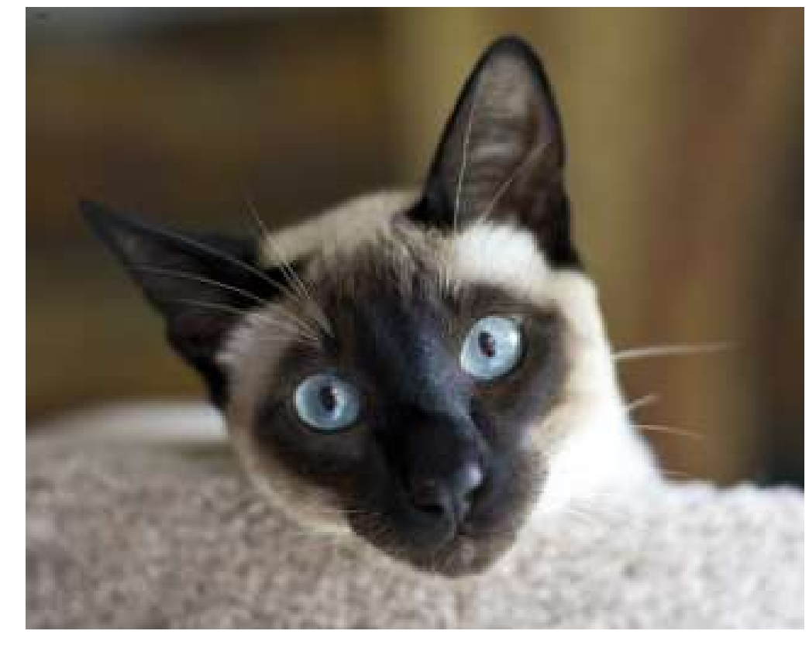

We're going to grab our medium res data, and here is our medium res stored photo. Can we improve this? You can see, there's still a lot of room for improvement. The lashes here are very pixelated. The place where there should be hair here is just kind of fuzzy. So watch this area as I hit down on my keyboard:

```python
Image(img_hr).show(figsize=(18,15))
```

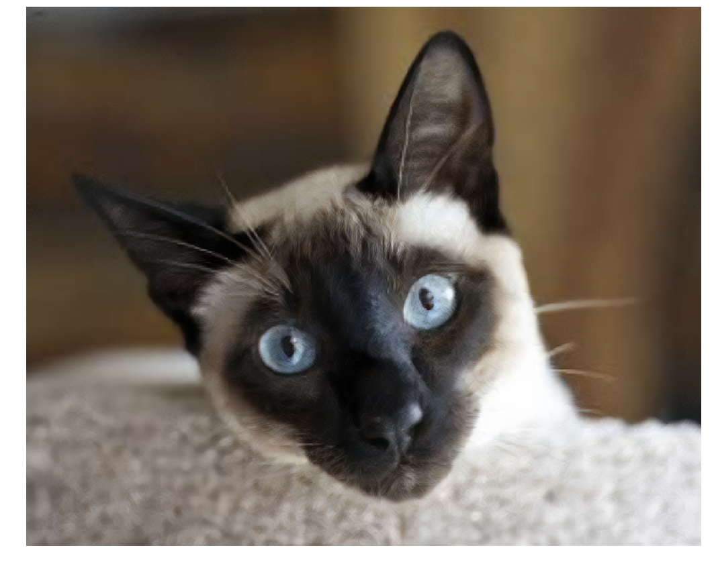

Look at that. It's done it. It's taken a medium res image and it's made a totally clear thing here. The furs reappeared. But look at the eyeball. Let's go back. The eyeball here (the before) is just kind of a general blue thing, here (the after) it's added all the right texture. So I just think this is super exciting. Here's a model I trained in an hour and a half using standard stuff that you've all learnt about a U-Net, a pre trained model, feature loss function and we've got something which can turn that medium res into that high res, or this absolute mess into this. It's really exciting to think what could you do with that.

One of the inspirations here has been Jason Antic. Jason was a student in the course last year, and what he did very sensibly was decided to focus basically nearly quit his job and work four days a week or really six days a week on studying deep learning, and as you should do, he created a kind of capstone project. His project was to combine GANs and feature losses together. And his crappification approach was to take color pictures and make them black and white. So he took the whole of ImageNet, created a black and white ImageNet, and then trained a model to re-colorize it. He's put this up as [DeOldify](https://github.com/jantic/DeOldify) and now he's got these actual old photos from the 19th century that he's turning into color.


What this is doing is incredible. Look at this. The model thought "oh that's probably some kind of copper kettle, so I'll make it copper colored" and "oh these pictures are on the wall, they're probably like different colors to the wall" and "maybe that looks a bit like a mirror, maybe it would be reflecting stuff outside." "These things might be vegetables, vegetables are often red. Let's make them red." It's extraordinary what it's done. And you could totally do this too. You can take our feature loss and our GAN loss and combine them. So I'm very grateful to Jason because he's helped us build this lesson, and it has been really nice because we've been able to help him too because he hadn't realized that he can use all this pre-training and stuff. So hopefully you'll see DeOldify in a couple of weeks be even better at the deoldification. But hopefully you all can now add other kinds of decrappification methods as well.

I like every course if possible to show something totally new, because then every student has the chance to basically build things that have never been built before. So this is kind of that thing. But between the much better segmentation results and these much simpler and faster decrappification results, i think you can build some really cool stuff.

**Question**: Is it possible to use similar ideas to U-Net and GANs for NLP? For example if I want to tag the verbs and nouns in a sentence or create a really good Shakespeare generator [[1:35:54](https://youtu.be/nWpdkZE2_cc?t=5754)]

Yeah, pretty much. We don't fully know yet. It's a pretty new area, but there's a lot of opportunities there. And we'll be looking at some in a moment actually.

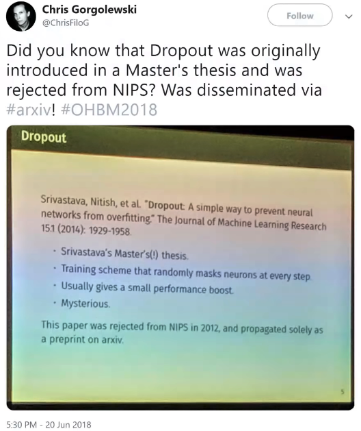

I actually tried testing this on this. Remember this picture I showed you of a slide last lesson, and it's a really rubbishy looking picture. And I thought, what would happen if we tried running this just through the exact same model. And it changed it from that (left) to that (right) so I thought that was a really good example. You can see something it didn't do which is this weird discoloration. It didn't fix it because I didn't crappify things with weird discoloration. So if you want to create really good image restoration like I say you need really good crappification.

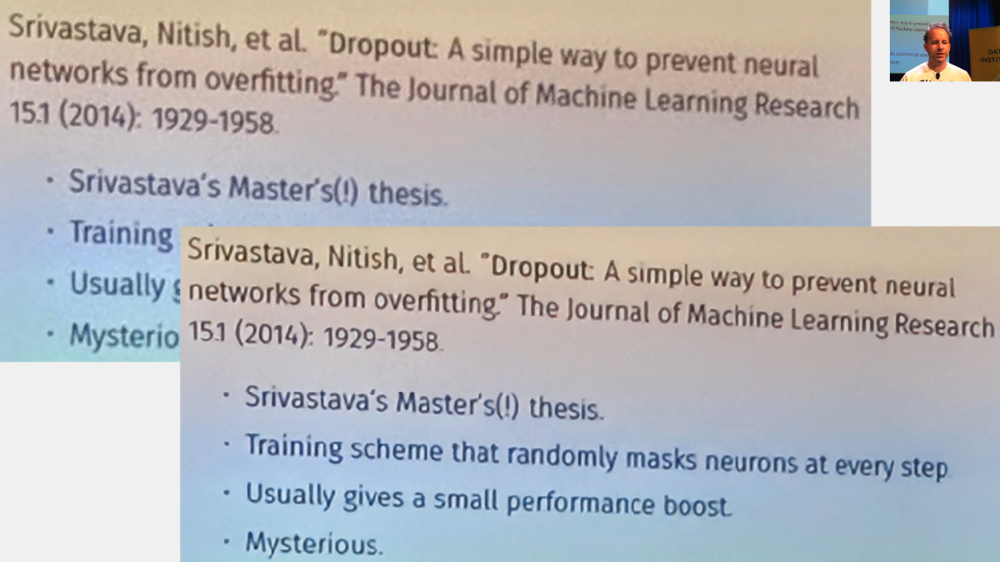

## What we learned in the class so far [[1:36:59](https://youtu.be/nWpdkZE2_cc?t=5819)]

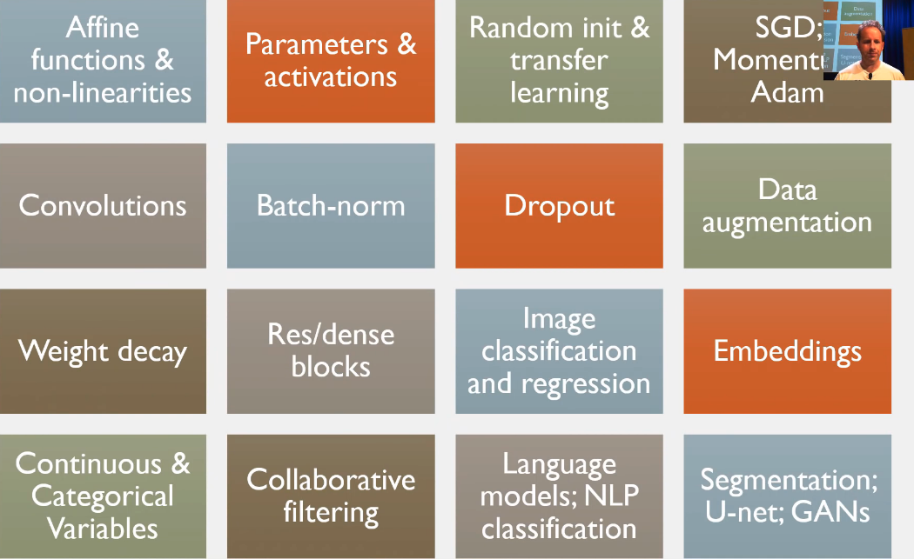

Here's some of the main things we've learned so far in the course. We've learned that neural nets consist of sandwich layers of affine functions (which are basically matrix multiplications, slightly more general version) and nonlinearities like ReLU. And we learnt that the results of those calculations are called activations, and the things that go into those calculations we learned are called parameters. The parameters are initially randomly initialized or we copy them over from a pre-trained model, and then we train them with SGD or faster versions. We learnt that convolutions are a particular affine function that work great for auto correlated data, so things like images and stuff. We learnt about batch norm, dropout, data augmentation, and weight decay as ways of regularizing models. Also batch norm helps train models more quickly.

Then today, we've learned about Res/Dense blocks. We ovbiously learnt a lot about image classification and regression, embeddings, categorical and continuous variables, collaborative filtering, language models, and NLP classification. Then segmentation, U-Net and GANs.

So go over these things and make sure that you feel comfortable with each of them. If you've only watched this series once, you definitely won't. People normally watch it three times or so to really understand the detail.
