# Collaborative learning models based on abbreviated Lesson 4

[Video](https://youtu.be/C9UdVPE3ynA) / [Lesson Forum](https://forums.fast.ai/t/lesson-4-official-resources-and-updates/30317)

Welcome to Lesson 4! We are going to finish our journey through these key applications. We've already looked at a range of vision applications. We've looked a classification, localization, image regression. We briefly touched on NLP. We're going to do a deeper dive into NLP transfer learning today. We're going to then look at tabular data and  collaborative filtering which are both super useful applications.

Then we're going to take a complete u-turn. We're going to take that collaborative filtering example and dive deeply into it to understand exactly what's happening mathematically﹣exactly what's happening in the computer. And we're going to use that to gradually go back in reverse order through the applications again in order to understand exactly what's going on behind the scenes of all of those applications.

### Collaborative Filtering [[53:08](https://youtu.be/C9UdVPE3ynA?t=3188)]

Collaborative filtering is where you have information about who bought what, or who liked what﹣ it's basically something where you have something like a user, a reviewer, or whatever and information about what they've bought, what they've written about, or what they reviewed. So in the most basic version of collaborative filtering, you just have two columns: something like user ID and movie ID and that just says this user bought that movie. So for example, Amazon has a really big list of user IDs and product IDs like what did you buy. Then you can add additional information to that table such as oh, they left a review, what review did they give it? So it's now like user ID, movie ID, number of stars. You could add a timecode so  this user bought this product at this time and gave it this review. But they are all basically the same structure.  

There are two ways you could draw that collaborative filtering structure. One is a two-column approach where you've got user and movie. And you've got user ID, movie ID﹣each pair basically describes that user watch that movie, possibly also number of stars (3, 4, etc). The other way you could write it would be you could have like all the users down here and all the movies along here.  And then,  you can look and find a particular cell in there to find out what could be the rating of that user for that movie, or there's just a `1` there if that user watched that movie, or whatever.


So there are two different ways of representing the same information. Conceptually, it's often easier to think of it this way (the matrix on the right), but most of the time you won't store it that way. Explicitly because most of the time, you'll have what's called a very sparse matrix which is to say most users haven't watched most movies or most customers haven't purchased most products. So if you store it as a matrix where every combination of customer and product is a separate cell in that matrix, it's going to be enormous. So you tend to store it like the left or you can store it as a matrix using some kind of special sparse matrix format. If that sounds interesting, you should check out [Rachel's computational linear algebra course](https://github.com/fastai/numerical-linear-algebra/blob/master/README.md) on fastai where we have lots and lots of information about sparse matrix storage approaches. For now though, we're just going to kind of keep it in this format on left hand side.


[[56:38](https://youtu.be/C9UdVPE3ynA?t=3398)]

[lesson4-collab.ipynb](https://github.com/fastai/course-v3/blob/master/nbs/dl1/lesson4-collab.ipynb)

For collaborative filtering, there's a really nice dataset called MovieLens created by GroupLens group and you can download various different sizes (20 million ratings, 100,000 ratings). We've actually created an extra small version for playing around with which is what we'll start with today. And then probably next week, we'll use the bigger version.

```python
from fastai import *
from fastai.collab import *
from fastai.tabular import *
```

You can grab the small version using `URLs.ML_SAMPLE`:

```python
user,item,title = 'userId','movieId','title'
```

```python
path = untar_data(URLs.ML_SAMPLE)
path
```

```
PosixPath('/home/jhoward/.fastai/data/movie_lens_sample')
```

```python
ratings = pd.read_csv(path/'ratings.csv')
ratings.head()
```

|      | userId | movieId | rating | timestamp  |
| ---- | ------ | ------- | ------ | ---------- |
| 0    | 73     | 1097    | 4.0    | 1255504951 |
| 1    | 561    | 924     | 3.5    | 1172695223 |
| 2    | 157    | 260     | 3.5    | 1291598691 |
| 3    | 358    | 1210    | 5.0    | 957481884  |
| 4    | 130    | 316     | 2.0    | 1138999234 |

It's a CSV so you can read it with Pandas and here it is. It's basically a list of user IDs﹣we don't actually know anything about who these users are. There's some movie IDs. There is some information about what the movies are, but we won't look at that until next week. Then there's the rating and the timestamp. We're going to ignore the timestamp for now. So that's a subset of our data. `head` in Pandas is just the first rows.


So now that we've got a data frame, the nice thing about collaborative filtering is it's incredibly simple.

```python
data = CollabDataBunch.from_df(ratings, seed=42)
```

```python
y_range = [0,5.5]
```

```python
learn = collab_learner(data, n_factors=50, y_range=y_range)
```


That's all the data that we need. So you can now go ahead and say get `collab_learner` and you can pass in the data bunch. The architecture, you have to tell it how many factors you want to use, and we're going to learn what that means after the break. And then something that could be helpful is to tell it what the range of scores are. We're going to see how that helps after the break as well. So in this case, the minimum score is 0, the maximum score is 5.


```python
learn.fit_one_cycle(3, 5e-3)
```

```
Total time: 00:04
epoch  train_loss  valid_loss
1      1.600185    0.962681    (00:01)
2      0.851333    0.678732    (00:01)
3      0.660136    0.666290    (00:01)
```

Now that you've got a learner, you can go ahead and call `fit_one_cycle` and trains for a few epochs, and there it is. So at the end of it, you now have something where you can pick a user ID and a movie ID, and guess whether or not that user will like that movie.

#### Cold start problem [[58:55](https://youtu.be/C9UdVPE3ynA?t=3535)]

This is obviously a super useful application that a lot of you are probably going to try during the week. In past classes, a lot of people have taken this collaborative filtering approach back to their workplaces and discovered that using it in practice is much more tricky than this. Because in practice, you have something called the cold start problem. So the cold start problem is that the time you particularly want to be good at recommending movies is when you have a new user, and the time you particularly care about recommending a movie is when it's a new movie. But at that point, you don't have any data in your collaborative filtering system and it's really hard.

As I say this, we don't currently have anything built into fastai to handle the cold start problem and that's really because the cold start problem, the only way I know of to solve it (in fact, the only way I think that conceptually can solve it) is to have a second model which is not a collaborative filtering model but a metadata driven model for new users or new movies.

I don't know if Netflix still does this, but certainly what they used to do when I signed up to Netflix was they started showing me lots of movies and saying "have you seen this?" "did you like it?" ﹣so they fixed the cold start problem through the UX, so there was no cold start problem. They found like 20 really common movies and asked me if I liked them, they used my replies to those 20 to show me 20 more that I might have seen, and by the time I had gone through 60,  there was no cold start problem anymore.

For new movies, it's not really a problem because like the first hundred users who haven't seen the movie go in and say whether they liked it, and then the next hundred thousand, the next million, it's not a cold start problem anymore.

The other thing you can do if you, for whatever reason, can't go through that UX of asking people did you like those things (for example if you're selling products and you don't really want to show them a big selection of your products and say did you like this because you just want them to buy), you can instead try and use a metadata based tabular model what geography did they come from maybe you know their age and sex, you can try and make some guesses about the initial recommendations.

So collaborative filtering is specifically for once you have a bit of information about your users and movies or customers and products or whatever.

[[1:01:37](https://youtu.be/C9UdVPE3ynA?t=3697)]


#### The half way point [[1:06:34](https://youtu.be/C9UdVPE3ynA?t=3994)]

That is both the break in the middle of lesson 4, it's the halfway point of the course, and it's the point at which we have now seen an example of all the key applications. So the rest of this course is going to be digging deeper into how they actually work behind the scenes, more of the theory, more of how the source code is written, and so forth. So it's a good time to have a nice break. Furthermore, it's my birthday today, so it's a really special moment.


### Collaborative filter with Microsoft Excel [[1:07:25](https://youtu.be/C9UdVPE3ynA?t=4045)]

[collab_filter.xlsx](https://github.com/fastai/course-v3/blob/master/files/xl/collab_filter.xlsx)

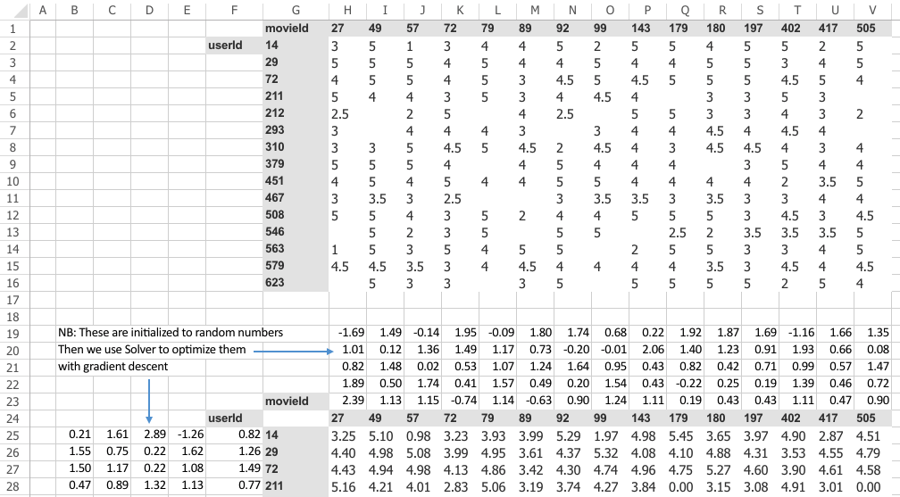

Microsoft Excel is one of my favorite ways to explore data and understand models. I'll make sure I put this in the repo, and actually this one, we can probably largely do in Google sheets. I've tried to move as much as I can over the last few weeks into Google sheets, but I just keep finding this is such a terrible product, so please try to find a copy of Microsoft Excel because there's nothing close, I've tried everything. Anyway, spreadsheets get a bad rap from people that basically don't know how to use them. Just like people who spend their life on Excel and then they start using Python, and they're like what the heck is this stupid thing.  It takes thousands of hours to get really good at spreadsheets, but a few dozen hours to get confident at them. Once you're confident at them, you can see everything in front of you. It's all laid out, it's really great.

### Jeremy's spreadsheet tip of the day!  [[1:08:37](https://youtu.be/C9UdVPE3ynA?t=4117)]

I'll give you one spreadsheet tip today which is if you hold down the <kbd>ctrl</kbd> key or <kbd>command</kbd> key on your keyboard and press the arrow keys, here's <kbd>ctrl</kbd>+<kbd>➜</kbd>, it takes you to the end of a block of a table that you're in. And it's by far the best way to move around the place, so there you go.

In this case, I want to skip around through this table, so I can hit <kbd>ctrl</kbd>+ <kbd>⬇︎</kbd> <kbd>➜</kbd> to get to the bottom right, <kbd>ctrl</kbd>+ <kbd>⬅︎</kbd> <kbd>⬆︎</kbd> to get to the top left. Skip around and see what's going on.

So here's some data, and as we talked about, one way to look at collaborative filtering data is like this: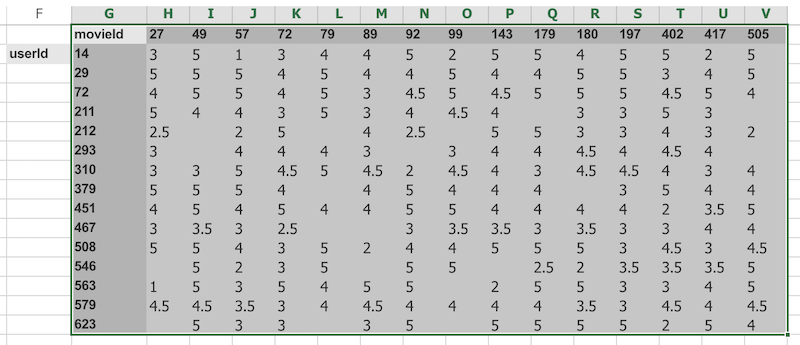

What we did was we grabbed from the MovieLens data the people that watched the most movies and the movies that were the most watched, and just limited the dataset down to those 15. As you can see, when you do it that way, it's not sparse anymore. There's just a small number of gaps.

This is something that we can now build a model with. How can we build a model? What we want to do is we want to create something which can predict for user 293, will they like movie 49, for example. So we've got to come up with some function that can represent that decision.

Here's a simple possible approach. We're going to take this idea of doing some matrix multiplications. So I've created here a random matrix. So here's one matrix of random numbers (the left). And I've created here another matrix of random numbers (the top). More specifically, for each movie, I've created five random numbers, and for each user, I've created five random numbers.

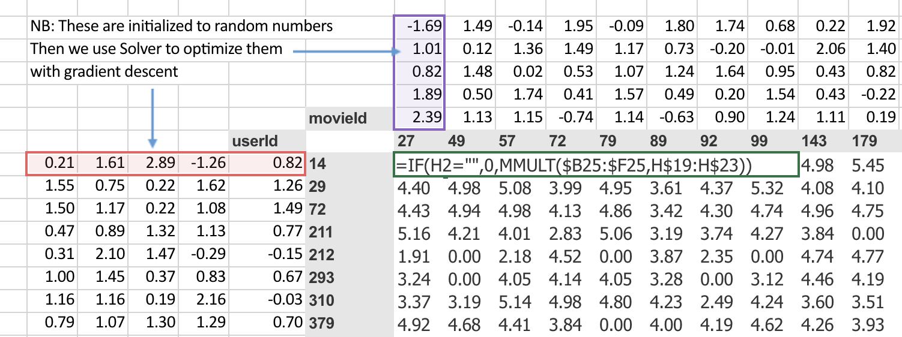

So we could say, then, that user 14, movie 27; did they like it or not? Well, the rating, what we could do would be to multiply together this vector (red) and that vector (purple). We could do a dot product, and here's the dot product. Then we can basically do that for every possible thing in here. And thanks to spreadsheets, we can just do that in one place and copy it over, and it fills in the whole thing for us. Why would we do it this way? Well, this is the basic starting point of a neural net, isn't it? A basic starting point of a neural net is that you take the matrix multiplication of two matrices, and that's what your first layer always is. So we just have to come up with some way of saying what are two matrices that we can multiply. Clearly, you need a vector for a user (a matrix for all the users) and a vector for a movie (a matrix for all the movies) and multiply them together, and you get some numbers. So they don't mean anything yet. They're just random. But we can now use gradient descent to try to make these numbers (top) and these numbers (left) give us results that are closer to what we wanted.

So how do we do that? Well, we set this up now as a linear model, so the next thing we need is a loss function. We can calculate our loss function by saying well okay movie 27 for user ID 14 should have been a rating of 3. With this random matrices, it's actually a rating of 0.91, so we can find the sum of squared errors would be  and then we can add them up. So there's actually a sum squared in Excel already sum X minus y squared (`SUMXMY2`), so we can use just sum X minus y squared function, passing in those two ranges and then divide by the count to get the mean.

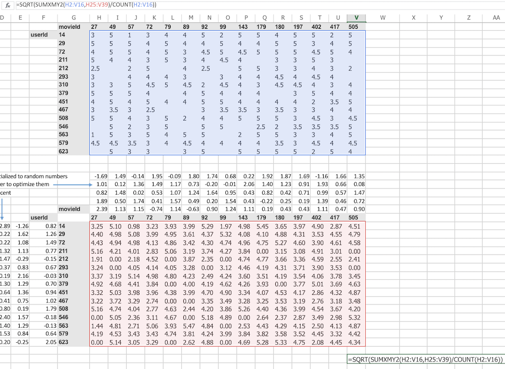

Here is a number that is the square root of the mean squared error. You sometimes you'll see people talk about MSE so that's the Mean Squared Error, sometimes you'll see RMSE that's the Root Mean Squared Error. Since I've got a square root at the front, this is the square root mean square error.

#### Excel Solver [[1:14:30](https://youtu.be/C9UdVPE3ynA?t=4470)]

We have a loss, so now all we need to do is use gradient descent to try to modify our weight matrices to make that loss smaller. Excel will do that for me.

If you don't have solver, go to Excel Options → Add-ins, and enable "Solver Add-in".

The gradient descent solver in Excel is called "Solver" and it just does normal gradient descent. You just go Data → Solver (you need to make sure that in your settings that you've enabled the solver extension which comes with Excel) and all you need to do is say which cell represents my loss function. So there it is, cell V41. Which cells contain your variables, and so you can see here, I've got H19 to V23 which is up here, and B25 to F39 which is over there, then you can just say "okay, set your loss function to a minimum by changing those cells" and click on Solve:

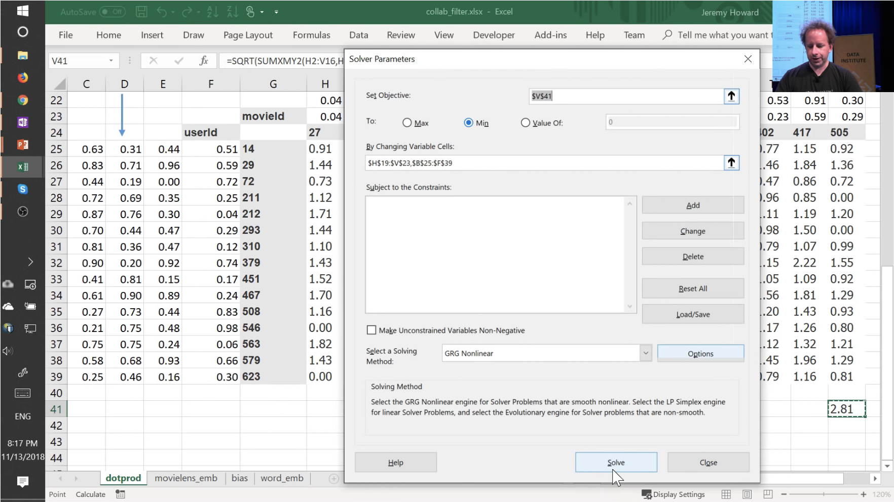

You'll see the starts a 2.81, and you can see the numbers going down. And all that's doing is using gradient descent exactly the same way that we did when we did it manually in the notebook the other day. But it's rather than solving the mean squared error for `a@x`  in Python, instead it is solving the loss function here which is the mean squared error of the dot product of each of those vectors by each of these vectors.

We'll let that run for a little while and see what happens. But basically in micro, here is a simple way of creating a neural network which is really in this case, it's like just a single linear layer with gradient descent to solve a collaborative filtering problem.

Back to the [notebook](https://github.com/fastai/course-v3/blob/master/nbs/dl1/lesson4-collab.ipynb) [[1:17:02](https://youtu.be/C9UdVPE3ynA?t=4622)]

Let's go back and see what we do over here.

```python
data = CollabDataBunch.from_df(ratings, seed=42)
```

```
y_range = [0,5.5]
```

```python
learn = collab_learner(data, n_factors=50, y_range=y_range)
```

```python
learn.fit_one_cycle(3, 5e-3)
```

```
Total time: 00:04
epoch  train_loss  valid_loss
1      1.600185    0.962681    (00:01)
2      0.851333    0.678732    (00:01)
3      0.660136    0.666290    (00:01)
```

So over here we used `collab_learner` to get a model. So the the function that was called in the notebook was `collab_learner` and as you dig deeper into deep learning, one of the really good ways to dig deeper into deep learning is to dig into the fastai source code and see what's going on. So if you're going to be able to do that, you need to know how to use your editor well enough to dig through the source code. Basically there are two main things you need to know how to do:

1. Jump to a particular "symbol", like a particular class or function by its name
2. When you're looking at a particular symbol, to be able to jump to its implementation

For example in this case, I want to find `def collab_learner`. In most editors including the one I use, vim, you can set it up so that you can hit tab or something and it jumps through all the possible completions, and you can hit enter and it jumps straight to the definition for you. So here is the definition of `collab_learner`. As you can see, it's pretty small as these things tend to be, and the key thing it does is to create model of a particular kind which is an `EmbeddingDotBias` model passing in the various things you asked for. So you want to find out in your editor how you jump to the definition of that, which in vim you just hit <kbd>Ctrl</kbd>+<kbd>]</kbd>  and here is the definition of `EmbeddingDotBias`.

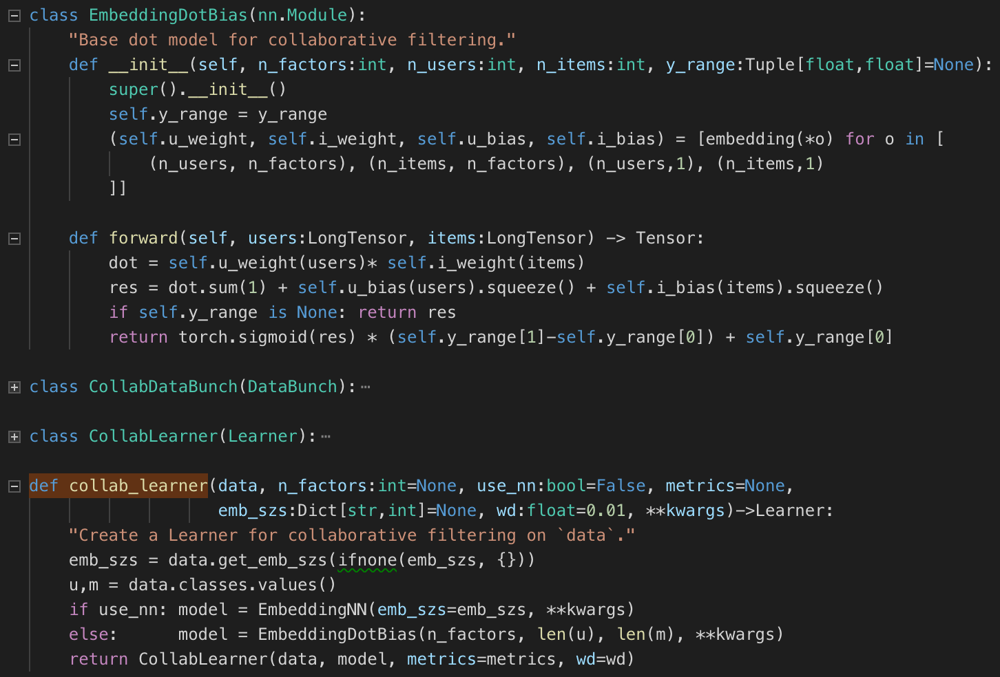

Now we have everything on screen at once, and as you can see there's not much going on. The models that are being created for you by fastai are actually PyTorch models. And a PyTorch model is called an `nn.Module` that's the name in PyTorch of their models. It's a little more nuanced than that, but that's a good starting point for now. When a PyTorch `nn.Module`  is run (when you calculate the result of that layer, neural net, etc), specifically, it always calls a method for you called `forward`. So it's in here that you get to find out how this thing is actually calculated.

When the model is built at the start, it calls this thing called `__init__` as we've briefly mentioned before in Python people tend to call this "dunder init". So dunder init is how we create the model, and forward is how we run the model.

One thing if you're watching carefully, you might notice is there's nothing here saying how to calculate the gradients of the model, and that's because PyTorch does it for us. So you only have to tell it how to calculate the output of your model, and PyTorch will go ahead and calculate the gradients for you.

So in this case, the model contains:

- a set of weights for a user
- a set of weights for an item
- a set of biases for a user
- a set of biases for an item

And each one of those is coming from this thing called `embedding`. Here is the definition of `embedding`:

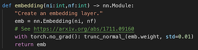


All it does is it calls this PyTorch thing called `nn.Embedding`. In PyTorch, they have a lot of standard neural network layers set up for you. So it creates an embedding. And then this thing here (`trunc_normal_`) is it just randomizes it. This is something which creates normal random numbers for the embedding.


#### Embedding [[1:21:41](https://youtu.be/C9UdVPE3ynA?t=4901)]

So what's an embedding? An embedding, not surprisingly, is a matrix of weights. Specifically, an embedding is a matrix of weights that looks something like this:

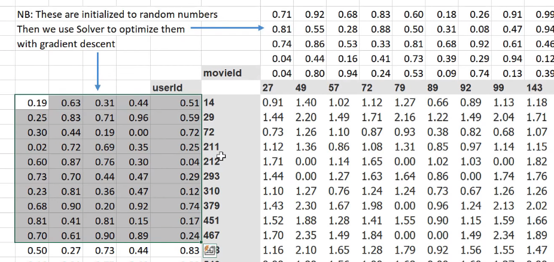

It's a matrix of weights which you can basically look up into, and grab one item out of it. So basically an embedding matrix is just a weight matrix that is designed to be something that you index into it as an array, and grab one vector out of it. That's what an embedding matrix is. In our case, we have an embedding matrix for a user and an embedding matrix for a movie. And here, we have been taking the dot product of them:

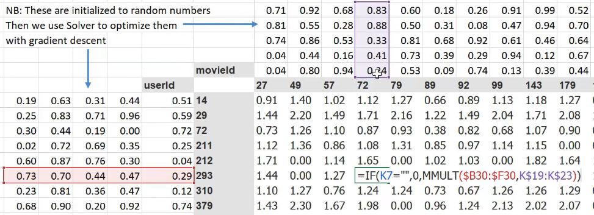

But if you think about it, that's not quite enough. Because we're missing this idea that maybe there are certain movies that everybody likes more. Maybe there are some users that just tend to like movies more. So I don't really just want to multiply these two vectors together, but I really want to add a single number of like how popular is this movie, and add a single number of like how much does this user like movies in general. So those are called "bias" terms. Remember how I said there's this idea of bias and the way we dealt with that in our gradient descent notebook was we added a column of 1's. But what we tend to do in practice is we actually explicitly say I want to add a bias term. So we don't just want to have prediction equals dot product of these two things, we want to say it's the dot product of those two things plus a bias term for a movie plus a bias term for user ID.

#### Back to code [[1:23:55](https://youtu.be/C9UdVPE3ynA?t=5035)]

So that's basically what happens. We when we set up the model, we set up the embedding matrix for the users and the embedding matrix for the items. And then we also set up the bias vector for the users and the bias vector for the items.

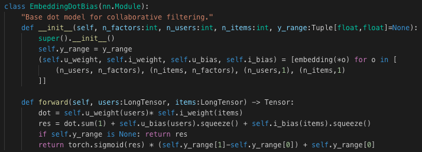

Then when we calculate the model, we literally just multiply the two together. Just like we did. We just take that product, we call it `dot`. Then we add the bias, and (putting aside `y_range` for a moment) that's what we return. So you can see that our model is literally doing what we did in the spreadsheet with the tweak that we're also adding the bias. So it's an incredibly simple linear model. For these kinds of collaborative filtering problems, this kind of simple linear model actually tends to work pretty well.

Then there's one tweak that we do at the end which is that in our case we said that there's y range of between 0 and 5.5. So here's something to point out. So you do that dot product and you add on the two biases and that could give you any possible number along the number line from very negative through to very positive numbers. But we know that we always want to end up with a number between zero and five. What if we mapped that number line like so, to this function. The shape of that function is called a sigmoid. And so, it's gonna asymptote to five and it's gonna asymptote to zero.

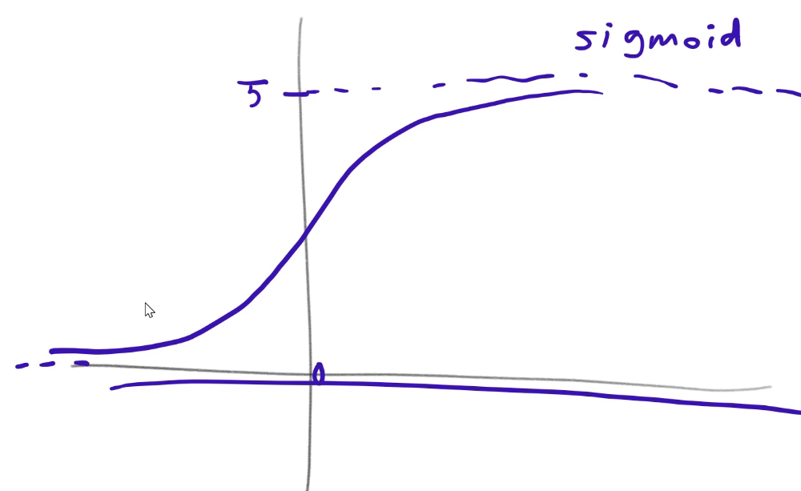

That way, whatever number comes out of our dot product and adding the biases, if we then stick it through this function, it's never going to be higher than 5 and never going to be smaller than 0. Now strictly speaking, that's not necessary. Because our parameters could learn a set of weights that gives about the right number. So why would we do this extra thing if it's not necessary? The reason is, we want to make its life as easy for our model as possible. If we actually set it up so it's impossible for it to ever predict too much or too little, then it can spend more of its weights predicting the thing we care about which is deciding who's going to like what movie. So this is an idea we're going to keep coming back to when it comes to like making neural network's work better. It's about all these little decisions that we make to basically make it easier for the network to learn the right thing. So that's the last tweak here:

```python
return torch.sigmoid(res) * (self.y_range[1]-self.y_range[0]) + self.y_range[0]
```

We take the result of this dot product plus biases, we put it through a sigmoid. A sigmoid is just a function which is basically, but the definition doesn't much matter. But it just has the shape that I just mentioned, and that goes between 0 and 1. If you then multiply that by `y_range[1]` minus `y_range[0]` plus `y_range[0]`, then that's going to give you something that's between `y_range[0]` and `y_range[1]`.

So that means that this tiny little neural network, I mean it's a push to call it a neural network. But it is a neural network with one weight matrix and no nonlinearities. So it's kind of the world's most boring neural network with a sigmoid at the end.  I guess it does have a non-linearity. The sigmoid at the end is the non-linearity, it only has one layer of weights. That actually turns out to give close to state-of-the-art performance. I've looked up online to find out like what are the best results people have on this MovieLens 100k database, and the results I get from this little thing is better than any of the results I can find from the standard commercial products that you can download that are specialized for this. And the trick seems to be that adding this little sigmoid makes a big difference.

[[1:29:09](https://youtu.be/C9UdVPE3ynA?t=5349)]


### Overview of important terminology [[1:31:24](https://youtu.be/C9UdVPE3ynA?t=5484)]

So what I wanted to close with today is, to take this collaborative filtering example and describe how we're going to build on top of it for the next three lessons to create the more complex neural networks we've been seeing. Roughly speaking, this is the bunch of concepts that we need to learn about:

- Inputs
- Weights/parameters
  - Random
- Activations
- Activation functions / nonlinearities
- Output
- Loss
- Metric
- Cross-entropy
- Softmax
- Fine tuning
  - Layer deletion and random weights
  - Freezing & unfreezing

Let's think about what happens when you're using a neural network to do image recognition. Let's take a single pixel. You've got lots of pixels, but let's take a single pixel. So you've got a red a green and a blue pixel. Each one of those is some number between 0 and 255, or we normalize them so they have the mean of zero and standard deviation of one. But let's just do 0 to 255 version. So red: 10, green: 20, blue 30. So what do we do with these? Well, what we do is we basically treat that as a vector, and we multiply it by a matrix. So this matrix (depending on how you think of the rows and the columns), let's treat the matrix is having three rows and then how many columns? You get to pick. Just like with the collaborative filtering version, I decided to pick a vector of size five for each of my embedding vectors. So that would mean that's an embedding of size 5. You get to pick how big your weight matrix is. So let's make it size 5. This is 3 by 5.

Initially, this weight matrix contains random numbers. Remember we looked at `embedding` weight matrix just now?


There were two lines; the first line was create the matrix, and the second was fill it with random numbers? That's all we do. I mean it all gets hidden behind the scenes by fastai and PyTorch, but that's all it's doing. So it's creating a matrix of random numbers when you set it up. The number of rows has to be 3 to match the input, and the number of columns can be as big as you like. So after you multiply the input vector by that weight matrix, you're going to end up with a vector of size 5.

People often ask how much linear algebra do I need to know to be able to do deep learning. This is the amount you need. And if you're not familiar with this, that's fine. You need to know about matrix products. You don't need to know a lot about them, you just need to know like computationally what are they and what do they do. You've got to be very comfortable with if a matrix of size blah times a matrix of size blah gives a matrix or size blah (i.e. how do the dimensions match up). So if you have 3, and they remember in numpy and PyTorch, we use @ times 3 by 5 gives a vector of size 5.

Then what happens next; it goes through an activation function such as ReLU which is just `max(0,x)` and spits out a new vector which is, of course, going to be exactly the same size because **no activation function changes the size﹣it only changes the contents**. So that's still of size 5.

What happens next? We multiply by another matrix. Again, it can be any number of columns, but the number of rows has to map nicely. So it's going to be 5 by whatever. Maybe this one has 5, let's say, by 10. That's going to give some output﹣it should be size 10 and again we put that through ReLU, and again that gives us something of the same size.

Then we can put that through another matrix.  Actually, just to make this a bit clearer (you'll see why in a moment), I'm going to use 8 not 10.

Let's say we're doing digit recognition. There are ten possible digits, so my last weight matrix has to be 10 in size. Because then that's going to mean my final output is a vector of 10 in size. Remember if you're doing that digit recognition, we take our actuals which is 10 in size. And if the number we're trying to predict was the number 3,  then that means that there is a 1 in the third position ([0,0,0,1,0,...]).

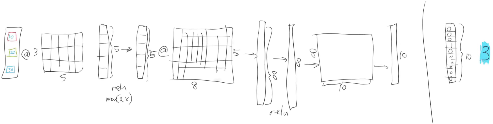

So what happens is our neural net runs along starting with our input, and going weight matrix→ReLU→ weight matrix→ReLU→ weight matrix→ final output. Then we compare these two together to see how close they are (i.e. how close they match) using some loss function and we'll learn about all the loss functions that we use next week. For now, the only one we've learned is mean squared error. And we compare the output (you can think of them as probabilities for each of the 10) to the actual each of the 10 to get a loss, and then we find the gradients of every one of the weight matrices with respect to that, and we update the weight matrices.

The main thing I wanted to show right now is the terminology we use because it's really important.

These things (yellow) contain numbers. Specifically they initially are matrices containing random numbers. And we can refer to these yellow things, in PyTouch, they're called parameters. Sometimes we'll refer to them as weights, although weights is slightly less accurate because they can also be biases. But we kind of use the terms a little bit interchangeably. Strictly speaking, we should call them parameters.

Then after each of those matrix products, that calculates a vector of numbers. Here are some numbers (blue) that are calculated by a weight matrix multiply. And then there's some other set of numbers (purple) that are calculated as a result of a ReLU as well as the activation function. Either one is called activations.

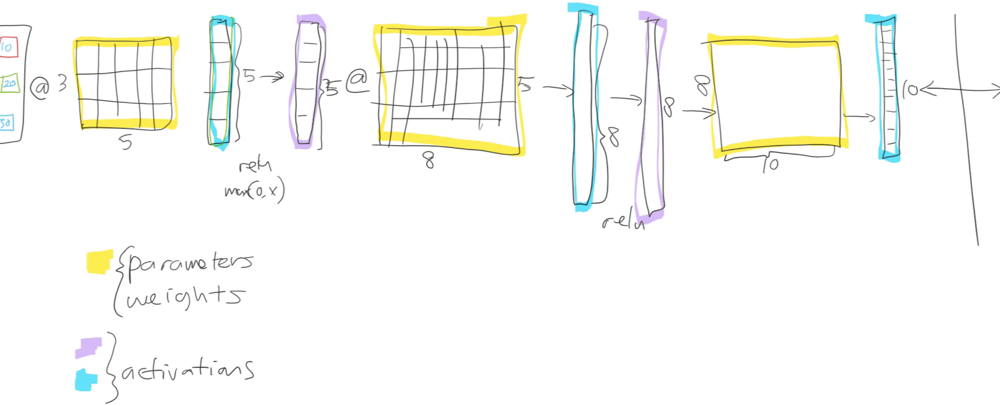

Activations and parameters, both refer to numbers. They are numbers. But **Parameters** are numbers that are stored, they are used to make a calculation. **Activations** are the result of a calculation﹣the numbers that are calculated. So they're the two key things you need to remember.

So use these terms, and use them correctly and accurately. And if you read these terms, they mean these very specific things. So don't mix them up in your head. And remember, they're nothing weird and magical﹣they are very simple things.

- An activation is the result of either a matrix multiply or an activation function.
- Parameters are the numbers inside the matrices that we multiply by.

That's it. Then there are some special layers. Every one of these things that does a calculation, all of these things that does a calculation (red arrow), are all called layers. They're the layers of our neural net. So every layer results in a set of activations because there's a calculation that results in a set of results.


There's a special layer at the start which is called the input layer, and then at the end you just have a set of activations and we can refer to those special numbers (I mean they're not special mathematically but they're semantically special); we can call those the outputs. The important point to realize here is the outputs of a neural net are not actually mathematically special, they're just the activations of a layer.

So what we did in our collaborative filtering example, we did something interesting. We actually added an additional activation function right at the very end. We added an extra activation function which was sigmoid, specifically it was a scaled sigmoid which goes between 0 and 5. It's very common to have an activation function as your last layer, and it's almost never going to be a ReLU because it's very unlikely that what you actually want is something that truncates at zero. It's very often going to be a sigmoid or something similar because it's very likely that actually what you want is something that's between two values and kind of scaled in that way.

So that's nearly it. Inputs, weights, activations, activation functions (which we sometimes call nonlinearities), output, and then the function that compares those two things together is called the loss function, which so far we've used MSE.

That's enough for today. So what we're going to do next week is we're going to kind of add in a few more extra bits which is we're going to learn the loss function that's used for classification called **cross-entropy**, we're going to use the activation function that's used for single label classification called **softmax**, and we're also going to learn exactly what happens when we do fine-tuning in terms of how these layers actually, what happens with unfreeze, and what happens when we create transfer learning. Thanks everybody! Looking forward to seeing you next week.

[[19:49](https://youtu.be/uQtTwhpv7Ew?t=1189)]

So we were looking at collaborative filtering last week.

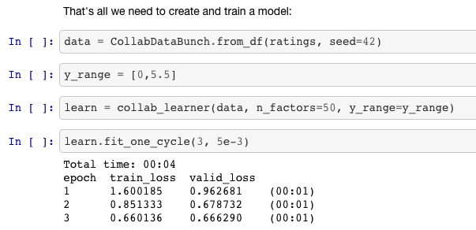

And in the collaborative filtering example, we called `fit_one_cycle` and we passed in just a single number. That makes sense because in collaborative filtering, we only have one layer. There's a few different pieces in it, but there isn't a matrix multiply followed by an activation function followed by another matrix multiply.

#### Affine Function [[20:24](https://youtu.be/uQtTwhpv7Ew?t=1224)]

I'm going to introduce another piece of jargon here. They're not always exactly matrix multiplications. There's something very similar. They're linear functions that we add together, but the more general term for these things that are more general than matrix multiplications is **affine functions**. So if you hear me say the word affine function, you can replace it in your head with matrix multiplication. But as we'll see when we do convolutions, convolutions are matrix multiplications where some of the weights are tied. So it would be slightly more accurate to call them affine functions. And I'd like to introduce a little bit more jargon in each lesson so that when you read books or papers or watch other courses or read documentation, there will be more of the words you recognize. So when you see affine function, it just means a linear function. It means something very very close to matrix multiplication. And matrix multiplication is the most common kind of affine function, at least in deep learning.

Specifically for collaborative filtering, the model we were using was this one:


It was where we had a bunch of numbers here (left) and a bunch of numbers here (top), and we took the dot product of them. And given that one here is a row and one is a column, that's the same as a matrix product. So `MMULT` in Excel multiplies matrices, so here's the matrix product of those two.

I started this training last week by using solver in Exce,l and we never actually went back to see how it went. So let's go and have a look now. The average sum of squared error got down to 0.39. We're trying to predict something on a scale of 0.5 to 5, so on average we're being wrong by about 0.4. That's pretty good. And you can kind of see it's pretty good, if you look at like 3, 5, 1 is what it meant to be, 3.23, 5.1, 0.98 - that's pretty close. So you get the general idea.

#### Embedding [[22:51](https://youtu.be/uQtTwhpv7Ew?t=1371)]

Then I started to talk about this idea of embedding matrices. In order to understand that, let's put this worksheet aside and look at [another worksheet](https://github.com/fastai/course-v3/blob/master/files/xl/collab_filter.xlsx) ("movielens_1hot" tab).


Here's another worksheet. What I've done here is I have copied over those two weight matrices from the previous worksheet. Here's the one for users, and here's the one for movies. And the movies one I've transposed it, so it's now got exactly the same dimensions as the users one.

So here are two weight matrices (in orange). Initially they were random. We can train them with gradient descent. In the original data, the user IDs and movie IDs were numbers like these. To make life more convenient, I've converted them to numbers from 1 to 15 (`user_idx` and `movie_idx`). So in these columns, for every rating, I've got user ID movie ID rating using these mapped numbers so that they're contiguous starting at one.

Now I'm going to replace user ID number 1 with this vector - the vector contains a 1 followed by 14 zeros. Then user number 2, I'm going to replace with a vector of 0 and then 1 and then 13 zeros. So movie ID 14, I've also replaced with another vector which is 13 zeros and then a 1 and then a 0. These are called one-hot encodings, by the way. This is not part of a neural net. This is just like some input pre-processing where I'm literally making this my new input:

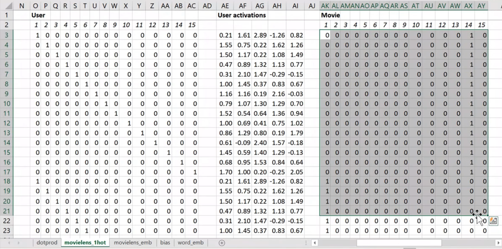

So this is my new inputs for my movies, this is my new inputs for my users. These are the inputs to a neural net.

What I'm going to do now is I'm going to take this input matrix and I'm going to do a matrix multiplied by the weight matrix. That'll work because weight matrix has 15 rows, and this (one-hot encoding) has 15 columns. I can multiply those two matrices together because they match. You can do matrix multiplication in Excel using the `MMULT` function. Just be careful if you're using Excel. Because this is a function that returns multiple numbers, you can't just hit enter when you finish with it; you have to hit <kbd>ctrl</kbd>+<kbd>shift</kbd>+<kbd>enter</kbd>. <kbd>ctrl</kbd>+<kbd>shift</kbd>+<kbd>enter</kbd> means this is an array function - something that returns multiple values.

Here (User activations) is the matrix product of this input matrix of inputs, and this parameter matrix or weight matrix. So that's just a normal neural network layer. It's just a regular matrix multiply. So we can do the same thing for movies, and so here's the matrix multiply for movies.

Well, here's the thing. This input, we claim, is this one hot encoded version of user ID number 1, and these activations are the activations for user ID number one. Why is that? Because if you think about it, the matrix multiplication between a one hot encoded vector and some matrix is actually going to find the Nth row of that matrix when the one is in position N. So what we've done here is we've actually got a matrix multiply that is creating these output activations. But it's doing it in a very interesting way - it's effectively finding a particular row in the input matrix.

Having done that, we can then multiply those two sets together (just a dot product), and we can then find the loss squared, and then we can find the average loss.

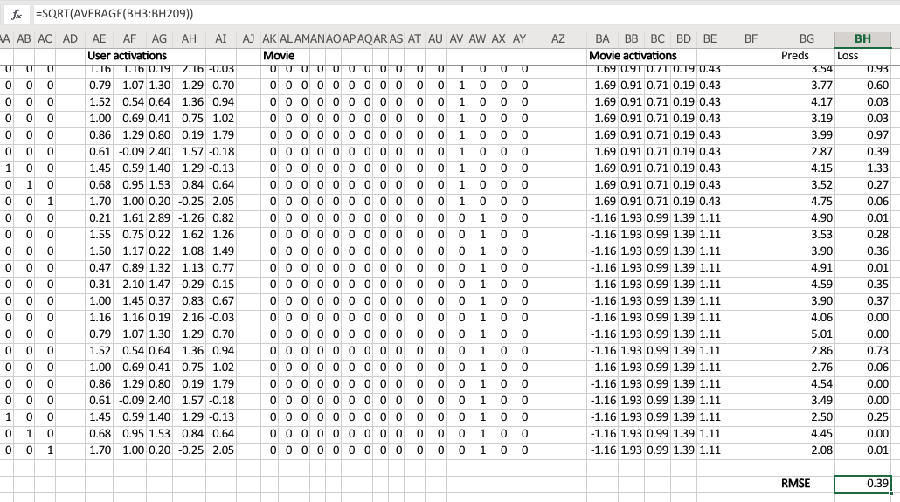

And lo and behold, that number 0.39 is the same as this number (from the solver) because they're doing the same thing.

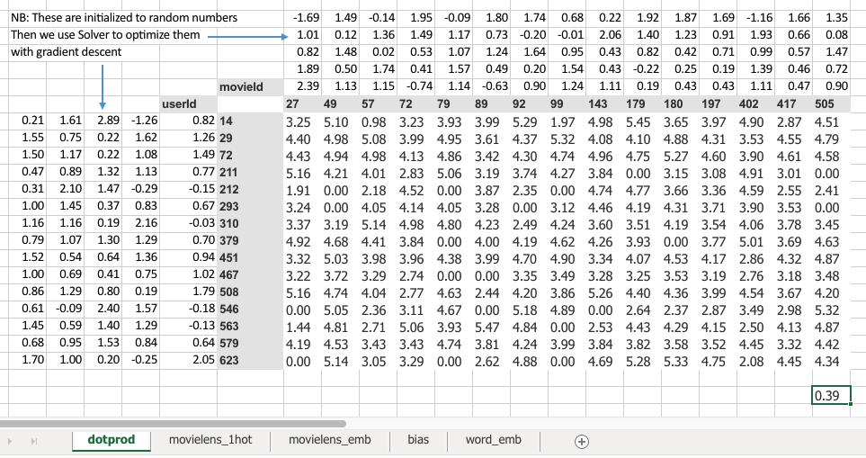

This one ("dotprod" version) was finding this particular users embedding vector, this one ("movielens_1hot" version) is just doing a matrix multiply, and therefore we know **they are mathematically identical**.

### Embedding once over [[27:57](https://youtu.be/uQtTwhpv7Ew?t=1677)]

So let's lay that out again. Here's our final version (*recommend watching a video for this section*):


This is the same weight matrices again - exactly the same I've copied them over. And here's those user IDs and movie IDs again. But this time, I've laid them out just in a normal tabular form just like you would expect to seein the input to your model. And this time, I have got exactly the same set of activations here (user embedding) that I had in movielens_1hot. But in this case I've calculated these activations using Excels `OFFSET` function which is an array look up. This version (`movielens_emb`) is identical to `movielens_1hot` version, but obviously it's much less memory intensive and much faster because I don't actually create the one hot encoded matrix and I don't actually do a matrix multiply. That matrix multiply is nearly all multiplying by zero which is a total waste of time.

So in other words, multiplying by a one hot encoded matrix is identical to doing an array lookup. Therefore **we should always do the array lookup version**, and therefore we have a specific way of saying I want to do a matrix multiplication by a one hot encoded matrix without ever actually creating it. I'm just instead going to pass in a bunch of integers and pretend they're one not encoded. And that is called an **embedding**.

You might have heard this word "embedding" all over the places as if it's some magic advanced mathy thing, but embedding means look something up in an array. But it's interesting to know that looking something up in an array is mathematically identical to doing a matrix product by a one hot encoded matrix. And therefore, an embedding fits very nicely in our standard model of our neural networks work.

Now suddenly it's as if we have another whole kind of layer. It's a kind of layer where we get to look things up in an array. But we actually didn't do anything special. We just added this computational shortcut - this thing called an embedding which is simply a fast memory efficient way of multiplying by hot encoded matrix.

So this is really important. Because when you hear people say embedding, you need to replace it in your head with "an array lookup" which we know is mathematically identical to matrix multiply by a one hot encoded matrix.

Here's the thing though, it has kind of interesting semantics. Because when you do multiply something by a one hot encoded matrix, you get this nice feature where the rows of your weight matrix, the values only appear (for row number one, for example) where you get user ID number one in your inputs. So in other words you kind of end up with this weight matrix where certain rows of weights correspond to certain values of your input. And that's pretty interesting. It's particularly interesting here because (going back to a kind of most convenient way to look at this) because the only way that we can calculate an output activation is by doing a dot product of these two input vectors. That means that they kind of have to correspond with each other. There has to be some way of saying if this number for a user is high and this number for a movie is high, then the user will like the movie. So the only way that can possibly make sense is if **these numbers represent features of personal taste and corresponding features of movies**. For example, the movie has John Travolta in it and user ID likes John Travolta, then you'll like this movie.

We're not actually deciding the rows mean anything. We're not doing anything to make the rows mean anything. But the only way that this gradient descent could possibly come up with a good answer is if it figures out what the aspects of movie taste are and the corresponding features of movies are. So those underlying kind of features that appear that are called **latent factors** or **latent features**. They're these hidden things that were there all along, and once we train this neural net, they suddenly appear.

#### Bias [[33:08](https://youtu.be/uQtTwhpv7Ew?t=1988)]

Now here's the problem. No one's going to like Battlefield Earth. It's not a good movie even though it has John Travolta in it. So how are we going to deal with that? Because there's this feature called I like John Travolta movies, and this feature called this movie has John Travolta, and so this is now like you're gonna like the movie. But we need to save some way to say "unless it's Battlefield Earth" or "you're a Scientologist" - either one. So how do we do that? We need to add in **bias**.
