# Collaborative learning models based on abbreviated Lesson 5

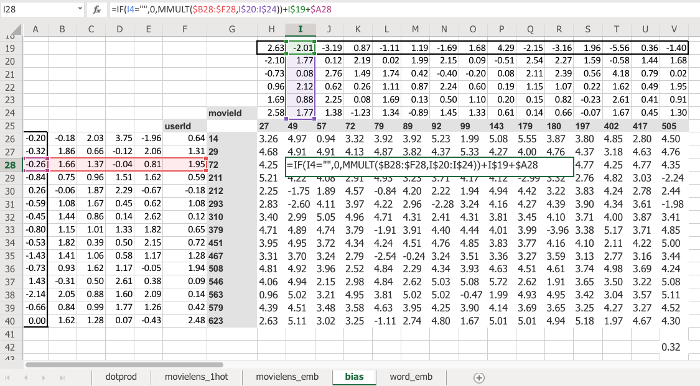

Here is the same thing again, the same construct, same shape of everything. But this time you've got an extra row. So now this is not just the matrix product of that and that, but I'm also adding on this number and this number. Which means, now each movie can have an overall "this is a great movie" versus "this isn't a great movie" and every user can have an overall "this user rates movies highly" or "this user doesn't rate movies highly" - that's called the bias. So this is hopefully going to look very familiar. This is the same usual linear model concept or linear layer concept from a neural net that you have a matrix product and a bias.

And remember from lesson 2 SGD notebook, you never actually need a bias. You could always just add a column of ones to your input data and then that gives you bias for free, but that's pretty inefficient. So in practice, all neural networks library explicitly have a concept of bias. We don't actually add the column of ones.

So what does that do? Well just before I came in today, I ran data solver on this as well, and we can check the RMSE. So the root mean squared here is 0.32 versus the version without bias was 0.39. So you can see that this slightly better model gives us a better result. And it's better because it's giving both more flexibility and it also just makes sense semantically that you need to be able to say weather I'd like the movie is not just about the combination of what actors it has, whether it's dialogue-driven, and how much action is in it but just is it a good movie or am i somebody who rates movies highly.

So there's all the pieces of this collaborative filtering model.

[[38:25](https://youtu.be/uQtTwhpv7Ew?t=2305)]

Let's go back to the [collaborative filtering notebook](https://github.com/fastai/course-v3/blob/master/nbs/dl1/lesson4-collab.ipynb). And this time we're going to grab the whole Movielens 100k dataset. There's also a 20 million dataset, by the way, so really a great project available made by this group called GroupLens. They actually update the Movielens datasets on a regular basis, but they helpfully provide the original one. We're going to use the original one because that means that we can compare to baselines. Because everybody basically they say, hey if you're going to compare the baselines make sure you all use the same dataset, here's the one you should use. Unfortunately it means that we're going to be restricted to movies that are before 1998. So maybe you won't have seen them all. but that's the price we pay. You can replace this with `ml-latest` when you download it and use it if you want to play around with movies that are up to date:

```python
path=Path('data/ml-100k/')
```

The original Movielens dataset, the more recent ones are in a CSV file it's super convenient to use. The original one is a slightly messy. First of all they don't use commas for delimiters, they use tabs. So in Pandas you can just say what's the delimiter and you loaded in. The second is they don't add a header row so that you know what column is what, so you have to tell Pandas there's no header row. Then since there's no header row, you have to tell Pandas what are the names of four columns. Rather than that, that's all we need.

```python
ratings = pd.read_csv(path/'u.data', delimiter='\t', header=None,
                      names=[user,item,'rating','timestamp'])
ratings.head()
```

|      | userId | movieId | rating | timestamp |
| ---- | ------ | ------- | ------ | --------- |
| 0    | 196    | 242     | 3      | 881250949 |
| 1    | 186    | 302     | 3      | 891717742 |
| 2    | 22     | 377     | 1      | 878887116 |
| 3    | 244    | 51      | 2      | 880606923 |
| 4    | 166    | 346     | 1      | 886397596 |

So we can then have a look at `head` which remember is the first few rows and there is our ratings; user, movie, rating.

Let's make it more fun. Let's see what the movies actually are.

```python
movies = pd.read_csv(path/'u.item',  delimiter='|', encoding='latin-1', header=None,
                 names=[item, 'title', 'date', 'N', 'url', *[f'g{i}' for i in range(19)]])
movies.head()
```

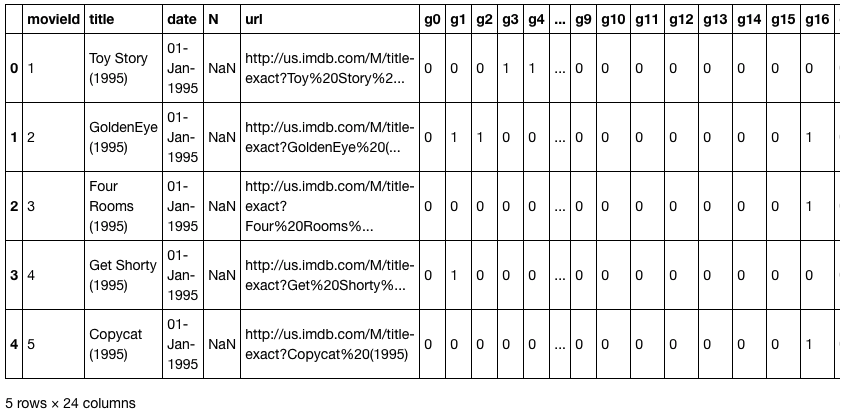

I'll just point something out here, which is there's this thing called `encoding=`. I'm going to get rid of it and I get this error:

```bash
---------------------------------------------------------------------------
UnicodeDecodeError                        Traceback (most recent call last)
pandas/_libs/parsers.pyx in pandas._libs.parsers.TextReader._convert_tokens()
pandas/_libs/parsers.pyx in pandas._libs.parsers.TextReader._convert_with_dtype()
pandas/_libs/parsers.pyx in pandas._libs.parsers.TextReader._string_convert()
pandas/_libs/parsers.pyx in pandas._libs.parsers._string_box_utf8()

UnicodeDecodeError: 'utf-8' codec can't decode byte 0xe9 in position 3: invalid continuation byte

During handling of the above exception, another exception occurred:
UnicodeDecodeError                        Traceback (most recent call last)
<ipython-input-15-d6ba3ac593ed> in <module>
      1 movies = pd.read_csv(path/'u.item',  delimiter='|', header=None,
----> 2                     names=[item, 'title', 'date', 'N', 'url', *[f'g{i}' for i in range(19)]])
      3 movies.head()

~/src/miniconda3/envs/fastai/lib/python3.6/site-packages/pandas/io/parsers.py in parser_f(filepath_or_buffer, sep, delimiter, header, names, index_col, usecols, squeeze, prefix, mangle_dupe_cols, dtype, engine, converters, true_values, false_values, skipinitialspace, skiprows, nrows, na_values, keep_default_na, na_filter, verbose, skip_blank_lines, parse_dates, infer_datetime_format, keep_date_col, date_parser, dayfirst, iterator, chunksize, compression, thousands, decimal, lineterminator, quotechar, quoting, escapechar, comment, encoding, dialect, tupleize_cols, error_bad_lines, warn_bad_lines, skipfooter, doublequote, delim_whitespace, low_memory, memory_map, float_precision)
    676                     skip_blank_lines=skip_blank_lines)
    677
--> 678         return _read(filepath_or_buffer, kwds)
    679
    680     parser_f.__name__ = name

~/src/miniconda3/envs/fastai/lib/python3.6/site-packages/pandas/io/parsers.py in _read(filepath_or_buffer, kwds)
    444
    445     try:
--> 446         data = parser.read(nrows)
    447     finally:
    448         parser.close()

~/src/miniconda3/envs/fastai/lib/python3.6/site-packages/pandas/io/parsers.py in read(self, nrows)
   1034                 raise ValueError('skipfooter not supported for iteration')
   1035
-> 1036         ret = self._engine.read(nrows)
   1037
   1038         # May alter columns / col_dict

~/src/miniconda3/envs/fastai/lib/python3.6/site-packages/pandas/io/parsers.py in read(self, nrows)
   1846     def read(self, nrows=None):
   1847         try:
-> 1848             data = self._reader.read(nrows)
   1849         except StopIteration:
   1850             if self._first_chunk:

pandas/_libs/parsers.pyx in pandas._libs.parsers.TextReader.read()
pandas/_libs/parsers.pyx in pandas._libs.parsers.TextReader._read_low_memory()
pandas/_libs/parsers.pyx in pandas._libs.parsers.TextReader._read_rows()
pandas/_libs/parsers.pyx in pandas._libs.parsers.TextReader._convert_column_data()
pandas/_libs/parsers.pyx in pandas._libs.parsers.TextReader._convert_tokens()
pandas/_libs/parsers.pyx in pandas._libs.parsers.TextReader._convert_with_dtype()
pandas/_libs/parsers.pyx in pandas._libs.parsers.TextReader._string_convert()
pandas/_libs/parsers.pyx in pandas._libs.parsers._string_box_utf8()

UnicodeDecodeError: 'utf-8' codec can't decode byte 0xe9 in position 3: invalid continuation byte
```

I just want to point this out because you'll all see this at some point in your lives. `codec can't decode blah blah blah`. What this means is that this is not a Unicode file. This will be quite common when you're using datasets are a little bit older. Back before us English people in the West really realized that there are people that use languages other than English. Nowadays we're much better at handling different languages. We use this standard called Unicode for it. Python very helpfully uses Unicode by default. So if you try to load an old file that's not Unicode, you actually (believe it or not) have to guess how it was coded. But since it's really likely that it was created by some Western European or American person, they almost certainly used Latin-1. So if you just pop in `encoding='latin-1'` if you use file `open` in Python or Pandas `open` or whatever, that will generally get around your problem.

Again, they didn't have the names so we had to list what the names are. This is kind of interesting. They had a separate column for every one of however many genres they had ...19 genres. And you'll see this looks one hot encoded, but it's actually not. It's actually N hot encoded. In other words, a movie can be in multiple genres. We're not going to look at genres today, but it's just interesting to point out that this is a way that sometimes people will represent something like genre. The more recent version, they actually listed the genres directly which is much more convenient.

```python
len(ratings)
```

```
100000
```

[[42:07](https://youtu.be/uQtTwhpv7Ew?t=2527)]

We got a hundred thousand ratings. I find life is easier when you're modeling when you actually denormalize the data. I actually want the movie title directly in my ratings, so Pandas has a merge function to let us do that. Here's the ratings table with actual titles.

```python
rating_movie = ratings.merge(movies[[item, title]])
rating_movie.head()
```

|      | userId | movieId | rating | timestamp | title        |
| ---- | ------ | ------- | ------ | --------- | ------------ |
| 0    | 196    | 242     | 3      | 881250949 | Kolya (1996) |
| 1    | 63     | 242     | 3      | 875747190 | Kolya (1996) |
| 2    | 226    | 242     | 5      | 883888671 | Kolya (1996) |
| 3    | 154    | 242     | 3      | 879138235 | Kolya (1996) |
| 4    | 306    | 242     | 5      | 876503793 | Kolya (1996) |

As per usual, we can create a data bunch for our application, so a CollabDataBunch for the collab application. From what? From a data frame. There's our data frame. Set aside some validation data. Really we should use the validation sets and cross validation approach that they used if you're going to properly compare with a benchmark. So take these comparisons with a grain of salt.

```python
data = CollabDataBunch.from_df(rating_movie, seed=42, pct_val=0.1, item_name=title)
```

```python
data.show_batch()
```

| userId | title                               | target |
| ------ | ----------------------------------- | ------ |
| 588    | Twister (1996)                      | 3.0    |
| 664    | Grifters, The (1990)                | 4.0    |
| 758    | Wings of the Dove, The (1997)       | 4.0    |
| 711    | Empire Strikes Back, The (1980)     | 5.0    |
| 610    | People vs. Larry Flynt, The (1996)  | 3.0    |
| 407    | Star Trek: The Wrath of Khan (1982) | 4.0    |
| 649    | Independence Day (ID4) (1996)       | 2.0    |
| 798    | Sabrina (1954)                      | 4.0    |

By default, CollabDataBunch assumes that your first column is user, second column is item, the third column is rating. But now we're actually going to use the title column as item, so we have to tell it what the item column name is (`item_name=title`). Then all of our data bunches support show batch, so you can just check what's in there, and there it is.

### Jeremy's tricks for getting better results [[43:18](https://youtu.be/uQtTwhpv7Ew?t=2598)]

I'm going to try and get as good a result as I can, so I'm gonna try and use whatever tricks I can come up with to get a good answer. Now one of the tricks is to use the Y range. Remember the Y range was the thing that made the final activation function a sigmoid. And specifically, last week we said "let's have a sigmoid that goes from naught to 5" and that way it's going to ensure that it is going to help the neural network predict things that are in the range.

Actually I didn't do that in my Excel version and so you can see I've actually got some negatives and there's also some things bigger than five. So if you want to beat me in Excel, you could add the sigmoid to excel and train this, and you'll get a slightly better answer.

Now the problem is that a sigmoid actually asymptotes at whatever the maximum is (we said 5) which means you can never actually predict 5. But plenty of movies have a rating of 5, so that's a problem. So actually **it's slightly better to make your Y range go from a little bit less than the minimum to a little bit more than the maximum**. The minimum of this data is 0.5 and the maximum is 5, so this range is just a little bit further. So that's a that's one little trick to get a little bit more accuracy.

```python
y_range = [0,5.5]
```

The other trick I used is to add something called weight decay, and we're going to look at that next . After this section, we are going to learn about weight okay.

```python
learn = collab_learner(data, n_factors=40, y_range=y_range, wd=1e-1)
```

How many factors do you want or what are factors? The number of factors is the width of the embedding matrix. So why don't we say embedding size? Maybe we should, but in the world of collaborative filtering they don't use that word. They use the word "factors" because of this idea of latent factors, and because the standard way of doing collaborative filtering has been with something called **matrix factorization**. In fact what we just saw happens to actually be a way of doing matrix factorization. So we've actually accidentally learned how to do matrix factorization today. So this is a term that's kind of specific to this domain. But you can just remember it as the width of the embedding matrix.

Why 40? Well this is one of these architectural decisions you have to play around with and see what works. So I tried 10, 20, 40, and 80 and I found 40 seems to work pretty well. And it rained really quickly, so you can chuck it in a little for loop to try a few things and see what looks best.

```python
learn.lr_find()
learn.recorder.plot(skip_end=15)
```

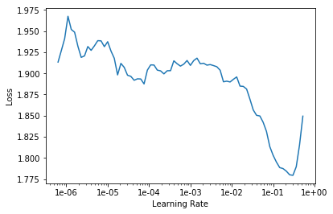

Then for learning rates, here's the learning rate finder as usual.  `5e-3` seemed to work pretty well. Remember this is just a rule of thumb. `5e-3` is a bit lower than both Sylvain's rule and my rule - so Sylvain's rule is find the bottom and go back by ten, so his rule would be more like `2e-2`, I reckon. My rule is kind of find about the steepest section which is about here, which again often it agrees with Sylvain's so that would be about `2e-2`. I tried that and I always like to try like 10 X less and 10x more just to check. And actually I found a bit less was helpful. So the answer to the question like "should I do blah?" is always "try blah and see." Now that's how you actually become a good practitioner.

```python
learn.fit_one_cycle(5, 5e-3)
```

```
Total time: 00:33
epoch  train_loss  valid_loss
1      0.938132    0.928146    (00:06)
2      0.862458    0.885790    (00:06)
3      0.753191    0.831451    (00:06)
4      0.667046    0.814966    (00:07)
5      0.546363    0.813588    (00:06)
```

```python
learn.save('dotprod')
```

So that gave me 0.813. And as usual, you can save the result to save you another 33 seconds from having to do it again later.

There's a library called LibRec and they published [some benchmarks for MovieLens 100k](https://www.librec.net/release/v1.3/example.html) and there's a root mean squared error section, and about 0.91 is about as good as they seem to have been able to get. 0.91 is the root mean square error. We use the mean square error, not the root, so we have to go to point 0.91^2 which is 0.83 and we're getting 0.81, so that's cool. With this very simple model, we're doing a little bit better, quite a lot better actually. Although as I said, take it with a grain of salt because we're not doing the same splits and the same cross validation. So we're at least highly competitive with their approaches.

We're going to look at the Python code that does this in a moment, but for now just take my word for it that we're going to see something that's just doing this:

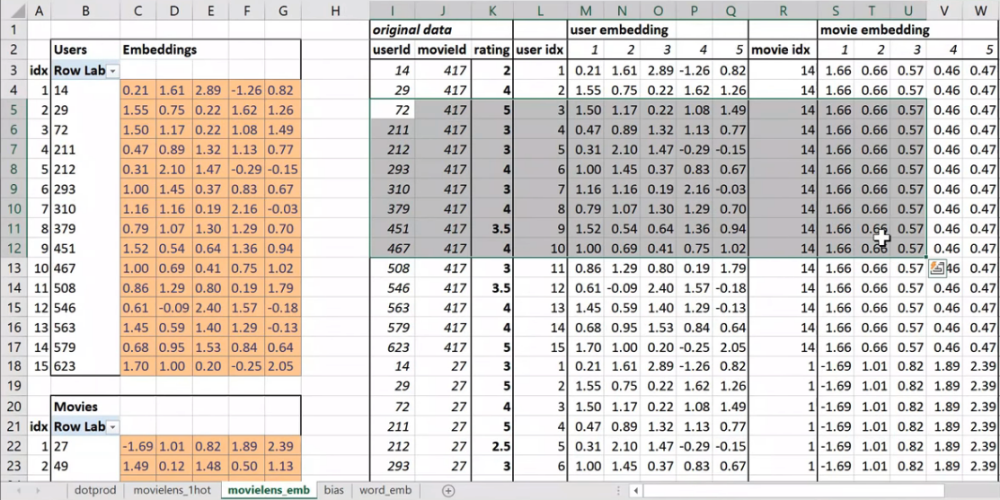

Looking things up in an array, and then multiplying them together, adding them up, and doing the mean square error loss function. Given that and given that we noticed that the only way that can do anything interesting is by trying to find these latent factors. It makes sense to look and see what they found.Particularly since as well as finding latent factors, we also now have a specific bias number for every user and every movie.

Now, you could just say what's the average rating for each movie. But there's a few issues with that. In particular, this is something you see a lot with like anime. People who like anime just love anime, and so they're watching lots of anime and then they just rate all the anima highly. So very often on kind of charts of movies, you'll see a lot of anime at the top. Particularly if it's like a hundred long series of anime, you'll find every single item of that series in the top thousand movie list or something.

#### Interpreting bias [[49:29](https://youtu.be/uQtTwhpv7Ew?t=2969)]

So how do we deal with that? Well the nice thing is that instead if we look at the movie bias, once we've included the user bias (which for an anime lover might be a very high number because they're just rating a lot of movies highly) and once we account for the specifics of this kind of movie (which again might be people love anime), what's left over is something specific to that movie itself. So it's kind of interesting to look at movie bias numbers as a way of saying what are the best movies or what do people really like as movies even if those people don't rate movies very highly or even if that movie doesn't have the kind of features that people tend to rate highly. So it's kind of nice, it's funny to say this 😆, by using the bias, we get an unbiased movie score.

How do we do that? To make it interesting particularly because this dataset only goes to 1998, let's only look at movies that are plenty of people watch. So we'll use Pandas to grab our `rating_movie` table, group it by title, and then count the number of ratings. Not measuring how high their rating, just how many ratings do they have.

```python
learn.load('dotprod');
```

```python
learn.model
```

```
EmbeddingDotBias(
  (u_weight): Embedding(944, 40)
  (i_weight): Embedding(1654, 40)
  (u_bias): Embedding(944, 1)
  (i_bias): Embedding(1654, 1)
)
```

```python
g = rating_movie.groupby(title)['rating'].count()
top_movies = g.sort_values(ascending=False).index.values[:1000]
top_movies[:10]
```

```
array(['Star Wars (1977)', 'Contact (1997)', 'Fargo (1996)', 'Return of the Jedi (1983)', 'Liar Liar (1997)',
       'English Patient, The (1996)', 'Scream (1996)', 'Toy Story (1995)', 'Air Force One (1997)',
       'Independence Day (ID4) (1996)'], dtype=object)
```

So the top thousand are the movies that have been rated the most, and so there hopefully movies that we might have seen.That's the only reason I'm doing this. So I've called this `top_movies` by which I mean not good movies, just movies we likely to have seen.

Not surprisingly, Star Wars is the one, at that point, the most people had put a rating to. Independence Day, there you go. We can then take our learner that we trained and asked it for the bias of the items listed here.

```python
movie_bias = learn.bias(top_movies, is_item=True)
movie_bias.shape
```

```
torch.Size([1000])
```

So `is_item=True`, you would pass `True` to say I want the items or `False` to say I want the users. So this is kind of like a pretty common piece of nomenclature for collaborative filtering - these IDs (users) tend to be called users, these IDs (movies) tend to be called items, even if your problem has got nothing to do with users and items at all. We just use these names for convenience. So they're just words. In our case, we want the items. This (`top_movies`) is the list of items we want, we want the bias. So this is specific to collaborative filtering.

And so that's going to give us back a thousand numbers back because we asked for this has a thousand movies in it. Just for comparison, let's also group the titles by the mean rating. Then we can zip through (i.e. going through together) each of the movies along with the bias and grab their rating, the bias, and the movie. Then we can sort them all by the zero index thing which is the bias.

```python
mean_ratings = rating_movie.groupby(title)['rating'].mean()
movie_ratings = [(b, i, mean_ratings.loc[i]) for i,b in zip(top_movies,movie_bias)]
```

```python
item0 = lambda o:o[0]
```

Here are the lowest numbers:

```python
sorted(movie_ratings, key=item0)[:15]
```

```
[(tensor(-0.3264),
  'Children of the Corn: The Gathering (1996)',
  1.3157894736842106),
 (tensor(-0.3241),
  'Lawnmower Man 2: Beyond Cyberspace (1996)',
  1.7142857142857142),
 (tensor(-0.2799), 'Island of Dr. Moreau, The (1996)', 2.1578947368421053),
 (tensor(-0.2761), 'Mortal Kombat: Annihilation (1997)', 1.9534883720930232),
 (tensor(-0.2703), 'Cable Guy, The (1996)', 2.339622641509434),
 (tensor(-0.2484), 'Leave It to Beaver (1997)', 1.8409090909090908),
 (tensor(-0.2413), 'Crow: City of Angels, The (1996)', 1.9487179487179487),
 (tensor(-0.2395), 'Striptease (1996)', 2.2388059701492535),
 (tensor(-0.2389), 'Free Willy 3: The Rescue (1997)', 1.7407407407407407),
 (tensor(-0.2346), 'Barb Wire (1996)', 1.9333333333333333),
 (tensor(-0.2325), 'Grease 2 (1982)', 2.0),
 (tensor(-0.2294), 'Beverly Hills Ninja (1997)', 2.3125),
 (tensor(-0.2223), "Joe's Apartment (1996)", 2.2444444444444445),
 (tensor(-0.2218), 'Bio-Dome (1996)', 1.903225806451613),
 (tensor(-0.2117), "Stephen King's The Langoliers (1995)", 2.413793103448276)]
```

I can say you know Mortal Kombat Annihilation, not a great movie. Lawnmower Man 2, not a great movie. I haven't seen Children of the Corn, but we did have a long discussion at SF study group today and people who have seen it agree, not a great movie. And you can kind of see like some of them actually have pretty decent ratings. So this one's actually got a much higher rating (Island of Dr. Moreau, The (1996)) than the next one. But that's kind of saying well the kind of actors that were in this, the kind of movie that this was, and the kind of people who watch it, you would expect it to be higher.

Then here's the sort by reverse:

```python
sorted(movie_ratings, key=lambda o: o[0], reverse=True)[:15]
```

```
[(tensor(0.6105), "Schindler's List (1993)", 4.466442953020135),
 (tensor(0.5817), 'Titanic (1997)', 4.2457142857142856),
 (tensor(0.5685), 'Shawshank Redemption, The (1994)', 4.445229681978798),
 (tensor(0.5451), 'L.A. Confidential (1997)', 4.161616161616162),
 (tensor(0.5350), 'Rear Window (1954)', 4.3875598086124405),
 (tensor(0.5341), 'Silence of the Lambs, The (1991)', 4.28974358974359),
 (tensor(0.5330), 'Star Wars (1977)', 4.3584905660377355),
 (tensor(0.5227), 'Good Will Hunting (1997)', 4.262626262626263),
 (tensor(0.5114), 'As Good As It Gets (1997)', 4.196428571428571),
 (tensor(0.4800), 'Casablanca (1942)', 4.45679012345679),
 (tensor(0.4698), 'Boot, Das (1981)', 4.203980099502488),
 (tensor(0.4589), 'Close Shave, A (1995)', 4.491071428571429),
 (tensor(0.4567), 'Apt Pupil (1998)', 4.1),
 (tensor(0.4566), 'Vertigo (1958)', 4.251396648044692),
 (tensor(0.4542), 'Godfather, The (1972)', 4.283292978208232)]
```

Schindler's List, Titanic, Shawshank Redemption - seems reasonable. Again you can kind of look for ones where the rating isn't that high but it's still very high here. So that's kind of like at least in 1998, people weren't that into Leonardo DiCaprio, people aren't that into dialogue-driven movies, or people aren't that into romances or whatever. But still people liked it more than you would have expected. It's interesting to interpret our models in this way.

#### Interpreting Weights [[54:27](https://youtu.be/uQtTwhpv7Ew?t=3267)]

We can go a bit further and grab not just the biases but the weights.

```python
movie_w = learn.weight(top_movies, is_item=True)
movie_w.shape
```

```
torch.Size([1000, 40])
```

```
movie_pca = movie_w.pca(3)
movie_pca.shape
```

```
torch.Size([1000, 3])
```

Again we're going to grab the weights for the items for our top movies. That is a thousand by forty because we asked for 40 factors, so rather than having a width of 5, we have a width of 40.

Often, really, there isn't really conceptually 40 latent factors involved in taste, and so trying to look at the 40 can be not that intuitive. So what we want to do is, we want to squish those 40 down to just 3. And there's something that we're not going to look into called PCA stands for Principal Components Analysis. This `movie_w` is a torch tensor and fastai adds the PCA method to torch tensors. What Principal Components Analysis does is it's a simple linear transformation that takes an input matrix and tries to find a smaller number of columns that cover a lot of the space of that original matrix. If that sounds interesting, which it totally is, you should check out our course, computational linear algebra, which Rachel teaches where we will show you how to calculate PCA from scratch and why you'd want to do it and lots of stuff like that. It's absolutely not a prerequisite for anything in this course, but it's definitely worth knowing that taking layers of neural nets and chucking them through PCA is very often a good idea. Because very often you have way more activations than you want in a layer, and there's all kinds of reasons you would might want to play with it. For example, Francisco who's sitting next to me today has been working on something to do with image similarity. And for image similarity, a nice way to do that is to compare activations from a model, but often those activations will be huge and therefore your thing could be really slow and unwieldy. So people often, for something like image similarity, will chuck it through a PCA first and that's kind of cool. In our case, we're just going to do it so that we take our 40 components down to 3 components, so hopefully they'll be easier for us to interpret.

```python
fac0,fac1,fac2 = movie_pca.t()
movie_comp = [(f, i) for f,i in zip(fac0, top_movies)]
```

We can grab each of those three factors will call them `fac0`, `fac1`, and `fac2`. Let's grab that movie components and then sort. Now the thing is, we have no idea what this is going to mean. But we're pretty sure it's going to be some aspect of taste and movie feature. So if we print it out the top and the bottom, we can see that the highest ranked things on this feature, you would kind of describe them as I guess "connoisseur movies".

```python
sorted(movie_comp, key=itemgetter(0), reverse=True)[:10]
```

```
[(tensor(1.0834), 'Chinatown (1974)'),
 (tensor(1.0517), 'Wrong Trousers, The (1993)'),
 (tensor(1.0271), 'Casablanca (1942)'),
 (tensor(1.0193), 'Close Shave, A (1995)'),
 (tensor(1.0093), 'Secrets & Lies (1996)'),
 (tensor(0.9771), 'Lawrence of Arabia (1962)'),
 (tensor(0.9724), '12 Angry Men (1957)'),
 (tensor(0.9660), 'Some Folks Call It a Sling Blade (1993)'),
 (tensor(0.9517), 'Ran (1985)'),
 (tensor(0.9460), 'Third Man, The (1949)')]
```

```python
sorted(movie_comp, key=itemgetter(0))[:10]
```

```
[(tensor(-1.2521), 'Jungle2Jungle (1997)'),
 (tensor(-1.1917), 'Children of the Corn: The Gathering (1996)'),
 (tensor(-1.1746), 'Home Alone 3 (1997)'),
 (tensor(-1.1325), "McHale's Navy (1997)"),
 (tensor(-1.1266), 'Bio-Dome (1996)'),
 (tensor(-1.1115), 'D3: The Mighty Ducks (1996)'),
 (tensor(-1.1062), 'Leave It to Beaver (1997)'),
 (tensor(-1.1051), 'Congo (1995)'),
 (tensor(-1.0934), 'Batman & Robin (1997)'),
 (tensor(-1.0904), 'Flipper (1996)')]
```

Chinatown - really classic Jack Nicholson movie. Everybody knows Casablanca, and even like Wrong Trousers is like this classic claymation movie and so forth. So yeah, this is definitely measuring like things that are very high on the connoisseur level. Where else, maybe Home Alone 3, not such a favorite with connoisseurs, perhaps. It's just not to say that there aren't people who don't like it, but probably not the same kind of people that would appreciate Secrets & Lies. So you can kind of see this idea that this has found some feature of movies and a corresponding feature of the kind of things people like.

Let's look at another feature.

```python
movie_comp = [(f, i) for f,i in zip(fac1, top_movies)]
```

```python
sorted(movie_comp, key=itemgetter(0), reverse=True)[:10]
```

```
[(tensor(0.8120), 'Ready to Wear (Pret-A-Porter) (1994)'),
 (tensor(0.7939), 'Keys to Tulsa (1997)'),
 (tensor(0.7862), 'Nosferatu (Nosferatu, eine Symphonie des Grauens) (1922)'),
 (tensor(0.7634), 'Trainspotting (1996)'),
 (tensor(0.7494), 'Brazil (1985)'),
 (tensor(0.7492), 'Heavenly Creatures (1994)'),
 (tensor(0.7446), 'Clockwork Orange, A (1971)'),
 (tensor(0.7420), 'Beavis and Butt-head Do America (1996)'),
 (tensor(0.7271), 'Rosencrantz and Guildenstern Are Dead (1990)'),
 (tensor(0.7249), 'Jude (1996)')]
```

```python
sorted(movie_comp, key=itemgetter(0))[:10]
```

```
[(tensor(-1.1900), 'Braveheart (1995)'),
 (tensor(-1.0113), 'Raiders of the Lost Ark (1981)'),
 (tensor(-0.9670), 'Titanic (1997)'),
 (tensor(-0.9409), 'Forrest Gump (1994)'),
 (tensor(-0.9151), "It's a Wonderful Life (1946)"),
 (tensor(-0.8721), 'American President, The (1995)'),
 (tensor(-0.8211), 'Top Gun (1986)'),
 (tensor(-0.8207), 'Hunt for Red October, The (1990)'),
 (tensor(-0.8177), 'Sleepless in Seattle (1993)'),
 (tensor(-0.8114), 'Pretty Woman (1990)')]
```

Here's factor number one. This seems to have found... okay these are just big hits that you could watch with the family (the latter). These are definitely not that - Trainspotting very gritty thing. So again, it's kind of found this interesting feature of taste. And we could even like draw them on a graph.

```python
idxs = np.random.choice(len(top_movies), 50, replace=False)
idxs = list(range(50))
X = fac0[idxs]
Y = fac2[idxs]
plt.figure(figsize=(15,15))
plt.scatter(X, Y)
for i, x, y in zip(top_movies[idxs], X, Y):
    plt.text(x,y,i, color=np.random.rand(3)*0.7, fontsize=11)
plt.show()
```

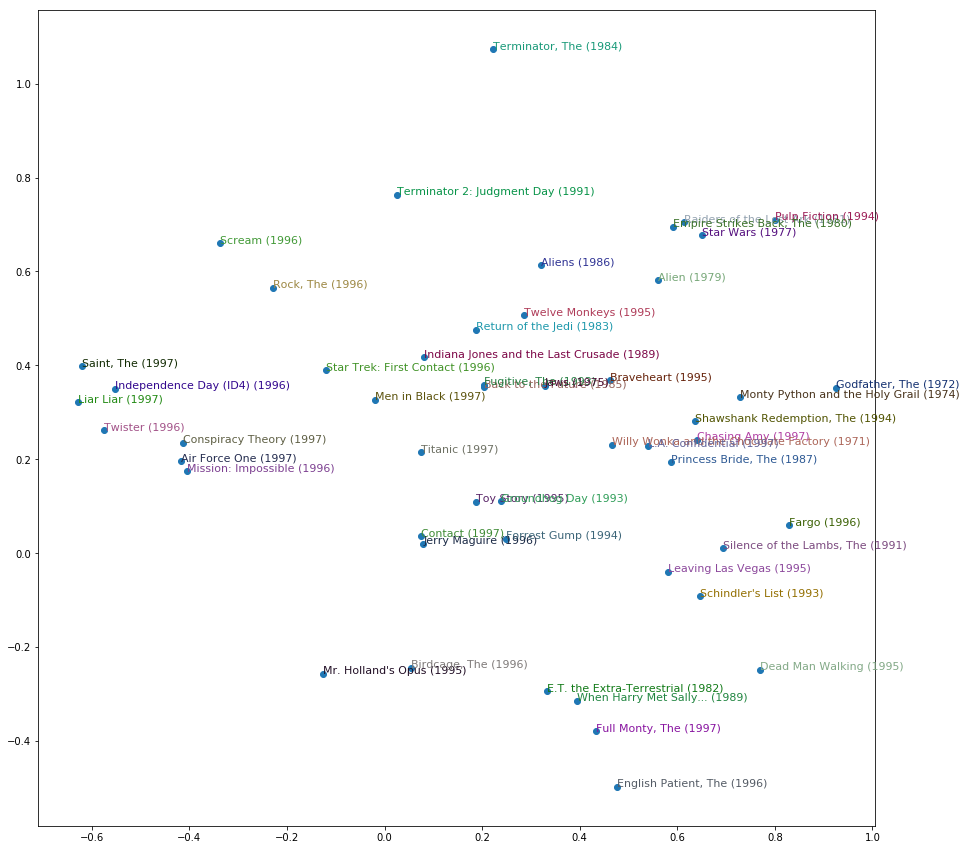

I've just cuddled them randomly to make them easier to see. This is just the top 50 most popular movies by how many times they've been rated. On this one factor, you've got The Terminators really high up here, and The English Patient and Schindler's List at the other end. Then The Godfather and Monty Python over here (on the right), and Independence Day and Liar Liar over there (on the left). So you get the idea. It's ind of fun. It would be interesting to see if you can come up with some stuff at work or other kind of datasets where you could try to pull out some features and play with them.

**Question**: Why am I sometimes getting negative loss when training? [[59:49](https://youtu.be/uQtTwhpv7Ew?t=3589)]

You shouldn't be. So you're doing something wrong. Particularly since people are uploading this, I guess other people have seen it too, so put it on the forum. We're going to be learning about cross entropy and negative log likelihood after the break today. They are loss functions that have very specific expectations about what your input looks like. And if your input doesn't look like that, then they're going to give very weird answers, so probably you press the wrong buttons. So don't do that.

### collab_learner [[1:00:43](https://youtu.be/uQtTwhpv7Ew?t=3643)]

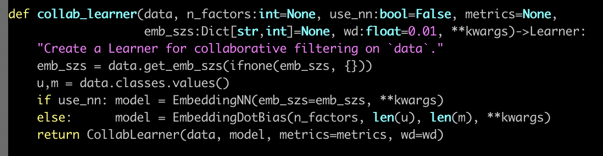

Here is the `collab_learner` function. The collab learner function as per usual takes a data bunch. And normally learners also take something where you ask for particular architectural details. In this case, there's only one thing which does that which is basically do you want to use a multi-layer neural net or do you want to use a classic collaborative filtering. We're only going to look at the classic collaborative filtering today, or maybe we'll briefly look at the other one too, we'll see.

So what actually happens here? Well basically we create an `EmbeddingDotBias` model, and then we pass back a learner which has our data and that model. So obviously all the interesting stuff is happening here in `EmbeddingDotBias`, so let's take a look at that.

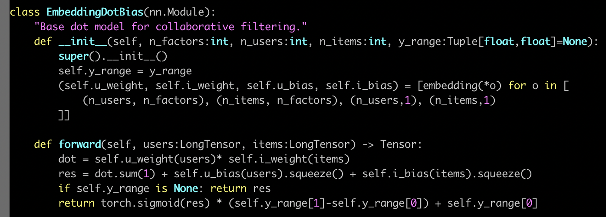

Here's our `EmbeddingDotBias` model. It is a `nn.Module`,  so in PyTorch, to remind you, all PyTorch layers and models are`nn.Module`'s. They are things that, once you create them, look exactly like a function. You call them with parentheses and you pass them arguments. But they're not functions. They don't even have `__call__`. Normally in Python, to make something look like a function, you have to give it a method called dunder call. Remember that means `__call__`, which doesn't exist here. The reason is that PyTorch actually expects you to have something called `forward` and that's what PyTorch will call for you when you call it like a function.

So when this model is being trained, to get the predictions it's actually going to call forward for us. So this (`forward`) is where we calculate our predictions. So this is where you can see, we grab our... Why is this `users` rather than `user`? That's because everything's done a mini-batch at a time. When I read the `forward` in a PyTorch module, I tend to ignore in my head the fact that there's a mini batch. And I pretend there's just one. Because PyTorch automatically handles all of the stuff about doing it to everything in the mini batch for you. So let's pretend there's just one user. So grab that user and what is this `self.u_weight`? `self.u_weight` is an embedding. We create an embedding for each of users by factors, items by factors, users by one, items by one. That makes sense, right? So users by one is the user's bias. Then users by factors is feature/embedding. So users by factors is the first tuple, so that's going to go in `u_weight` and `(n_users,1)` is the third, so that's going to go in `u_bias`.

Remember, when PyTorch creates our `nn.Module`, it calls dunder init. So this is where we have to create our weight matrices. We don't normally create the actual weight matrix tensors. We normally use PyTorch's convenience functions to do that for us, and we're going to see some of that after the break. For now, just recognize that this function is going to create an embedding matrix for us. It's going to be a PyTorch `nn.Module` as well, so therefore to actually pass stuff into that embedding matrix and get activations out, you treat it as if it was a function - stick it in parentheses. So if you want to look in the PyTorch source code and find `nn.Embedding`, you will find there's something called `.forward` in there which will do this array lookup for us.

[[1:05:29](https://youtu.be/uQtTwhpv7Ew?t=3929)]

Here's where we grab the users (`self.u_weight(users)`), here's where we grab the items (`self.i_weight(items)`). So we've now got the embeddings for each. So at this point, we multiply them together and sum them up, and then we add on the user bias and the item bias. Then if we've got a `y_range`, then we do our sigmoid trick. So the nice thing is, you now understand the entirety of this model. This is not just any model. This is a model that we just found which is at the very least highly competitive with and perhaps slightly better than some published table of pretty good numbers from a software group that does nothing but this. So you're doing well. This is nice.

### Embeddings are amazing[[1:07:03](https://youtu.be/uQtTwhpv7Ew?t=4023)]

This idea of interpreting embeddings is really interesting. As we'll see later in this lesson, the things that we create for categorical variables more generally in tabular data sets are also embedding matrices. And again, that's just a normal matrix multiplied by a one hot encoded input where we skip the computational and memory burden of it by doing it in a more efficient way, and it happens to end up with these interesting semantics kind of accidentally. There was [this really interesting paper](https://arxiv.org/abs/1604.06737) by these folks who came second in a Kaggle competition for something called Rossman. We will probably look in more detail at the Rossman competition in part two. I think we're gonna run out of time in part one. But it's basically this pretty standard tabular stuff. The main interesting stuffs in the pre-processing. And it was interesting because they came second despite the fact that the person who came first and pretty much everybody else who was the top of the leaderboard did a massive amount of highly specific feature engineering. Where else, these folks did way less feature engineering than anybody else. But instead they used a neural net, and this was at a time in 2016 when just no one did that. No one was doing neural nets for tabular data.

So the kind of stuff that we've been talking about kind of arose there or at least was kind of popularized there. And when I say popularized, I mean only popularized a tiny bit - still most people are unaware of this idea. But it's pretty cool because in their paper they showed that the main average percentage error for various techniques K nearest neighbors, random forests, and gradient boosted trees:

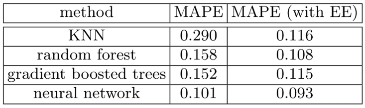

First, you know, neural nets just worked a lot better but then with entity embeddings (which is what they call this using entity matrices in tabular data), they actually added the entity embeddings to all of these different tasks after training them and they all got way better. So neural nets with entity embeddings are still the best but a random forest with empty embeddings was not at all far behind. That's kind of nice because you could train these entity matrices for products or stores or genome motifs or whatever and then use them in lots of different models, possibly using faster things like random forests but getting a lot of the benefits.

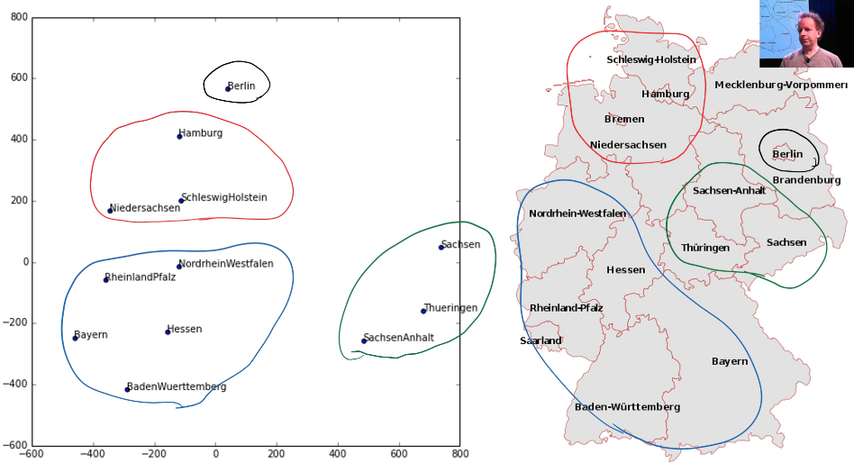

But here is something interesting. They took a two-dimensional projection of their embedding matrix for German state because this was a German supermarket chain using the same kind of approach we did - I don't remember if they use PCA or something else slightly different. And then here's the interesting thing. I've circled here  a few things in this embedding space, and I've circled it with the same color over here and it's like "oh my god, the embedding projection has actually discovered geography." They didn't do that but it's found things that are near by each other in grocery purchasing patterns because this was about predicting how many sales there will be. There is some Geographic element of that.


In fact, here is a graph of the distance between two embedding vectors. So you can just take an embedding vector and say what's the sum of squared compared to some other embedding vector. That's the Euclidean distance (i.e. what's the distance in embedding space) and then plotted against the distance in real life between shops, and you get this very strong positive correlation.

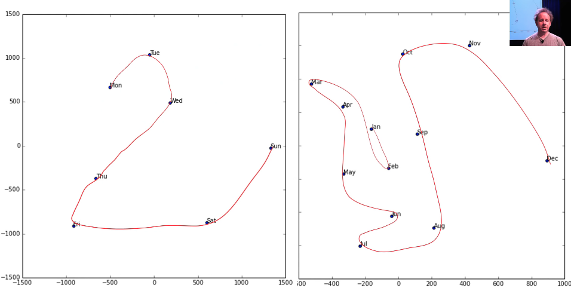

Here is an embedding space for the days of the week, and as you can see there's a very clear path through them. Here's the embedding space for the month of the year, and again there's a very clear path through them.

Embeddings are amazing, and I don't feel like anybody's even close to exploring the kind of interpretation that you could get. So if you've got genome motifs or plant species or products that your shop sells or whatever, it would be really interesting to train a few models, try and fine tune some embeddings, and then start looking at them in these ways in terms of similarity to other ones and clustering them and projecting them into 2d spaces and whatever. I think is really interesting.

### Regularization: Weight Decay [[1:12:09](https://youtu.be/uQtTwhpv7Ew?t=4329)]

We were trying to make sure we understood what every line of code did in this some pretty good collab learner model we built. The one piece missing is this`wd` piece, and `wd` stands for weight decay. So what is weight decay? Weight decay is a type of regularization. What is regularization?

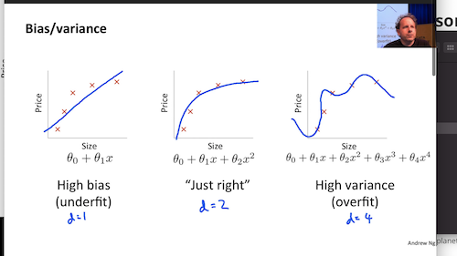

Let's start by going back to this nice little chart that Andrew Ng did in his terrific machine learning course where he plotted some data and then showed a few different lines through it. This one here, because Andrew's at Stanford he has to use Greek letters. We can say this is  but if you want to go there is a line. It's a line even if it's got a Greek letters. Here's a second-degree polynomial  - bit of curve, and here's a high degree polynomial which is curvy as anything.

So models with more parameters tend to look more like this. In traditional statistics, we say "let's use less parameters" because we don't want it to look like this. Because if it looks like this, then the predictions far left and far right, they're going to be all wrong. It's not going to generalize well. We're overfitting. So we avoid overfitting by using less parameters. So if any of you are unlucky enough to have been brainwashed by a background in statistics or psychology or econometrics or any of these kinds of courses, you're gonna have to unlearn the idea that you need less parameters. Because what you instead need to realize is you were fed this lie that you need less parameters because it's a convenient fiction for the real truth which is you don't want your function to be too complex. Having less parameters is one way of making it less complex. But what if you had a thousand parameters and 999 of those parameters were 1e-9? What if they were 0? If they were 0, they're not really there. Or if they were 1e-9, they're hardly there. So why can't I have lots of parameters if lots of them are really small? And the answer is you can. So this thing of counting the number of parameters is how we limit complexity is actually extremely limiting. It's a fiction that really has a lot of problems. So if in your head complexity is scored by how many parameters you have, you're doing it all wrong. Score it properly.

So why do we care? Why would I want to use more parameters? Because more parameters means more nonlinearities, more interactions, more curvy bits. And real life is full of curvy bits. Real life does not look like a straight line. But we don't want them to be more curvy than necessary or more interacting than necessary. Therefore let's use lots of parameters and then penalize complexity. So one way to penalize complexity (as I kind of suggested before) is let's sum up the value of your parameters. Now that doesn't quite work because some parameters are positive and some are negative. So what if we sum up the square of the parameters, and that's actually a really good idea.

Let's actually create a model, and in the loss function we're going to add the sum of the square of the parameters. Now here's a problem with that though. Maybe that number is way too big, and it's so big that the best loss is to set all of the parameters to zero. That would be no good. So we want to make sure that doesn't happen, so therefore let's not just add the sum of the squares of the parameters to the model but let's multiply that by some number that we choose. That number that we choose in fastai is called `wd`. That's what we are going to do. We are going take our loss function and we're going to add to it the sum of the squares of parameters multiplied by some number `wd`.

What should that number be? Generally, it should be 0.1. People with fancy machine learning PhDs are extremely skeptical and dismissive of any claims that a learning rate can be 3e-3 most of the time or a weight decay can be 0.1 most of the time. But here's the thing - we've done a lot of experiments on a lot of datasets, and we've had a lot of trouble finding anywhere a weight decay of 0.1 isn't great. However we don't make that the default. We actually make the default 0.01. Why? Because in those rare occasions where you have too much weight decay, no matter how much you train it just never quite fits well enough. Where else if you have too little weight decay, you can still train well. You'll just start to overfit, so you just have to stop a little bit early.

So we've been a little bit conservative with our defaults, but my suggestion to you is this. Now that you know that every learner has a `wd` argument and I should mention you won't always see it in this list:

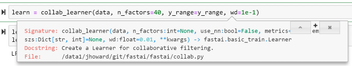

Because there's this concept of `**kwargs` in Python which is basically parameters that are going to get passed up the chain to the next thing that we call. So basically all of the learners will call eventually this constructor:

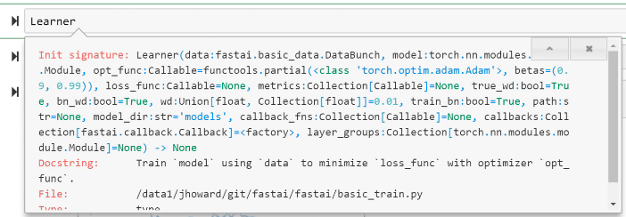

And this constructor has a `wd`. So this is just one of those things that you can either look in the docs or you now know it. Anytime you're constructing a learner from pretty much any kind of function in fastai, you can pass `wd`. And passing 0.1 instead of the default 0.01 will often help, so give it a go.
