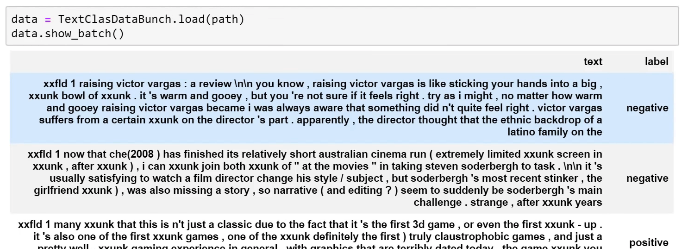

# NLP based on abbreviated Lesson 3

[Video](https://youtu.be/PW2HKkzdkKY) / [Lesson Forum](https://forums.fast.ai/t/lesson-3-official-resources-and-updates/29732)


### IMDB [[1:41:07](https://youtu.be/PW2HKkzdkKY?t=6067)]

[lesson3-imdb.ipynb](https://github.com/fastai/course-v3/blob/master/nbs/dl1/lesson3-imdb.ipynb)

Last example before we look at more foundational theory stuff, NLP. Next week, we're going to be looking at a lot more NLP, but let's now do the same thing but rather than creating a classification of pictures, let's try and classify documents. We're going to go through this in a lot more detail next week, but let's do the quick version.

```
%reload_ext autoreload
%autoreload 2
%matplotlib inline
```

```python
from fastai import *
from fastai.text import *
```

Rather than importing from `fastai.vision`, I now import, for the first time, from `fastai.text`. That's where you'll find all the application specific stuff for analyzing text documents.

In this case, we're going to use a dataset called IMDB. IMDB has lots of movie reviews. They're generally about a couple of thousand words, and each movie review has been classified as either negative or positive.

```python
path = untar_data(URLs.IMDB_SAMPLE)
path.ls()
```

```
[PosixPath('/home/jhoward/.fastai/data/imdb_sample/texts.csv'),
 PosixPath('/home/jhoward/.fastai/data/imdb_sample/models')]
```

 It's just in a CSV file, so we can use pandas to read it and we can take a little look.

```python
df = pd.read_csv(path/'texts.csv')
df.head()
```

|      | label    | text                                              | is_valid |
| ---- | -------- | ------------------------------------------------- | -------- |
| 0    | negative | Un-bleeping-believable! Meg Ryan doesn't even ... | False    |
| 1    | positive | This is a extremely well-made film. The acting... | False    |
| 2    | negative | Every once in a long while a movie will come a... | False    |
| 3    | positive | Name just says it all. I watched this movie wi... | False    |
| 4    | negative | This movie succeeds at being one of the most u... | False    |

```
df['text'][1]
```

```
'This is a extremely well-made film. The acting, script and camera-work are all first-rate. The music is good, too, though it is mostly early in the film, when things are still relatively cheery. There are no really superstars in the cast, though several faces will be familiar. The entire cast does an excellent job with the script.<br /><br />But it is hard to watch, because there is no good end to a situation like the one presented. It is now fashionable to blame the British for setting Hindus and Muslims against each other, and then cruelly separating them into two countries. There is some merit in this view, but it\'s also true that no one forced Hindus and Muslims in the region to mistreat each other as they did around the time of partition. It seems more likely that the British simply saw the tensions between the religions and were clever enough to exploit them to their own ends.<br /><br />The result is that there is much cruelty and inhumanity in the situation and this is very unpleasant to remember and to see on the screen. But it is never painted as a black-and-white case. There is baseness and nobility on both sides, and also the hope for change in the younger generation.<br /><br />There is redemption of a sort, in the end, when Puro has to make a hard choice between a man who has ruined her life, but also truly loved her, and her family which has disowned her, then later come looking for her. But by that point, she has no option that is without great pain for her.<br /><br />This film carries the message that both Muslims and Hindus have their grave faults, and also that both can be dignified and caring people. The reality of partition makes that realisation all the more wrenching, since there can never be real reconciliation across the India/Pakistan border. In that sense, it is similar to "Mr & Mrs Iyer".<br /><br />In the end, we were glad to have seen the film, even though the resolution was heartbreaking. If the UK and US could deal with their own histories of racism with this kind of frankness, they would certainly be better off.'
```

Basically as per usual, we can either use factory methods or the data block API to create a data bunch. So here's the quick way to create a data bunch from a CSV of texts:

```python
data_lm = TextDataBunch.from_csv(path, 'texts.csv')
```


At this point I could create a learner and start training it, but we're going to show you a little bit more detail which we mainly going to look at next week. The steps that actually happen when you create these data bunches, there's a few steps:

1. **Tokenization**: it takes those words and converts them into a standard form of tokens. Basically each token represents a word.

   

   But it does things like, see how "didn't" has been turned here into two separate words (`did` and `n't`)? And everything has been lowercased. See how "you're" has been turned into two separate words (`you` and `'re`)? So tokenization is trying to make sure that each "token" (i.e. each thing that we've got with spaces around it) represents a single linguistic concept. Also it finds words that are really rare (e.g. really rare names) and replaces them with a special token called unknown (`xxunk`). Anything's starting with `xx` in fastai is some special token. This is tokenization, so we end up with something where we've got a list of tokenized words. You'll also see that things like punctuation end up with spaces around them to make sure that they're separate tokens.

2. **Numericalization**: The next thing we do is we take a complete unique list of all of the possible tokens﹣ that's called the `vocab` which gets created for us.

   ```python
   data.vocab.itos[:10]
   ```

   ```
   ['xxunk', 'xxpad', 'the', ',', '.', 'and', 'a', 'of', 'to', 'is']
   ```

   So here is every possible token (the first ten of them) that appear in our all of the movie reviews. We then replace every movie review with a list of numbers.

   ```python
   data.train_ds[0][0].data[:10]
   ```

   ```
   array([ 43,  44,  40,  34, 171,  62,   6, 352,   3,  47])
   ```

   The list of numbers simply says what numbered thing in the vocab is in this place.

So through tokenization and numericalization, this is the standard way in NLP of turning a document into a list of numbers.

We can do that with the data block API:

```
data = (TextList.from_csv(path, 'texts.csv', cols='text')
                .split_from_df(col=2)
                .label_from_df(cols=0)
                .databunch())
```

 This time, it's not ImageFilesList, it's TextList from a CSV and create a data bunch. At that point, we can start to create a model.

As we learn about next week, when we do NLP classification, we actually create two models:

1. The first model is something called a **language model** which we train in a kind of a usual way.

   ```python
   learn = language_model_learner(data_lm, pretrained_model=URLs.WT103, drop_mult=0.3)
   ```

   We say we want to create a language model learner, train it, save it, and we unfreeze, train some more.

2. After we've created a language model, we fine-tune it to create the **classifier**. We create the data bunch of the classifier, create a learner, train it and we end up with some accuracy.

That's the really quick version. We're going to go through it in more detail next week, but you can see the basic idea of training and NLP classifier is very similar to creating every other model we've seen so far. The current state of the art for IMDB classification is actually the algorithm that we built and published with colleague named Sebastian Ruder and what I just showed you is pretty much the state of the art algorithm with some minor tweaks. You can get this up to about 95% if you try really hard. So this is very close to the state of the art accuracy that we developed.


**Question**: There's a question about tokenization. I'm curious about how tokenizing words works when they depend on each other such as San Francisco. [[1:56:45](https://youtu.be/PW2HKkzdkKY?t=7005)]

How do you tokenize something like San Francisco. San Francisco contains two tokens `San` `Francisco`. That's it. That's how you tokenize San Francisco. The question may be coming from people who have done traditional NLP which often need to use these things called n-grams. N-rams are this idea of a lot of NLP in the old days was all built on top of linear models where you basically counted how many times particular strings of text appeared like the phrase San Francisco. That would be a bigram for an n-gram with an n of 2. The cool thing is that with deep learning, we don't have to worry about that. Like with many things, a lot of the complex feature engineering disappears when you do deep learning. So with deep learning, each token is literally just a word (or in the case that the word really consists of two words like `you're` you split it into two words) and then what we're going to do is we're going to then let the deep learning model figure out how best to combine words together. Now when we see like let the beep learning model figure it out, of course all we really mean is find the weight matrices using gradient descent that gives the right answer. There's not really much more to it than that.

Again, there's some minor tweaks. In the second half of the course, we're going to be learning about the particular tweak for image models which is using a convolution that'll be a CNN, for language there's a particular tweak we do called using recurrent models or an RNN, but they're very minor tweaks on what we've just described. S o basically it turns out with an RNN, that it can learn that `San` plus `Francisco` has a different meaning when those two things are together.
