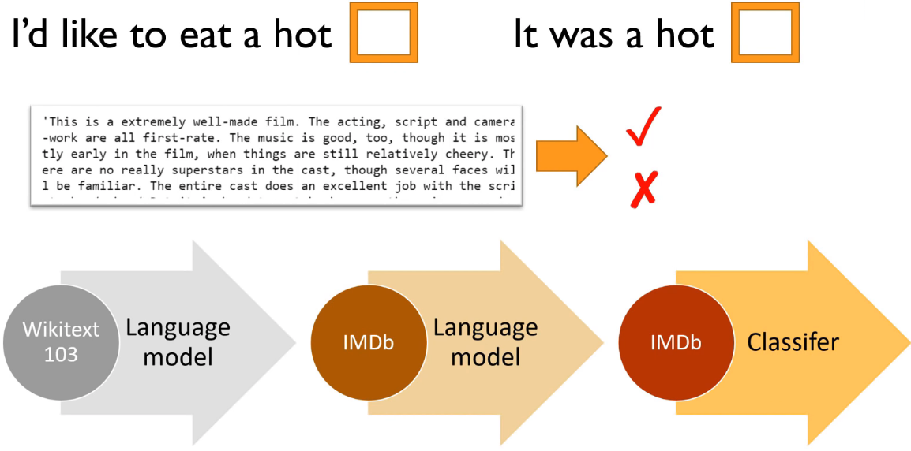
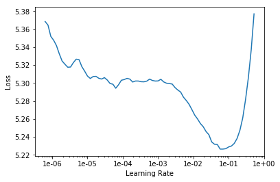
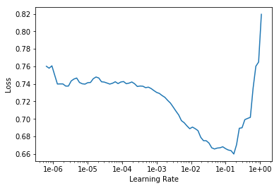
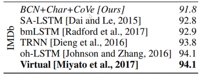

# NLP based on abbreviated Lesson 4

[Video](https://youtu.be/C9UdVPE3ynA) / [Lesson Forum](https://forums.fast.ai/t/lesson-4-official-resources-and-updates/30317)

Welcome to Lesson 4! We are going to finish our journey through these key applications. We've already looked at a range of vision applications. We've looked a classification, localization, image regression. We briefly touched on NLP. We're going to do a deeper dive into NLP transfer learning today. We're going to then look at tabular data and  collaborative filtering which are both super useful applications.

Then we're going to take a complete u-turn. We're going to take that collaborative filtering example and dive deeply into it to understand exactly what's happening mathematically﹣exactly what's happening in the computer. And we're going to use that to gradually go back in reverse order through the applications again in order to understand exactly what's going on behind the scenes of all of those applications.

## Natural Language Processing (NLP) [[2:00](https://youtu.be/C9UdVPE3ynA?t=120)]

What I wanted to start with is going back over NLP a little bit to understand really what was going on there.

### A quick review

So first of all, a quick review. Remember NLP is natural language processing. It's about taking text and doing something with it. Text classification is particularly useful﹣practically useful applications. It's what we're going to start off focusing on. Because classifying a text or classifying a document can be used for anything from:

- Spam prevention
- Identifying fake news
- Finding a diagnosis from medical reports
- Finding mentions of your product in Twitter

So it's pretty interesting. And actually there was a great example during the week from one of our students [@howkhang](https://forums.fast.ai/u/howkhang) who is a lawyer and he mentioned on [the forum](https://forums.fast.ai/t/share-your-work-here/27676/468) that he had a really great results from classifying legal texts using this NLP approach. And I thought this was a great example. This is the post that they presented at an academic conference this week describing the approach:


This series of three steps that you see here (and I'm sure you recognize this classification matrix) is what we're going to start by digging into.



We're going to start out with a movie review like this one and decide whether it's positive or negative sentiment about the movie. That is the problem. We have, in the training set, 25,000 movie reviews and for each one we have like one bit of information: they liked it, or they didn't like it. That's what we're going to look into a lot more detail today and in the current lessons. Our neural networks (remember, they're just a bunch of matrix multiplies and simple nonlinearities﹣particularly replacing negatives with zeros), those weight matrices start out random. So if you start out with with some random parameters and try to train those parameters to learn how to recognize positive vs. negative movie reviews, you literally have 25,000 ones and zeros to actually tell you I like this one I don't like that one. That's clearly not enough information to learn, basically, how to speak English﹣how to speak English well enough to recognize they liked this or they didn't like this. Sometimes that can be pretty nuanced. Particularly with movie reviews because these are like online movie reviews on IMDB, people can often use sarcasm. It could be really quite tricky.

Until very recently, in fact, this year, neural nets didn't do a good job at all of this kind of classification problem. And that was why﹣there's not enough information available. So the trick, hopefully you can all guess, is to use transfer learning. It's always the trick.

Last year in this course I tried something crazy which was I thought what if I try transform learning to demonstrate that it can work for NLP as well. I tried it out and it worked extraordinarily well. So here we are, a year later, and transfer learning in NLP is absolutely the hit thing. And I'm going to describe to you what happens.

### Transfer learning in NLP [[6:04](https://youtu.be/C9UdVPE3ynA?t=364)]

The key thing is we're going to start with the same kind of thing that we used for computer vision﹣a pre-trained model that's been trained to do something different to what we're doing with it. For ImageNet, that was originally built as a model to predict which of a thousand categories each photo falls into. And people then fine-tune that for all kinds of different things as you've seen. So we're going to start with a pre-trained model that's going to do something else. Not movie review classification. We're going to start with a pre-trained model which is called a language model.

A language model has a very specific meaning in NLP and it's this. A language model is a model that learns to predict the next word of a sentence. To predict the next word of a sentence, you actually have to know quite a lot about English (assuming you're doing it in English) and quite a lot of world knowledge. By world knowledge, I'll give you an example.

Here's your language model and it has read:

- "I'd like to eat a hot ___": Obviously, "dog", right?  
- "It was a hot ___": Probably "day"

Now previous approaches to NLP use something called n-grams largely which is basically saying how often do these pairs or triplets of words tend to appear next to each other. And n-grams are terrible at this kind of thing. As you can see, there's not enough information here to decide what the next word probably is. But with a neural net, you absolutely can.

So here's the nice thing. If you train a neural net to predict the next word of a sentence then you actually have a lot of information. Rather than having a single bit to every 2,000 word movie review: "liked it" or "didn't like it", every single word, you can try and predict the next word. So in a 2,000 word movie review, there are 1,999 opportunities to predict the next word. Better still, you don't just have to look at movie reviews. Because really the hard thing isn't so much as "does this person like the movie or not?" but "how do you speak English?". So you can learn "how do you speak English?" (roughly) from some much bigger set of documents. So what we did was we started with Wikipedia.

#### Wikitext 103 [[8:30](https://youtu.be/C9UdVPE3ynA?t=510)]

Stephen Merity and some of his colleagues built something called Wikitext 103 dataset which is simply a subset of most of the largest articles from Wikipedia with a little bit of pre-processing that's available for download. So you're basically grabbing Wikipedia and then I built a language model on all of Wikipedia. So I just built a neural net which would predict the next word in every significantly sized Wikipedia article. That's a lot of information. If I remember correctly, it's something like a billion tokens. So we've got a billion separate things to predict. Every time we make a mistake on one of those predictions, we get the loss, we get gradients from that, and we can update our weights, and they can better and better until we can get pretty good at predicting the next word of Wikipedia.

Why is that useful? Because at that point, I've got a model that knows probably how to complete sentences like this, so it knows quite a lot about English and quite a lot about how the world works﹣what kinds of things tend to be hot in different situations, for instance. Ideally, it would learn things like "in 1996 in a speech to the United Nations, United States president _____ said "... Now that would be a really good language model, because it would actually have to know who is this United States president in that year. So getting really good at training language models is a great way to teach a neural-net a lot about what is our world, what's in our world, how do things work in our world. It's a really fascinating topic, and it's actually one that philosophers have been studying for hundreds of years now. There's actually a whole theory of philosophy which is about what can be learned from studying language alone. So it turns out, apparently, quite a lot.

So here's the interesting thing. You can start by training a language model on all of Wikipedia, and then we can make that available to all of you. Just like a pre-trained ImageNet model for vision, we've now made available a pre-trained Wikitext model for NLP not because it's particularly useful of itself (predicting the next word of sentences is somewhat useful, but not normally what we want to do), but it's a model that understands a lot about language and a lot about what language describes. So then, we can take that and we can do transfer learning to create a new language model that's specifically good at predicting the next word of movie reviews.

#### Fine-tuning Wikitext to create a new language model [[11:10](https://youtu.be/C9UdVPE3ynA?t=670)]

If we can build a language model that's good at predicting the next word of movie reviews pre-trained with the Wikitext model, then that's going to understand a lot about "my favorite actor is Tom ____. " Or "I thought the photography was fantastic but I wasn't really so happy about the _____ (director)." It's going to learn a lot about specifically how movie reviews are written. It'll even learn things like what are the names of some popular movies.

That would then mean we can still use a huge corpus of lots of movie reviews even if we don't know whether they're positive or negative to learn a lot about how movie reviews are written. So for all of this pre-training and all of this language model fine-tuning, we don't need any labels at all. It is what the researcher Yann LeCun calls **self supervised learning**. In other words, it's a classic supervised model﹣we have labels, but the labels are not things that somebody else have created. They're built into the dataset itself. So this is really really neat. Because at this point, we've now got something that's good at understanding movie reviews and we can fine-tune that with transfer learning to do the thing we want to do which in this case is to classify movie reviews to be positive or negative. So my hope was (when I tried this last year) that at that point, 25,000 ones and zeros would be enough feedback to fine-tune that model and it turned out it absolutely was.

**Question**: Does the language model approach works for text in forums that are informal English, misspelled words or slangs or shortforms like s6 instead of Samsung S 6? [[12:47](https://youtu.be/C9UdVPE3ynA?t=767)]

Yes, absolutely it does. Particularly if you start with your wikitext model and then fine-tune it with your "target" corpus. Corpus is just a bunch of documents (emails, tweets, medical reports, or whatever). You could fine-tune it so it can learn a bit about the specifics of the slang , abbreviations, or whatever that didn't appear in the full corpus. So interestingly, this is one of the big things that people were surprised about when we did this research last year. People thought that learning from something like Wikipedia wouldn't be that helpful because it's not that representative of how people tend to write. But it turns out it's extremely helpful because there's a much a difference between Wikipedia and random words than there is between like Wikipedia and reddit. So it kind of gets you 99% of the way there.

So language models themselves can be quite powerful. For example there was [a blog post](https://blog.swiftkey.com/swiftkey-debuts-worlds-first-smartphone-keyboard-powered-by-neural-networks/) from SwiftKey (the folks that do the mobile-phone predictive text keyboard) and they describe how they kind of rewrote their underlying model to use neural nets. This was a year or two ago. Now most phone keyboards seem to do this. You'll be typing away on your mobile phone, and in the prediction there will be something telling you what word you might want next. So that's a language model in your phone.

Another example was the researcher Andrej Karpathy who now runs all this stuff at Tesla, back when he was a PhD student, he created [a language model of text in LaTeX documents](http://karpathy.github.io/2015/05/21/rnn-effectiveness/) and created these automatic generation of LaTeX documents that then became these automatically generated papers. That's pretty cute.

We're not really that interested in the output of the language model ourselves. We're just interested in it because it's helpful with this process.

#### Review of the basic process [[15:14](https://youtu.be/C9UdVPE3ynA?t=914)]

We briefly looked at the process last week. The basic process is, we're going to start with the data in some format. So for example, we've prepared a little IMDB sample that you can use which is in CSV file. You can read it in with Pandas and there's negative or positive, the text of each movie review, and boolean of is it in the validation set or the training set.

```python
path = untar_data(URLs.IMDB_SAMPLE)
path.ls()
```

```
[PosixPath('/home/jhoward/.fastai/data/imdb_sample/texts.csv'),
 PosixPath('/home/jhoward/.fastai/data/imdb_sample/models')]
```

```python
df = pd.read_csv(path/'texts.csv')
df.head()
```

|      | label    | text                                              | is_valid |
| ---- | -------- | ------------------------------------------------- | -------- |
| 0    | negative | Un-bleeping-believable! Meg Ryan doesn't even ... | False    |
| 1    | positive | This is a extremely well-made film. The acting... | False    |
| 2    | negative | Every once in a long while a movie will come a... | False    |
| 3    | positive | Name just says it all. I watched this movie wi... | False    |
| 4    | negative | This movie succeeds at being one of the most u... | False    |

So there's an example of a movie review:

```python
df['text'][1]
```

```
'This is a extremely well-made film. The acting, script and camera-work are all first-rate. The music is good, too, though it is mostly early in the film, when things are still relatively cheery. There are no really superstars in the cast, though several faces will be familiar. The entire cast does an excellent job with the script.<br /><br />But it is hard to watch, because there is no good end to a situation like the one presented. It is now fashionable to blame the British for setting Hindus and Muslims against each other, and then cruelly separating them into two countries. There is some merit in this view, but it\'s also true that no one forced Hindus and Muslims in the region to mistreat each other as they did around the time of partition. It seems more likely that the British simply saw the tensions between the religions and were clever enough to exploit them to their own ends.<br /><br />The result is that there is much cruelty and inhumanity in the situation and this is very unpleasant to remember and to see on the screen. But it is never painted as a black-and-white case. There is baseness and nobility on both sides, and also the hope for change in the younger generation.<br /><br />There is redemption of a sort, in the end, when Puro has to make a hard choice between a man who has ruined her life, but also truly loved her, and her family which has disowned her, then later come looking for her. But by that point, she has no option that is without great pain for her.<br /><br />This film carries the message that both Muslims and Hindus have their grave faults, and also that both can be dignified and caring people. The reality of partition makes that realisation all the more wrenching, since there can never be real reconciliation across the India/Pakistan border. In that sense, it is similar to "Mr & Mrs Iyer".<br /><br />In the end, we were glad to have seen the film, even though the resolution was heartbreaking. If the UK and US could deal with their own histories of racism with this kind of frankness, they would certainly be better off.'
```


So you can just go `TextDataBunch.from_csv` to grab a language model specific data bunch:

```python
data_lm = TextDataBunch.from_csv(path, 'texts.csv')
```

And then you can create a learner from that in the usual way and fit it.  

```python
data_lm.save()
```

You can save the data bunch which means that the pre-processing that is done, you don't have to do it again. You can just load it.

```python
data = TextDataBunch.load(path)
```


What happens behind the scenes if we now load it as a classification data bunch (that's going to allow us to see the labels as well)?

```
data = TextClasDataBunch.load(path)
data.show_batch()
```

| text                                                         | label    |
| ------------------------------------------------------------ | -------- |
| xxbos xxfld 1 raising victor vargas : a review \n\n you know , raising victor vargas is like sticking your hands into a big , xxunk bowl of xxunk . it 's warm and gooey , but you 're not sure if it feels right . try as i might | negative |
| xxbos xxfld 1 now that che(2008 ) has finished its relatively short australian cinema run ( extremely limited xxunk screen in xxunk , after xxunk ) , i can xxunk join both xxunk of " at the movies " in taking steven soderbergh to task . \n\n it 's usually | negative |
| xxbos xxfld 1 many xxunk that this is n't just a classic due to the fact that it 's the first xxup 3d game , or even the first xxunk - up . it 's also one of the first xxunk games , one of the xxunk definitely the first | positive |
| xxbos xxfld 1 i really wanted to love this show . i truly , honestly did . \n\n for the first time , gay viewers get their own version of the " the bachelor " . with the help of his obligatory " hag " xxunk , james , a | negative |
| xxbos xxfld 1 this film sat on my xxunk for weeks before i watched it . i xxunk a self - indulgent xxunk flick about relationships gone bad . i was wrong ; this was an xxunk xxunk into the xxunk - up xxunk of new xxunk . \n\n the | positive |

As we described, it basically creates a separate unit (i.e. a "token") for each separate part of a word. So most of them are just for words, but sometimes if it's like an `'s` from `it's`, it will get its own token. Every bit of punctuation tends to get its own token (a comma, a full stop, and so forth).

Then the next thing that we do is a numericalization which is where we find what are all of the unique tokens that appear here, and we create a big list of them. Here's the first ten in order of frequency:

```python
data.vocab.itos[:10]
```

```
['xxunk', 'xxpad', 'the', ',', '.', 'and', 'a', 'of', 'to', 'is']
```

And that big list of unique possible tokens is called the vocabulary which we just call it a "vocab". So what we then do is we replace the tokens with the ID of where is that token in the vocab:

```
data.train_ds[0][0]
```

```
Text xxbos xxfld 1 he now has a name , an identity , some memories and a a lost girlfriend . all he wanted was to disappear , but still , they xxunk him and destroyed the world he hardly built . now he wants some explanation , and to get ride of the people how made him what he is . yeah , jason bourne is back , and this time , he 's here with a vengeance .
```

```
data.train_ds[0][0].data[:10]
```

```
array([ 43,  44,  40,  34, 171,  62,   6, 352,   3,  47])
```

That's numericalization. Here's the thing though. As you'll learn, every word in our vocab is going to require a separate row in a weight matrix in our neural net. So to avoid that weight matrix getting too huge, we restrict the vocab to no more than (by default) 60,000 words.  And if a word doesn't appear more than two times, we don't put it in the vocab either. So we keep the vocab to a reasonable size in that way. When you see these `xxunk`, that's an unknown token. It just means this was something that was not a common enough word to appear in our vocab.

We also have a couple of other special tokens like (see `fastai.text.transform.py` for up-to-date info):

- `xxfld`: This is a special thing where if you've got like title, summary, abstract, body, (i. e. separate parts of a document), each one will get a separate field and so they will get numbered (e.g. `xxfld 2`).
- `xxup`: If there's something in all caps, it gets lower cased and a token called `xxup` will get added to it.

#### With the data block API [[18:31](https://youtu.be/C9UdVPE3ynA?t=1111)]

Personally, I more often use the data block API because there's less to remember about exactly what data bunch to use, and what parameters and so forth, and it can be a bit more flexible.

```python
data = (TextList.from_csv(path, 'texts.csv', cols='text')
                .split_from_df(col=2)
                .label_from_df(cols=0)
                .databunch())
```

So another approach to doing this is to just decide:

- What kind of list you're creating (i.e. what's your independent variable)? So in this case, my independent variable is text.
- What is it coming from? A CSV.
- How do you want to split it into validation versus training? So in this case, column number two was the `is_valid` flag.
- How do you want to label it? With positive or negative sentiment, for example. So column zero had that.
-  Then turn that into a data bunch.

That's going to do the same thing.

```pythoin
path = untar_data(URLs.IMDB)
path.ls()
```

```
[PosixPath('/home/jhoward/.fastai/data/imdb/imdb.vocab'),
 PosixPath('/home/jhoward/.fastai/data/imdb/models'),
 PosixPath('/home/jhoward/.fastai/data/imdb/tmp_lm'),
 PosixPath('/home/jhoward/.fastai/data/imdb/train'),
 PosixPath('/home/jhoward/.fastai/data/imdb/test'),
 PosixPath('/home/jhoward/.fastai/data/imdb/README'),
 PosixPath('/home/jhoward/.fastai/data/imdb/tmp_clas')]
```

```python
(path/'train').ls()
```

```
[PosixPath('/home/jhoward/.fastai/data/imdb/train/pos'),
 PosixPath('/home/jhoward/.fastai/data/imdb/train/unsup'),
 PosixPath('/home/jhoward/.fastai/data/imdb/train/unsupBow.feat'),
 PosixPath('/home/jhoward/.fastai/data/imdb/train/labeledBow.feat'),
 PosixPath('/home/jhoward/.fastai/data/imdb/train/neg')]
```

Now let's grab the whole data set which has:

- 25,000 reviews in training
- 25,000 interviews in validation
- 50,000 unsupervised movie reviews (50,000 movie reviews that haven't been scored at all)

#### Language model [[19:44](https://youtu.be/C9UdVPE3ynA?t=1184)]

We're going to start with the language model. Now the good news is, we don't have to train the Wikitext 103 language model. Not that it's difficult﹣you can just download the wikitext 103 corpus, and run the same code. But it takes two or three days on a decent GPU, so not much point in you doing it. You may as well start with ours. Even if you've got a big corpus of like medical documents or legal documents, you should still start with Wikitext 103. There's just no reason to start with random weights. It's always good to use transfer learning if you can.

So we're gonna start fine-tuning our IMDB language model.

```python
bs=48
```

```python
data_lm = (TextList.from_folder(path)
           #Inputs: all the text files in path
            .filter_by_folder(include=['train', 'test'])
           #We may have other temp folders that contain text files so we only keep what's in train and test
            .random_split_by_pct(0.1)
           #We randomly split and keep 10% (10,000 reviews) for validation
            .label_for_lm()           
           #We want to do a language model so we label accordingly
            .databunch(bs=bs))
data_lm.save('tmp_lm')
```

We can say:

- It's a list of text files﹣the full IMDB actually is not in a CSV. Each document is a separate text file.
- Say where it is﹣in this case we have to make sure we just to include the `train` and `test` folders.
- We randomly split it by 0.1.

Now this is interesting﹣10%. Why are we randomly splitting it by 10% rather than using the predefined train and test they gave us? This is one of the cool things about transfer learning. Even though our validation set has to be held aside, it's actually only the labels that we have to keep aside. So we're not allowed to use the labels in the test set. If you think about in a Kaggle competition, you certainly can't use the labels because they don't even give them to you. But you can certainly use the independent variables. So in this case, you could absolutely use the text that is in the test set to train your language model. This is a good trick﹣when you do the language model, concatenate the training and test set together, and then just split out a smaller validation set so you've got more data to train your language model. So that's a little trick.

So if you're doing NLP stuff on Kaggle, for example, or you've just got a smaller subset of labeled data, make sure that you use all of the text you have to train in your language model, because there's no reason not to.

- How are we going to label it? Remember, a language model kind of has its own labels. The text itself is labels so label for a language model (`label_for_lm`) does that for us.
- And create a data bunch and save it. That takes a few minutes to tokenize and numericalize.


Since it takes some few minutes, we save it. Later on you can just load it. No need to run it again.

```python
data_lm = TextLMDataBunch.load(path, 'tmp_lm', bs=bs)
```

```python
data_lm.show_batch()
```

| idx  | text                                                         |
| ---- | ------------------------------------------------------------ |
| 0    | xxbos after seeing the truman show , i wanted to see the other films by weir . i would say this is a good one to start with . the plot : \n\n the wife of a doctor ( who is trying to impress his bosses , so he can get xxunk trying to finish her written course , while he s at work . but one day a strange man , who says that he s a plumber , tells her he s been called out to repair some pipes in there flat . |
| 1    | and turn to the wisdom of homeless people & ghosts . that 's a good plan . i would never recommend this movie ; partly because the sexual content is unnecessarily graphic , but also because it really does n't offer any valuable insight . check out " yentl " if you want to see a much more useful treatment of jewish tradition at odds with society . xxbos creep is the story of kate ( potente ) , an intensely unlikeable bourgeois bitch that finds herself somehow sleeping through the noise of the last |
| 2    | been done before but there is something about the way its done here that lifts it up from the rest of the pack . \n\n 8 out of 10 for dinosaur / monster lovers . xxbos i rented this movie to see how the sony xxunk camera shoots , ( i recently purchased the same camera ) and was blown away by the story and the acting . the directing , acting , editing was all above what i expected from what appeared at first glance to be a " low budget " type of |
| 3    | troubles . nigel and xxunk are the perfect team , i 'd watch their show any day ! i was so crushed when they removed it , and anytime they had it on xxup tv after that i was over the moon ! they put it on on demand one summer ( only the first eight episodes or so ) and i 'd spend whole afternoons watching them one after the other ... but the worst part ? it is now back on a channel called xxunk - and xxup it xxup 's xxup on |
| 4    | movie ! ) the movie is about edward , a obsessive - compulsive , nice guy , who happens to be a film editor . he is then lent to another department in the building , and he is sent to the posh yet violent world of sam campbell , the splatter and gore department . sam campbell , eddy 's new boss , is telling eddy about the big break on his movies , the gruesome loose limbs series , and he needs eddy to make the movie somewhat less violent so they can |


#### Training [[22:29](https://youtu.be/C9UdVPE3ynA?t=1349)]

At this point things are going to look very familiar. We create a learner:

```python
learn = language_model_learner(data_lm, pretrained_model=URLs.WT103, drop_mult=0.3)
```

But instead of creating a CNN learner, we're going to create a language model learner. So behind the scenes, this is actually not going to create a CNN (a convolutional neural network), it's going to create an RNN (a recurrent neural network). We're going to be learning exactly how they're built over the coming lessons, but in short they're the same basic structure. The input goes into a weight matrix (i.e. a matrix multiply), that then you replace the negatives with zeros, and it goes into another matrix multiply, and so forth a bunch of times. So it's the same basic structure.

As usual, when we create a learner, you have to pass in two things:

- The data: so here's our language model data
- What pre-trade model we want to use: here, the pre-trade model is the Wikitext 103 model that will be downloaded for you from fastai if you haven't used it before just like ImageNet pre-trained models are downloaded for you.

This here (`drop_mult=0.3`) sets the amount of dropout. We haven't talked about that yet. We've talked briefly about this idea that there is something called regularization and you can reduce the regularization to avoid underfitting. So for now, just know that by using a number lower than one is because when I first tried to run this, I was under fitting. So if you reduced that number, then it will avoid under fitting.

Okay. so we've got a learner, we can `lr_find` and looks pretty standard:

```python
learn.lr_find()
```

```python
learn.recorder.plot(skip_end=15)
```



Then we can fit one cycle.

```python
learn.fit_one_cycle(1, 1e-2, moms=(0.8,0.7))
```

```
Total time: 12:42
epoch  train_loss  valid_loss  accuracy
1      4.591534    4.429290    0.251909  (12:42)
```

What's happening here is we are just fine-tuning the last layers. Normally after we fine-tune the last layers, the next thing we do is we go `unfreeze` and train the whole thing. So here it is:

```python
learn.unfreeze()
learn.fit_one_cycle(10, 1e-3, moms=(0.8,0.7))
```

```
Total time: 2:22:17
epoch  train_loss  valid_loss  accuracy
1      4.307920    4.245430    0.271067  (14:14)
2      4.253745    4.162714    0.281017  (14:13)
3      4.166390    4.114120    0.287092  (14:14)
4      4.099329    4.068735    0.292060  (14:10)
5      4.048801    4.035339    0.295645  (14:12)
6      3.980410    4.009860    0.298551  (14:12)
7      3.947437    3.991286    0.300850  (14:14)
8      3.897383    3.977569    0.302463  (14:15)
9      3.866736    3.972447    0.303147  (14:14)
10     3.847952    3.972852    0.303105  (14:15)
```

As you can see, even on a pretty beefy GPU that takes two or three hours. In fact, I'm still under fitting.  So probably tonight, I might train it overnight and try and do a little bit better. I'm guessing I could probably train this a bit longer because you can see the accuracy hasn't started going down again. So I wouldn't mind try to train that a bit longer. But the accuracy, it's interesting. 0.3 means we're guessing the next word of the movie review correctly about a third of the time. That sounds like a pretty high number﹣the idea that you can actually guess the next word that often. So it's a good sign that my language model is doing pretty well. For more limited domain documents (like medical transcripts and legal transcripts), you'll often find this accuracy gets a lot higher. So sometimes this can be even 50% or more. But 0.3 or more is pretty good.


#### Predicting with Language Model [[25:43](https://youtu.be/C9UdVPE3ynA?t=1543)]

You can now run `learn.predict` and pass in the start of a sentence, and it will try and finish off that sentence for you.

```python
learn.predict('I liked this movie because ', 100, temperature=1.1, min_p=0.001)
```

```
Total time: 00:10
```

```
'I liked this movie because  of course after yeah funny later that the world reason settings - the movie that perfect the kill of the same plot - a mention of the most of course . do xxup diamonds and the " xxup disappeared kill of course and the movie niece , from the care more the story of the let character , " i was a lot \'s the little performance is not only . the excellent for the most of course , with the minutes night on the into movies ( ! , in the movie its the first ever ! \n\n a'
```

Now I should mention, this is not designed to be a good text generation system. This is really more designed to check that it seems to be creating something that's vaguely sensible. There's a lot lot of tricks that you can use to generate much higher quality text﹣none of which we're using here. But you can kind of see that it's certainly not random words that it's generating. It sounds vaguely English like even though it doesn't make any sense.

At this point, we have a movie review model. So now we're going to save that in order to load it into our classifier (i.e. to be a pre-trained model for the classifier). But I actually don't want to save the whole thing. A lot of the second half of the language model is all about predicting the next word rather than about understanding the sentence so far. So the bit which is specifically about understanding the sentence so far is called the **encoder**, so I just save that (i.e. the bit that understands the sentence rather than the bit that generates the word).

```python
learn.save_encoder('fine_tuned_enc')
```


#### Classifier [[27:18](https://youtu.be/C9UdVPE3ynA?t=1638)]

Now we're ready to create our classifier. Step one, as per usual, is to create a data bunch, and we're going to do basically exactly the same thing:

```python
data_clas = (TextList.from_folder(path, vocab=data_lm.vocab)
             #grab all the text files in path
             .split_by_folder(valid='test')
             #split by train and valid folder (that only keeps 'train' and 'test' so no need to filter)
             .label_from_folder(classes=['neg', 'pos'])
             #remove docs with labels not in above list (i.e. 'unsup')
             .filter_missing_y()
             #label them all with their folders
             .databunch(bs=50))
data_clas.save('tmp_clas')
```

But we want to make sure that it uses exactly the same vocab that are used for the language model. If word number 10 was `the` in the language model, we need to make sure that word number 10 is `the` in the classifier. Because otherwise, the pre-trained model is going to be totally meaningless. So that's why we pass in the vocab from the language model to make sure that this data bunch is going to have exactly the same vocab. That's an important step.

`split_by_folder`﹣remember, the last time we had split randomly, but this time we need to make sure that the labels of the test set are not touched. So we split by folder.

And then this time we label it not for a language model but we label these classes (`['neg', 'pos']`). Then finally create a data bunch.

Sometimes you'll find that you ran out of GPU memory. I was running this in an 11G machine, so you should make sure this number (`bs`) is a bit lower if you run out of memory. You may also want to make sure you restart the notebook and kind of start it just from here (classifier section). Batch size 50 is as high as I could get on an 11G card. If you're using a p2 or p3 on Amazon or the K80 on Google, for example, I think you'll get 16G so you might be able to make this bit higher, get it up to 64. So you can find whatever batch size fits on your card.

So here is our data bunch:

```python
data_clas = TextClasDataBunch.load(path, 'tmp_clas', bs=bs)
data_clas.show_batch()
```

| text                                                         | label |
| ------------------------------------------------------------ | ----- |
| xxfld 1 match 1 : tag team table match bubba ray and spike dudley vs eddie guerrero and chris benoit bubba ray and spike dudley started things off with a tag team table match against eddie guerrero and chris benoit . according to the rules of the match , both | pos   |
| xxfld 1 i have never seen any of spike lee 's prior films , as their trailers never caught my interest . i have seen , and admire denzel washington , and jodie foster 's work , and have several of their dvds . i was , however , entirely | neg   |
| xxfld 1 pier paolo pasolini , or pee - pee - pee as i prefer to call him ( due to his love of showing male genitals ) , is perhaps xxup the most overrated european marxist director - and they are thick on the ground . how anyone can | neg   |
| xxfld 1 chris rock deserves better than he gives himself in " down to earth . " as directed by brothers chris & paul weitz of " american pie " fame , this uninspired remake of warren beatty 's 1978 fantasy " heaven can wait , " itself a rehash | neg   |
| xxfld 1 yesterday , i went to the monthly antique flea market that comes to town . i really have no interest in such things , but i went for the fellowship of friends who do have such an interest . looking over the hundreds of vendor , passing many | pos   |

```python
learn = text_classifier_learner(data_clas, drop_mult=0.5)
learn.load_encoder('fine_tuned_enc')
learn.freeze()
```

This time, rather than creating a language model learner, we're creating a text classifier learner. But again, same thing﹣pass in the data that we want, figure out how much regularization we need. If you're overfitting then you can increase this number (`drop_mult`). If you're underfitting, you can decrease the number. And most importantly, load in our pre train model. Remember, specifically it's this half of the model called the encoder which is the bit that we want to load in.

Then freeze, lr_find, find the learning rate and fit for a little bit.

```python
learn.lr_find()
```

```python
learn.recorder.plot()
```



```python
learn.fit_one_cycle(1, 2e-2, moms=(0.8,0.7))
```

```
Total time: 02:46
epoch  train_loss  valid_loss  accuracy
1      0.294225    0.210385    0.918960  (02:46)
```

We're already up nearly to 92% accuracy after less than three minutes of training. So this is a nice thing. In your particular domain (whether it be law, medicine, journalism, government, or whatever), you probably only need to train your domain's language model once. And that might take overnight to train well. But once you've got it, you can now very quickly create all kinds of different classifiers and models with that. In this case, already a pretty good model after three minutes. So when you first start doing this. you might find it a bit annoying that your first models take four hours or more to create that language model. But the key thing to remember is you only have to do that once for your entire domain of stuff that you're interested in. And then you can build lots of different classifiers and other models on top of that in a few minutes.

```python
learn.save('first')
```

```python
learn.load('first');
```

```python
learn.freeze_to(-2)
learn.fit_one_cycle(1, slice(1e-2/(2.6**4),1e-2), moms=(0.8,0.7))
```

```
Total time: 03:03
epoch  train_loss  valid_loss  accuracy
1      0.268781    0.180993    0.930760  (03:03)
```

We can save that to make sure we don't have to run it again.

And then, here's something interesting. I'm not going to say `unfreeze`. Instead, I'm going to say `freeze_to`. What that says is unfreeze the last two layers, don't unfreeze the whole thing. We've just found it really helps with these text classification not to unfreeze the whole thing, but to unfreeze one layer at a time.

- unfreeze the last two layers
- train it a little bit more
- unfreeze the next layer again
- train it a little bit more
- unfreeze the whole thing
- train it a little bit more

```python
learn.save('second')
```

```python
learn.load('second');
```

```python
learn.freeze_to(-3)
learn.fit_one_cycle(1, slice(5e-3/(2.6**4),5e-3), moms=(0.8,0.7))
```

```
Total time: 04:06
epoch  train_loss  valid_loss  accuracy
1      0.211133    0.161494    0.941280  (04:06)
```

```python
learn.save('third')
```

```python
learn.load('third');
```

```python
learn.unfreeze()
learn.fit_one_cycle(2, slice(1e-3/(2.6**4),1e-3), moms=(0.8,0.7))
```

```
Total time: 10:01
epoch  train_loss  valid_loss  accuracy
1      0.188145    0.155038    0.942480  (05:00)
2      0.159475    0.153531    0.944040  (05:01)
```

You also see I'm passing in this thing (`moms=(0.8,0.7)`)﹣momentums equals 0.8,0.7. We are going to learn exactly what that means probably next week. We may even automate it. So maybe by the time you watch the video of this, this won't even be necessary anymore. Basically we found for training recurrent neural networks (RNNs), it really helps to decrease the momentum a little bit. So that's what that is.

That gets us a 94.4% accuracy after about half an hour or less of training. There's quite a lot less of training the actual classifier. We can actually get this quite a bit better with a few tricks. I don't know if we'll learn all the tricks this part. It might be next part. But even this very simple standard approach is pretty great.



If we compare it to last year's state of the art on IMDb, this is from The [CoVe paper](https://papers.nips.cc/paper/7209-learned-in-translation-contextualized-word-vectors.pdf) from McCann et al. at Salesforce Research. Their paper was 91.8% accurate. And the best paper they could find, they found a fairly domain-specific sentiment analysis paper from 2017, they've got 94.1%. And here, we've got 94.4%. And the best models I've been able to build aince have been about 95.1%. So if you're looking to do text classification, this really standardized transfer learning approach works super well.


**Question**: How to combine NLP (tokenized) data with meta data (tabular data) with Fastai? For instance, for IMBb classification, how to use information like who the actors are, year made, genre, etc. [[49:14](https://youtu.be/C9UdVPE3ynA?t=2954)]

Yeah, we're not quite up to that yet. So we need to learn a little bit more about how neural net architectures work as well. But conceptually, it's kind of the same as the way we combine categorical variables and continuous variables. Basically in the neural network, you can have two different sets of inputs merging together into some layer. It could go into an early layer or into a later layer, it kind of depends. If it's like text and an image and some metadata, you probably want the text going into an RNN, the image going into a CNN, the metadata going into some kind of tabular model like this. And then you'd have them basically all concatenated together, and then go through some fully connected layers and train them end to end. We will probably largely get into that in part two. In fact we might entirely get into that in part two. I'm not sure if we have time to cover it in part one. But conceptually, it's a fairly simple extension of what we'll be learning in the next three weeks.


**Question**: How does the language model trained in this manner perform on code switched data (Hindi written in English words), or text with a lot of emojis?

Text with emojis, it'll be fine. There's not many emojis in Wikipedia and where they are at Wikipedia it's more like a Wikipedia page about the emoji rather than the emoji being used in a sensible place. But you can (and should) do this language model fine-tuning where you take a corpus of text where people are using emojis in usual ways, and so you fine-tune the Wikitext language model to your reddit or Twitter or whatever language model. And there aren't that many emojis if you think about it. There are hundreds of thousands of possible words that people can be using, but a small number of possible emojis. So it'll very quickly learn how those emojis are being used. So that's a piece of cake.

I'm not really familiar with Hindi, but I'll take an example I'm very familiar with which is Mandarin. In Mandarin, you could have a model that's trained with Chinese characters. There are about five or six thousand Chinese characters in common use, but there's also a romanization of those characters called pinyin. It's a bit tricky because although there's a nearly direct mapping from the character to the pinyin (I mean there is a direct mapping but that pronunciations are not exactly direct),  there isn't direct mapping from the pinyin to the character because one pinyin corresponds to multiple characters.

So the first thing to note is that if you're going to use this approach for Chinese, you would need to start with a Chinese language model.

Actually fastai has something called [Language Model Zoo](https://forums.fast.ai/t/language-model-zoo-gorilla/14623) where we're adding more and more language models for different languages, and also increasingly for different domain areas like English medical texts or even language models for things other than NLP like genome sequences, molecular data, musical MIDI notes, and so forth.  So you would you obviously start there.

To then convert that (in either simplified or traditional Chinese) into pinyin, you could either map the vocab directly, or as you'll learn, these multi-layer models﹣it's only the first layer that basically converts the tokens into a set of vectors, you can actually throw that away and fine-tune just the first layer of the model. So that second part is going to require a few more weeks of learning before you exactly understand how to do that and so forth, but if this is something you're interested in doing, we can talk about it on the forum because it's a nice test of understanding.
