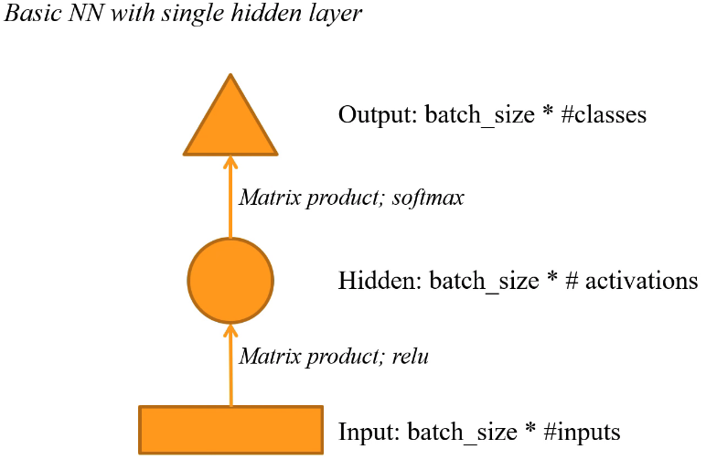
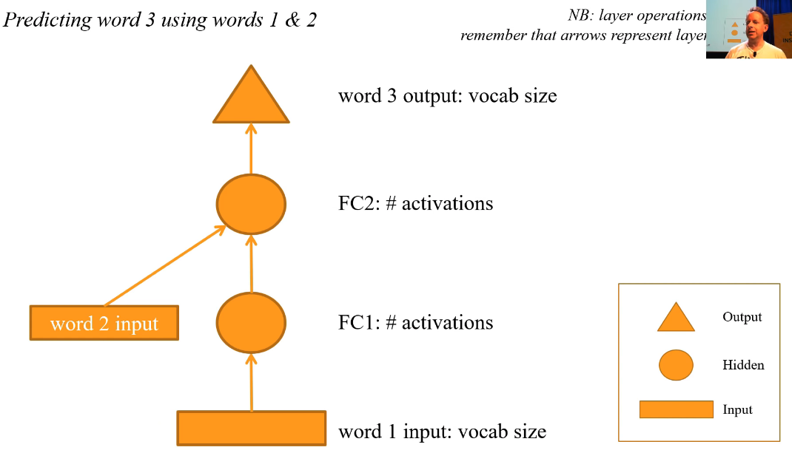
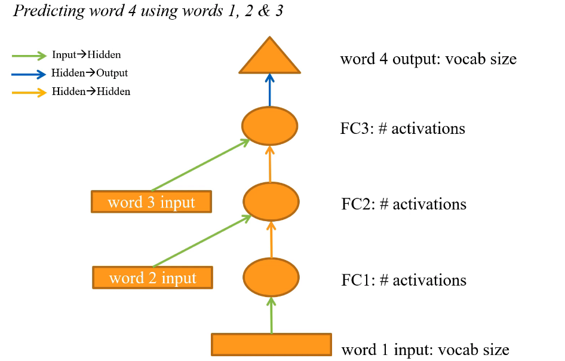
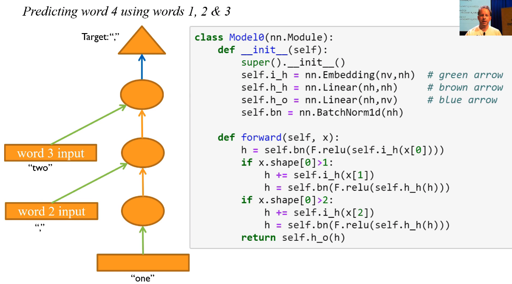
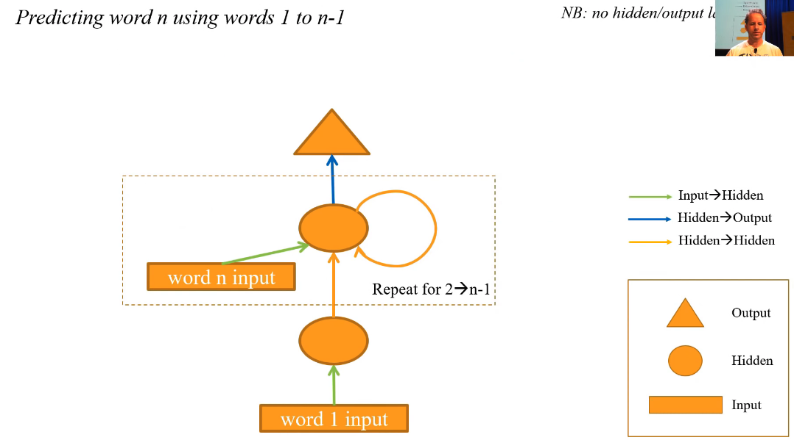
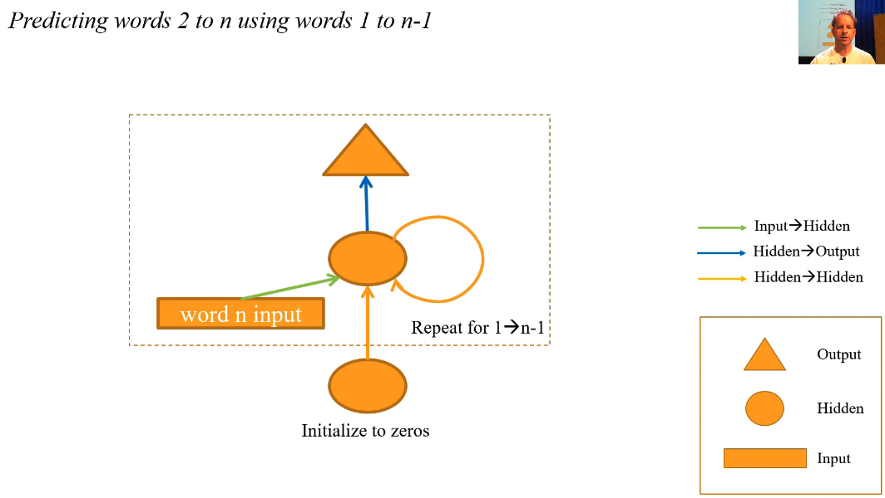
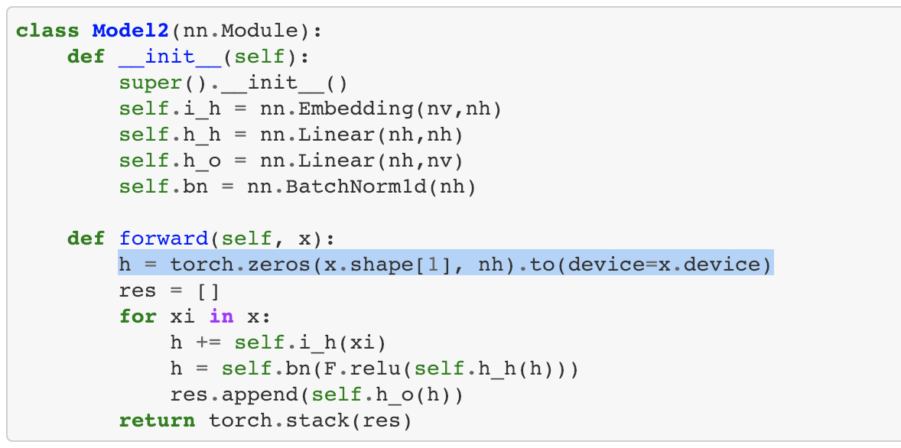
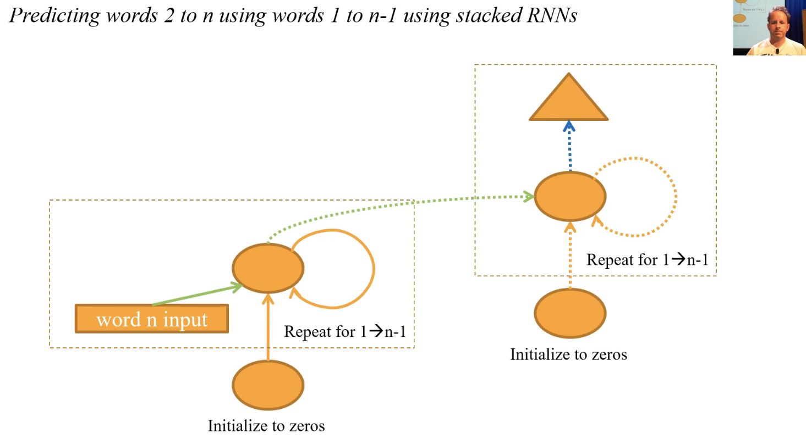

# RNNs based on abbreviated Lesson 7


### Recurrent Neural Network (RNN) [[1:38:31](https://youtu.be/nWpdkZE2_cc?t=5911)]

One thing that doesn't get here is RNNs. So that's the last thing we're going to do. RNNs; I'm going to introduce a little diagrammatic method here to explain to RNNs, and the diagrammatic method, I'll start by showing your basic neural net with a single hidden layer.



**Rectangle** means an input. That'll be batch size by number of inputs. An **arrow** means a layer (broadly defined) such as matrix product followed by ReLU. A **circle** is activations. So this case, we have one set of hidden activations and so given that the input was number of inputs, this here (the first arrow) is a matrix of number of inputs by number of activations. So the output will be batch size by a number of activations.

It's really important you know how to calculate these shapes. So go `learn.summary()` lots to see all the shapes. Then here's another arrow, so that means it's another layer; matrix product followed by non-linearity. In this case, we go into the output, so we use softmax.

Then **triangle** means an output. This matrix product will be number of activations by a number of classes, so our output is batch size by number classes.



Let's reuse the that key; triangle is output, circle is activations (hidden state - we also call that) and rectangle is input. Let's now imagine that we wanted to get a big document, split it into sets of three words at a time, and grab each set of three words and then try to predict the third word using the first two words. If we had the dataset in place, we could:

1. Grab word 1 as an input.
2. Chuck it through an embedding, create some activations.
3. Pass that through a matrix product and nonlinearity.
4. Grab the second word.
5. Put it through an embedding.
6. Then we could either add those two things together or concatenate them. Generally speaking, when you see two sets of activations coming together in a diagram, you normally have a choice of concatenate or or add. And that's going to create the second bunch of activations.
7. Then you can put it through one more fully connected layer and softmax to create an output.

So that would be a totally standard, fully connected neural net with one very minor tweak which is concatenating or adding at this point, which we could use to try to predict the third word from pairs of two words.

Remember, arrows represent layer operations and I removed in this one the specifics of what they are because they're always an affine function followed by a non-linearity.



Let's go further. What if we wanted to predict word 4 using words 1 and 2 and 3? It's basically the same picture as last time except with one extra input and one extra circle. But I want to point something out which is each time we go from rectangle to circle, we're doing the same thing - we're doing an embedding. Which is just a particular kind of matrix multiply where you have a one hot encoded input. Each time we go from circle to circle, we're basically taking one piece of hidden state (a.k.a activations) and turning it into another set of activations by saying we're now at the next word. Then when we go from circle to triangle, we're doing something else again which is we're saying let's convert the hidden state (i.e. these activations) into an output. So I've colored each of those arrows differently. Each of those arrows should probably use the same weight matrix because it's doing the same thing. So why would you have a different set of embeddings for each word or a different matrix to multiply by to go from this hidden state to this hidden state versus this one? So this is what we're going to build.

### [Human numbers](https://github.com/fastai/course-v3/blob/master/nbs/dl1/lesson7-human-numbers.ipynb) [[1:43:11](https://youtu.be/nWpdkZE2_cc?t=6191)]

We're now going to jump into human numbers which is lesson7-human-numbers.ipynb. This is a dataset that I created which literally just contains all the numbers from 1 to 9,999 written out in English.

We're going to try to create a language model that can predict the next word in this document. It's just a toy example for this purpose. In this case, we only have one document. That one document is the list of numbers. So we can use a `TextList` to create an item list with text in for the training of the validation.

```python
from fastai.text import *
```

```python
bs=64
```

```python
path = untar_data(URLs.HUMAN_NUMBERS)
path.ls()
```

```
[PosixPath('/data1/jhoward/git/course-v3/nbs/dl1/data/human_numbers/valid.txt'),
 PosixPath('/data1/jhoward/git/course-v3/nbs/dl1/data/human_numbers/train.txt'),
 PosixPath('/data1/jhoward/git/course-v3/nbs/dl1/data/human_numbers/models')]
```

```python
def readnums(d): return [', '.join(o.strip() for o in open(path/d).readlines())]
```

```python
train_txt = readnums('train.txt'); train_txt[0][:80]
```

```
'one, two, three, four, five, six, seven, eight, nine, ten, eleven, twelve, thirt'
```

```python
valid_txt = readnums('valid.txt'); valid_txt[0][-80:]
```

```
' nine thousand nine hundred ninety eight, nine thousand nine hundred ninety nine'
```

```python
train = TextList(train_txt, path=path)
valid = TextList(valid_txt, path=path)

src = ItemLists(path=path, train=train, valid=valid).label_for_lm()
data = src.databunch(bs=bs)
```

In this case, the validation set is the numbers from 8,000 onwards, and the training set is 1 to 8,000. We can combine them together, turn that into a data bunch.

```python
train[0].text[:80]
```

```
'xxbos one , two , three , four , five , six , seven , eight , nine , ten , eleve'
```

We only have one document, so `train[0]` is the document grab its `.text` that's how you grab the contents of a text list, and here are the first 80 characters. It starts with a special token `xxbos`. Anything starting with `xx` is a special fast.ai token, `bos` is the beginning of stream token. It basically says this is the start of a document, and it's very helpful in NLP to know when documents start so that your models can learn to recognize them.

```python
len(data.valid_ds[0][0].data)
```

```
13017
```

The validation set contains 13,000 tokens. So 13,000 words or punctuation marks because everything between spaces is a separate token.

```
data.bptt, len(data.valid_dl)
```

```
(70, 3)
```

```
13017/70/bs
```

```
2.905580357142857
```

The batch size that we asked for was 64, and then by default it uses something called `bptt` of 70. `bptt`, as we briefly mentioned, stands for "back prop through time". That's the sequence length. For each of our 64 document segments, we split it up into lists of 70 words that we look at at one time. So what we do for the validation set is we grab this entire string of 13,000 tokens, and then we split it into 64 roughly equal sized sections. People very very very often think I'm saying something different. I did not say "they are of length 64" - they're not. They're **64 roughly equally sized segments**. So we take the first 1/64 of the document -  piece 1. The second 1/64 - piece 2.

Then for each of those 1/64 of the document, we then split those into pieces of length 70. So let's now say for those 13,000 tokens, how many batches are there? Well, divide by batch size and divide by 70, so there's going to be 3 batches.

```python
it = iter(data.valid_dl)
x1,y1 = next(it)
x2,y2 = next(it)
x3,y3 = next(it)
it.close()
```

```python
x1.numel()+x2.numel()+x3.numel()
```

```
12928
```

Let's grab an iterator for a data loader, grab 1 2 3 batches (the X and the Y), and let's add up the number of elements, and we get back slightly less than 13,017 because there's a little bit left over at the end that doesn't quite make up a full batch. This is the kind of stuff you should play around with a lot - lots of shapes and sizes and stuff and iterators.

```python
x1.shape,y1.shape
```

```
(torch.Size([95, 64]), torch.Size([95, 64]))
```

```python
x2.shape,y2.shape
```

```
(torch.Size([69, 64]), torch.Size([69, 64]))
```

As you can see, it's 95 by 64. I claimed it was going to be 70 by 64. That's because our data loader for language models slightly randomizes `bptt` just to give you a bit more shuffling - get bit more randomization - it helps the model.

```
x1[:,0]
```

```
tensor([ 2, 18, 10, 11,  8, 18, 10, 12,  8, 18, 10, 13,  8, 18, 10, 14,  8, 18,
        10, 15,  8, 18, 10, 16,  8, 18, 10, 17,  8, 18, 10, 18,  8, 18, 10, 19,
         8, 18, 10, 28,  8, 18, 10, 29,  8, 18, 10, 30,  8, 18, 10, 31,  8, 18,
        10, 32,  8, 18, 10, 33,  8, 18, 10, 34,  8, 18, 10, 35,  8, 18, 10, 36,
         8, 18, 10, 37,  8, 18, 10, 20,  8, 18, 10, 20, 11,  8, 18, 10, 20, 12,
         8, 18, 10, 20, 13], device='cuda:0')
```

```
y1[:,0]
```

```
tensor([18, 10, 11,  8, 18, 10, 12,  8, 18, 10, 13,  8, 18, 10, 14,  8, 18, 10,
        15,  8, 18, 10, 16,  8, 18, 10, 17,  8, 18, 10, 18,  8, 18, 10, 19,  8,
        18, 10, 28,  8, 18, 10, 29,  8, 18, 10, 30,  8, 18, 10, 31,  8, 18, 10,
        32,  8, 18, 10, 33,  8, 18, 10, 34,  8, 18, 10, 35,  8, 18, 10, 36,  8,
        18, 10, 37,  8, 18, 10, 20,  8, 18, 10, 20, 11,  8, 18, 10, 20, 12,  8,
        18, 10, 20, 13,  8], device='cuda:0')
```

So here, you can see the first batch of X (remember, we've numeric alized all these) and here's the first batch of Y. And you'll see here `x1` is `[2, 18, 10, 11, 8, ...]`, `y1` is `[18, 10, 11, 8, ...]`. So `y1` is offset by 1 from `x1`. Because that's what you want to do with a language model. We want to predict the next word. So after 2, should come 18, and after 18, should come 10.

```python
v = data.valid_ds.vocab
```

```python
v.textify(x1[:,0])
```

```
'xxbos eight thousand one , eight thousand two , eight thousand three , eight thousand four , eight thousand five , eight thousand six , eight thousand seven , eight thousand eight , eight thousand nine , eight thousand ten , eight thousand eleven , eight thousand twelve , eight thousand thirteen , eight thousand fourteen , eight thousand fifteen , eight thousand sixteen , eight thousand seventeen , eight thousand eighteen , eight thousand nineteen , eight thousand twenty , eight thousand twenty one , eight thousand twenty two , eight thousand twenty three'
```

```python
v.textify(y1[:,0])
```

```
'eight thousand one , eight thousand two , eight thousand three , eight thousand four , eight thousand five , eight thousand six , eight thousand seven , eight thousand eight , eight thousand nine , eight thousand ten , eight thousand eleven , eight thousand twelve , eight thousand thirteen , eight thousand fourteen , eight thousand fifteen , eight thousand sixteen , eight thousand seventeen , eight thousand eighteen , eight thousand nineteen , eight thousand twenty , eight thousand twenty one , eight thousand twenty two , eight thousand twenty three ,'
```

You can grab the vocab for this dataset, and a vocab has a `textify` so if we look at exactly the same thing but with `textify`, that will just look it up in the vocab. So here you can see `xxbos eight thousand one` where else in the `y`, there's no `xxbos`, it's just `eight thousand one`. So after `xxbos` is `eight`, after `eight` is `thousand`, after `thousand` is `one`.

```python
v.textify(x2[:,0])
```

```
', eight thousand twenty four , eight thousand twenty five , eight thousand twenty six , eight thousand twenty seven , eight thousand twenty eight , eight thousand twenty nine , eight thousand thirty , eight thousand thirty one , eight thousand thirty two , eight thousand thirty three , eight thousand thirty four , eight thousand thirty five , eight thousand thirty six , eight thousand thirty seven'
```

```python
v.textify(x3[:,0])
```

```
', eight thousand thirty eight , eight thousand thirty nine , eight thousand forty , eight thousand forty one , eight thousand forty two , eight thousand forty three , eight thousand forty four , eight thousand forty'
```

Then after we get 8023, comes `x2`, and look at this, we're always looking at column 0, so this is the first batch (the first mini batch) comes 8024 and then `x3`, all the way up to 8,040 .

```python
v.textify(x1[:,1])
```

```
', eight thousand forty six , eight thousand forty seven , eight thousand forty eight , eight thousand forty nine , eight thousand fifty , eight thousand fifty one , eight thousand fifty two , eight thousand fifty three , eight thousand fifty four , eight thousand fifty five , eight thousand fifty six , eight thousand fifty seven , eight thousand fifty eight , eight thousand fifty nine , eight thousand sixty , eight thousand sixty one , eight thousand sixty two , eight thousand sixty three , eight thousand sixty four , eight'
```

```python
v.textify(x2[:,1])
```

```
'thousand sixty five , eight thousand sixty six , eight thousand sixty seven , eight thousand sixty eight , eight thousand sixty nine , eight thousand seventy , eight thousand seventy one , eight thousand seventy two , eight thousand seventy three , eight thousand seventy four , eight thousand seventy five , eight thousand seventy six , eight thousand seventy seven , eight thousand seventy eight , eight'
```

```python
v.textify(x3[:,1])
```

```
'thousand seventy nine , eight thousand eighty , eight thousand eighty one , eight thousand eighty two , eight thousand eighty three , eight thousand eighty four , eight thousand eighty five , eight thousand eighty six ,'
```

```python
v.textify(x3[:,-1])
```

```
'ninety , nine thousand nine hundred ninety one , nine thousand nine hundred ninety two , nine thousand nine hundred ninety three , nine thousand nine hundred ninety four , nine thousand nine hundred ninety five , nine'
```

Then we can go right back to the start, but look at batch index 1 which is batch number 2. Now we can continue. A slight skip from 8,040 to 8,046, that's because the last mini batch wasn't quite complete. What this means is that every mini batch joins up with a previous mini batch. So you can go straight from x1[0] to x2[0] - it continues 8,023, 8,024. If you took the same thing for `:,1`, you'll also see they join up. So all the mini batches join up.

```python
data.show_batch(ds_type=DatasetType.Valid)
```

| idx  | text                                                         |
| ---- | ------------------------------------------------------------ |
| 0    | xxbos eight thousand one , eight thousand two , eight thousand three , eight thousand four , eight thousand five , eight thousand six , eight thousand seven , eight thousand eight , eight thousand nine , eight thousand ten , eight thousand eleven , eight thousand twelve , eight thousand thirteen , eight thousand fourteen , eight thousand fifteen , eight thousand sixteen , eight thousand |
| 1    | , eight thousand forty six , eight thousand forty seven , eight thousand forty eight , eight thousand forty nine , eight thousand fifty , eight thousand fifty one , eight thousand fifty two , eight thousand fifty three , eight thousand fifty four , eight thousand fifty five , eight thousand fifty six , eight thousand fifty seven , eight thousand fifty eight , eight thousand |
| 2    | thousand eighty seven , eight thousand eighty eight , eight thousand eighty nine , eight thousand ninety , eight thousand ninety one , eight thousand ninety two , eight thousand ninety three , eight thousand ninety four , eight thousand ninety five , eight thousand ninety six , eight thousand ninety seven , eight thousand ninety eight , eight thousand ninety nine , eight thousand one hundred |
| 3    | thousand one hundred twenty three , eight thousand one hundred twenty four , eight thousand one hundred twenty five , eight thousand one hundred twenty six , eight thousand one hundred twenty seven , eight thousand one hundred twenty eight , eight thousand one hundred twenty nine , eight thousand one hundred thirty , eight thousand one hundred thirty one , eight thousand one hundred thirty two |
| 4    | fifty two , eight thousand one hundred fifty three , eight thousand one hundred fifty four , eight thousand one hundred fifty five , eight thousand one hundred fifty six , eight thousand one hundred fifty seven , eight thousand one hundred fifty eight , eight thousand one hundred fifty nine , eight thousand one hundred sixty , eight thousand one hundred sixty one , eight thousand |

That's the data. We can do show_batch to see it.

```python
data = src.databunch(bs=bs, bptt=3, max_len=0, p_bptt=1.)
```

```python
x,y = data.one_batch()
x.shape,y.shape
```

```
(torch.Size([3, 64]), torch.Size([3, 64]))
```

```python
nv = len(v.itos); nv
```

```
38
```

```
nh=64
```

```
def loss4(input,target): return F.cross_entropy(input, target[-1])
def acc4 (input,target): return accuracy(input, target[-1])
```

Here is our model which is doing what we saw in the diagram:

```
class Model0(nn.Module):
    def __init__(self):
        super().__init__()
        self.i_h = nn.Embedding(nv,nh)  # green arrow
        self.h_h = nn.Linear(nh,nh)     # brown arrow
        self.h_o = nn.Linear(nh,nv)     # blue arrow
        self.bn = nn.BatchNorm1d(nh)

    def forward(self, x):
        h = self.bn(F.relu(self.i_h(x[0])))
        if x.shape[0]>1:
            h += self.i_h(x[1])
            h = self.bn(F.relu(self.h_h(h)))
        if x.shape[0]>2:
            h += self.i_h(x[2])
            h = self.bn(F.relu(self.h_h(h)))
        return self.h_o(h)
```

This is just a code copied over:



It content contains 1 embedding (i.e. the green arrow), one hidden to hidden - brown arrow layer, and one hidden to output. So each colored arrow has a single matrix. Then in the forward pass, we take our first input `x[0]` and put it through input to hidden (the green arrow), create our first set of activations which we call `h`. Assuming that there is a second word, because sometimes we might be at the end of a batch where there isn't a second word. Assume there is a second word then we would add to `h` the result of `x[1]` put through the green arrow (that's `i_h`). Then we would say, okay our new `h` is the result of those two added together, put through our hidden to hidden (orange arrow), and then ReLU then batch norm. Then for the second word, do exactly the same thing. Then finally blue arrow - put it through `h_o`.

So that's how we convert our diagram to code. Nothing new here at all. We can chuck that in a learner, and we can train it - 46%.

```python
learn = Learner(data, Model0(), loss_func=loss4, metrics=acc4)
```

```python
learn.fit_one_cycle(6, 1e-4)
```

Total time: 00:05

| epoch | train_loss | valid_loss | acc4     |
| ----- | ---------- | ---------- | -------- |
| 1     | 3.533459   | 3.489706   | 0.098855 |
| 2     | 3.011390   | 3.033105   | 0.450031 |
| 3     | 2.452748   | 2.552569   | 0.461247 |
| 4     | 2.154685   | 2.315783   | 0.461711 |
| 5     | 2.039904   | 2.236383   | 0.462020 |
| 6     | 2.016217   | 2.225322   | 0.462020 |

#### Same thing with a loop [[1:50:48](https://youtu.be/nWpdkZE2_cc?t=6648)]

Let's take this code and recognize it's pretty awful. There's a lot of duplicate code, and as coders, when we see duplicate code, what do we do? We refactor. So we should refactor this into a loop.

```python
class Model1(nn.Module):
    def __init__(self):
        super().__init__()
        self.i_h = nn.Embedding(nv,nh)  # green arrow
        self.h_h = nn.Linear(nh,nh)     # brown arrow
        self.h_o = nn.Linear(nh,nv)     # blue arrow
        self.bn = nn.BatchNorm1d(nh)

    def forward(self, x):
        h = torch.zeros(x.shape[1], nh).to(device=x.device)
        for xi in x:
            h += self.i_h(xi)
            h  = self.bn(F.relu(self.h_h(h)))
        return self.h_o(h)
```

Here we are. We've refactored it into a loop. So now we're going for each `xi` in `x`, and doing it in the loop. Guess what? That's an RNN. An RNN is just a refactoring. It's not anything new. This is now an RNN. And let's refactor our diagram:



This is the same diagram, but I've just replaced it with my loop. It does the same thing, so here it is. It's got exactly the same `__init__`, literally exactly the same, just popped a loop here. Before I start, I just have to make sure that I've got a bunch of zeros to add to. And of course, I get exactly the same result when I train it.

```python
learn = Learner(data, Model1(), loss_func=loss4, metrics=acc4)
```

```python
learn.fit_one_cycle(6, 1e-4)
```

Total time: 00:07

| epoch | train_loss | valid_loss | acc4     |
| ----- | ---------- | ---------- | -------- |
| 1     | 3.463261   | 3.436951   | 0.172881 |
| 2     | 2.937433   | 2.903948   | 0.385984 |
| 3     | 2.405134   | 2.457942   | 0.454827 |
| 4     | 2.100047   | 2.231621   | 0.459468 |
| 5     | 1.981868   | 2.155234   | 0.460860 |
| 6     | 1.957631   | 2.144365   | 0.461324 |

One nice thing about the loop though, is now this will work even if I'm not predicting the fourth word from the previous three, but the ninth word from the previous eight. It'll work for any arbitrarily length long sequence which is nice.

So let's up the `bptt` to 20 since we can now. And let's now say, okay, instead of just predicting the th word from the previous , let's try to predict the second word from the first, the third from the second, and the fourth from the third, and so forth. Look at our loss function.


Previously we were comparing the result of our model to just the last word of the sequence. It is very wasteful, because there's a lot of words in the sequence. So let's compare every word in `x` to every word and `y`. To do that, we need to change the diagram so it's not just one triangle at the end of the loop, but the triangle is inside the loop:



In other words, after every loop, predict, loop, predict, loop, predict.

```python
data = src.databunch(bs=bs, bptt=20)
```

```python
x,y = data.one_batch()
x.shape,y.shape
```

```
(torch.Size([45, 64]), torch.Size([45, 64]))
```

```python
class Model2(nn.Module):
    def __init__(self):
        super().__init__()
        self.i_h = nn.Embedding(nv,nh)
        self.h_h = nn.Linear(nh,nh)
        self.h_o = nn.Linear(nh,nv)
        self.bn = nn.BatchNorm1d(nh)

    def forward(self, x):
        h = torch.zeros(x.shape[1], nh).to(device=x.device)
        res = []
        for xi in x:
            h += self.i_h(xi)
            h = self.bn(F.relu(self.h_h(h)))
            res.append(self.h_o(h))
        return torch.stack(res)
```

Here's this code. It's the same as the previous code, but now I've created an array, and every time I go through the loop, I append `h_o(h)` to the array. Now, for  inputs, I create  outputs. So I'm predicting after every word.

```
learn = Learner(data, Model2(), metrics=accuracy)
```

```
learn.fit_one_cycle(10, 1e-4, pct_start=0.1)
```

Total time: 00:06

| epoch | train_loss | valid_loss | accuracy |
| ----- | ---------- | ---------- | -------- |
| 1     | 3.704546   | 3.669295   | 0.023670 |
| 2     | 3.606465   | 3.551982   | 0.080213 |
| 3     | 3.485057   | 3.433933   | 0.156405 |
| 4     | 3.360244   | 3.323397   | 0.293704 |
| 5     | 3.245313   | 3.238923   | 0.350156 |
| 6     | 3.149909   | 3.181015   | 0.393054 |
| 7     | 3.075431   | 3.141364   | 0.404316 |
| 8     | 3.022162   | 3.121332   | 0.404548 |
| 9     | 2.989504   | 3.118630   | 0.408416 |
| 10    | 2.972034   | 3.114454   | 0.408029 |

Previously I had 46%, now I have 40%. Why is it worse? It's worse because now when I'm trying to predict the second word, I only have one word of state to use. When I'm looking at the third word, I only have two words of state to use. So it's a much harder problem for it to solve. The key problem is here:



I go `h = torch.zeros`. I reset my state to zero every time I start another BPTT sequence. Let's not do that. Let's keep `h`. And we can, because remember, each batch connects to the previous batch. It's not shuffled like happens in image classification. So let's take this exact model and replicate it again, but let's move the creation of `h` into the constructor.

```python
class Model3(nn.Module):
    def __init__(self):
        super().__init__()
        self.i_h = nn.Embedding(nv,nh)
        self.h_h = nn.Linear(nh,nh)
        self.h_o = nn.Linear(nh,nv)
        self.bn = nn.BatchNorm1d(nh)
        self.h = torch.zeros(x.shape[1], nh).cuda()

    def forward(self, x):
        res = []
        h = self.h
        for xi in x:
            h = h + self.i_h(xi)
            h = F.relu(self.h_h(h))
            res.append(h)
        self.h = h.detach()
        res = torch.stack(res)
        res = self.h_o(self.bn(res))
        return res
```

There it is. So it's now `self.h`. So this is now exactly the same code, but at the end, let's put the new `h` back into `self.h`. It's now doing the same thing, but it's not throwing away that state.

```python
learn = Learner(data, Model3(), metrics=accuracy)
```

```python
learn.fit_one_cycle(20, 3e-3)
```

Total time: 00:09

| epoch | train_loss | valid_loss | accuracy |
| ----- | ---------- | ---------- | -------- |
| 1     | 3.574752   | 3.487574   | 0.096380 |
| 2     | 3.218008   | 2.850531   | 0.269261 |
| 3     | 2.640497   | 2.155723   | 0.465269 |
| 4     | 2.107916   | 1.925786   | 0.372293 |
| 5     | 1.743533   | 1.977690   | 0.366027 |
| 6     | 1.461914   | 1.873596   | 0.417002 |
| 7     | 1.239240   | 1.885451   | 0.467923 |
| 8     | 1.069399   | 1.886692   | 0.476949 |
| 9     | 0.943912   | 1.961975   | 0.473159 |
| 10    | 0.827006   | 1.950261   | 0.510674 |
| 11    | 0.733765   | 2.038847   | 0.520471 |
| 12    | 0.658219   | 1.988615   | 0.524675 |
| 13    | 0.605873   | 1.973706   | 0.550201 |
| 14    | 0.551433   | 2.027293   | 0.540130 |
| 15    | 0.519542   | 2.041594   | 0.531250 |
| 16    | 0.497289   | 2.111806   | 0.537891 |
| 17    | 0.476476   | 2.104390   | 0.534837 |
| 18    | 0.458751   | 2.112886   | 0.534242 |
| 19    | 0.463085   | 2.067193   | 0.543007 |
| 20    | 0.452624   | 2.089713   | 0.542400 |

Therefore, now we actually get above the original. We get all the way up to 54% accuracy. So this is what a real RNN looks like. You always want to keep that state. But just keep remembering, there's nothing different about an RNN, and it's a totally normal fully connected neural net. It's just that you've got a loop you refactored.



What you could do though is at the end of your every loop, you could not just spit out an output, but you could spit it out into another RNN. So you have an RNN going into an RNN. That's nice because we now got more layers of computation, you would expect that to work better.

To get there, let's do some more refactoring. Let's take this code (`Model3`) and replace it with the equivalent built in PyTorch code which is you just say that:

```python
class Model4(nn.Module):
    def __init__(self):
        super().__init__()
        self.i_h = nn.Embedding(nv,nh)
        self.rnn = nn.RNN(nh,nh)
        self.h_o = nn.Linear(nh,nv)
        self.bn = nn.BatchNorm1d(nh)
        self.h = torch.zeros(1, x.shape[1], nh).cuda()

    def forward(self, x):
        res,h = self.rnn(self.i_h(x), self.h)
        self.h = h.detach()
        return self.h_o(self.bn(res))
```

So `nn.RNN` basically says do the loop for me. We've still got the same embedding, we've still got the same output, still got the same batch norm, we still got the same initialization of `h`, but we just got rid of the loop. One of the nice things about RNN is that you can now say how many layers you want. This is the same accuracy of course:

```python
learn = Learner(data, Model4(), metrics=accuracy)
```

```python
learn.fit_one_cycle(20, 3e-3)
```

Total time: 00:04

| epoch | train_loss | valid_loss | accuracy |
| ----- | ---------- | ---------- | -------- |
| 1     | 3.502738   | 3.372026   | 0.252707 |
| 2     | 3.092665   | 2.714043   | 0.457998 |
| 3     | 2.538071   | 2.189881   | 0.467048 |
| 4     | 2.057624   | 1.946149   | 0.451719 |
| 5     | 1.697061   | 1.923625   | 0.466471 |
| 6     | 1.424962   | 1.916880   | 0.487856 |
| 7     | 1.221850   | 2.029671   | 0.507735 |
| 8     | 1.063150   | 1.911920   | 0.523128 |
| 9     | 0.926894   | 1.882562   | 0.541045 |
| 10    | 0.801033   | 1.920954   | 0.541228 |
| 11    | 0.719016   | 1.874411   | 0.553914 |
| 12    | 0.625660   | 1.983035   | 0.558014 |
| 13    | 0.574975   | 1.900878   | 0.560721 |
| 14    | 0.505169   | 1.893559   | 0.571627 |
| 15    | 0.468173   | 1.882392   | 0.576869 |
| 16    | 0.430182   | 1.848286   | 0.574489 |
| 17    | 0.400253   | 1.899022   | 0.580929 |
| 18    | 0.381917   | 1.907899   | 0.579285 |
| 19    | 0.365580   | 1.913658   | 0.578666 |
| 20    | 0.367523   | 1.918424   | 0.577197 |

So here, I'm going to do it with two layers:

```python
class Model5(nn.Module):
    def __init__(self):
        super().__init__()
        self.i_h = nn.Embedding(nv,nh)
        self.rnn = nn.GRU(nh,nh,2)
        self.h_o = nn.Linear(nh,nv)
        self.bn = nn.BatchNorm1d(nh)
        self.h = torch.zeros(2, bs, nh).cuda()

    def forward(self, x):
        res,h = self.rnn(self.i_h(x), self.h)
        self.h = h.detach()
        return self.h_o(self.bn(res))
```

But here's the thing. When you think about this:


Think about it without the loop. It looks like this:


It keeps on going, and we've got a BPTT of 20, so there's 20 layers of this. And we know from that visualizing the loss landscapes paper, that deep networks have awful bumpy loss surfaces. So when you start creating long timescales and multiple layers, these things get impossible to train. There's a few tricks you can do. One thing is you can add skip connections, of course. But what people normally do is, instead of just adding these together(green and orange arrows), they actually use a little mini neural net to decide how much of the green arrow to keep and how much of the orange arrow to keep. When you do that, you get something that's either called GRU or LSTM depending on the details of that little neural net. And we'll learn about the details of those neural nets in part 2. They really don't matter though, frankly.

So we can now say let's create a GRU instead. It's just like what we had before, but it'll handle longer sequences in deeper networks. Let's use two layers.

```python
learn = Learner(data, Model5(), metrics=accuracy)
```

```python
learn.fit_one_cycle(10, 1e-2)
```

Total time: 00:02

| epoch | train_loss | valid_loss | accuracy |
| ----- | ---------- | ---------- | -------- |
| 1     | 3.010502   | 2.602906   | 0.428063 |
| 2     | 2.087371   | 1.765773   | 0.532410 |
| 3     | 1.311803   | 1.571677   | 0.643796 |
| 4     | 0.675637   | 1.594766   | 0.730275 |
| 5     | 0.363373   | 1.432574   | 0.760873 |
| 6     | 0.188198   | 1.704319   | 0.762454 |
| 7     | 0.108004   | 1.716183   | 0.755837 |
| 8     | 0.064206   | 1.510942   | 0.763404 |
| 9     | 0.040955   | 1.633394   | 0.754179 |
| 10    | 0.034651   | 1.621733   | 0.755460 |

And we're up to 75%. That's RNNs and the main reason I wanted to show it to you was to remove the last remaining piece of magic, and this is one of the least magical things we have in deep learning. It's just a refactored fully connected network. So don't let RNNs ever put you off. With this approach where you basically have a sequence of  inputs and a sequence of  outputs we've been using for language modeling, you can use that for other tasks.

For example, the sequence of outputs could be for every word there could be something saying is there something that is sensitive and I want to anonymize or not. So it says private data or not. Or it could be a part of speech tag for that word, or it could be something saying how should that word be formatted, or whatever. These are called **sequence labeling tasks** and so you can use this same approach for pretty much any sequence labeling task. Or you can do what I did in the earlier lesson which is once you finish building your language model, you can throw away the `h_o` bit, and instead pop there a standard classification head, and then you can now do NLP classification which as you saw earlier will give you a state of the art results even on long documents. So this is a super valuable technique, and not remotely magical.
