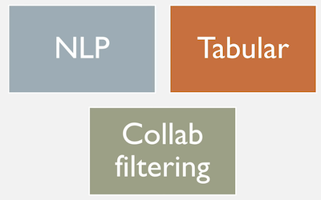
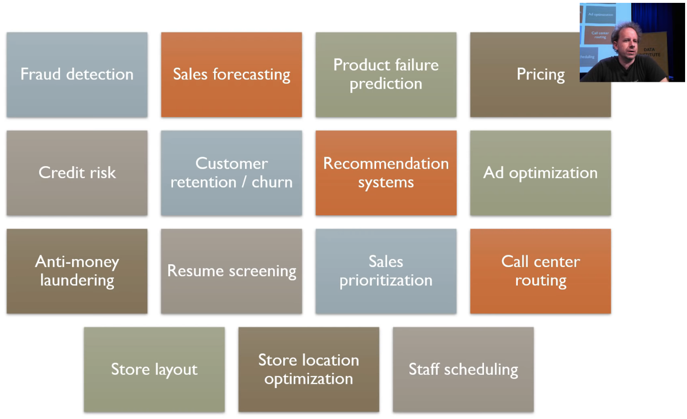
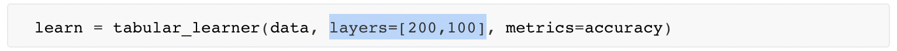
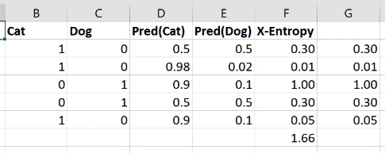
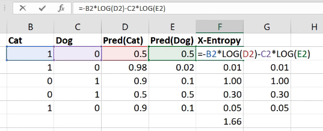
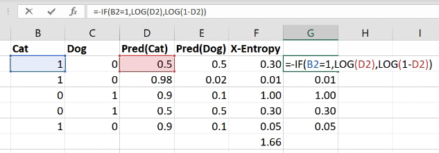
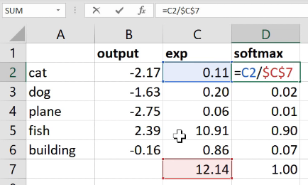
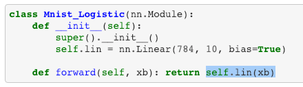
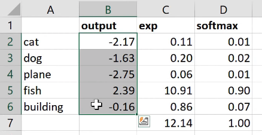
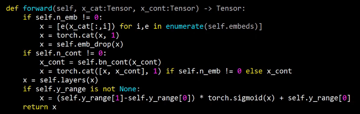

# Tabular models based on abbreviated Lessons 4 and 5

[Video](https://youtu.be/C9UdVPE3ynA) / [Lesson Forum](https://forums.fast.ai/t/lesson-4-official-resources-and-updates/30317)

Welcome to Lesson 4! We are going to finish our journey through these key applications. We've already looked at a range of vision applications. We've looked a classification, localization, image regression. We briefly touched on NLP. We're going to do a deeper dive into NLP transfer learning today. We're going to then look at tabular data and  collaborative filtering which are both super useful applications.

### Tabular [[33:10](https://youtu.be/C9UdVPE3ynA?t=1990)]



So that was NLP. We'll be learning more about NLP later in this course. But now, I wanted to switch over and look at tabular. Now tabular data is pretty interesting because it's the stuff that, for a lot of you, is actually what you use day-to-day at work in spreadsheets, in relational databases, etc.


**Question**: Where does the magic number of  in the learning rate come from? [[33:38](https://youtu.be/C9UdVPE3ynA?t=2018)]

```python
learn.fit_one_cycle(2, slice(1e-3/(2.6**4),1e-3), moms=(0.8,0.7))
```

Good question. So the learning rate is various things divided by 2.6 to the fourth. The reason it's to the fourth, you will learn about at the end of today. So let's focus on the 2.6. Why 2.6? Basically, as we're going to see in more detail later today, this number, the difference between the bottom of the slice and the top of the slice is basically what's the difference between how quickly the lowest layer of the model learns versus the highest layer of the model learns. So this is called discriminative learning rates. So really the question is as you go from layer to layer, how much do I decrease the learning rate by? And we found out that for NLP RNNs, the answer is 2.6.

How do we find out that it's 2.6? I ran lots and lots of different models using lots of different sets of hyper parameters of various types (dropout, learning rates,  and discriminative learning rate and so forth), and then I created something called a random forest which is a kind of model where I attempted to predict how accurate my NLP classifier would be based on the hyper parameters. And then I used random forest interpretation methods to basically figure out what the optimal parameter settings were, and I found out that the answer for this number was 2.6. So that's actually not something I've published or I don't think I've even talked about it before, so there's a new piece of information. Actually, a few months after I did this, Stephen Merity and somebody else did publish a paper describing a similar approach, so the basic idea may be out there already.

Some of that idea comes from a researcher named Frank Hutter and one of his collaborators. They did some interesting work showing how you can use random forests to actually find optimal hyperparameters. So it's kind of a neat trick. A lot of people are very interested in this thing called Auto ML which is this idea of like building models to figure out how to train your model. We're not big fans of it on the whole. But we do find that building models to better understand how your hyper parameters work, and then finding those rules of thumb like oh basically it can always be 2.6 quite helpful. So there's just something we've kind of been playing with.


### Back to Tabular [[36:41](https://youtu.be/C9UdVPE3ynA?t=2201)]

Let's talk about tabular data. Tabular data such as you might see in a spreadsheet, a relational database, or financial report, it can contain all kinds of different things. I tried to make a little list of some of the kinds of things that I've seen tabular data analysis used for:



Using neural nets for analyzing tabular data﹣when we first presented this, people were deeply skeptical. They thought it was a terrible idea to use neural nets to analyze tabular data, because everybody knows that you should use logistic regression, random forests, or gradient boosting machines (all of which have their place for certain types of things). But since that time, it's become clear that the commonly held wisdom is wrong. It's not true that neural nets are not useful for tabular data ,in fact they are extremely useful. We've shown this in quite a few of our courses, but what's really helped is that some really effective organizations have started publishing papers and posts describing how they've been using neural nets for analyzing tabular data.

One of the key things that comes up again and again is that although feature engineering doesn't go away, it certainly becomes simpler. So Pinterest, for example, replaced the gradient boosting machines that they were using to decide how to put stuff on their homepage with neural nets. And they presented at a conference this approach, and they described how it really made engineering a lot easier because a lot of the hand created features weren't necessary anymore. You still need some, but it was just simpler. So they ended up with something that was more accurate, but perhaps even more importantly, it required less maintenance. So I wouldn't say you it's the only tool that you need in your toolbox for analyzing tabular data. But where else, I used to use random forests 99% of the time when I was doing machine learning with tabular data, I now use neural nets 90% of the time. It's my standard first go-to approach now, and it tends to be pretty reliable and effective.

One of the things that's made it difficult is that until now there hasn't been an easy way to create and train tabular neural nets. Nobody has really made it available in a library. So we've actually just created `fastai.tabular` and I think this is pretty much the first time that's become really easy to use neural nets with tabular data. So let me show you how easy it is.

#### Tabular examples [[39:51](https://youtu.be/C9UdVPE3ynA?t=2391)]

[lesson4-tabular.ipynb](https://github.com/fastai/course-v3/blob/master/nbs/dl1/lesson4-tabular.ipynb)

This is actually coming directly from the examples folder in the fastai repo. I haven't changed it at all. As per usual, as well as importing fastai, import your application﹣so in this case, it's tabular.

```python
from fastai import *
from fastai.tabular import *
```

We assume that your data is in a Pandas DataFram. Pandas DataFrame is the standard format for tabular data in Python. There are lots of ways to get it in there, but probably the most common might be `pd.read_csv`. But whatever your data is in, you can probably get it into a Pandas data frame easily enough.

```python
path = untar_data(URLs.ADULT_SAMPLE)
df = pd.read_csv(path/'adult.csv')
```


**Question**: What are the 10% of cases where you would not default to neural nets? [[40:41](https://youtu.be/C9UdVPE3ynA?t=2441)]

Good question. I guess I still tend to give them a try. But yeah, I don't know. It's kind of like as you do things for a while, you start to get a sense of the areas where things don't quite work as well. I have to think about that during the week. I don't think I have a rule of thumb. But I would say, you may as well try both. I would say try a random forest and try a neural net. They're both pretty quick and easy to run, and see how it looks. If they're roughly similar, I might dig into each and see if I can make them better. But if the random forest is doing way better, I'd probably just stick with that. Use whatever works.

So we start with the data in a data frame, and so we've got an adult sample﹣it's a classic old dataset. It's a pretty small simple old dataset that's good for experimenting with. And it's a CSV file, so you can read it into a data frame with Pandas read CSV (`pd.read_csv`). If your data is in a relational database, Pandas can read from that. If it's in spark or Hadoop, Pandas can read from that. Pandas can read from most stuff that you can throw at it. So that's why we use it as a default starting point.

```python
dep_var = '>=50k'
cat_names = ['workclass', 'education', 'marital-status', 'occupation', 'relationship', 'race']
cont_names = ['age', 'fnlwgt', 'education-num']
procs = [FillMissing, Categorify, Normalize]
```

```python
test = TabularList.from_df(df.iloc[800:1000].copy(), path=path, cat_names=cat_names, cont_names=cont_names)
```

```python
data = (TabularList.from_df(df, path=path, cat_names=cat_names, cont_names=cont_names, procs=procs)
                           .split_by_idx(list(range(800,1000)))
                           .label_from_df(cols=dep_var)
                           .add_test(test, label=0)
                           .databunch())
```

As per usual, I think it's nice to use the data block API. So in this case, the list that we're trying to create is a tabular list and we're going to create it from a data frame. So you can tell it:

- What the data frame is.
- What the path that you're going to use to save models and intermediate steps is.
- Then you need to tell it what are your categorical variables and what are your continuous variables.

##### Continuous vs. Categorical [[43:07](https://youtu.be/C9UdVPE3ynA?t=2587)]

We're going to be learning a lot more about what that means to the neural net next week, but for now the quick summary is this. Your independent variables are the things that you're using to make predictions with. So things like education, marital status, age, and so forth. Some of those variables like age are basically numbers. They could be any number. You could be 13.36 years old or 19.4 years old or whatever. Where else, things like marital status are options that can be selected from a discrete group: married, single, divorced, whatever. Sometimes those options might be quite a lot more, like occupation. There's a lot of possible occupations. And sometimes, they might be binary (i.e. true or false). But anything which you can select the answer from a small group of possibilities is called a **categorical variable**. So we're going to need to use a different approach in the neural net to modeling categorical variables to what we use for continuous variables. For categorical variables, we're going to be using something called **embeddings** which we'll be learning about later today. For continuous variables, they could just be sent into the neural net just like pixels in a neural net can. Because pixels in a neural net are already numbers; these continuous things are already numbers as well. So that's easy.

So that's why you have to tell the tabular list from data frame which ones are which. There are some other ways to do that by pre-processing them in Pandas to make things categorical variables, but it's kind of nice to have one API for doing everything; you don't have to think too much about it.

##### Processor [[45:04](https://youtu.be/C9UdVPE3ynA?t=2704)]

Then we've got something  which is a lot like transforms in computer vision. Transforms in computer vision do things like flip a photo on its axis, turn it a bit, brighten it, or normalize it. But for tabular data, instead of having transforms, we have things called processes. And they're nearly identical but the key difference, which is quite important, is that a processor is something that happens ahead of time. So we basically pre-process the data frame rather than doing it as we go. So transformations are really for data augmentation﹣we want to randomize it and do it differently each time. Or else, processes are the things that you want to do once, ahead of time.

```python
procs = [FillMissing, Categorify, Normalize]
```

We have a number of processes in the fastai library. And the ones we're going to use this time are:

- `FillMissing`: Look for missing values and deal with them some way.
- `Categorify`: Find categorical variables and turn them into Pandas categories
- `Normalize` : Do a normalization ahead of time which is to take continuous variables and subtract their mean and divide by their standard deviation so they are zero-one variables.

The way we deal with missing data, we'll talk more about next week, but in short, we replace it with the median and add a new column which is a binary column of saying whether that was missing or not.

For all of these things, whatever you do to the training set, you need to do exactly the same thing to the validation set and the test set. So whatever you replaced your missing values with, you need to replace them with exactly the same thing in the validation set. So fastai handles all these details for you. They are the kinds of things that if you have to do it manually, if you like me, you'll screw it up lots of times until you finally get it right. So that's what these processes are here.

Then we're going to split into training versus validation sets. And in this case, we do it by providing a list of indexes so the indexes from 800 to a thousand. It's very common. I don't quite remember the details of this dataset, but it's very common for wanting to keep your validation sets to be contiguous groups of things. If they're map tiles, they should be the map tiles that are next to each other, if their time periods, they should be days that are next to each other, if they are video frames, they should be video frames next to each other. Because otherwise you're kind of cheating. So it's often a good idea to use `split_by_idx` and to grab a range that's next to each other if your data has some kind of structure like that or find some other way to structure it in that way.

All right, so that's now given us a  training and a validation set. We now need to add labels. In this case, the labels can come straight from the data frame we grabbed earlier, so we just have to tell it which column it is. So the dependent variable is whether they're making over $50,000 salary. That's the thing we're trying to predict.

We'll talk about test sets later, but in this case we can add a test set. And finally get our data bunch. S at that point, we have something that looks like this:

```python
data.show_batch(rows=10)
```

| workclass        | education    | marital-status     | occupation        | relationship   | race  | education-num_na | age     | fnlwgt  | education-num | target |
| ---------------- | ------------ | ------------------ | ----------------- | -------------- | ----- | ---------------- | ------- | ------- | ------------- | ------ |
| Private          | Prof-school  | Married-civ-spouse | Prof-specialty    | Husband        | White | False            | 0.1036  | 0.9224  | 1.9245        | 1      |
| Self-emp-inc     | Bachelors    | Married-civ-spouse | Farming-fishing   | Husband        | White | False            | 1.7161  | -1.2654 | 1.1422        | 1      |
| Private          | HS-grad      | Never-married      | Adm-clerical      | Other-relative | Black | False            | -0.7760 | 1.1905  | -0.4224       | 0      |
| Private          | 10th         | Married-civ-spouse | Sales             | Own-child      | White | False            | -1.5823 | -0.0268 | -1.5958       | 0      |
| Private          | Some-college | Never-married      | Handlers-cleaners | Own-child      | White | False            | -1.3624 | 0.0284  | -0.0312       | 0      |
| Private          | Some-college | Married-civ-spouse | Prof-specialty    | Husband        | White | False            | 0.3968  | 0.4367  | -0.0312       | 1      |
| ?                | Some-college | Never-married      | ?                 | Own-child      | White | False            | -1.4357 | -0.7295 | -0.0312       | 0      |
| Self-emp-not-inc | 5th-6th      | Married-civ-spouse | Sales             | Husband        | White | False            | 0.6166  | -0.6503 | -2.7692       | 1      |
| Private          | Some-college | Married-civ-spouse | Sales             | Husband        | White | False            | 1.5695  | -0.8876 | -0.0312       | 1      |
| Local-gov        | Some-college | Never-married      | Handlers-cleaners | Own-child      | White | False            | -0.6294 | -1.5422 | -0.0312       | 0      |

There is our data. Then to use it, it looks very familiar. You get a learner, in this case it's a tabular learner, passing in the data, some information about your architecture, and some metrics. And you then call fit.

```python
learn = tabular_learner(data, layers=[200,100], metrics=accuracy)
```

```python
learn.fit(1, 1e-2)
```

```
Total time: 00:03
epoch  train_loss  valid_loss  accuracy
1      0.362837    0.413169    0.785000  (00:03)
```


[[52:12](https://youtu.be/C9UdVPE3ynA?t=3132)]



We're gonna learn what `layers=` means either towards the end of class today or the start of class next week, but this is where we're basically defining our architecture just like when we chose ResNet 34 or whatever for conv nets. We'll look at more about metrics in a moment, but just to remind you, metrics are just the things that get printed out. They don't change our model at all. So in this case, we're saying I want you to print out the accuracy to see how we're doing.

So that's how to do tabular. This is going to work really well because we're gonna hit our break soon. And the idea was that after three and a half lessons, we're going to hit the end of all of the quick overview of applications, and then I'm going to go down on the other side. I think we're going to be to the minute, we're going to hit it. Because the next one is collaborative filtering.

**Question**: What about time series on tabular data? is there any RNN model involved in `tabular.models`? [[1:05:09](https://youtu.be/C9UdVPE3ynA?t=3909)]

We're going to look at time series tabular data next week, but the short answer is generally speaking you don't use a RNN for time series tabular data but instead, you extract a bunch of columns for things like day of week, is it a weekend, is it a holiday, was the store open, stuff like that. It turns out that adding those extra columns which you can do somewhat automatically basically gives you state-of-the-art results. There are some good uses of RNNs for time series, but not really for these kind of tabular style time series (like retail store logistics databases, etc).

# Lesson 5

### Back to Tabular [[2:03:15](https://youtu.be/uQtTwhpv7Ew?t=7395)]

[Notebook](https://github.com/fastai/course-v3/blob/master/nbs/dl1/lesson4-tabular.ipynb)

We're now at a point coming to the end of this collab and tabular section where we're going to try to understand all of the code in our tabular model. Remember, the tabular model use this data set called adult which is trying to predict who's going to make more money. It's a classification problem and we've got a number of categorical variables and a number of continuous variables.

```python
from fastai.tabular import *
```

```python
path = untar_data(URLs.ADULT_SAMPLE)
df = pd.read_csv(path/'adult.csv')
```

```python
dep_var = '>=50k'
cat_names = ['workclass', 'education', 'marital-status', 'occupation', 'relationship', 'race']
cont_names = ['age', 'fnlwgt', 'education-num']
procs = [FillMissing, Categorify, Normalize]
```

The first thing we realize is we actually don't know how to predict a categorical variable yet. Because so far, we did some hand waving around the fact that our loss function was `nn.CrossEntropyLoss`. What is that? Let's find out. And of course we're going to find out by looking at [Microsoft Excel](https://github.com/fastai/course-v3/blob/master/files/xl/entropy_example.xlsx).

Cross-entropy loss is just another loss function. You already know one loss function which is mean squared error .  That's not a good loss function for us because in our case we have, for MNIST, 10 possible digits and we have 10 activations each with a probability of that digit. So we need something where predicting the right thing correctly and confidently should have very little loss; predicting the wrong thing confidently should have a lot of loss. So that's what we want.

Here's an example:



Here is cat versus dog one hot encoded. Here are my two activations for each one from some model that I built - probability cat, probability dog. The first row is not very confident of anything. The second row is very confident of being a cat and that's right. The third row is very confident for being a cat and it's wrong. So we want a loss that for the first row should be a moderate loss because not predicting anything confidently is not really what we want, so here's 0.3. The second row is predicting the correct thing very confidently, so 0.01. The third row is predicting the wrong thing very confidently, so 1.0.

How do we do that? This is the cross entropy loss:



It is equal to whether it's a cat multiplied by the log of the cat activation, negative that, minus is it a dog times the log of the dog activation. That's it. So in other words, it's the sum of all of your one hot encoded variables times all of your activations.



Interestingly these ones here (column G) - exactly the same numbers as the column F, but I've written it differently. I've written it with an if function because the zeros don't actually add anything so actually it's exactly the same as saying if it's a cat, then take the log of cattiness and if it's a dog (i.e. otherwise) take the log of one minus cattiness (in other words, the log of dogginess). So the sum of the one hot encoded times the activations is the same as an `if` function. If you think about it, because this is just a matrix multiply, it is the same as an index lookup  (as we now know from our from our embedding discussion).  So to do cross entropy, you can also just look up the log of the activation for the correct answer.

Now that's only going to work if these rows add up to one. This is one reason that you can get screwy cross-entropy numbers is (that's why I said you press the wrong button) if they don't add up to 1 you've got a trouble. So how do you make sure that they add up to 1? You make sure they add up to 1 by using the correct activation function in your last layer. And the correct activation function to use for this is **softmax**. Softmax is an activation function where:

- all of the activations add up to 1
- all of the activations are greater than 0
- all of the activations are less than 1

So that's what we want. That's what we need. How do you do that? Let's say we were predicting one of five things: cat, dog, plane, fish, building,  and these were the numbers that came out of our neural net for one set of predictions (`output`).

What if I did  to the power of that? That's one step in the right direction because  to the power of something is always bigger than zero so there's a bunch of numbers that are always bigger than zero. Here's the sum of those numbers (12.14). Here is  to the number divided by the sum of  to the number:



Now this number is always less than one because all of the things were positive so you can't possibly have one of the pieces be bigger than 100% of its sum. And all of those things must add up to 1 because each one of them was just that percentage of the total. That's it. So this thing `softmax` is equal to  to the activation divided by the sum of  to the activations. That's called softmax.

 So when we're doing single label multi-class classification, you generally want softmax as your activation function and you generally want cross-entropy as your loss. Because these things go together in such friendly ways, PyTorch will do them both for you. So you might have noticed that in this MNIST example, I never added a softmax here:



That's because if you ask for cross entropy loss (`nn.CrossEntropyLoss`), it actually does the softmax inside the loss function. So it's not really just cross entropy loss, it's actually softmax then cross entropy loss.

So you've probably noticed this, but sometimes your predictions from your models will come out looking more like this:



Pretty big numbers with negatives in, rather than this (softmax column) - numbers between 0 to 1 that add up to 1. The reason would be that it's a PyTorch model that doesn't have a softmax in because we're using cross entropy loss and so you might have to do the softmax for it.

Fastai is getting increasingly good at knowing when this is happening. Generally if you're using a loss function that we recognize, when you get the predictions, we will try to add the softmax in there for you. But particularly if you're using a custom loss function that might call `nn.CrossEntropyLoss` behind the scenes or something like that, you might find yourself with this situation.

We only have 3 minutes less, but I'm going to point something out to you. Next week when we finish off tabular which we'll do in like the first 10 minutes, this is `forward` in tabular:



It basically goes through a bunch of embeddings. It's going to call each one of those embeddings `e` and you can use it like a function, of course. So it's going to pass each categorical variable to each embedding, it's going to concatenate them together into a single matrix. It's going to then call a bunch of layers which are basically a bunch of linear layers. And then it's going to do our sigmoid trick. There's only two new things we'll need to learn. One is dropout and the other is batch norm (`bn_cont`). These are two additional regularization strategies. BatchNorm does more than just regularization, but amongst other things it does regularization. And the basic ways you regularize your model are weight decay, batch norm, and dropout. Then you can also avoid overfitting using something called data augmentation. So batch norm and dropout, we're going to touch on at the start of next week. And we're also going to look at data augmentation and then we're also going to look at what convolutions are. And we're going to learn some new computer vision architectures and some new computer vision applications. But basically we're very nearly there. You already know how the entirety of `collab.py` (`fastai.collab`) works. You know why it's there and what it does and you're very close to knowing what the entirety of tabular model does. And this tabular model is actually the one that, if you run it on Rossmann, you'll get the same answer that I showed you in that paper. You'll get that second place result. In fact, even a little bit better. I'll show you next week (if I remember) how I actually ran some additional experiments where I figured out some minor tweaks that can do even slightly better than that. We'll see you next week. Thanks very much and enjoy the smoke outside.
