# Tabular models based on parts of Lesson 6

### Finishing up regularization for the Tabular Learner[[9:48](https://youtu.be/U7c-nYXrKD4?t=588)]

One of the reasons I wanted to mention this today is that we're going to be doing a big dive into convolutions later in this lesson. So I'm going to circle back to this to try and explain a little bit more about how that is working under the hood, and give you a kind of a sense of what's going on. But before we do, we have to finish off last week's discussion of regularization. We were talking about regularization specifically in the context of the tabular learner because the tabular learner, this is the init method in the tabular learner:

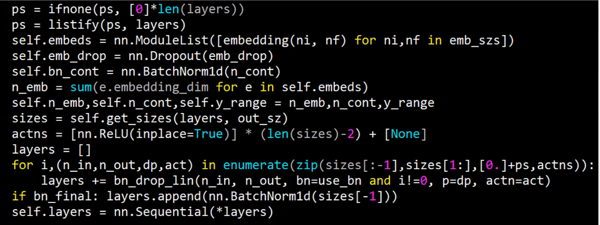

And our goal was to understand everything here, and we're not quite there yet. Last week we were looking at the adult data set which is a really simple (kind of over simple) data set that's just for toy purposes. So this week, let's look at a data set that's much more interesting - a Kaggle competition data set so we know what the the best in the world and Kaggle competitions' results tend to be much harder to beat than academic state-of-the-art results tend to be because a lot more people work on Kaggle competitions than most academic data sets. So it's a really good challenge to try and do well on a Kaggle competition data set.

The rossmann data set is they've got 3,000 drug stores in Europe and you're trying to predict how many products they're going to sell in the next couple of weeks. One of the interesting things about this is that the test set for this is from a time period that is more recent than the training set. This is really common. If you want to predict things, there's no point predicting things that are in the middle of your training set. You want to predict things in the future.

Another interesting thing about it is the evaluation metric they provided is the root mean squared percent error.


This is just a normal root mean squared error except we go actual minus prediction divided by actual, so in other words it's the "percent" error that we're taking the root mean squared of. There's a couple of interesting features.

Always interesting to look at the leaderboard. So the leaderboard, the winner was 0.1. The paper that we've roughly replicated was 0.105 ~ 0.106, and the 10th place out of 3,000 was 0.11ish - a bit less.

We're gonna skip over a little bit. The data that was provided here was they provided a small number of files but they also let competitors provide additional external data as long as they shared it with all the competitors. So in practice the data set we're going to use contains six or seven tables. The way that you join tables and stuff isn't really part of a deep learning course. So I'm going to skip over it, and instead I'm going to refer you to [Introduction to Machine Learning for Coders](http://course.fast.ai/ml) which will take you step-by-step through the data preparation for this. We've provided it for you in [rossman_data_clean.ipynb](https://github.com/fastai/course-v3/blob/master/nbs/dl1/rossman_data_clean.ipynb) so you'll see the whole process there. You'll need to run through that notebook to create these pickle files that we read here ([lesson6-rossmann.ipynb](https://github.com/fastai/course-v3/blob/master/nbs/dl1/lesson6-rossmann.ipynb)):

```
%reload_ext autoreload
%autoreload 2
```

```python
from fastai.tabular import *
```

```python
path = Path('data/rossmann/')
train_df = pd.read_pickle(path/'train_clean')
```


#### Time Series and `add_datepart` [[13:21](https://www.youtube.com/watch?v=U7c-nYXrKD4&feature=youtu.be&t=530)]

I just want to mention one particularly interesting part of the rossmann data clean notebook which is you'll see there's something that says `add_datepart` and I wanted to explain what's going on here.

```python
add_datepart(train, "Date", drop=False)
add_datepart(test, "Date", drop=False)
```

I've been mentioning for a while that we're going to look at time series. Pretty much everybody whom I've spoken to about it has assumed that I'm going to do some kind of recurrent neural network. But I'm not. Interestingly, the main academic group that studies time series is econometrics but they tend to study one very specific kind of time series which is where the only data you have is a sequence of time points of one thing. That's the only thing you have is one sequence. In real life, that's almost never the case. Normally, we would have some information about the store that represents or the people that it represents. We'd have metadata, we'd have sequences of other things measured at similar time periods or different time periods. So most of the time, I find in practice the the state-of-the-art results when it comes to competitions on more real-world data sets don't tend to use recurrent neural networks. But instead, they tend to take the time piece which in this case it was a date we were given in the data, and they add a whole bunch of metadata. So in our case, for example, we've added day of week. We were given a date. We've added a day of week, year, month, week of year, day of month, day of week, day of year, and then a bunch of booleans is it at the month start/end, quarter year start/end, elapsed time since 1970, so forth.

If you run this one function `add_datepart` and pass it a date, it'll add all of these columns to your data set for you. What that means is that, let's take a very reasonable example. Purchasing behavior probably changes on payday. Payday might be the fifteenth of the month. So if you have a thing here called this is day of month, then it'll be able to recognize every time something is a fifteen there and associated it with a higher, in this case, embedding matrix value. Basically, we can't expect a neural net to do all of our feature engineering for us. We can expect it to find nonlinearities and interactions and stuff like that. But for something like taking a date like this (`2015-07-31 00:00:00`) and figuring out that the fifteenth of the month is something when interesting things happen. It's much better if we can provide that information for it.

So this is a really useful function to use. Once you've done this, you can treat many kinds of time-series problems as regular tabular problems. I say "many" kinds not "all". If there's very complex kind of state involved in a time series such as equity trading or something like that, this probably won't be the case or this won't be the only thing you need. But in this case, it'll get us a really good result and in practice, most of the time I find this works well.

Tabular data is normally in Pandas, so we just stored them as standard Python pickle files. We can read them in. We can take a look at the first five records.

```python
train_df.head().T
```

|                           | 0                   | 1                   | 2                   | 3                   | 4                   |
| ------------------------- | ------------------- | ------------------- | ------------------- | ------------------- | ------------------- |
| index                     | 0                   | 1                   | 2                   | 3                   | 4                   |
| Store                     | 1                   | 2                   | 3                   | 4                   | 5                   |
| DayOfWeek                 | 5                   | 5                   | 5                   | 5                   | 5                   |
| Date                      | 2015-07-31 00:00:00 | 2015-07-31 00:00:00 | 2015-07-31 00:00:00 | 2015-07-31 00:00:00 | 2015-07-31 00:00:00 |
| Sales                     | 5263                | 6064                | 8314                | 13995               | 4822                |
| Customers                 | 555                 | 625                 | 821                 | 1498                | 559                 |
| Open                      | 1                   | 1                   | 1                   | 1                   | 1                   |
| Promo                     | 1                   | 1                   | 1                   | 1                   | 1                   |
| StateHoliday              | False               | False               | False               | False               | False               |
| SchoolHoliday             | 1                   | 1                   | 1                   | 1                   | 1                   |
| Year                      | 2015                | 2015                | 2015                | 2015                | 2015                |
| Month                     | 7                   | 7                   | 7                   | 7                   | 7                   |
| Week                      | 31                  | 31                  | 31                  | 31                  | 31                  |
| Day                       | 31                  | 31                  | 31                  | 31                  | 31                  |
| Dayofweek                 | 4                   | 4                   | 4                   | 4                   | 4                   |
| Dayofyear                 | 212                 | 212                 | 212                 | 212                 | 212                 |
| Is_month_end              | True                | True                | True                | True                | True                |
| Is_month_start            | False               | False               | False               | False               | False               |
| Is_quarter_end            | False               | False               | False               | False               | False               |
| Is_quarter_start          | False               | False               | False               | False               | False               |
| Is_year_end               | False               | False               | False               | False               | False               |
| Is_year_start             | False               | False               | False               | False               | False               |
| Elapsed                   | 1438300800          | 1438300800          | 1438300800          | 1438300800          | 1438300800          |
| StoreType                 | c                   | a                   | a                   | c                   | a                   |
| Assortment                | a                   | a                   | a                   | c                   | a                   |
| CompetitionDistance       | 1270                | 570                 | 14130               | 620                 | 29910               |
| CompetitionOpenSinceMonth | 9                   | 11                  | 12                  | 9                   | 4                   |
| CompetitionOpenSinceYear  | 2008                | 2007                | 2006                | 2009                | 2015                |
| Promo2                    | 0                   | 1                   | 1                   | 0                   | 0                   |
| Promo2SinceWeek           | 1                   | 13                  | 14                  | 1                   | 1                   |
| ...                       | ...                 | ...                 | ...                 | ...                 | ...                 |
| Min_Sea_Level_PressurehPa | 1015                | 1017                | 1017                | 1014                | 1016                |
| Max_VisibilityKm          | 31                  | 10                  | 31                  | 10                  | 10                  |
| Mean_VisibilityKm         | 15                  | 10                  | 14                  | 10                  | 10                  |
| Min_VisibilitykM          | 10                  | 10                  | 10                  | 10                  | 10                  |
| Max_Wind_SpeedKm_h        | 24                  | 14                  | 14                  | 23                  | 14                  |
| Mean_Wind_SpeedKm_h       | 11                  | 11                  | 5                   | 16                  | 11                  |
| Max_Gust_SpeedKm_h        | NaN                 | NaN                 | NaN                 | NaN                 | NaN                 |
| Precipitationmm           | 0                   | 0                   | 0                   | 0                   | 0                   |
| CloudCover                | 1                   | 4                   | 2                   | 6                   | 4                   |
| Events                    | Fog                 | Fog                 | Fog                 | NaN                 | NaN                 |
| WindDirDegrees            | 13                  | 309                 | 354                 | 282                 | 290                 |
| StateName                 | Hessen              | Thueringen          | NordrheinWestfalen  | Berlin              | Sachsen             |
| CompetitionOpenSince      | 2008-09-15 00:00:00 | 2007-11-15 00:00:00 | 2006-12-15 00:00:00 | 2009-09-15 00:00:00 | 2015-04-15 00:00:00 |
| CompetitionDaysOpen       | 2510                | 2815                | 3150                | 2145                | 107                 |
| CompetitionMonthsOpen     | 24                  | 24                  | 24                  | 24                  | 3                   |
| Promo2Since               | 1900-01-01 00:00:00 | 2010-03-29 00:00:00 | 2011-04-04 00:00:00 | 1900-01-01 00:00:00 | 1900-01-01 00:00:00 |
| Promo2Days                | 0                   | 1950                | 1579                | 0                   | 0                   |
| Promo2Weeks               | 0                   | 25                  | 25                  | 0                   | 0                   |
| AfterSchoolHoliday        | 0                   | 0                   | 0                   | 0                   | 0                   |
| BeforeSchoolHoliday       | 0                   | 0                   | 0                   | 0                   | 0                   |
| AfterStateHoliday         | 57                  | 67                  | 57                  | 67                  | 57                  |
| BeforeStateHoliday        | 0                   | 0                   | 0                   | 0                   | 0                   |
| AfterPromo                | 0                   | 0                   | 0                   | 0                   | 0                   |
| BeforePromo               | 0                   | 0                   | 0                   | 0                   | 0                   |
| SchoolHoliday_bw          | 5                   | 5                   | 5                   | 5                   | 5                   |
| StateHoliday_bw           | 0                   | 0                   | 0                   | 0                   | 0                   |
| Promo_bw                  | 5                   | 5                   | 5                   | 5                   | 5                   |
| SchoolHoliday_fw          | 7                   | 1                   | 5                   | 1                   | 1                   |
| StateHoliday_fw           | 0                   | 0                   | 0                   | 0                   | 0                   |
| Promo_fw                  | 5                   | 1                   | 5                   | 1                   | 1                   |

93 rows × 5 columns

The key thing here is that we're trying to on a particular date for a particular store ID, we want to predict the number of sales. Sales is the dependent variable.

### Preprocesses [[16:52](https://youtu.be/U7c-nYXrKD4?t=1012)]

The first thing I'm going to show you is something called pre-processes. You've already learned about transforms. **Transforms** are bits of code that **run every time something is grabbed from a data set** so it's really good for data augmentation that we'll learn about today, which is that it's going to get a different random value every time it's sampled. **Preprocesses** are like transforms, but they're a little bit different which is that they run once before you do any training. Really importantly, they **run once on the training set and then any kind of state or metadata that's created is then shared with the validation and test set**.

Let me give you an example. When we've been doing image recognition and we've had a set of classes to all the different pet breeds and they've been turned into numbers. The thing that's actually doing that for us is a preprocessor that's being created in the background. That makes sure that the classes for the training set are the same as the classes for the validation and the classes of the test set. So we're going to do something very similar here. For example, if we create a little small subset of a data for playing with. This is a really good idea when you start with a new data set.

```python
idx = np.random.permutation(range(n))[:2000]
idx.sort()
small_train_df = train_df.iloc[idx[:1000]]
small_test_df = train_df.iloc[idx[1000:]]
small_cont_vars = ['CompetitionDistance', 'Mean_Humidity']
small_cat_vars =  ['Store', 'DayOfWeek', 'PromoInterval']
small_train_df = small_train_df[small_cat_vars + small_cont_vars + ['Sales']]
small_test_df = small_test_df[small_cat_vars + small_cont_vars + ['Sales']]
```

I've just grabbed 2,000 IDs at random. Then I'm just going to grab a little training set and a little test set - half and half of those 2,000 IDs, and it's going to grab five columns. Then we can just play around with this. Nice and easy. Here's the first few of those from the training set:

```python
small_train_df.head()
```

|      | Store | DayOfWeek | PromoInterval   | CompetitionDistance | Mean_Humidity | Sales |
| ---- | ----- | --------- | --------------- | ------------------- | ------------- | ----- |
| 280  | 281   | 5         | NaN             | 6970.0              | 61            | 8053  |
| 584  | 586   | 5         | NaN             | 250.0               | 61            | 17879 |
| 588  | 590   | 5         | Jan,Apr,Jul,Oct | 4520.0              | 51            | 7250  |
| 847  | 849   | 5         | NaN             | 5000.0              | 67            | 10829 |
| 896  | 899   | 5         | Jan,Apr,Jul,Oct | 2590.0              | 55            | 5952  |

You can see, one of them is called promo interval and it has these strings, and sometimes it's missing. In Pandas, missing is `NaN`.

#### Preprocessor: Categorify [[18:39](https://youtu.be/U7c-nYXrKD4?t=1119)]

The first preprocessor I'll show you is Categorify.

```python
categorify = Categorify(small_cat_vars, small_cont_vars)
categorify(small_train_df)
categorify(small_test_df, test=True)
```

Categorify does basically the same thing that `.classes` thing for image recognition does for a dependent variable. It's going to take these strings, it's going to find all of the possible unique values of it, and it's going to create a list of them, and then it's going to turn the strings into numbers. So if I call it on my training set, that'll create categories there (`small_train_df`) and then I call it on my test set passing in `test=true`, that makes sure it's going to use the same categories that I had before. Now when I say `.head`, it looks exactly the same:

```python
small_test_df.head()
```

|        | Store  | DayOfWeek | PromoInterval    | CompetitionDistance | Mean_Humidity | Sales |
| ------ | ------ | --------- | ---------------- | ------------------- | ------------- | ----- |
| 428412 | NaN    | 2         | NaN              | 840.0               | 89            | 8343  |
| 428541 | 1050.0 | 2         | Mar,Jun,Sept,Dec | 13170.0             | 78            | 4945  |
| 428813 | NaN    | 1         | Jan,Apr,Jul,Oct  | 11680.0             | 85            | 4946  |
| 430157 | 414.0  | 6         | Jan,Apr,Jul,Oct  | 6210.0              | 88            | 6952  |
| 431137 | 285.0  | 5         | NaN              | 2410.0              | 57            | 5377  |

That's because Pandas has turned this into a categorical variable which internally is storing numbers but externally is showing me the strings. But I can look inside promo interval to look at the `cat.categories`, this is all standard Pandas here, to show me a list of all of what we would call "classes" in fast.ai or would be called just "categories" in Pandas.

```python
small_train_df.PromoInterval.cat.categories
```

```
Index(['Feb,May,Aug,Nov', 'Jan,Apr,Jul,Oct', 'Mar,Jun,Sept,Dec'], dtype='object')
```

```python
small_train_df['PromoInterval'].cat.codes[:5]
```

```
280   -1
584   -1
588    1
847   -1
896    1
dtype: int8
```

So then if I look at the `cat.codes`, you can see here this list here is the numbers that are actually stored (-1, -1, 1, -1, 1). What are these minus ones? The minus ones represent `NaN` - they represent "missing". So Pandas uses the special code `-1` to be mean missing.

As you know, these are going to end up in an embedding matrix, and we can't look up item -1 in an embedding matrix. So internally in fast.ai, we add one to all of these.

#### Preprocessor: Fill Missing [[20:18](https://youtu.be/U7c-nYXrKD4?t=1218)]

Another useful preprocessor is `FillMissing`. Again, you can call it on the data frame, you can call on the test passing in `test=true`.

```python
fill_missing = FillMissing(small_cat_vars, small_cont_vars)
fill_missing(small_train_df)
fill_missing(small_test_df, test=True)
```

```python
small_train_df[small_train_df['CompetitionDistance_na'] == True]
```

|        | Store | DayOfWeek | PromoInterval   | CompetitionDistance | Mean_Humidity | Sales | CompetitionDistance_na |
| ------ | ----- | --------- | --------------- | ------------------- | ------------- | ----- | ---------------------- |
| 78375  | 622   | 5         | NaN             | 2380.0              | 71            | 5390  | True                   |
| 161185 | 622   | 6         | NaN             | 2380.0              | 91            | 2659  | True                   |
| 363369 | 879   | 4         | Feb,May,Aug,Nov | 2380.0              | 73            | 4788  | True                   |

This will create, for anything that has a missing value, it'll create an additional column with the column name underscore na (e.g. `CompetitionDistance_na`) and it will set it for true for any time that was missing. Then what we do is, we replace competition distance with the median for those. Why do we do this? Well, because very commonly the fact that something's missing is of itself interesting (i.e. it turns out the fact that this is missing helps you predict your outcome). So we certainly want to keep that information in a convenient boolean column, so that our deep learning model can use it to predict things.

But then, we need competition distance to be a continuous variable so we can use it in the continuous variable part of our model. So we can replace it with almost any number because if it turns out that the missingness is important, it can use the interaction of `CompetitionDistance_na` and `CompetitionDistance` to make predictions. So that's what FillMissing does.

[[21:31](https://youtu.be/U7c-nYXrKD4?t=1291)]

You don't have to manually call preprocesses yourself. When you call any kind of item list creator, you can pass in a list of pre processes which you can create like this:

```python
procs=[FillMissing, Categorify, Normalize]
```

```python
data = (TabularList.from_df(df, path=path, cat_names=cat_vars, cont_names=cont_vars, procs=procs)
                   .split_by_idx(valid_idx)
                   .label_from_df(cols=dep_var, label_cls=FloatList, log=True)
                   .databunch())
```

This is saying "ok, I want to fill missing, I want to categorify, I want to normalize (i.e. for continuous variables, it'll subtract the mean and divide by the standard deviation to help a train more easily)." So you just say, those are my procs and then you can just pass it in there and that's it.

Later on, you can go `data.export` and it'll save all the metadata for that data bunch so you can, later on, load it in knowing exactly what your category codes are, exactly what median values used for replacing the missing values, and exactly what means and standard deviations you normalize by.

#### Categorical and Continuous Variables [[22:23](https://youtu.be/U7c-nYXrKD4?t=1343)]

The main thing you have to do if you want to create a data bunch of tabular data is tell it what are your categorical variables and what are your continuous variables. As we discussed last week briefly, your categorical variables are not just strings and things, but also I include things like day of week and month and day of month. Even though they're numbers, I make them categorical variables. Because, for example, day of month, I don't think it's going to have a nice smooth curve. I think that the fifteenth of the month and the first of the month and the 30th of the month are probably going to have different purchasing behavior to other days of the month. Therefore, if I make it a categorical variable, it's going to end up creating an embedding matrix and those different days of the month can get different behaviors.

You've actually got to think carefully about which things should be categorical variables. On the whole, if in doubt and there are not too many levels in your category (that's called the **cardinality**), if your cardinality is not too high, I would put it as a categorical variable. You can always try an each and see which works best.

```python
cat_vars = ['Store', 'DayOfWeek', 'Year', 'Month', 'Day', 'StateHoliday',
            'CompetitionMonthsOpen', 'Promo2Weeks', 'StoreType', 'Assortment',
            'PromoInterval', 'CompetitionOpenSinceYear', 'Promo2SinceYear', 'State',
            'Week', 'Events', 'Promo_fw', 'Promo_bw', 'StateHoliday_fw',
            'StateHoliday_bw','SchoolHoliday_fw', 'SchoolHoliday_bw']

cont_vars = ['CompetitionDistance', 'Max_TemperatureC', 'Mean_TemperatureC',
             'Min_TemperatureC', 'Max_Humidity', 'Mean_Humidity', 'Min_Humidity',
             'Max_Wind_SpeedKm_h', 'Mean_Wind_SpeedKm_h', 'CloudCover', 'trend',
             'trend_DE','AfterStateHoliday', 'BeforeStateHoliday', 'Promo',
             'SchoolHoliday']
```

Our final data frame that we're going to pass in is going to be a training set with the categorical variables, the continuous variables, the dependent variable, and the date. The date, we're just going to use to create a validation set where we are basically going to say the validation set is going to be the same number of records at the end of the time period that the test set is for Kaggle. That way, we should be able to validate our model nicely.

```python
dep_var = 'Sales'
df = train_df[cat_vars + cont_vars + [dep_var,'Date']].copy()
```

```python
test_df['Date'].min(), test_df['Date'].max()
```

```
(Timestamp('2015-08-01 00:00:00'), Timestamp('2015-09-17 00:00:00'))
```

```python
cut = train_df['Date'][(train_df['Date'] == train_df['Date'][len(test_df)])].index.max()
cut
```

```
41395
```

```python
valid_idx = range(cut)
```

```python
df[dep_var].head()
```

```
0     5263
1     6064
2     8314
3    13995
4     4822
Name: Sales, dtype: int64
```

Now we can create a tabular list.

```python
data = (TabularList.from_df(df, path=path, cat_names=cat_vars, cont_names=cont_vars, procs=procs)
                   .split_by_idx(valid_idx)
                   .label_from_df(cols=dep_var, label_cls=FloatList, log=True)
                   .databunch())
```

This is our standard data block API that you've seen a few times:

- From a data frame, passing all of that information.
- Split it into valid vs. train.
- Label it with a dependent variable.

Here's something I don't think you've seen before - label class (`label_cls=FloatList`). This is our dependent variable (`df[dep_var].head()` above), and as you can see, this is sales. It's not a float. It's int64. **If this was a float, then fast.ai would automatically guess that you want to do a regression**. But this is not a float, it's an int. So fast.ai is going to assume you want to do a classification. So when we label it, we have to tell it that the class of the labels we want is a list of floats, not a list of categories (which would otherwise be the default). So **this is the thing that's going to automatically turn this into a regression problem for us**.  Then we create a data bunch.

### Reminder about Doc [[25:09](https://youtu.be/U7c-nYXrKD4?t=1509)]

```python
doc(FloatList)
```

I wanted to remind you again about `doc` which is how we find out more information about this stuff. In this case, all of the labeling functions in the data blocks API will pass on any keywords they don't recognize to the label class. So one of the things I've passed in here is `log` and so that's actually going to end up in `FloatList` and so if I go `doc(FloatList)`, I can see a summary:

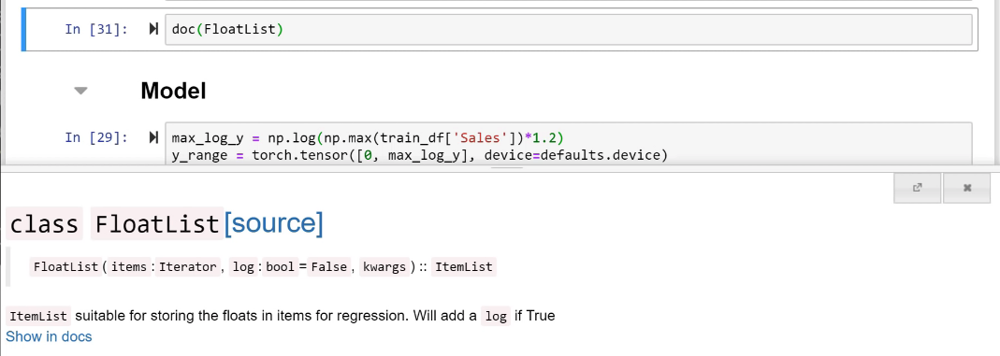

And I can even jump into the full documentation, and it shows me here that `log` is something which if true, it's going to take the logarithm of my dependent variable. Why am I doing that? So this is the thing that's actually going to automatically take the log of my . The reason I'm doing that is because as I mentioned before, the evaluation metric is root mean squared percentage error.


Neither fast.ai nor PyTorch has a root mean squared percentage error loss function built-in. I don't even know if such a loss function would work super well. But if you want to spend the time thinking about it, you'll notice that this ratio if you first take the log of  and , then becomes a difference rather than the ratio. In other words, if you take the log of  then RMSPE becomes root mean squared error. So that's what we're going to do. We're going to take the log of  and then we're just going to use root mean square error which is the default for a regression problems we won't even have to mention it.

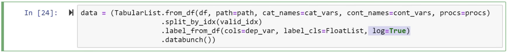

The reason that we have this (`log=True`) here is because this is so common. Basically anytime you're trying to predict something like a population or a dollar amount of sales, these kind of things tend to have long tail distributions where you care more about percentage differences and exact/absolute differences. So you're very likely to want to do things with `log=True` and to measure the root mean squared percent error.

#### `y_range` [[27:12](https://youtu.be/U7c-nYXrKD4?t=1632)]

```python
max_log_y = np.log(np.max(train_df['Sales'])*1.2)
y_range = torch.tensor([0, max_log_y], device=defaults.device)
```

We've learned about the `y_range` before which is going to use that sigmoid to help us get in the right range. Because this time the  values are going to be taken the log of it first, we need to make sure that the `y_range` we want is also the log. So I'm going to take the maximum of the sales column. I'm going to multiply it by a little bit because remember how we said it's nice if your range is a bit wider than the range of the data. Then we're going to take the log. That's going to be our maximum. Then our `y_range` will be from zero to a bit more than the maximum.

Now we've got our data bunch, we can create a tabular learner from it. Then we have to pass in our architecture. As we briefly discussed, for a tabular model, our architecture is literally the most basic fully connected network - just like we showed in this picture:

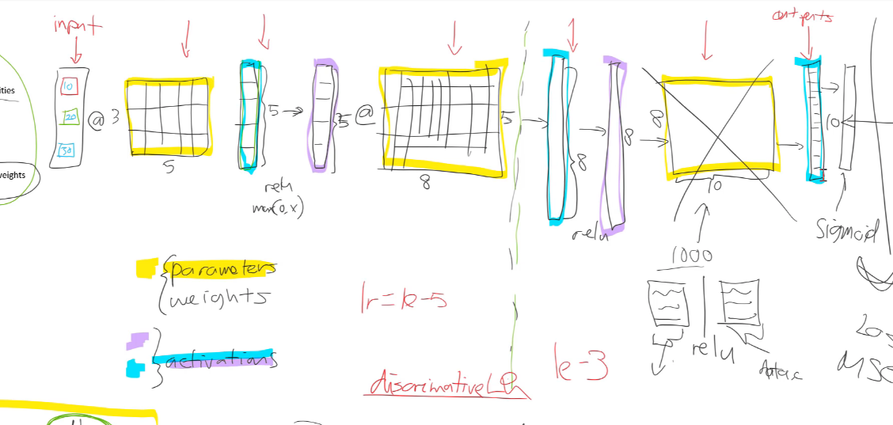


It's an input, matrix multiply, non-linearity, matrix multiply, non-linearity, matrix multiply, non-linearity, done. What are the interesting things about this is that this competition is three years old, but I'm not aware of any significant advances at least in terms of architecture that would cause me to choose something different to what the third-placed folks did three years ago. We're still basically using simple fully connected models for this problem.

```python
learn = tabular_learner(data, layers=[1000,500], ps=[0.001,0.01], emb_drop=0.04,
                        y_range=y_range, metrics=exp_rmspe)
```

Now the intermediate weight matrix is going to have to go from a 1000 activation input to a 500 activation output, which means it's going to have to be 500,000 elements in that weight matrix. That's an awful lot for a data set with only a few hundred thousand rows. So this is going to overfit, and we need to make sure it doesn't. The way to make sure it doesn't is to **use regularization; not to reduce the number of parameters**. So one way to do that will be to use weight decay which fast.ai will use automatically, and you can vary it to something other than the default if you wish. It turns out in this case, we're going to want more regularization. So we're going to pass in something called `ps`. This is going to provide dropout. And also this one here `embb_drop` - this is going to provide embedding dropout.

### Dropout [[29:47](https://youtu.be/U7c-nYXrKD4?t=1787)]

Let's learn about what is dropout. The short version is dropout is a kind of regularization. This is [the dropout paper](https://www.cs.toronto.edu/~hinton/absps/JMLRdropout.pdf) Nitish Srivastava it was Srivastava's master's thesis under Geoffrey Hinton.

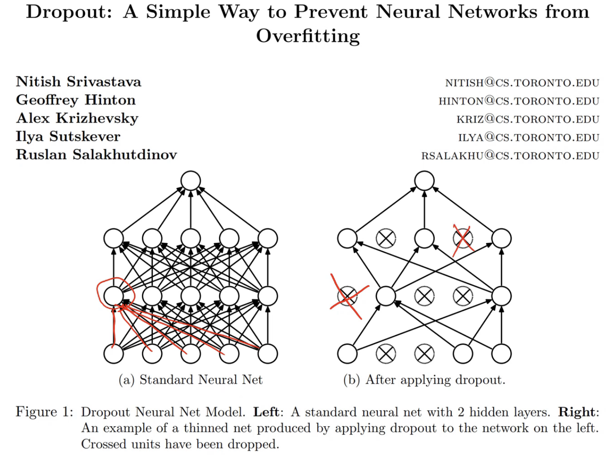

This picture from the original paper is a really good picture of what's going on. This first picture is a picture of a standard fully connected network and what each line shows is a multiplication of an activation times a weight. Then when you've got multiple arrows coming in, that represents a sum. So this activation here (circled in red) is the sum of all of these inputs times all of these activations. So that's what a normal fully connected neural net looks like.

For dropout, we throw that away. At random, we **throw away some percentage of the activations** not the weights, not the parameters. Remember, there's **only two types of number in a neural net -  parameters** also called weights (kind of) and **activations**. So we're going to throw away some activations.

So you can see that when we throw away this activation, all of the things that were connected to it are gone too. For each mini batch, we throw away a different subset of activations. How many do we throw away? We throw each one away with a probability `p`. A common value of `p` is 0.5. So what does that mean? And you'll see in this case, not only have they deleted at random some of these hidden layers, but they've actually deleted some of the inputs as well. Deleting the inputs is pretty unusual. Normally, we only delete activations in the hidden layers. So what does this do? Well, every time I have a mini batch going through, I, at random, throw away some of the activations. And then the next mini batch, I put them back and I throw away some different ones.

It means that no 1 activation can memorize some part of the input because that's what happens if we over fit. If we over fit, some part of the model is basically learning to recognize a particular image rather than a feature in general or a particular item. With dropout, it's going to be very hard for it to do that. In fact, Geoffrey Hinton described part of the thinking behind this as follows:

> I went to my bank. The tellers kept changing and I asked one of them why. He said he didn't know but they got moved around a lot. I figured it must be because it would require cooperation between employees to successfully defraud the bank. This made me realize that randomly removing a different subset of neurons on each example would prevent conspiracies and thus reduce overfitting.

*[Hinton: Reddit AMA](https://www.reddit.com/r/MachineLearning/comments/4w6tsv/ama_we_are_the_google_brain_team_wed_love_to/d6dgyse)*

He noticed every time he went to his bank that all the tellers and staff moved around, and he realized the reason for this must be that they're trying to avoid fraud. If they keep moving them around, nobody can specialize so much in that one thing that they're doing that they can figure out a conspiracy to defraud the bank. Now, of course, depends when you ask Hinton. At other times he says that the reason for this was because he thought about how spiking neurons work and he's a neuroscientist by training:

> We don't really know why neurons spike. One theory is that they want to be noisy so as to regularize, because we have many more parameters than we have data points. The idea of dropout is that if you have noisy activations, you can afford to use a much bigger model.

*[Hinton: O'Reilly](https://www.oreilly.com/ideas/adapting-ideas-from-neuroscience-for-ai)*

There's a view that spiking neurons might help regularization, and dropout is a way of matching this idea of spiking neurons. It's interesting. When you actually ask people where did your idea for some algorithm come from, it basically never comes from math; it always comes from intuition and thinking about physical analogies and stuff like that.

Anyway the truth is a bunch of ideas I guess all flowing around and they came up with this idea of dropout. But the important thing to know is it worked really really well. So we can use it in our models to get generalization for free.

Now too much dropout, of course, is reducing the capacity of your model, so it's going to under fit. So you've got to play around with different dropout values for each of your layers to decide.

In pretty much every fast.ai learner, there's a parameter called `ps` which will be the p-value for the dropout for each layer. So you can just pass in a list, or you can pass it an int and it'll create a list with that value everywhere. Sometimes it's a little different. For CNN, for example, if you pass in an int, it will use that for the last layer, and half that value for the earlier layers. We basically try to do things represent best practice. But you can always pass in your own list to get exactly the dropout that you want.

### Dropout and test time [[34:47](https://youtu.be/U7c-nYXrKD4?t=2087)]


There is an interesting feature of dropout. We talk about training time and test time (we also call inference time). Training time is when we're actually doing that those weight updates - the backpropagation. The training time, dropout works the way we just saw. At test time we turn off dropout. We're not going to do dropout anymore because we wanted to be as accurate as possible. We're not training so we can't cause it to overfit when we're doing inference. So we remove dropout. But what that means is if previously `p` was 0.5, then half the activations were being removed. Which means when they're all there, now our overall activation level is twice of what it used to be. Therefore, in the paper, they suggest multiplying all of your weights at test time by `p`.

Interestingly, you can dig into the PyTorch source code and you can find the actual C code where dropout is implemented.

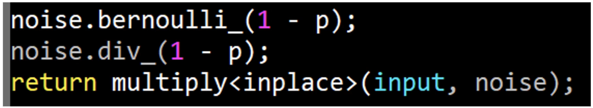

And you can see what they're doing is something quite interesting. They first of all do a Bernoulli trial. So a Bernoulli trial is with probability `1 - p`, return the value 1 otherwise return the value 0. That's all it means. In this case, `p` is the probability of dropout, so `1 - p` is a probability that we keep the activation. So we end up here with either a 1 or a 0. Then (this is interesting) we divide in place (remember underscore means "in place" in PyTorch) we divide in place that 1 or 0 by `1 - p`. If it's a 0 nothing happens it's still 0. If it's a 1 and `p` was 0.5, that one now becomes 2. Then finally, we multiply in place our input by this noise (i.e. this dropout mask).

So in other words, in PyTorch, we don't do the change at test time. We actually do the change at training time - which means that you don't have to do anything special at inference time with PyTorch. It's not just PyTorch, it's quite a common pattern. But it's kind of nice to look inside the PyTorch source code and see dropout; this incredibly cool, incredibly valuable thing, is really just these three lines of code which they do in C because I guess it ends up a bit faster when it's all fused together. But lots of libraries do it in Python and that works well as well. You can even write your own dropout layer, and it should give exactly the same results as this. That'd be a good exercise to try. See if you can create your own dropout layer in Python, and see if you can replicate the results that we get with this dropout layer.

[[37:38](https://youtu.be/U7c-nYXrKD4?t=2258)]

```python
learn = tabular_learner(data, layers=[1000,500], ps=[0.001,0.01], emb_drop=0.04,
                        y_range=y_range, metrics=exp_rmspe)
```

So that's dropout. In this case, we're going to use a tiny bit of dropout on the first layer (0.001) and a little bit of dropout on the next layer (0.01), and then we're going to use special dropout on the embedding layer. Now why do we do special dropout on the embedding layer? If you look inside the fast.ai source code, here is our tabular model:

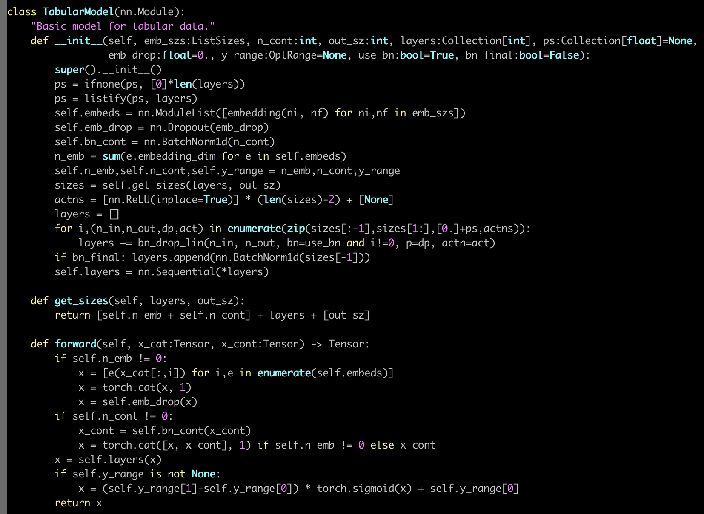

You'll see that in the section that checks that there's some embeddings (`if self.n_emb != 0:` in `forward`),

- we call each embedding
- we concatenate the embeddings into a single matrix
-  then we call embedding dropout

An embedding dropout is simply just a dropout. So it's just an instance of a dropout module. This kind of makes sense, right? For continuous variables, that continuous variable is just in one column. You wouldn't want to do dropout on that because you're literally deleting the existence of that whole input which is almost certainly not what you want. But for an embedding, and embedding is just effectively a matrix multiplied by a one hot encoded matrix, so it's just another layer. So it makes perfect sense to have dropout on the output of the embedding, because you're putting dropout on those activations of that layer. So you're basically saying let's delete at random some of the results of that embedding (i.e. some of those activations). So that makes sense.

The other reason we do it that way is because I did very extensive experiments about a year ago where on this data set I tried lots of different ways of doing kind of everything. And you can actually see it here:

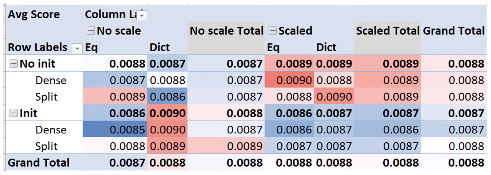

I put it all in a spreadsheet (of course Microsoft Excel), put them into a pivot table to summarize them all together to find out which different choices, hyper parameters, and architectures worked well and worked less well. Then I created all these little graphs:

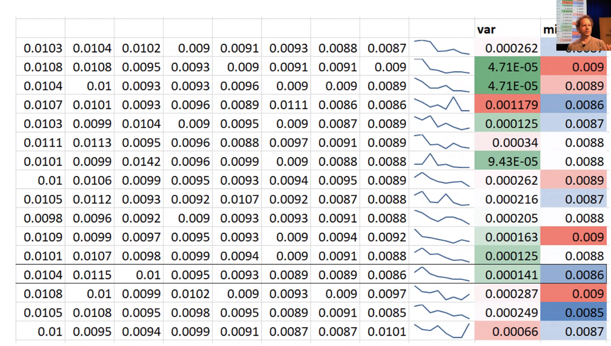

These are like little summary training graphs for different combinations of high parameters and architectures. And I found that there was one of them which ended up consistently getting a good predictive accuracy, the bumpiness of the training was pretty low, and you can see, it was just a nice smooth curve.

This is an example of the experiments that I do that end up in the fastai library. So embedding dropout was one of those things that I just found work really well. Basically the results of these experiments is why it looks like this rather than something else. Well, it's a combination of these experiments but then why did I do these particular experiments? Well because it was very influenced by what worked well in that Kaggle prize winner's paper. But there are quite a few parts of that paper I thought "there were some other choices they could have made, I wonder why they didn't" and I tried them out and found out what actually works and what doesn't work as well, and found a few little improvements. So that's the kind of experiments that you can play around with as well when you try different models and architectures; different dropouts, layer numbers, number of activations, and so forth.

[[41:02](https://youtu.be/U7c-nYXrKD4?t=2462)]

Having created our learner, we can type `learn.model` to take a look at it:

```python
learn.model
```

```
TabularModel(
  (embeds): ModuleList(
    (0): Embedding(1116, 50)
    (1): Embedding(8, 5)
    (2): Embedding(4, 3)
    (3): Embedding(13, 7)
    (4): Embedding(32, 17)
    (5): Embedding(3, 2)
    (6): Embedding(26, 14)
    (7): Embedding(27, 14)
    (8): Embedding(5, 3)
    (9): Embedding(4, 3)
    (10): Embedding(4, 3)
    (11): Embedding(24, 13)
    (12): Embedding(9, 5)
    (13): Embedding(13, 7)
    (14): Embedding(53, 27)
    (15): Embedding(22, 12)
    (16): Embedding(7, 4)
    (17): Embedding(7, 4)
    (18): Embedding(4, 3)
    (19): Embedding(4, 3)
    (20): Embedding(9, 5)
    (21): Embedding(9, 5)
    (22): Embedding(3, 2)
    (23): Embedding(3, 2)
  )
  (emb_drop): Dropout(p=0.04)
  (bn_cont): BatchNorm1d(16, eps=1e-05, momentum=0.1, affine=True, track_running_stats=True)
  (layers): Sequential(
    (0): Linear(in_features=229, out_features=1000, bias=True)
    (1): ReLU(inplace)
    (2): BatchNorm1d(1000, eps=1e-05, momentum=0.1, affine=True, track_running_stats=True)
    (3): Dropout(p=0.001)
    (4): Linear(in_features=1000, out_features=500, bias=True)
    (5): ReLU(inplace)
    (6): BatchNorm1d(500, eps=1e-05, momentum=0.1, affine=True, track_running_stats=True)
    (7): Dropout(p=0.01)
    (8): Linear(in_features=500, out_features=1, bias=True)
  )
)
```

As you would expect, in that, there is a whole bunch of embeddings. Each of those embedding matrices tells you the number of levels for each input (the first number) . You can match these with your list `cat_vars`. So the first one will be `Store`, so that's not surprising there are 1,116 stores. Then the second number, of course, is the size of the embedding. That's a number that you get to choose.

Fast.ai has some defaults which actually work really really well nearly all the time. So I almost never changed them. But when you create your `tabular_lerner`, you can absolutely pass in an embedding size dictionary which maps variable names to embedding sizes for anything where you want to override the defaults.

Then we've got our embedding dropout layer, and then we've got a batch norm layer with 16 inputs. The 16 inputs make sense because we have 16 continuous variables.

```python
len(data.train_ds.cont_names)
```

```
16
```

The length of `cont_names` is 16. So this is something for our continuous variables. Specifically, it's over here, `bn_cont` on our continuous variables:

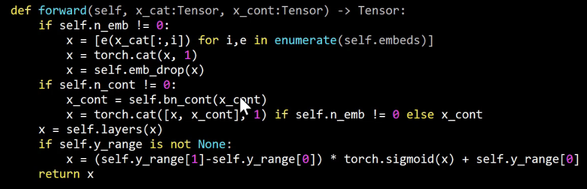

And `bn_cont` is a `nn.BatchNorm1d`. What's that? The first short answer is it's one of the things that I experimented with as to having batchnorm not, and I found that it worked really well. Then specifically what it is is extremely unclear. Let me describe it to you.

- It's kind of a bit of regularization
- It's kind of a bit of training helper

It's called batch normalization and it comes from [this paper](https://arxiv.org/abs/1502.03167).

[[43:06](https://youtu.be/U7c-nYXrKD4?t=2586)]

Actually before I do this, I just want to mention one other really funny thing dropout. I mentioned it was a master's thesis. Not only was it a master's thesis, one of the most influential papers of the last ten years.

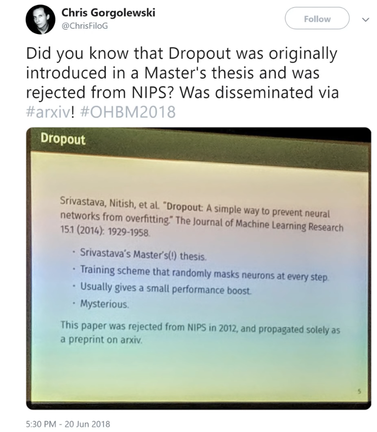

It was rejected from the main neural nets conference what was then called NIPS, now called NeurIPS. I think it's very interesting because it's just a reminder that our academic community is generally extremely poor at recognizing which things are going to turn out to be important. Generally, people are looking for stuff that are in the field that they're working on and understand. So dropout kind of came out of left field. It's kind of hard to understand what's going on. So that's kind of interesting.

It's a reminder that if you just follow as you develop beyond being just a practitioner into actually doing your own research, don't just focus on the stuff everybody's talking about. Focus on the stuff you think might be interesting. Because the stuff everybody's talking about generally turns out not to be very interesting. The community is very poor at recognizing high-impact papers when they come out.

### Batch Normalization [[44:28](https://youtu.be/U7c-nYXrKD4?t=2668)]

Batch normalization, on the other hand, was immediately recognized as high-impact. I definitely remember everybody talking about it in 2015 when it came out. That was because it's so obvious, they showed this picture:


Showing the current then state of the art ImageNet model Inception. This is how long it took them to get  a pretty good result, and then they tried the same thing with this new thing called batch norm, and they just did it way way way quickly. That was enough for pretty much everybody to go "wow, this is interesting."

Specifically they said this thing is called batch normalization and it's accelerating training by reducing internal covariate shift. So what is internal covariate shift? Well, it doesn't matter. Because this is one of those things where researchers came up with some intuition and some idea about this thing they wanted to try. They did it, it worked well, they then post hoc added on some mathematical analysis to try and claim why it worked. And it turned out they were totally wrong.

[[45:29](https://youtu.be/U7c-nYXrKD4?t=2729)]

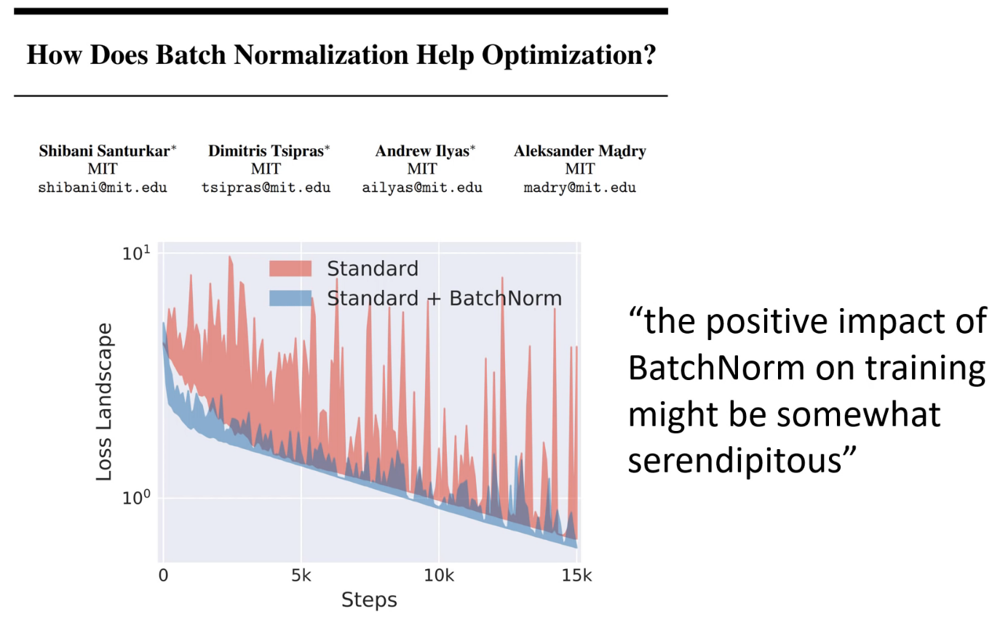

In the last two months, there's been two papers (so it took three years for people to really figure this out), in the last two months, there's been two papers that have shown batch normalization doesn't reduce covariate shift at all. And even if it did, that has nothing to do with why it works. I think that's an interesting insight, again, which is why we should be focusing on being practitioners and experimentalists and developing an intuition.

What batch norm does is what you see in this picture here in this paper. Here are steps or batches (x-axis). And here is loss (y-axis). The red line is what happens when you train without batch norm  - very very bumpy. And here, the blue line is what happens when you train with batch norm - not very bumpy at all. What that means is, you can increase your learning rate with batch norm. Because these big bumps represent times that you're really at risk of your set of weights jumping off into some awful part of the weight space that it can never get out of again. So if it's less bumpy, then you can train at a higher learning rate. So that's actually what's going on.

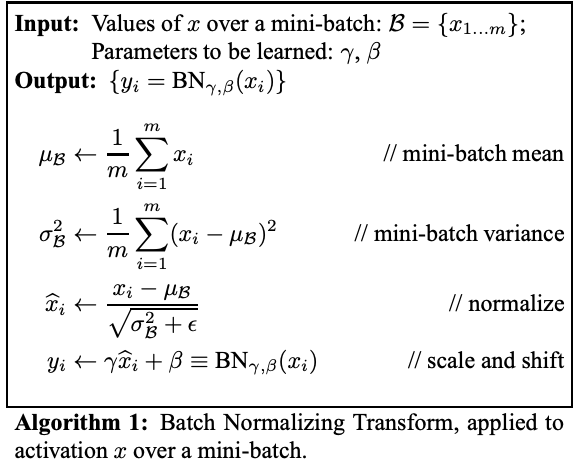

This is the algorithm, and it's really simple. The algorithm is going to take a mini batch. So we have a mini batch, and remember this is a layer, so the thing coming into it is activations. Batch norm is a layer, and it's going to take in some activations. So the activations are what it's calling  and so forth.

1. The first thing we do is we find the mean with those activations - sum divided by the count that is just the mean.
2. The second thing we do is we find the variance of those activations - a difference squared divided by the mean is the variance.
3. Then we normalize - the values minus the mean divided by the standard deviation is the normalized version. It turns out that bit is actually not that important. We used to think it was - it turns out it's not. The really important bit is the next bit.
4. We take those values and we add a vector of biases (they call it beta here). We've seen that before. We've used a bias term before. So we're just going to add a bias term as per usual. Then we're going to use another thing that's a lot like a bias term, but rather than adding it, we're going to multiply by it. So there's these parameters gamma  and beta  which are learnable parameters.

Remember, in a neural net there's only two kinds of number; activations and parameters. These are parameters. They're things that are learnt with gradient descent.  is just a normal bias layer and  is a multiplicative bias layer. Nobody calls it that, but that's all it is. It's just like bias, but we multiply rather than add. That's what batch norm is. That's what the layer does.

So why is that able to achieve this fantastic result? I'm not sure anybody has exactly written this down before. If they have, I apologize for failing to site it because I haven't seen it. But let me explain. What's actually going on here. The value of our predictions y-hat is some function of our various weights. There could be millions of them (weight 1 million) and it's also a function, of course, of the inputs to our layer.


This function  is our neural net function whatever is going on in our neural net. Then our loss, let's say it's mean squared error, is just our actuals minus our predicted squared.


Let's say we're trying to predict movie review outcomes, and they're between 1 and 5. And we've been trying to train our model and the activations at the very end currently between -1 and 1. So they're way off where they need to be. The scale is off, the mean is off, so what can we do? One thing we could do would be to try and come up with a new set of weights that cause the spread to increase, and cause the mean to increase as well. But that's going to be really hard to do, because remember all these weights interact in very intricate ways. We've got all those nonlinearities, and they all combine together. So to just move up, it's going to require navigating through this complex landscape and we use all these tricks like momentum and Adam and stuff like that to help us, but it still requires a lot of twiddling around to get there. So that's going to take a long time, and it's going to be bumpy.

But what if we did this? What if we went times  plus ?


We added 2 more parameter vectors. Now it's really easy. In order to increase the scale, that number  has a direct gradient to increase the scale. To change the mean, that number  has a direct gradient to change the mean. There's no interactions or complexities, it's just straight up and down, straight in and out. That's what batch norm does. Batch norm is basically making it easier for it to do this really important thing which is to shift the outputs up and down, and in and out. And that's why we end up with these results.

Those details, in some ways, don't matter terribly. The really important thing to know is **you definitely want to use it**. Or if not it, something like it. There's various other types of normalization around nowadays, but batch norm works great. The other main normalization type we use in fast.ai is something called weight norm which is much more just in the last few months' development.

[[51:50](https://youtu.be/U7c-nYXrKD4?t=3110)]

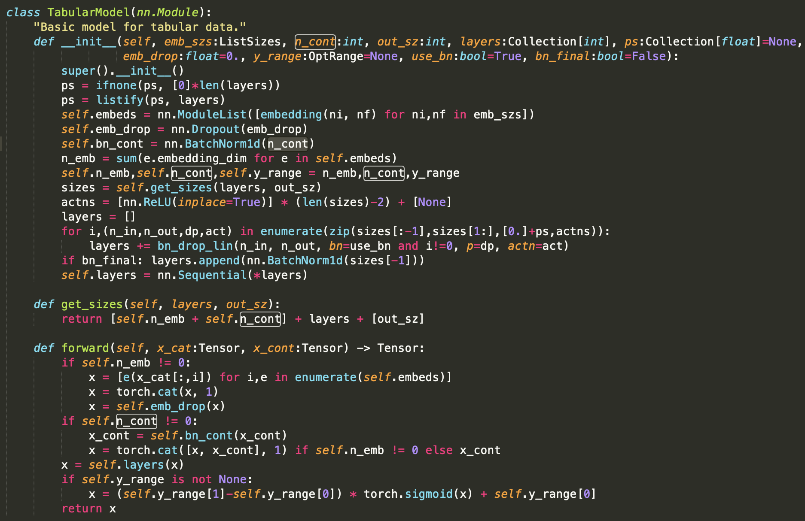

So that's batch norm and so what we do is we create a batch norm layer for every continuous variable. `n_cont` is a number of continuous variables. In fast.ai, `n_something` always means the count of that thing, `cont` always means continuous. Then here is where we use it. We grab our continuous variables and we throw them through a batch norm layer.

So then over here you can see it in our model.

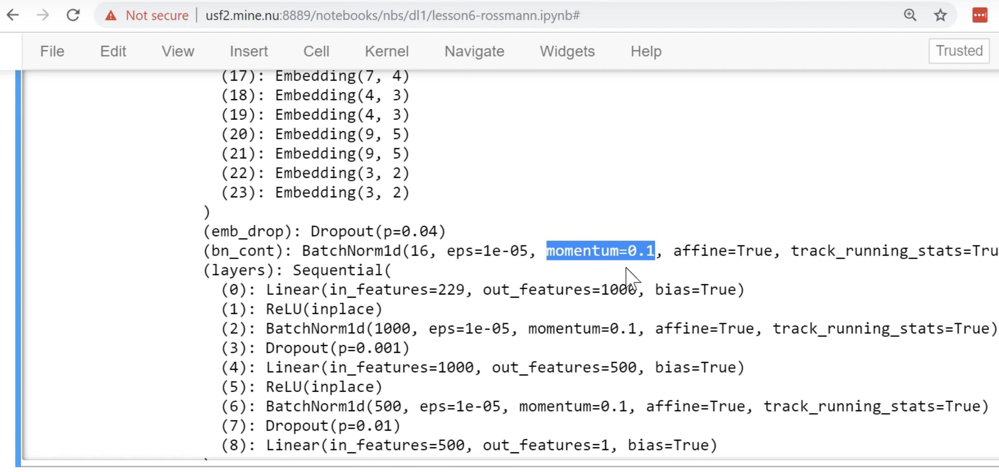

One interesting thing is this momentum here. This is not momentum like in optimization, but this is momentum as in exponentially weighted moving average. Specifically this mean and standard deviation (in batch norm algorithm), we don't actually use a different mean and standard deviation for every mini batch. If we did, it would vary so much that it be very hard to train. So instead, we take an exponentially weighted moving average of the mean and standard deviation.If you don't remember what I mean by that, look back at last week's lesson to remind yourself about exponentially weighted moving averages which we implemented in excel for the momentum and Adam gradient squared terms.

[[53:10](https://youtu.be/U7c-nYXrKD4?t=3190)]

You can vary the amount of momentum in a batch norm layer by passing a different value to the constructor in PyTorch. If you use a smaller number, it means that the mean and standard deviation will vary less from mini batch to mini batch, and that will have less of a regularization effect. A larger number will mean the variation will be greater for a mini batch to mini batch, that will have more of a regularization effect. So as well as this thing of training more nicely because it's parameterised better, this momentum term in the mean and standard deviation is the thing that adds this nice regularization piece.

When you add batch norm, you should also be able to use a higher learning rate. So that's our model. So then you can go `lr_find`, you can have a look:

```python
learn.lr_find()
```

```python
learn.recorder.plot()
```


```python
learn.fit_one_cycle(5, 1e-3, wd=0.2)
```

```
Total time: 14:18
epoch  train_loss  valid_loss  exp_rmspe
1      0.021467    0.023627    0.149858   (02:49)
2      0.017700    0.018403    0.128610   (02:52)
3      0.014242    0.015516    0.116233   (02:51)
4      0.012754    0.011944    0.108742   (02:53)
5      0.010238    0.012665    0.105895   (02:52)
```

```python
learn.save('1')
```

```python
learn.recorder.plot_losses(last=-1)
```

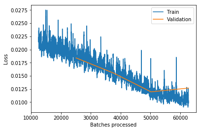

```python
learn.load('1');
```

```python
learn.fit_one_cycle(5, 3e-4)
```

```
Total time: 13:52
epoch  train_loss  valid_loss  exp_rmspe
1      0.018280    0.021080    0.118549   (02:49)
2      0.018260    0.015992    0.121107   (02:50)
3      0.015710    0.015826    0.113787   (02:44)
4      0.011987    0.013806    0.109169   (02:43)
5      0.011023    0.011944    0.104263   (02:42)
```

```python
learn.fit_one_cycle(5, 3e-4)
```

Total time: 14:41

| epoch | train_loss | valid_loss | exp_rmspe |
| ----- | ---------- | ---------- | --------- |
| 1     | 0.012831   | 0.012518   | 0.106848  |
| 2     | 0.011145   | 0.013722   | 0.109208  |
| 3     | 0.011676   | 0.015752   | 0.115598  |
| 4     | 0.009419   | 0.012901   | 0.107179  |
| 5     | 0.009156   | 0.011122   | 0.103746  |

(10th place in the competition was 0.108)

We end up 0.103. 10th place in the competition was 0.108, so it's looking good. Again, take it with a slight grain of salt because what you actually need to do is use the real training set and submit it to Kaggle, but you can see we're very much amongst the cutting-edge of models at least as of 2015. As I say, they haven't really been any architectural improvements since then. There wasn't batch norm when this was around, so the fact we added batch norm means that we should get better results and certainly more quickly. If I remember correctly, in their model, they had to train at a lower learning rate for quite a lot longer. As you can see, this is less than 45 minutes of training. So that's nice and fast.

**Question:** In what proportion would you use dropout vs. other regularization errors, like, weight decay, L2 norms, etc.? [[54:49](https://youtu.be/U7c-nYXrKD4?t=3299)]

So remember that L2 regularization and weight decay are kind of two ways of doing the same thing? We should always use the weight decay version, not the L2 regularization version. So there's weight decay. There's batch norm which kind of has a regularizing effect. There's data augmentation which we'll see soon, and there's dropout. So batch norm, we pretty much always want. So that's easy. Data augmentation, we'll see in a moment. So then it's really between dropout versus weight decay. I have no idea. I don't think I've seen anybody to provide a compelling study of how to combine those two things. Can you always use one instead of the other? Why? Why not? I don't think anybody has figured that out. I think in practice, it seems that you generally want a bit of both. You pretty much always want some weight decay, but you often also want a bit of dropout. But honestly, I don't know why. I've not seen anybody really explain why or how to decide. So this is one of these things you have to try out and kind of get a feel for what tends to work for your kinds of problems. I think the defaults that we provide in most of our learners should work pretty well in most situations. But yeah, definitely play around with it.
